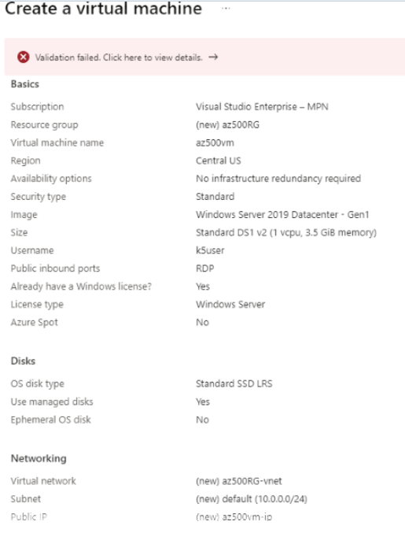

# AZ-500 Practice Test 139 Questions

---

## Q06X:

---

### Answer:

---

### References:


---

## Q061:

Your company uses the Azure Functions Premium plan to allow its development team to create applications in an Azure landing zone without the need to deploy servers and additional infrastructure. You currently use the virtual network integration feature with an App Service Environment to allow Functions apps to access resources inside a VNet.
The development team manager has informed you that the development team now needs to access application resources in other networks.
You need to recommend a feature and service to facilitate this requirement.

What should you recommend?

- Azure Relay's Hybrid Connections feature
- Network Security Groups (NSGS)
- Service endpoints
- Private endpoints

---

### Answer:
- Azure Relay's Hybrid Connections feature

You should recommend Azure Relay's Hybrid Connections feature. This is recommended because Hybrid Connections can be used to access application resources in other networks. It enables access from your Functions app to an application endpoint but it cannot be used to access the application. It is only available to functions that run on a Windows Consumption plan. When you use a Consumption plan, instances of an Azure Functions host are dynamically added and removed based on how many incoming events there are.
You should not recommend Network Security Groups (NSGs). These are utilized to block inbound and outbound traffic to resources in a VNet. For example, if an app is using VNet integration, it can use an NSG to block outbound traffic to resources in your VNet or the internet. However, it would require VNet peering to communicate with other VNets, which is not part of this scenario.
You should not recommend private endpoints. A private endpoint is a network interface that allows you to connect privately to a service provider via Azure Private Link. It uses a private IP address from your VNet, which essentially brings the service into your VNet.
You should not recommend service endpoints. By using service endpoints with Azure Functions apps, you can restrict multiple Azure services to specific VNet subnets to enable a much higher level of security.

---

### References:

[Azure App Service Hybrid Connections](https://learn.microsoft.com/en-us/azure/app-service/app-service-hybrid-connections)  

[App Service networking features](https://learn.microsoft.com/en-us/azure/app-service/networking-features)  

[Azure Functions networking options](https://learn.microsoft.com/en-us/azure/azure-functions/functions-networking-options?tabs=azure-portal)  

[Integrate your app with an Azure virtual network](https://learn.microsoft.com/en-us/azure/app-service/overview-vnet-integration)  

[Azure Functions networking options](https://learn.microsoft.com/en-us/azure/azure-functions/functions-networking-options?tabs=azure-cli)  

[Azure Relay Hybrid Connections protocol](https://learn.microsoft.com/en-us/azure/azure-relay/relay-hybrid-connections-protocol)  

[What is a private endpoint?](https://learn.microsoft.com/en-us/azure/private-link/private-endpoint-overview)  

[Virtual Network service endpoints](https://learn.microsoft.com/en-us/azure/virtual-network/virtual-network-service-endpoints-overview)    

---

## Q060:

Your organization has an existing Azure subscription and currently uses different cloud services, including virtual machines, databases, and storage. You have recently set up a virtual network and enabled VNet service endpoint for Azure Storage via a PowerShell script.
Your manager has asked you to create a service endpoint for Azure Storage and restrict network access via a network security group (NSG) for the subnet with three rules with the following requirements:
• Allow outbound access to the public IP address assigned to the Azure Storage service.
• Deny access to all public IP addresses, except the Azure Storage service.
• Allow inbound Remote Desktop Protocol (RDP) traffic to the subnet from any location.
You need to use PowerShell to configure three rules that match the above requirements.
Which cmdlets should you use? To answer, complete the commands by selecting the correct parts from the drop-down menus.


$rule1 =
New-AzNetwork Security RuleConfig
-Name Allow-Storage-All'
-Access Allow'
-DestinationAddressPrefix Storage'
-DestinationPortRange * '
-Direction Outbound'
-Priority
100
Protocol * '
-SourceAddressPrefix VirtualNetwork'
-SourcePortRange *


$rule2 = New-AzNetworkSecurity RuleConfig'
-Name Deny-Internet-All'
-Access Deny'
-DestinationAddressPrefix Internet'
-DestinationPortRange *`
-Direction Outbound'
-Priority
110
-Protocol *
-SourceAddressPrefix VirtualNetwork'
-SourcePortRange *

$rule3 New-AzNetworkSecurity RuleConfig'
-Name Allow-RDP-All`
-Access Allow
-DestinationAddressPrefix VirtualNetwork'
-Destination PortRange
3389
-Direction Inbound'
-Priority 120'
-Protocol * 1
-SourceAddressPrefix * '
-SourcePortRange *


---

### Answer:

You should complete the PowerShell script as follows:

$rulel New-AzNetworkSecurityRuleConfig"
-Name Allow-Storage-All
-Access Allow
-DestinationAddressPrefix Storage
-DestinationPortRange
-Direction Outbound
-Priority 100 -Protocol *
-SourceAddressPrefix VirtualNetwork
-SourcePortRange

$rule2 New-AzNetworkSecurityRuleConfig
-Name Deny-Internet-All
-Access Deny
-DestinationAddressPrefix Internet
-DestinationPortRange
-Direction Outbound
-Priority 110 -Protocol *
-SourceAddressPrefix VirtualNetwork
-SourcePortRange *

$rule3 New-AzNetworkSecurityRuleConfig
-Name Allow-RDP-All
-Access Allow
-DestinationAddressPrefix VirtualNetwork
-DestinationPortRange 3389
-Direction Inbound
-Priority 120
-Protocol
-SourceAddress Prefix
-SourcePortRange *

You should use the New-AzNetwork Security RuleConfig cmdlet to start each rule as you are creating three new rules for the service endpoint traffic flow.
You should not use the New-AzNetwork SecurityGroup cmdlet. This cmdlet creates a new network security group (NSG), which is not a requirement within this scenario. You would use this cmdlet when you want to create a new NSG to associate with a subnet.

---

### References:

[Virtual Network service endpoints](https://learn.microsoft.com/en-us/azure/virtual-network/virtual-network-service-endpoints-overview)   

[Allow access to Azure Service Bus namespace from specific virtual networks](https://learn.microsoft.com/en-us/azure/service-bus-messaging/service-bus-service-endpoints)  

[New-AzNetworkSecurityRuleConfig](https://learn.microsoft.com/en-us/powershell/module/az.network/new-aznetworksecurityruleconfig?view=azps-12.0.0&viewFallbackFrom=azps-9.4.0)   

[New-AzNetworkSecurityGroup](https://learn.microsoft.com/en-us/powershell/module/az.network/new-aznetworksecuritygroup?view=azps-12.0.0&viewFallbackFrom=azps-9.4.0)   

[New-AzNetworkManagerSecurityAdminRule](https://learn.microsoft.com/en-us/powershell/module/az.network/new-aznetworkmanagersecurityadminrule?view=azps-12.0.0&viewFallbackFrom=azps-9.4.0)  

[New-AzNetworkManagerSecurityAdminConfiguration](https://learn.microsoft.com/en-us/powershell/module/az.network/new-aznetworkmanagersecurityadminconfiguration?view=azps-12.0.0&viewFallbackFrom=azps-9.4.0)  

[New-AzPrivateLinkService](https://learn.microsoft.com/en-us/powershell/module/az.network/new-azprivatelinkservice?view=azps-12.0.0&viewFallbackFrom=azps-9.4.0)  


---

## Q059:

You are administering an Azure environment for a military organization.
You have a virtual machine (VM) named VM1 that is running in a virtual network (VNet) named VNET1. VNET1 hosts an application named App1 which generates top secret reports which are stored in storage account topsecretstorage1.
You need to ensure that topsecretstorage1 can be accessed exclusively from VNET1 in the most secure way.

What should you configure?

- Private endpoint connections
- Network security groups (NSGs)
- Firewalls and VNets
- Application security groups (ASGs)

---

### Answer:
- Private endpoint connections

You should configure private endpoint connections. By default, a storage account is always accessed over the public internet, even if you limit traffic using a firewall. Configuring a private endpoint connection enables VM secure access to the requested storage account without exfiltrating traffic outside of the VNET the VM resides in. In this scenario, by using a private link on the Microsoft backbone network, VM1 can access topsecretstorage1 only from within VNET1, thus eliminating exposure to the public internet.
You should not configure firewalls and VNets. Even if you configure firewalls and VNets, network traffic would still travel over the public internet.
You should not configure Application security groups (ASGs). An ASG protects traffic from the internet and between VNETs for multiple servers serving the same application type, for example all VMs within a web service, all VMs within an SQL service, etc. An ASG would not ensure that topsecretstorage1 can be accessed exclusively from VNET1.
You should not configure Network security groups (NSGs). An NSG can filter traffic from the internet and between VNETs. An NSG would not ensure that topsecretstorage1 can be accessed exclusively from VNET1.

---

### References:

[Configure Azure Storage firewalls and virtual networks](https://github.com/MicrosoftDocs/azure-docs/blob/main/articles/storage/common/storage-network-security.md)

[Use private endpoints for Azure Storage](https://github.com/MicrosoftDocs/azure-docs/blob/main/articles/storage/common/storage-private-endpoints.md)  

[Application security groups](https://learn.microsoft.com/en-us/azure/virtual-network/application-security-groups)  

[
Network Security Group (NSG) vs Application Security Group](https://tutorialsdojo.com/network-security-group-nsg-vs-application-security-group/)  

---

## Q058:

You manage an Azure App Service named App1.
The security team performs a security assessment on App1 and discovers the following vulnerabilities:
App1 is susceptible to SQL injection attacks.
Network communication between the server and clients is not encrypted.
You need to protect App1 from the security vulnerabilities discovered by the security team.
How should you configure application security? To answer, drag the appropriate configuration setting to each security alert detail. A configuration setting may be used once, more than once, or not at all.

SSL certificate
Application Gateway
Network security group (NSG)
Azure Load Balancer
Azure Traffic Manager


Protect against SQL injection attacks: Application Gateway

Encrypt network communication between server and clients: SSL certificate


---

### Answer:

You should use Application Gateway for protection against SQL injection attacks. Application Gateway is a web traffic load balancer that operates in the application layer of the OSI model (Layer 7). Application Gateway has a Web Application Firewall feature that protects your web applications from common exploits and vulnerabilities, including SQL injection.
You should use an SSL certificate to encrypt network communication between server and clients. You can include SSL certificates in Azure App Service to enable HTTPS and encrypt network communication. You can use an App Service certificate and take advantage of features like automated certificate management for
your custom domains.
You should not use a network security group (NSG). An NSG enables you to allow or deny network traffic from virtual network (VNet) subnets and network interfaces. You could therefore use one to limit which VNets have access to App1. However, you cannot use an NSG to encrypt network traffic or protect against SQL injection.
You should not use Azure Load Balancer. Load Balancer can be used to distribute network traffic between a pool of servers. Load Balancer supports both Transmission Control Protocol (TCP) and User Datagram Protocol (UDP).
You should not use Azure Traffic Manager. Traffic Manager is a Domain Name System (DNS) based traffic load balancer designed to distribute network traffic. Traffic Manager uses DNS to direct clients to the most appropriate service endpoint, based on health probes and traffic-routing rules.
You should not use Azure Load Balancer or Azure Traffic Manager to encrypt network traffic or protect against SQL injection.

---

### References:

[Securing PaaS deployments](https://learn.microsoft.com/en-us/azure/security/fundamentals/paas-deployments)  

[Security services and technologies available on Azure](https://learn.microsoft.com/en-us/azure/security/fundamentals/services-technologies)  

[Azure network security overview](https://learn.microsoft.com/en-us/azure/security/fundamentals/network-overview)  

[Add and manage TLS/SSL certificates in Azure App Service](https://learn.microsoft.com/en-us/azure/app-service/configure-ssl-certificate?tabs=apex)  

[What is Azure Web Application Firewall?](https://learn.microsoft.com/en-us/azure/web-application-firewall/overview)  

---

## Q057:

Your company is planning to migrate an IIS web application to Azure. The web application is hosted on a Windows Server 2012 R2 server named WEB01. It is accessed by some of your company's partners.
You need to evaluate the web app's migration to Azure and recommend a security baseline for the web application.
Which security features should you implement? To answer, drag the appropriate security feature to each requirement. A security feature may be used once, more than once, or not at all.

Access Restrictions
Managed Identity
Microsoft Defender for Cloud
SAML
Microsoft BPA


Automatically run security assessments and provide security recommendations :
Microsoft Defender for Cloud

Restrict access to the web app to a list of IP addresses 
Access Restrictions

Protect back-end resources with authenticated access
Managed Identity

---

### Answer:

You should use Microsoft Defender for Cloud to automatically run security assessments periodically across the tenant and provide security recommendations for your resources. Microsoft Defender for Cloud can identify attacks on App Service applications and it uses analytics and machine learning models to cover all interfaces that allow interaction with the web application.
You should use access restrictions to restrict access to the web app based on a list of IP addresses. Access restrictions process inbound traffic to a web application and are processed from top to bottom. If traffic matches a rule, traffic will either be allowed or denied. There is an implicit deny at the bottom, which applies to any traffic that does not match rules higher up.
You should use a managed identity to protect back-end resources with authenticated access. A managed identity can be used to apply role-based access control (RBAC) permissions directly to the web application. For example, you could grant the web application itself permission to any Azure resource that supports RBAC.
You should not use SAML. Security Assertion Markup Language (SAML) is used to exchange authentication and authorization data between parties. It is used for Azure single sign-on, among other things.
You should not use Microsoft Best Practices Analyzer (BPA). Microsoft BPA is used for various Microsoft products to scan a system and report any best practice violations, so that they can be remediated. For example, on Windows Server 2016, Microsoft BPA creates a detailed report explaining any violations, their severity, and how they can be remediated. However, Microsoft BPA does not run security assessments automatically and results do not restrict access to a list of IP addresses or protect back-end resources with authenticated access.

---

### References:

[Set up Azure App Service access restrictions](https://learn.microsoft.com/en-us/azure/app-service/app-service-ip-restrictions?tabs=azurecli)   

[How to use managed identities for App Service and Azure Functions](https://learn.microsoft.com/en-us/azure/app-service/overview-managed-identity?tabs=portal%2Chttp)  

[Single sign-on SAML protocol](https://learn.microsoft.com/en-us/entra/identity-platform/single-sign-on-saml-protocol)  

[Run Best Practices Analyzer Scans and Manage Scan Results](https://learn.microsoft.com/en-us/windows-server/administration/server-manager/run-best-practices-analyzer-scans-and-manage-scan-results)    

---

## Q056:

Your company creates and runs a Docker image in Azure to support a custom ASP.NET application. The container is running on a Windows 2019 Server virtual machine (VM) named VM01.
The development team wants to create three additional Docker images to run on VM01.
You need to ensure that the Docker images are isolated from each other and that they do not share the sam kernel. You also need to keep costs to a minimum.
How should you configure the Windows containers? To answer, drag the appropriate configuration value to each Windows container property. A configuration value may be used once, more than once, or not at all.

Hyper-V
One
None
Three
Process

Container Isolation Mode: Hyper-V
Additional VMs: None

---

### Answer:

You should use the Hyper-V isolation mode. By default, Windows containers will run in the process container mode. This means that they share the same kernel. The only way to guarantee that containers do not share the same kernel is to configure them to use the Hyper-V isolation mode, which ensures that each container has a dedicated kernel.
You should not create any additional VMs. Although creating three additional VMs would achieve the goal of the containers not sharing the same kernel, it would be a more expensive solution.

---

### References:

[Windows Containers Isolation Modes](https://learn.microsoft.com/en-us/virtualization/windowscontainers/manage-containers/hyperv-container)  

---

## Q055:

You are the global administrator for the Microsoft Entra tenant of your company.
The company wants to assign newly added users to a specific group, based on their attributes such as department and role, without increasing the workload for the operations team.
You need to assign these users to Microsoft Entra groups automatically.
What should you use?

- Dynamic membership rules
- Group owners
- Groups Administrator
- Self-service group management

---

### Answer:
- Dynamic membership rules

You should use dynamic membership rules. You can create dynamic membership rules in your Microsoft Entra groups to automatically assign users to those groups based on the users' attributes, such as department or role. This also reduces the operational workload for helpdesk teams. To use dynamic membership rules, you must have an Microsoft Entra P1 license at least.
You should not use self-service group management. You can configure self-service group management to allow users to manage security groups or Microsoft 365 groups, with the moderation of a group owner. Self-service group management does not add new users to a specific group based on their attributes.
You should not use group owners. A group owner is a user or service principal who is able to manage group membership. A group owner can also approve or deny membership requests if the group is configured with self-service group management. Although group owners would be able to manage membership of the groups they are responsible for, this would not meet the requirement not to increase the workload for the operations team.
You should not use Groups Administrator. Groups Administrator is a Microsoft Entra built-in role to create and manage groups and their settings, for example naming and expiration policies. Although users in this Microsoft Entra role would be able to manage membership of the groups, this would not meet the requirement of not increasing the workload of the operations team.

---

### References:

[Dynamic membership rules for groups in Microsoft Entra ID](https://learn.microsoft.com/en-us/entra/identity/users/groups-dynamic-membership)   

[Set up self-service group management in Microsoft Entra ID](https://learn.microsoft.com/en-us/entra/identity/users/groups-self-service-management)  

[Manage Microsoft Entra groups and group membership](https://learn.microsoft.com/en-us/entra/fundamentals/how-to-manage-groups)   

[Microsoft Entra built-in roles](https://learn.microsoft.com/en-us/entra/identity/role-based-access-control/permissions-reference)    

---

## Q054:

Your company has a new green field Azure landing zone in which it wants to create a secure virtual hub. The Cloud team has defined the following variables:

- Resource Group Name: vwan-rg-a
- Location: uksouth
- Virtual Wan Name: vwan01
- Virtual Hub Name: huba

The Cloud team has started to create the PowerShell script to create the secure virtual hub and need your assistance to complete the script. In the script they have defined the variables, created the resource group, as well as the virtual wan, and the virtual hub. They need help to create a virtual network (VNet) and connect it to the hub and spokes.
You need to use PowerShell to allow the Cloud team to deploy the secure virtual hub.
Which cmdlets should you use? To answer, complete the commands by selecting the correct parts from the drop-down menus.

```
$Spoke1 = New-AzVirtual Network 
-Name "spoke1" 
-ResourceGroupName $RG 
-Location $Location
-Address Prefix "10.2.1.0/24"

$Spoke1Connection = New-AzVirtualHubVnetConnection -ResourceGroupName $RG -ParentResourceName

$HubName -Name "spoke1" -RemoteVirtualNetwork $Spoke1 -EnableInternetSecurityFlag $True
```

---

### Answer:

You should use the New-AzVirtual Network cmdlet to initially create a new VNet to allow you to then use the New-AzVirtual HubVnetConnection to create the hub virtual connection resource that peers the virtual network to the Azure Virtual Hub.
You should not use the Get-AzVirtual Hub VnetConnection cmdlet as this returns information on the VNet connection in a virtual hub. In this scenario, you need to create a virtual hub connection rather than obtain information regarding its connectivity to a VNet.
You should not use the Get-AzVirtual Network cmdlet as this will return the VNet information form a resource group. In this scenario, you need to create a VNet, not view information about an existing one.
You should not use the Update-AzVirtual HubVnetConnection cmdlet as this will update an existing hub's VNet connection. There are no existing connections in this scenario.


---

### References:

[Tutorial: Secure your virtual hub using Azure PowerShel](https://learn.microsoft.com/en-us/azure/firewall-manager/secure-cloud-network-powershell)  

[New-AzVirtualNetwork](https://learn.microsoft.com/en-us/powershell/module/az.network/new-azvirtualnetwork?view=azps-12.0.0&viewFallbackFrom=azps-9.4.0)  

[Get-AzVirtualNetwork](https://learn.microsoft.com/en-us/powershell/module/az.network/get-azvirtualnetwork?view=azps-12.0.0&viewFallbackFrom=azps-9.4.0) 

[New-AzVirtualHubVnetConnection](https://learn.microsoft.com/en-us/powershell/module/az.network/new-azvirtualhubvnetconnection?view=azps-12.0.0&viewFallbackFrom=azps-9.4.0)  

[Get-AzVirtualHubVnetConnection](https://learn.microsoft.com/en-us/powershell/module/az.network/get-azvirtualhubvnetconnection?view=azps-12.0.0&viewFallbackFrom=azps-9.4.0)  

[Update-AzVirtualHubVnetConnection](https://learn.microsoft.com/en-us/powershell/module/az.network/update-azvirtualhubvnetconnection?view=azps-12.0.0&viewFallbackFrom=azps-9.4.0)  

---

## Q053:

Your organization has an existing Azure subscription that is used to host web applications, storage and databases. Currently, the development team can only access the Azure resources when they are in one of the company offices, as the Azure network is only accessible via the site-to-site VPN.
Your company decides to also allow the development team to access the Azure resources when they are remotely working and you recommend implementing a point-to-site VPN with Microsoft Entra authentication.

The following table shows the development team's device information:

| User Name | Device Type | Device Operating System |
|-----------|-------------|---|
| DevUser1 | Tablet | Android |
| DevUser2 | Laptop | Windows 8 |
| DevUser3 | Laptop | macOS |
| DevUser4 | Laptop | Windows 10 |  
| DevUser5 | Tablet |  |
| DevUser6 | Laptop | Windows 8 |


You need to identify which devices will support a point-to-site VPN with Microsoft Entra authentication.
Which two users should you identify? Each correct answer presents part of the solution.

- DevUser1
- DevUser2
- DevUser3
- DevUser4
- DevUser5
- DevUser6


---

### Answer:
- DevUser3
- DevUser4

Microsoft Entra authentication for point-to-site (P2S) VPN connections enables users to connect to Azure by using their Microsoft Entra login credentials. Native Microsoft Entra authentication is only supported for OpenVPN protocol and requires an Azure VPN client.
You should identify that DevUser3 and DevUser4 devices will support a P2S VPN with Microsoft Entra authentication. P2S Microsoft Entra authentication supports Windows 10 or later and macOS client operating systems.
OpenVPN is a tunneling protocol that uses Secure Sockets Layer (SSL) encryption to make sure that any data that is shared via the internet is kept private by using AES-256 encryption.

---

### References:

[About Point-to-Site VPN](https://learn.microsoft.com/en-us/azure/vpn-gateway/point-to-site-about)  

---

## Q052:

Your company has an existing Azure subscription that hosts laas and PaaS resources and services. The development team has recently developed a new web application called webapp01, which has a backend application server called appsrv01, and has the following requirements that need to be met before migrating to the production environment:

• Webapp01 must be accessible from the public internet only.
• All traffic from the internet to Webapp01 must go via a network virtual appliance (NVA) firewall.
• All traffic to the appsrv01 must go via the NVA firewall.

You need to recommend a routing solution to meet the above requirements.
Which routing solution should you recommend?

- Network security group (NSG)
- Application security group (ASG)
- System route
- User Defined Routes (UDR)

---

### Answer:
- User Defined Routes (UDR)

You should recommend User Defined Routes (UDR) as the routing solution to meet the requirements. You can create custom or UDR routes in Azure to override default system routes, or add routes to a subnets route table. You can specify different next hop types, including virtual appliances, when creating a UDR.
You should not recommend an application security group (ASG) as the routing solution to meet the requirements. ASGs allow you to configure network security as an extension of an application's structure. This enables you to group VMs and define network security policies based on those groups. According to the requirements, you need to route traffic, not secure the application.
You should not recommend a network security group (NSG) as the routing solution. An NSG is a set of security rules that allow or block inbound and outbound network traffic from Azure resources. According to the requirements, you need to route traffic, not secure a network.
You should not recommend a system route for the routing solution to meet the requirements. System routes are automatically created and assigned by Azure to each subnet in a virtual network. You cannot create or remove system routes. However, you can override them with UDR.

---

### References:

[Virtual appliance scenario](https://learn.microsoft.com/en-us/azure/virtual-network/virtual-network-scenario-udr-gw-nva)  
[Virtual network traffic routing](https://learn.microsoft.com/en-us/azure/virtual-network/virtual-networks-udr-overview)  
[Application security groups](https://learn.microsoft.com/en-us/azure/virtual-network/application-security-groups)  
[How network security groups filter network traffic](https://learn.microsoft.com/en-us/azure/virtual-network/network-security-group-how-it-works)  

---

## Q051:

Your company has an existing Azure subscription where you host multiple laas services, including virtual machines, storage and databases. At present you have four different offices in the following locations:

| Office location | Azure region |
|-----------------|--------------|
| London          | UK South |
| Leeds           | UK South |
| Paris           | France Central |
| New York        | East US |

Currently, only the Leeds and London offices can access shared Azure laaS resources. However, there is now a requirement to access resources for both Paris and New York.
You need to configure network connectivity between the UK-based offices and Paris and New York. There is no existing Multiprotocol Label Switching (MPLS) network in place. Your solution should minimize administrative overhead.
Which connectivity method should you use?

- ExpressRoute connection
- site-to-site VPN
- Virtual network peering
- Global virtual network peering

---

### Answer:
- Global virtual network peering

You should use global virtual network peering. This allows you to seamlessly connect multiple virtual networks in Azure that are situated across Azure regions. In this scenario, we have three regions that need to be connected: UK South, France Central and East US.
You should not use virtual network peering. This allows you to seamlessly connect multiple networks in Azure that are in the same region. In this scenario, the two offices in the same region (UK South) are already connected and the requirement is to connect offices in other regions.
You should not use a site-to-site VPN. This type of connection would require a virtual network gateway in each virtual network you want to connect. In this scenario, it would require a virtual network gateway in UK South, France Central and East US, which would increase administrative overhead.
You should not use an Express Route connection. This type of connection cannot be configured between virtual networks and must be configured between a virtual network and on-premises location/data center. However, it would require a Multiprotocol Label Switching (MPLS) network to be implemented to connect all the offices into a single wide area network (WAN). An MPLS is a networking technology that routes traffic using the shortest path based on labels rather than network addresses.

---

### References:

[Virtual network peering](https://learn.microsoft.com/en-us/azure/virtual-network/virtual-network-peering-overview)  

[Tutorial: Create a site-to-site VPN connection in the Azure portal](https://learn.microsoft.com/en-us/azure/vpn-gateway/tutorial-site-to-site-portal)  

[Azure geographies](https://azure.microsoft.com/en-gb/explore/global-infrastructure/geographies/#geographies)  

---

## Q050:

You are the Azure administrator for your company. The company has a subscription named Production in your existing tenant. All users are based in the San Francisco office that uses the 192.168.0.0/24 subnet.
There are two virtual machines (VMs) running in Azure named VM01 and VM02. They are connected to the network as shown in the table below:

| VM   | VNET   | Subnet    | NSG |
|------|--------|-----------|---|
| VM01 | VNET01 | subnet-01 | nsg-01 |
| VM02 | VNET01 | subnet-02 | n/a |

You need to ensure that Remote Desktop Protocol (RDP) access to both VM01 and VM02 is only accessible from the San Francisco office and enabled when needed.
How should you configure RDP access to VM01 and VM02? To answer, select the appropriate options from the drop-down menus.

Create a new  : Network security group (NSG) | VNet
Configure     : Just-in-time (JIT) access    | PIM
Allowed source: 192.168.0.0/24               | VNET01


---

### Answer:

Create a new  : Network security group (NSG)
Configure     : Just-in-time (JIT) access
Allowed source: 192.168.0.0/24

You should create a new network security group (NSG). This NSG needs to be assigned to subnet-02 to limit Remote Desktop Protocol (RDP) access in this subnet. This is required by just-in-time (JIT) access.
You should configure JIT access. JIT uses an NSG rule to deny or temporarily allow network traffic when specific users request RPD connection. Configuring JIT will provide network access to connect with VM01 and VM02 only when needed.
You should use 192.168.0.0/24 as the allowed source. This classless inter-domain routing (CIDR) block is used by the San Francisco office and only users in this office should request access to VM01 and VM02.
JIT access requires an NSG to be created. Once JIT is enabled, it will create a deny rule for the configured port rules at the top of the assigned NSG rule list for inbound traffic: in this case, anything destined for VM01 and VM02 from the San Francisco office on TCP port 3389. When access is requested, JIT will create an allow rule only for three hours by default. When that period elapses, the rule will be removed.
You should not create a new virtual network (VNet). You can use the current VNET01 to meet the objectives.
You should not enable Privileged Identity Management (PIM). PIM is a service that enables you to manage, control, and monitor access to important resources by providing time-based and approval-based role activation. PIM cannot allow or deny RDP access.

---

### References:

[Enable just-in-time access on VMs](https://learn.microsoft.com/en-us/azure/defender-for-cloud/just-in-time-access-usage)    

[What is Microsoft Entra Privileged Identity Management?](https://learn.microsoft.com/en-us/entra/id-governance/privileged-identity-management/pim-configure)  

---

## Q049:

Your company runs a web application in Azure named webapp01. Webapp01 was assigned a public IP address at deployment.
To increase security to webapp01, you remove the public IP address and replace it with a private address. You create an application gateway named gateway01. External users are able to access webapp01 by using the application gateway. The resources have been assigned the private IP addresses shown in the table below:

| Resource  | Internal IP Address |
|-----------|---------------------|
| webapp01  | 192.168.1.10 |
| gateway01 | 10.10.1.10 |

You need to allow only HTTPS traffic from gateway01 to webapp01. All other traffic should be blocked. You must use an Azure Resource Manager (ARM) template.
Which ARM template settings should you use? To answer, complete the settings by selecting the correct parts from the drop-down menus.

{
"type": "Microsoft.Web/sites/config" | "Microsoft.Network/applicationGateways",
"apiVersion": "2016-08-01",
"name": "name",
"location": "West Europe",
"dependson": [],
"properties": {
    "ipSecurityRestrictions": [
        {
            "ipAddress": "10.10.1.10" | "198.168.1.10",
            "subnetMask": "255.255.255.255",
            "name": "Allow-443"
        }
    ]
}
}

---

### Answer:

{
"type": "microsoftwebsites.config",
"apiVersion": "2016-08-01",
"name": "name",
"location": "West Europe",
"dependson": [],
"properties": {
    "ipSecurityRestrictions": [
        {
            "ipAddress": "10.10.1.10",
            "subnetMask": "255.255.255.255",
            "name": "Allow-443"
        }
    ]
}
}


You should use "Microsoft.Web/sites/config" as the type. One way to secure a web application is to use an
application gateway with a public IP address assigned to it, and then create a back-end pool that contains the private IP address assigned to the web application. To block all other inbound traffic to webapp01, except gateway01, you should create an access restriction on webapp01.
You should use 10.10.1.10 as the source IP address. Access restrictions allow traffic from a source Classless Inter-Domain Routing (CIDR) block. In this case, you want to allow traffic from gateway01, which has been allocated the IP address 10.10.1.10.
You should not use "Microsoft.Network/application Gateways". Access restrictions cannot be applied to application gateways.
You should not use 192.168.1.10 as the source address. This is the destination IP address assigned to webapp01. Access restrictions block traffic based on the source IP address.


---

### References:

[What is Azure Application Gateway?](https://learn.microsoft.com/en-us/azure/application-gateway/overview)  
[Set up Azure App Service access restrictions](https://learn.microsoft.com/en-us/azure/app-service/app-service-ip-restrictions?tabs=azurecli)  

---

## Q048:

Your company deploys a new accounting web application in Azure. The web application uses an SSL certificate. The company has a small sales office in Los Angeles with five users. The main office is in New York with 200 users. The office networks are configured as follows:

| Site               | Subnet       |
|--------------------| ------------ |
| Los Angeles Subnet | 10.10.0.0/24 |
| New York Subnet    | 10.20.0.0/24 |


Both sites are connected to Azure via a site-to-site VPN gateway connection. All resources are assigned to VNET1. The web application uses the standard service plan and the 10.30.0.1 address. Your company uses the least privilege model.
The IT team is informed that users from the sales office are able to access the web application. Only users who are physically located at the main office should be able to access the web application.
You need to limit access to the web application.

- Create a new Network Security Group (NSG) and create a rule that allows traffic from the 10.20.0.0/24 network to the 10.30.0.1 address on TCP port 443.

- Create two new security groups. Assign one group to the sales office users and one group to the main office users. Create a new Network Security Group (NSG) and create a rule to allow the main office group access to the 10.30.0.1 address on TCP port 443.

- Create two new Microsoft Entra security groups. Assign one group to the sales office users and one group to the main office users. Grant only the main office group access to the accounting web application.

- Create a new Network Security Group (NSG) and create a rule that allows traffic from the 10.20.0.0/24 network to VNET1 on TCP port 443.

---

### Answer:
- Create a new Network Security Group (NSG) and create a rule that allows traffic from the 10.20.0.0/24 network to the 10.30.0.1 address on TCP port 443.

You should create a new Network Security Group (NSG) and create a rule that allows traffic from the 10.20.0.0/24 network to the 10.30.0.1 address on TCP port 443. This is the only solution that will limit access to the web application to users who are physically at the main office.
An NSG contains a list of rules that are processed in ascending order. If traffic matches a rule, a particular action (Allow or Deny) will be taken. Rules are matched by using 5-tuple information (source/destination IP, source/destination port, protocol) and then either allowed or denied. When users are physically located at the main office, their traffic will originate from the 10.20.0.0/24 subnet with a destination address of 10.30.0.1 port 443 using the TCP protocol and as a result will be allowed. All other traffic that does not match a rule will be denied by default.
You should not create two new Microsoft Entra security groups, assign one group to the sales office users and one group to the main office users, and grant only the main office group access to the accounting web application. This does not meet the goal because groups are assigned to users and not to a physical location.
You should not create two new security groups, assign one group to the sales office users and one group to the main office users, create a new NSG, and create a rule to allow the main office group access to the 10.30.0.1 address on TCP port 443. You cannot configure a rule that applies to group membership.
You should not create a new NSG and create a rule that allows traffic from the 10.20.0.0/24 network to VNET1 on TCP port 443. Although this configuration would restrict traffic originating from the main office, it does not use the least privilege model. Traffic originating from the main office will be allowed to all resources within VNET1 on TCP port 443, not just the web application.

---

### References:


---

## Q047:

Your company has a single subscription and two resource groups configured, one named production-rg and the other development-rg.

The network is configured as follows:

| Resource Group | VNET  | Subnet  | Subnet Address Range |
|----------------| ----  | ------- | ---------------------|
| development-rg | VNET1 | Subnet1 | 10.1.1.0/24 |
| production-rg  | VNET2 | Subnet2 | 10.2.1.0/24 |


Virtual network peering is in place between VNET1 and VNET2. The development team regularly creates resources in the development-rg group and connects them to Subnet2. All development resources in development_rg communicate over TCP port 80 or 443 from Subnet1 to subnet2.
You need to ensure that traffic from the development resources is allowed but all other traffic for Subnet2 is denied.

What should you do?

- Create a new Network Security Group (NSG) and allow outbound traffic to TCP ports 80 and 443. Assign the new Network Security Group (NSG) to VNET1 and Subnet1.

- Create a new static route to the 10.2.1.0/24 subnet and set the next hop to VNET2. Assign the new static route to Subnet1.

- Create a new Network Security Group (NSG) and allow inbound traffic to TCP ports 80 and 443. Assign the new NSG to Subnet2.

- Remove VNET peering between VNET1 and VNET2.

---

### Answer:
- Create a new Network Security Group (NSG) and allow inbound traffic to TCP ports 80 and 443. Assign the new NSG to Subnet2.

You should create a new Network Security Group (NSG) and allow inbound traffic to TCP ports 80 and 443, and then assign the new NSG to Subnet2. In this scenario, you create an inbound rule to allow TCP ports 80 and 443 from any source and then assign the NSG to Subnet2.
You should not create a new static route to the 10.2.1.0/24 subnet, set the next hop to VNET2, and then assign the new static route to Subnet1. Static routes are used to route traffic and do not allow or deny traffic.
You should not remove the virtual network (VNET) peering between VNET1 and VNET2. For subnet1 to communicate with subnet2, a VNET peer is required. VNET peering facilitates communication between two VNETS. By default all communication between two VNETS are not allowed.
You should not create a new NSG, allow outbound traffic to TCP ports 80 and 443 and then assign the NSG to VNET1 and Subnet1. This would block all outbound traffic leaving Subnet1, other than TCP 80 and 443, and would be too restrictive.


---

### References:

[What is Azure Virtual Network?](https://learn.microsoft.com/en-us/azure/virtual-network/virtual-networks-overview)   

[Virtual network traffic routing](https://learn.microsoft.com/en-us/azure/virtual-network/virtual-networks-udr-overview)   

[Network security groups](https://learn.microsoft.com/en-us/azure/virtual-network/network-security-groups-overview)   

---

## Q046:

You have an Azure virtual machine (VM) running Linux. The VM is named linux1 and it has the following properties:
• resource group: prod
• location: East US
You have a Log Analytics workspace named prod-workspace with the following properties:
• resource group: prod
• location: Central US
You need to enable the Update Management solution on linux1.
What should you do first?


- Connect linux1 to the Log Analytics workspace.
- Enable boot diagnostics on linux1.
- Define an Azure Automation runbook.
- Deploy a second Log Analytics workspace.

---

### Answer:
- Connect linux1 to the Log Analytics workspace.

You need to connect linux1 to prod-workspace. The VM has to be connected to the log analytics workspace before you can enable Update Management for the virtual machine.
You do not need to deploy a second Log Analytics workspace. You can have the VM and the Log Analytics workspace in different regions and still be able to connect the VM to the workspace.
You should not enable boot diagnostics on linux1. Doing so does not accomplish the goal. Boot diagnostics stores Serial Console log data and periodic screenshots of the VM's console screen.
You should not define an Azure Automation runbook. This does not accomplish the goal of enabling Update Management for linux1.

---

### References:

[Update Management overview](https://learn.microsoft.com/en-us/azure/automation/update-management/overview)    

[Supported regions for linked Log Analytics workspace](https://learn.microsoft.com/en-us/azure/automation/how-to/region-mappings)    

[How to use boot diagnostics to troubleshoot virtual machines in Azure](https://learn.microsoft.com/en-us/troubleshoot/azure/virtual-machines/windows/boot-diagnostics)   

[Manage runbooks in Azure Automation](https://learn.microsoft.com/en-us/azure/automation/manage-runbooks)   

[Monitor virtual machines with Azure Monitor](https://learn.microsoft.com/en-us/azure/azure-monitor//vm/monitor-virtual-machine)  

---

## Q045:

You are developing a web application named WebApp1 that needs to retrieve data from Azure SQL database DB1. Your static code security analysis identified an SQL connection string with a username and password included in your code in plain text. You must eliminate this vulnerability in your WebApp1.

Which two actions should you identify to achieve this goal in the most effective way? Each correct answer presents a complete solution.

- Create a system-assigned managed identity.
- Create a Microsoft Entra user identity.
- Create a user-assigned managed identity.
- Create a database user identity.
- Create a virtual machine local user identity.

---

### Answer:
- Create a system-assigned managed identity.
- Create a user-assigned managed identity.

You should create a user-assigned or system-assigned managed identity. A managed identity is a Microsoft Entra security principal that represents the Azure resource. Azure resources can use a managed identity to authenticate to any other Azure services, as such providing secure inter-service authentication. Managed identities can be system-assigned or user-assigned. If you set a system-assigned managed identity, it is created and managed by Azure and gets assigned to your respective resource automatically. If you would like to manage the identity of a security principal yourself, you need to manually create a managed identity as an Azure resource and then assign it to your app service, virtual machine (VM), or other Azure resources. In this scenario, using a Microsoft Entra-managed identity provides the possibility to move plain text authentication credentials out of the source code, thereby mitigating the security risk of stolen credentials.
You should not create a Microsoft Entra user identity. Although using a Microsoft Entra user identity would
enable WebApp1 to access DB1, it is not the most effective way. This solution would be more expensive and
require much more administrative effort. A Microsoft Entra user identity would be suitable to manage
access to WebApp1, but it is not effective to configure service-to-service authentication.
You should not create a database user identity. Database identities can be used by users who do not have a login and if they only need access to one or a few databases. It should not be used in the scenario of service-to-service authentication, like this one. This is the most dangerous type of authentication.
You should not create a virtual machine local user identity. It is not technologically possible to use a virtual machine local user identity to access Azure SQL Database. A virtual machine local user could be used in the
case of an SQL server being installed directly on the virtual machine with the local user.

---

### References:

[Authenticate apps to Azure services by using service principals and managed identities for Azure resources](https://learn.microsoft.com/en-us/training/modules/authenticate-apps-with-managed-identities/)    

[SQL Server Create a database user](https://learn.microsoft.com/en-us/sql/relational-databases/security/authentication-access/create-a-database-user?view=sql-server-ver16)  


---

## Q044:

You are a security engineer at your company. The company has created an internal iOS mobile application that is registered in your Microsoft Entra tenant.
A group of users in your company utilize the application to edit the user attributes in your Microsoft Entra tenant.
You need to ensure that the application can edit the user attributes on behalf of the application users.

What should you configure?

- Application permission without admin consent
- Delegated permission requiring admin consent
- Application permission requiring admin consent
- Delegated permission without admin consent

---

### Answer:
- Delegated permission requiring admin consent

You should configure delegated permission requiring admin consent. You need to delegate the permission because the application uses the permissions of an application user to edit the user attributes in Microsoft Entra ID. You also need admin consent since the delegation request is for write permissions.
You should not configure delegated permission without admin consent. You can configure delegated permission without admin consent when the application performs read operations on behalf of the users. In this scenario, the application needs to edit user attributes in Microsoft Entra ID.
You should not configure application permission with or without admin consent. Application permissions are provided when the application needs permission to access Microsoft Graph API without user interaction. These kinds of permissions should be provided to applications that do not need user interaction, such as background services or daemon apps.


---

### References:

[Overview of permissions and consent in the Microsoft identity platform](https://learn.microsoft.com/en-us/entra/identity-platform/permissions-consent-overview)    

[Quickstart: Configure a client application to access a web API](https://learn.microsoft.com/en-us/entra/identity-platform/quickstart-configure-app-access-web-apis)   


---

## Q043:

Your team is developing a new application that uses the Microsoft Identity Platform for user authentication.
The application is a single-page application (SPA) developed with JavaScript. Users should be able to login by using their personal Microsoft accounts.
You need to register the application in Microsoft Entra ID.

Which grant flow and account type should you use? To answer, select the appropriate options from the drop-down menus.

Options: Autherization Code | Implicit
Grant flow: Autherization Code

Options: Multitenant | Personal | Single Tenant
Account Type: Personal only

---

### Answer:

You should use the authorization code grant flow. Single-page applications (SPAs) run directly in the client browser and have different security requirements compared to traditional server-based web applications. The authorization code grant flow is used to perform authentication and authorization for these applications. It requires the application to provide a client secret or certificate to securely provide access tokens. This method is the best option for ensuring SPAs are compatible with browsers that require privacy, like Safari.
You should use the personal account type. This account type allows users to log in with personal Microsoft
accounts only. As an alternative, you could use the account type that combines both personal Microsoft
accounts and multi-tenant accounts, as this would allow accounts in any Microsoft Entra ID directory as
well as personal accounts to log in with the application.
You should not use the implicit grant flow. The implicit grant flow allows the application to get tokens without performing a backend server credential exchange, making it possible for users to log in directly from the SPA. This practice is no longer considered a best practice.
You should not use a single tenant only or multi-tenant account type only. These account types are used to log in users that are present in the same Microsoft Entra tenant where the application is registered, or any Microsoft Entra accounts, respectively. These options do not allow personal Microsoft accounts to log in.

---

### References:

[Application types for the Microsoft identity platform](https://learn.microsoft.com/en-us/entra/identity-platform/v2-app-types)  

[Quickstart: Sign in users in a single-page app (SPA) and call the Microsoft Graph API using JavaScript](https://learn.microsoft.com/en-us/entra/identity-platform/quickstart-single-page-app-javascript-sign-in)    

[Tenancy in Microsoft Entra ID](https://learn.microsoft.com/en-us/entra/identity-platform/single-and-multi-tenant-apps)  

[Microsoft identity platform app types and authentication flows](https://learn.microsoft.com/en-us/entra/identity-platform/authentication-flows-app-scenarios)  


---

## Q042:

Your company has an Azure subscription that is associated with a Microsoft Entra tenant. You develop a mobile app and install it on your company devices.
Your device needs to access protected resources on your tenant for which your app would use OAuth 2.0 code grant to acquire Microsoft Entra access tokens.
You need to register your app in Microsoft Entra ID.

What information should you provide to register your app in Microsoft Entra ID?

- A redirect URI
- A service principal object ID
- An application ID
- A client certificate

---

### Answer:
- A redirect URI

You should provide a redirect URI. Microsoft Entra ID will use this URI to return token responses to the client app. An app configuration can be completed without a redirect URI, but the OAuth 2.0 code grant would not work for your mobile application without the redirect URI configured for the Microsoft Entra registered app.
You should not provide a service principal object ID. A service principal object ID is a principal that is created for the app registration that can be assigned permissions on resources in Azure subscriptions.
You should not provide a client certificate. You would use a client certificate for the app registration if you wanted the authentication for the app to use a certificate instead of a password.
You should not provide an application ID. The application ID is a unique ID that is provided once the app is registered in Microsoft Entra ID.

---

### References:

[Microsoft identity platform and OAuth 2.0 authorization code flow](https://learn.microsoft.com/en-us/entra/identity-platform/v2-oauth2-auth-code-flow)  

---

## Q041:

You are a security engineer at your company. A company-designed application is registered as secureApp in your Microsoft Entra tenant and it is used by users within the company.
You need to ensure that secureApp can read secrets from an Azure Key Vault in a subscription associated with your company's Microsoft Entra tenant on behalf of the application users.

What should you configure?

- A delegated permission without admin consent
- An application permission requiring admin consent
- An application permission without admin consent
- A delegated permission requiring admin consent

---

### Answer:
- A delegated permission without admin consent

You should configure a delegated permission without admin consent. You need to delegate the permission because the app is using the permissions of a user to access the key vault. Since you want to limit access by the selected permission based on the application user, the use of a delegated permission is appropriate. For permissions that use the user's authorization to access the key vault, Microsoft Entra ID does not require you to provide admin consent.
You should not select a delegated permission requiring admin consent. Since the delegation request is for read permissions, admin consent would not be required. Admin consent is required for elevated access to the API in situations where you do not want access based on the user context, as is the case in this scenario.
You should not select application permission with or without admin consent. Application permissions are provided when the client application needs to access the key vault web API directly without the user context. These kinds of permissions should not be provided to client applications.

---

### References:

[User and admin consent in Microsoft Entra ID](https://learn.microsoft.com/en-us/entra/identity/enterprise-apps/user-admin-consent-overview)   

[Quickstart: Register an application with the Microsoft identity platform](https://learn.microsoft.com/en-us/entra/identity-platform/quickstart-register-app)  

[Quickstart: Configure an application to expose a web API](https://learn.microsoft.com/en-us/entra/identity-platform/quickstart-configure-app-expose-web-apis)    

[Quickstart: Configure a client application to access a web API](https://learn.microsoft.com/en-us/entra/identity-platform/quickstart-configure-app-access-web-apis)  

---

## Q040:

You are the Azure administrator for your company. The company has an Enterprise application that connects to the Microsoft Graph API. The application synchronizes profile data from Microsoft Entra ID and must be able to read all user properties within the tenant.
You need to configure the application permissions using the least privilege principle.
How should you configure the workspace? To answer, drag the appropriate configuration value to each workspace property. A configuration value may be used once, more than once, or not at all.

Scope : Directory.Read.All
Scope Type: app-only
Requires admin consent: yes

Options:
Directory.Read.All
yes
app-only
Directory.ReadWrite.All
app.only
delegated
no


---

### Answer:

You should use the Directory.Read.All permission scope because this will grant the application read access to all data in the directory, including users.
You should set the scope type to app-only. The app-only scopes offer the full set of permissions offered by the scope, in this case Directory.Read.All access to all objects in the directory. App-only scopes are used by apps that run as a service without a signed-in user being present.
Some permissions require administrative consent when they are assigned to the application. In this case, Directory.Read. All requires administrative consent.
You should not use the Directory.ReadWrite. All permission scope. This would allow write access to all data in the directory, and write access is not required. Using the least privilege model, this would grant unnecessary permission to the application.
You should not set the scope type to delegated. Delegated permission scopes are used when an application requires a user to be signed in and allow the application to use the privileges of the signed in user.

---

### References:

[Permission scopes | Graph API concepts](https://learn.microsoft.com/en-us/previous-versions/azure/ad/graph/howto/azure-ad-graph-api-permission-scopes)  

---

## Q039:

Your company has an Azure subscription associated with a Microsoft Entra tenant named company.net.
The company is developing an application named App1 running on a Linux Ubuntu server provisioned in this Azure subscription.
App1 runs as a background service and does not need a signed-in user to run. App1 needs to access the company.net Microsoft Graph API to export user data in this tenant.
You need to delegate the required permissions to App1 using the principle of least privilege.
Which three actions should you perform in sequence? To answer, move the appropriate actions from the list of possible actions to the answer area and arrange them in the correct order.

- Grant permissions
- Add a delegated permission
- Add an application permission
- Create an app registration
- Configure Microsoft Entra Application Proxy

---

### Answer:
- Create an app registration
- Add an application permission
- Grant permissions

You should first create an app registration. App registration is used to create an identity for an application. This identity is also known as a service principal. You can assign role-based access control (RBAC) permissions to the service principal. This limits the application to only have permission to export user data.
You then need to add an application permission. Application permissions are used by applications that run without a signed-in user. They require admin consent to be permitted, which is also required to export user data from the Graph API.
The last step is to grant permissions to the app. The User. Export.All permission is required for App1 to be able to export user data from the Graph API. This is the only permission required for App1.
You should not configure Microsoft Entra Application Proxy for this scenario. Microsoft Entra Application Proxy is used to provide remote access to on-premises web applications. App1 is provisioned in the Azure infrastructure.
You should not add a delegated permission. This permission is used by applications that require a signed-in user. These applications use the user identity to perform requests on behalf of the user. App1, however, runs as a background service and does not interact directly with signed-in users.

---

### References:

[Register a Microsoft Entra app and create a service principal](https://learn.microsoft.com/en-us/entra/identity-platform/howto-create-service-principal-portal)  

[Overview of permissions and consent in the Microsoft identity platform](https://learn.microsoft.com/en-us/entra/identity-platform/permissions-consent-overview)  

[Microsoft Entra application proxy documentation](https://learn.microsoft.com/en-us/entra/identity/app-proxy/)  

[Microsoft Graph permissions reference](https://learn.microsoft.com/en-us/graph/permissions-reference)   

---

## Q038:

You manage an Azure subscription named Labs and a Microsoft Entra tenant for a sales company.
Your company is developing an application named App1 to provision resources on the Labs subscription.
App1 provisions these resources using the Azure REST API under its own identity or under the identity of a signed-in user.
You need to register App1 in Microsoft Entra ID with the correct platform configuration and request the appropriate configuration information from the development team.
Which platform configuration and configuration information should you use? To answer, select the appropriate options from the drop-down menus.

Options: 
Web | 
Public client / native mobiel & desktop
SPA

Platform configuration: Web

Options: Redirect URI | Bundle ID | Signature Hash
Configuration information: Redirect URI

---

### Answer:

You should use the web platform configuration and request a Redirect URI from the development team as the configuration information. According to the OAuth2 Authorization Framework, you have to configure a web platform to let the application create Azure resources using its own identity or the identity of a signed- in user. With this configuration, you can create an app registration in Microsoft Entra ID to be used by App1.
You should not use the Public client/native (mobile & desktop) platform configuration. With this configuration, the app is installed and run on a device. Resources are accessed only under delegated authorization. In this scenario, the app has to access resources under its own identity or under the identity of a signed-in user. You should therefore register App1 with the web platform configuration.
You should not use a Single-page application (SPA). This type of application runs entirely in the browser and cannot use its own identity to access resources in Azure.
You should not use the bundle ID or Signature Hash configuration information. These configurations are used to register iOS mobile applications and Android mobile applications, respectively. You should provide a Redirect URI for a web platform application.

---

### References:

[Azure REST API reference](https://learn.microsoft.com/en-us/rest/api/azure/)   

[Quickstart: Configure a client application to access a web API](https://learn.microsoft.com/en-us/entra/identity-platform/quickstart-configure-app-access-web-apis)  

[Microsoft identity platform app types and authentication flows](https://learn.microsoft.com/en-us/entra/identity-platform/authentication-flows-app-scenarios)   

[Register mobile apps that call web APIs](https://learn.microsoft.com/en-us/entra/identity-platform/scenario-mobile-app-registration)   

[Microsoft identity platform and OAuth 2.0 implicit grant flow](https://learn.microsoft.com/en-us/entra/identity-platform/v2-oauth2-implicit-grant-flow)  

[Single-page application: App registration](https://learn.microsoft.com/en-us/entra/identity-platform/scenario-spa-app-registration)  

---

## Q037:

You are the Azure administrator for your company. Your company has several Azure Enterprise applications configured. Some of the applications run interactively and some do not.
You need to recommend the appropriate permissions for the following Azure Enterprise applications:
• APP1 - This application is available to all users to input expense claims interactively using their mobile devices.
• APP2 - This application is used to synchronize identities to a third-party system and does not involve any interactive actions with any user.
• APP3 - This application allows power users to modify custom user attributes interactively in Microsoft Entra ID.

For each of the following statements, select Yes if the statement is true. Otherwise, select No.


- APP1 should be assigned the appropriate delegated permissions
Yes
- APP2 should be assigned the appropriate delegated permissions.
No
- APP3 should be assigned the appropriate application permissions.
No

---

### Answer:

APP1 should be assigned delegated permissions because it is used interactively by users to input their expense claims. Delegated permissions are used by applications when the user who is signed in is present. In this case, the users will be signed in and using the application. By using delegated permissions, the application acts as the signed-in user and uses the permissions the user has already been assigned.
APP2 should be not assigned delegated permissions, it should be assigned application permissions because it is used to synchronize identities to a third party. It is not interactive and therefore does not have a signed- in user present. Application permissions are used when an application is running without a user sign-in and usually when explicit, high-level permissions are required.
APP3 should not be assigned application permissions. It is used interactively by power users to modify custom Microsoft Entra attributes and should therefore be assigned delegated permissions.

---

### References:

[Overview of permissions and consent in the Microsoft identity platform](https://learn.microsoft.com/en-us/entra/identity-platform/permissions-consent-overview)  

---

## Q036:

You are the Azure administrator for your company. Your company uses a third-party email scanning system that scans email before it enters or leaves Microsoft Office 365. The solution supports single sign-on (SSO) and has advanced mail scanning, reporting, and quarantine features.
The third-party email scanning system has a recipient verification feature that connects to the tenant directory via a non-interactive Azure enterprise app. The application verifies the sending email address before allowing the email to be sent.
You need to verify which permissions are configured on the Azure enterprise app.

Which two actions should you perform? Each correct answer presents part of the solution.

- Verify that only the correct Admin consent permissions are configured.
- Review the Enterprise Application in Microsoft Defender for Cloud.
- Verify that the correct User and Admin consent permissions are configured.
- Review the Enterprise Application in Active Directory.


---

### Answer:
- Verify that only the correct Admin consent permissions are configured.
- Review the Enterprise Application in Active Directory.

You should review the Enterprise Applications in Active Directory and then verify that only the correct Admin consent permissions are configured. When assigning permissions to an Enterprise application, two types are supported: Delegated (User consent) or Application (Admin consent). Delegated permissions are used when an application is used interactively. Application consent applications are used non-interactively and usually have a high level of permission assigned to them.
You should not verify that the correct user and admin consent permissions are configured. For delegated permissions, the effective permissions are the least restrictive of the permissions assigned to the application and the current signed-in user. For example, if the application is granted the User.ReadWrite. All permission and the user is a global administrator, they will be able to update all user properties in the environment. If the user is not a global administrator, they will only be able to update their own user properties. For application permissions, the effective permissions will be the full level of privileges implied by the permission. For example, an Azure Enterprise app that has been granted the application (Admin consent) permission User.ReadWrite.All can update the profile of all users in the organization.
Although the required permissions are not explained in the question, it does state that the Azure Enterprise app runs non-interactively, which implies a higher level of privileges.
You should not review the Enterprise App in Microsoft Defender for Cloud (formerly, Azure Security Center). Microsoft Defender for Cloud is used to manage and strengthen your security posture. It cannot be used to manage Enterprise App permissions.

---

### References:

[Overview of permissions and consent in the Microsoft identity platform](https://learn.microsoft.com/en-us/entra/identity-platform/permissions-consent-overview)  

[What is Microsoft Defender for Cloud?](https://learn.microsoft.com/en-us/azure/defender-for-cloud/defender-for-cloud-introduction)  

---

## Q035:

Your company is migrating an on-premises payroll solution to a cloud solution. Microsoft Entra Connect is configured and identities are synchronized from the AD domain to Azure. The domain functional level is Windows Server 2012 R2. Active Directory Federation Services (AD FS) is used for single sign-on. When users connect to the cloud solution, they are prompted to enter their credentials.
You need to allow users to connect to the new payroll solution without being prompted for authentication.

Which two actions should you perform? Each correct answer presents part of the solution.

- Add the payroll company as a relying party trust in the AD FS console.
- Create a new app registration within the Azure portal.
- Download the Security Assertion Markup Language (SAML) metadata file and send it to the payroll provider.
- Send the AD FS token-signing certificate to the payroll company.

---

### Answer:
- Create a new app registration within the Azure portal.
- Download the Security Assertion Markup Language (SAML) metadata file and send it to the payroll provider.

You should create a new app registration in the Azure portal and send the SAML metadata file to the payroll provider. When you create an app registration in the Azure portal, there are a few different configuration settings you need to configure, such as the reply URL, which the authenticated token should be sent back to, or the terms of service URL, a URL containing any terms of service for the application. There are templates for many well-known applications, or you can create a custom configuration if required.
Regardless of the method chosen, the supplier will need a copy of the SAML metadata file. The file is XML- formatted and contains, among other things, the public signing certificate. The certificate is used to sign the SAML token generated by Azure and verifies where the token was generated and that it has not been tampered with. The provider will configure its system to only allow tokens that were signed by the token- signing certificate configured in the Azure App registration.
You should not add the payroll company as a relying party trust in the AD FS console. Although AD FS is an identity provider, it is not required when creating Azure Enterprise apps.
You should not send the token-signing certificate to the payroll company. The certificate is used to sign the issued token. Although it is required for single-sign-on (SSO), additional data is needed to complete the SSO process. For example, the payroll provider would need the URLs of endpoints, information about supported bindings, identifiers, and public keys, none of which is contained in the certificate.

---

### References:

[Quickstart: Register an application with the Microsoft identity platform](https://learn.microsoft.com/en-us/entra/identity-platform/quickstart-register-app)  

[Create a Relying Party Trust](https://learn.microsoft.com/en-us/windows-server/identity/ad-fs/operations/create-a-relying-party-trust)    

[Token-Signing Certificates](https://learn.microsoft.com/en-us/windows-server/identity/ad-fs/design/token-signing-certificates)    

---

## Q034:

Your company develops an Azure App Service web application named InternalApp that uses Microsoft Entra authentication.
You need to prevent the app from prompting users for OAuth 2.0 approval.

What should you do?

- In Azure Key Vault, define an access policy
- In Microsoft Entra ID, configure application roles
- In Microsoft Entra ID, grant admin consent
- In Azure Key Vault, configure HSM-protected keys

---

### Answer:
- In Microsoft Entra ID, grant admin consent

In Microsoft Entra ID, you should grant admin consent. Your Microsoft Entra ID-backed applications can make use of two types of OAuth 2.0 consent flow. User consent flow is when each user is prompted to consent to the application's data access. Admin consent flow is when an Microsoft Entra administrator globally consents on behalf of the organization. In this case, the authenticated users never see the OAuth 2.0 consent dialog.
You should not configure application roles in Microsoft Entra ID. Application roles simplify role-based access control (RBAC) authorization in your cloud application.
You should not define an access policy in Azure Key Vault. Access policies define which actions an authorized user or service principal can perform within Key Vault. In this scenario, you are concerned with the Azure AD OAuth 2.0 consent flow, not secret management.
You should not configure Hardware Security Module (HSM)-protected keys in Azure Key Vault for the same reason that you should not define an access policy. OAuth 2.0 consent is unrelated to Key Vault. However, HSM is a premium Azure Key Vault feature that offers a higher degree of security assurance for stored secrets.

---

### References:

[Configure how users consent to applications](https://learn.microsoft.com/en-us/entra/identity/enterprise-apps/configure-user-consent?pivots=portal)  

[Consent experience for applications in Microsoft Entra ID](https://learn.microsoft.com/en-us/entra/identity-platform/application-consent-experience)  

[Add app roles to your application and receive them in the token](https://learn.microsoft.com/en-us/entra/identity-platform/howto-add-app-roles-in-apps)  

[Azure Key Vault security](https://learn.microsoft.com/en-us/azure/key-vault/general/security-features)   

[Import HSM-protected keys to Key Vault](https://learn.microsoft.com/en-us/azure/key-vault/keys/hsm-protected-keys)  


---

## Q033:

You manage an Azure App Service app that hosts website artifacts in a general purpose v2 storage account.
You need to configure the App Service app to authenticate programmatically to the storage account.
Which of the following should you create?

- An Azure role-based access control (RBAC) role assignment
- A Microsoft Entra user
- A managed identity
- An Microsoft Entra Connect virtual machine (VM)

---

### Answer:
- A managed identity

You should create a system-assigned or user-assigned managed identity for the App Services app in Microsoft Entra ID. A managed identity is a Microsoft Entra security principal that represents an Azure resource. By creating a managed identity for the web app, you can authenticate the web app to the storage account without exposing sensitive secrets (such as storage account access keys) in your source code.
You should not create an Azure role-based access control (RBAC) role assignment. Before you create an RBAC assignment, you first need to create a managed identity for the App Service app.
You should not create a Microsoft Entra user. Applications are represented as service principals, not users, in your Microsoft Entra tenant.
You should not create a Microsoft Entra Connect virtual machine (VM). You would use Microsoft Entra Connect to replicate and synchronize on-premises Active Directory user accounts to your Microsoft Entra tenant, which facilitates cloud app single sign-on (SSO).

---

### References:

[What are managed identities for Azure resources?](https://learn.microsoft.com/en-us/entra/identity/managed-identities-azure-resources/overview)  

[Application and service principal objects in Microsoft Entra ID](https://learn.microsoft.com/en-us/entra/identity-platform/app-objects-and-service-principals?tabs=browser)    


[What is Azure role-based access control (Azure RBAC)?](https://learn.microsoft.com/en-us/azure/role-based-access-control/overview)  


[Microsoft Entra Connect Sync: Understand and customize synchronization](https://learn.microsoft.com/en-us/entra/identity/hybrid/connect/how-to-connect-sync-whatis)   

---

## Q032:

You are a Global Security Administrator for a Microsoft Entra tenant.
You need to delegate the creation and management of Azure Key vaults to your colleague administrator. You must adhere to the principle of least privilege.
Which Azure built-in role-based access control (RBAC) role should you assign to your colleague?

- Key Vault Reader
- Key Vault Administrator
- Security Admin
- Key Vault Contributor

---

### Answer:
- Key Vault Contributor

You should assign them the Key Vault Contributor role. This role manages data plane operations that provide permissions to manage Azure key vaults. It does not grant access to Azure key vault content, such as keys, secrets, and certificates. To be able to adhere to the principle of least privilege, you should only provide permissions to delegate the creation and management of Azure key vault resources, which makes Key Vault Contributor the right role for this scenario.
You should not assign them the Key Vault Reader role. This role provides permissions to read metadata of key vaults, certificates, keys, and secrets, but not to create and manage key vaults.
You should not assign them the Security Admin role. This role provides permissions to manage Microsoft 365 Defender, Microsoft Entra ID Protection, Microsoft Entra Authentication, Azure Information Protection, and the Office 365 Security & Compliance Center. These permissions are not required in the scenario and do not adhere to the principle of least privilege.
You should not assign them the Key Vault Administrator role. This role provides permissions to manage data plane operations on key vaults, certificates, keys, and secrets. This role does not allow you to manage, create or delete key vault resources or manage role assignments.

---

### References:

[Provide access to Key Vault keys, certificates, and secrets with an Azure role-based access control](https://learn.microsoft.com/en-us/azure/key-vault/general/rbac-guide?tabs=azure-cli)  


---

## Q031:


You are appointed to take over the role of a security administrator for an Azure tenant of Company1. You receive a complaint from User1, saying that they are not able to create a virtual machine (VM) in the tenant. Refer to the exhibit for details of the error message.
You have identified that the following custom role definition, Role1, is assigned to User1:

```
{
  "Name": "Role1",
  "IsCustom": true,
  "Description": "Rolel",
  "Actions": [
    "Microsoft.Compute/*",
    "Microsoft.Resources/subscriptions/resourceGroups/write",
    "Microsoft.Resources/subscriptions/resourceGroups/read",
    "Microsoft.Resources/deployments/*"
  ],
  "notActions": [],
  "dataActions": [],
  "notDataActions": [],
  "assignableScopes": [
    "/subscriptions/11111111-2222-3333-4444-555555555555",
    "/subscriptions/11111111-2222-3333-4444-555555555555/resourceGroups/az500rg"
  ]
}
```

You need to resolve the error, satisfying the principle of least privilege and causing the least amount of administrative effort.
Which step should you take to meet this requirement?




- Preconfigure the resource group named az500rg.
- Assign the Contributor role to User1 at the resource group level.
- Assign to the user the Virtual Machine Contributor role at the subscription level.
- Add the Microsoft.Network/*/write permission to the Actions section.

---

### Answer:
- Add the Microsoft.Network/*/write permission to the Actions section.

You should add the Microsoft.Network/*/write permission to the Actions section. If Azure built-in roles do not satisfy your needs, you can create custom roles and assign them to users via a procedure similar to the one used for built-in roles. With custom roles, you can limit the level of permissions to those that the user needs to perform their work. Providing only the level of permissions as required by the user to perform their work is called the principle of least privilege. To create a virtual machine (VM), User1 needs only Compute, Resourcegroups, and Network permissions. The custom role configuration can be defined in a JSON configuration file, in which you can use the Actions section to provide permissions and the notActions section to remove them. In User1's custom role definition, the Microsoft.Network/*/write permission is missing, which prevents the creation of a virtual LAN (VLAN) and network interface card (NIC). The solution of adding the Microsoft.Network/*/write line satisfies both requirements: the principle of least privilege and least administrative effort.
You should not assign the Contributor role to User1 at the resource group level. A Contributor role is an Azure built-in role which provides the permission to create resources at the resource group level and, as such, it provides a higher level of permissions than required. Although assigning the Contributor role at the resource group level would solve the error, it would not satisfy the principle of least privilege.
You should not preconfigure the resource group named az500rg. Preconfiguring the resource group cannot resolve the error, seeing as the Microsoft.Network/*/write permission is still missing in this case.
You should not assign to the user the Virtual Machine Contributor role at the subscription level. This Azure
built-in role allows the user to create and manage VMs. However, this role does not provide the permission
to manage a network, which is the main reason for the error in this scenario. This role would be useful if you
needed to provide permissions to an administrator to start/stop/reboot a VM or execute some other
administrative task on the VM. In this case, the requirement is to create a VM, which requires additional
permissions. This solution does not satisfy the requirement.


---

### References:

[Create or update Azure custom roles using Azure CLI](https://learn.microsoft.com/en-us/azure/role-based-access-control/custom-roles-cli)  

[Understand Azure role definitions](https://learn.microsoft.com/en-us/azure/role-based-access-control/role-definitions)   

[Azure custom roles](https://learn.microsoft.com/en-us/azure/role-based-access-control/custom-roles)  

---

## Q030:

You are the administrator of a Microsoft Sentinel workspace in your company. You grant access to the following users in this workspace:

- UserA is a security manager who needs to view incidents in the workspace
- UserB is a security analyst who is responsible for managing analytics rules
- UserC is a level I support analyst who is responsible for responding to incidents
- UserD is a level II support analyst who needs to create automation playbooks

You need to assign the Microsoft Sentinel Contributor built-in role to the users who require it, based on their daily tasks and following the principle of least privilege.
Which two users should you assign this built-in role to? Each correct answer presents part of the solution.

- UserA
- UserB
- UserC
- UserD

---

### Answer:
- UserB
- UserD

You should assign the Microsoft Sentinel Contributor role to UserB and UserD. You should assign this role to users who need to create and edit workbooks, analytics rules, and other Microsoft Sentinel resources, as well as to those who need to manage incidents by assigning or dismissing them, and view Microsoft Sentinel resources. In addition to the Microsoft Sentinel Contributor, you need to assign the Logic App Contributor role to UserD in order to allow them to create automation playbooks.
You should not assign the Microsoft Sentinel Contributor role to UserA. You should assign this user the Microsoft Sentinel Reader role instead. This role has the permissions to view Microsoft Sentinel resources, such as incidents and workbooks.
You should not assign the Microsoft Sentinel Contributor role to UserC. You should assign this user the
Microsoft Sentinel Responder role instead, seeing as this role would give them permission to manage incidents by assigning or dismissing them. The role also contains all the permissions from the Microsoft Sentinel Reader role.


---

### References:

[Roles and permissions in Microsoft Sentinel](https://learn.microsoft.com/en-us/azure/sentinel/roles)  

---

## Q029:

Your company owns a Microsoft Entra tenant named myCompany.com. You create a subscription in the tenant named subscriptionA. The table below shows the users of the tenant, their roles defined in Microsoft Entra ID, and their role level for subscriptionA.

| Name  | Microsoft Entra role  | Subscription role |
|------ |-----------------------|-------------------|
| User1 | Application Developer | Owner             |       
| User2 | None                  | Contributor       |
| User3 | None                  | Security Admin    |
| User4 | Conditional Access Administrator | None   |

You have a resource group named resourcegroup1 in subscriptionA.
You need to understand how these role assignments affect the ability of users to perform tasks in resourcegroup1.
Which user or users can perform the actions specified in the answer area? To answer, select the appropriate options from the drop-down menus.

Options: 
User1
User1 and User2
User1 and User3
User1 and User2 and User3
User1 and User2 and User4


Users who can manage permissions for resourcegroup1.
User1

Users who can create virtual machines (VMs) in resourcegroup1.
User1 and User2

Users who can register applications in the tenant.
User1

---

### Answer:

Only User1 would be able to manage permissions on resourcegroup1. When using built-in roles, you have to be part of the Owner built-in role to manage permissions on resources in Azure. The Conditional Access Administrator, Contributor, and Security Admin roles do not have permissions to manage user access across Azure resources.
User1 and User2 would be able to create a VM in resourcegroup1. The Contributor role provides all permissions to manage resources in Azure, but it does not give you the ability to manage access control on resources. The Security Admin role does not have permission to create a virtual machine (VM) in Azure.
Only User1 can register applications in the tenant. To register applications at the tenant level, users must be assigned Microsoft Entra roles rather than subscription roles. The Application Developer role has the permissions required to register an application in the tenant. The Conditional Access Administrator role does not grant users the required permissions, it provides permissions to manage the configuration of conditional access to resources in Azure.

---

### References:

---

## Q028:

You need to configure periodic access reviews for your company for applications and groups. The access reviews should be routinely administered by the application teams. All team members for an application are part of the same Microsoft Entra group. The owner of the group is responsible for ensuring that access is removed when a team member changes roles.
You need to configure the access review users and reviewers section.
For each of the following statements, select Yes if the statement is true. Otherwise, select No.

| Statement                                                             | Yes  | No  |
|---|---|---|
| You should select Members of a group for the Users to review setting. | Yes  |     |
| You should select Guest users only for the Scope setting.             |      | No  |
| You should select Selected user(s) for the Select reviewers setting.  |      | No  |

---

### Answer:

You should select Members of a group for the Users to review setting. Since the application team members belong to a Microsoft Entra group, you can select the group that has to review their access.
You should not select Guest users only as the Scope. The requirements are to review all user access. The scope should be set to All users, to ensure that access for all users that belong to the group is reviewed.
You should not select Selected user(s) as the Reviewers. In this case, you want to make sure that the owner of the group is responsible for proper access for the application team. You should select Group owner(s) as the reviewers.

---

### References:

[Plan a Microsoft Entra access reviews deployment](https://learn.microsoft.com/en-us/entra/id-governance/deploy-access-reviews)  

[Create an access review of groups and applications in Microsoft Entra ID](https://learn.microsoft.com/en-us/entra/id-governance/create-access-review)  

[Review access to groups and applications in access reviews](https://learn.microsoft.com/en-us/entra/id-governance/perform-access-review)  

[Review access for yourself to groups or applications in access reviews](https://learn.microsoft.com/en-us/entra/id-governance/review-your-access)  


---

## Q027:

Your company wants to regularly review Microsoft Entra group membership. All users have been assigned a Microsoft Entra ID P1 license.
You need to create a new access review for all users in the marketing group. The access review needs to be performed by the group owner every week.
Which four actions should you perform in sequence? To answer, move the appropriate actions from the list of possible actions to the answer area and arrange them in the correct order.

- Specify the recurrence of the review.
- Assign all users a Microsoft Entra ID P2 license.
- Scope the access review users to All users.
- Assign the marketing group owner a Microsoft Entra ID P2 license.
- Scope access review users to guests only.
- Select the marketing group for access review.
- Assign a Microsoft Entra ID P2 license to the marketing group.
- Create a one-time access review.


---

### Answer:
- Assign the marketing group owner a Microsoft Entra ID P2 license.
- Select the marketing group for access review.
- Scope the access review users to All users.
- Specify the recurrence of the review.

First, you should assign the marketing group owner a Microsoft Entra ID P2 license. To perform a review in this scenario, only the group owner requires a Microsoft Entra ID P2 license.
Next, you should select the marketing group for access review. This will configure a new access review for members of the marketing group as is stated by the requirements.
Then, you should scope the access review users to All users. This will perform access reviews on all members of the marketing group, not only guest users.
Finally, you should specify the recurrence of the review. You specify the recurrence of the review by changing the frequency setting to one time, weekly, monthly, quarterly, semi-annually or annually. You should select weekly frequency for this access review, following the requirements.
You should not create a one-time access review. In this scenario you need to perform a weekly access review in the marketing group.
You should not scope the access review users to guests only. All users that are members of the marketing team need to have their access reviewed, not guest users only, as is stated in the requirements.
You should not assign all users a Microsoft Entra ID P2 license. This is not required. Only the group owner requires the license.
You should not assign a Microsoft Entra ID P2 license to the marketing group. By assigning a Microsoft Entra ID P2 license to the marketing group, all members of the group will automatically be assigned the license, which is not required.

---

### References:

[Create an access review of groups and applications in Microsoft Entra ID](https://learn.microsoft.com/en-us/entra/id-governance/create-access-review) 

---

## Q026:

All IT staff in your company are members of the Global Administrators role. All users are assigned a Microsoft Entra ID P1 license.
You are requested to minimize the number of administrators being able to access to secure resources by providing users just-in-time privileged access. You also have to be able to oversee what those users are doing with their privileged access.
You need to activate Privileged Identity Management (PIM) while keeping costs to a minimum.

Which two actions should you perform? Each correct answer presents part of the solution.

- Consent to PIM by using the Azure portal with any Global Administrator role assigned.
- Assign Microsoft Entra ID P2 licenses to all users.
- Visit Privileged Identity Management configuration page in Azure portal.
- Assign Microsoft Entra ID P2 licenses to the IT staff.

---

### Answer:
- Visit Privileged Identity Management configuration page in Azure portal.
- Assign Microsoft Entra ID P2 licenses to the IT staff.

You should first assign a Microsoft Entra ID P2 license to the IT staff and then visit the Privileged Identity Management (PIM) configuration page in the Azure portal. To implement PIM, you must be active in a privileged role in a Microsoft Entra organization (e.g., be member of the Global Administrators role as in this scenario) and you must have a Microsoft Entra ID P2 license assigned. Once you are logged into the portal, you should search for the PIM service and open the configuration page once. Navigating to the PIM service by user with the Global Administrator role and Microsoft Entra ID P2 license assigned triggers automatic activation of PIM for the organization.
You should not assign Microsoft Entra ID P2 licenses to all users. This is not requested in this scenario and would not be cost-effective.
You should not consent to PIM via the Azure portal with any Global Administrator role assigned. The scenario states that all users, including those with Global Administrator role, are assigned a Microsoft Entra ID P1 license. To be able to activate PIM for the organization a user must be active in a privileged role in an Microsoft Entra ID (e.g., be a member of Global Administrators role) and have a Microsoft Entra ID P2 license assigned. Being Global Administrator only is not enough to activate PIM for the organization.

---

### References:

[Start using Privileged Identity Management](https://learn.microsoft.com/en-us/entra/id-governance/privileged-identity-management/pim-getting-started)  

---

## Q025:

You manage an Azure account with a subscription named Sub1 for your company. Sub1 has three Azure virtual machines (VMs) named SERVER01, SERVERO2, and SERVER03.
SERVER01 and SERVERO2 are used by the sales team, and SERVERO3 is used by the development team. All servers are in a resource group named RG1 in Sub1.
The development team regularly makes changes to SERVERO3, including adding memory and additional storage. The team also needs the ability to create new VMs in the future.
You need to limit access to the development team and perform the necessary tasks using the least privilege model. The solution should not increase the administrative effort required to maintain the Azure account.
Which three actions should you perform? To answer, move the appropriate actions from the list of possible actions to the answer area and arrange them in any order.


- Create a new resource group named RG2.
- Assign the development team the Virtual Machine Contributor role, scoped to RG2.
- Assign the development team the Virtual Machine Contributor role, scoped to Sub2.
- Create a new subscription named Sub2.
- Assign the development team the Virtual Machine Contributor role, scoped to Sub1.
- Move SERVER03 to Sub2.
- Move SERVER03 to RG2.

---

### Answer:

- Create a new resource group named RG2.
- Assign the development team the Virtual Machine Contributor role, scoped to RG2.
- Move SERVER03 to RG2.

Access to objects in Azure is controlled via role-based access control (RBAC). When configuring access to objects, roles are assigned to resources. A role consists of three elements:
• A security principal the development team user account
• A role definition - Virtual Machine Contributor
• A scope - the resource group
You can specify a scope at multiple levels: management group, subscription, resource group, or resource. Scopes are structured in a parent-child relationship. Therefore, in this example, the development team will have access to all objects in the new resource group. They will also be able to create new VMs in the resource group in the future, as per the requirements.
You should not create a new subscription named Sub2, assign the development team the Virtual Machine Contributor role, scoped to Sub2, and move SERVERO3 to it. This would limit the development team's access to performing the required tasks in Sub2 only. However, managing an Azure account with multiple subscriptions involves more administrative effort compared to an account with a single subscription.
You should not assign the development team the Virtual Machine Contributors role, scoped to Sub1. If you assigned them the Virtual Machine Contributors role and scoped it to the existing subscription, you would grant them full access to all resources within the subscription. This is more access than is required for the development team.

---

### References:

[What is Azure role-based access control (Azure RBAC)?](https://learn.microsoft.com/en-us/azure/role-based-access-control/overview)  

[Automate resource management governance](https://learn.microsoft.com/en-us/azure/cloud-adoption-framework/govern/enforce-cloud-governance-policies#automate-resource-management-governance)   
 
---

## Q024:

You work for a pharmaceutical company that regularly runs clinical trials on new drugs in development. Each new trial is worked on by several different teams who use a dedicated Azure enterprise application to enter result data.
When a trial starts, a new enterprise application is created and access is granted to the application via Microsoft Entra groups.
Your company decides to implement access reviews to streamline the process and shorten the time needed to set up new clinical trials. All users are already assigned an Office 365 E3 license.
You need to enable and configure an access review for a new Azure enterprise application. You should also ensure that costs are kept to a minimum.

What should you do?


- Assign all users an Office 365 E5 license. Then select the Microsoft Entra ID blade, select Identity Governance, and configure an access review policy.

- Create a Conditional Access policy and assign the policy to the new enterprise application. Link the Conditional Access policy to a new access review.

- Assign all users a Microsoft Entra ID P2 license. Then select the Microsoft Entra ID blade, select Identity Governance, and configure an access review policy.

- In the Azure portal, select the Microsoft Entra ID blade, select Identity Governance, and configure an access review policy.

---

### Answer:

- Assign all users a Microsoft Entra ID P2 license. Then select the Microsoft Entra ID blade, select Identity Governance, and configure an access review policy.

You should first assign all users a Microsoft Entra ID P2 license. You should then select the Microsoft Entra ID blade, select Identity Governance, and configure an access review policy. A Microsoft Entra ID P2 license is required for access reviews.
You should not assign all users an Office 365 E5 license, then select the Microsoft Entra ID blade, select Identity Governance, and configure an access review policy. The license would include additional enterprise features that cost more and are not required to implement the solution. This scenario requests to keep the costs to a minimum. All you would need is a Microsoft Entra ID P2 license for access reviews.
You should not create a Conditional Access policy, assign the policy to the new enterprise application, and link the Conditional Access policy to a new access review. Conditional Access is a technology that is used to make decisions and enforce corporate organizational policies when accessing corporate resources.

---

### References:

[What are access reviews?](https://learn.microsoft.com/en-us/entra/id-governance/access-reviews-overview)  

[What is Conditional Access?](https://learn.microsoft.com/en-us/entra/identity/conditional-access/overview)  

[Find the right Microsoft 365 enterprise plan for your organization](https://www.microsoft.com/en-us/microsoft-365/enterprise/microsoft365-plans-and-pricing)  

[Microsoft Entra Plans & Pricing](https://www.microsoft.com/en-us/security/business/microsoft-entra-pricing?market=it)   

---

## Q023:

Your company uses a centralized system for payroll and expense payments. The payroll system is secured by Microsoft Entra groups, and access is delegated to two groups: the Payroll Administrators group grants access to payroll data, and the Expense Administrators group grants access to expense data.
When a new payroll user is created, access is requested by the user's line manager. In the past, access to payroll data was incorrectly granted to new users. The mistake is sometimes rectified months after the creation of the new account.
You need to implement a solution allowing the payroll manager to check and remediate access to the payroll data on a regular basis.

What should you do?


- Create an access review with a monthly frequency for the Payroll Administrators group. Select the payroll manager as the reviewer.

- Create an Azure function that sends an e-mail to the payroll manager whenever a new user is added to the Payroll Administrators group.

- Change the group owner of the Payroll Administrators group to the payroll manager.

- Create a scheduled task to use the Get-ADGroupMember cmdlet and send the Payroll Administrators group members to the payroll manager.

---

### Answer:
- Create an access review with a monthly frequency for the Payroll Administrators group. Select the payroll manager as the reviewer.


You should create an access review with a monthly frequency for the Payroll Administrators group and select the payroll manager as the reviewer. Access reviews can be created as either a one-off review or they can be performed on a schedule. The aim of an access review is to allow specific users, in this case the payroll manager, to review group members based on their requirements. The payroll manager will see all the group members and can approve or deny members of the group via the access review. Any denied users will be removed from the group.
You should not create a scheduled task to use the Get-ADGroup Member cmdlet and send the Payroll Administrators group members to the payroll manager. The Get-ADGroupMember command retrieves a list of group members, which can be exported to CSV. However, you cannot modify group membership via the Get-ADGroupMember cmdlet.
You should not create an Azure function to send an email to the payroll manager whenever a new user is added to the Payroll Administrators group. Although this will inform the payroll manager when users are added to the group, it is an unnecessarily complex solution and will incur additional costs. It also does not provide the ability to remediate any users who have been incorrectly assigned to the Payroll Administrators group.
You should not change the group owner of the Payroll Administrators group to the payroll manager. This will not inform the payroll manager whenever any changes are made to the group or provide any additional functionality to regularly review and remediate group membership.


---

### References:

[Review access to groups and applications in access reviews](https://learn.microsoft.com/en-us/entra/id-governance/perform-access-review)  

[What are access reviews?](https://learn.microsoft.com/en-us/entra/id-governance/access-reviews-overview)  

[Get-ADGroup](https://learn.microsoft.com/en-us/powershell/module/activedirectory/get-adgroup?view=windowsserver2019-ps)  

---

## Q022:


You are the Azure administrator for your company. You create two virtual machines (VMs) named VM01 and VM02. Both are stored in the production-rg resource group.
The IT support team has the Contributor role at the subscription level.
You create a new VM named VM03 and deploy it to a new resource group named development-rg.
You need to allow the development team access to the new VM. They must be able to deploy new resources to the development-rg resource group only. They should not be allowed to grant access to any other users.

Which role should you assign to each resource to support the requirements? To answer, select the 
appropriate roles from the drop-down menus.

Options: Reader | Contributor | Owner | None

| Resource         | Role |
|------------------|------|
| Subscription     | None |
| production-rg    | None |
| development-rg   | Contributor |

---

### Answer:

You should assign the Contributor role to the development team but only to the development-rg resource group. You should not assign any other roles to any other resources.
Resources within Azure are protected using role-based access control (RBAC), and applied permissions are inherited from any parent object to its children. In this case, you want to grant the development team the ability to modify any existing resources or create new resources in the development-rg resource group.
You should not apply the Owner role. This would allow the development team the ability to grant other users access to resources.
You should not apply role permissions at any other level because you would not be using the least privilege model. Any other level of permissions would grant the development team more access than they require.

---

### References:

[What is Azure role-based access control (Azure RBAC)?](https://learn.microsoft.com/en-us/azure/role-based-access-control/overview)  

---

## Q021:

You are the Azure administrator for your company. You are asked to design the appropriate access permissions for the finance, IT support, and development teams.
Your company's tenant contains a single management group named Group IT. Within the management group, there are two subscriptions named Production and Development.

- The finance team needs Read access to all subscriptions across the tenant.

- The IT support team needs full access to the Production subscription. The team should not be able to grant access to any resources.

- The development team needs full access to the Development subscription only, including the ability to grant other users access to resources.

Which role should you assign to each resource to support the requirements? To answer, select the appropriate roles from the drop-down menus.

Options: Reader | Contributor | Owner

| Resource                  | Team              | Role             |
|---------------------------|-------------------|------------------|
| Management group          | Finance           | Reader           |
| Production subscription   | IT Support        | Contributor      |
| Development subscription  | Development       | Owner            |

---

### Answer:

Permissions in Azure are inherited, and permissions that are granted on a parent item are inherited by any of its children.
You should add the Finance team to the Reader role scoped to the Group IT Management group because it contains all subscriptions in the tenant. Adding the finance team to the Readers role will grant read access to the management group, and all objects within it.
You should grant the IT Support team Contributor access to the Production subscription. The Contributor role allows full access to the object and any children without the ability to grant other users access.
Finally, you should grant the Development team Owner access to the Development subscription. The Owner
role is the only built-in role that allows full access to a resource and also the ability to grant other users
access.

---

### References:

[Assign Azure roles using the Azure portal](https://learn.microsoft.com/en-us/azure/role-based-access-control/role-assignments-portal)  

---

## Q020:

You are the Azure administrator for your company. The company migrated to Office 365 last year and is synchronizing identities to Azure via Microsoft Entra Connect. All users have a Microsoft 365 E5 license.
You need to activate and configure Microsoft Entra Privileged Identity Management (PIM) for your tenant. PIM must be configured to ensure the following:

- Any assigned roles should only be active for one hour
- Users must authenticate with multi-factor authentication (MFA) before using their roles

What should you do?

Set activations to one hour and enable MFA in PIM.
Enable MFA for all users.
Enable PIM on each of the privileged accounts.
Create a conditional access rule for PIM.

---

### Answer:
Set activations to one hour and enable MFA in PIM.


You should set activations to one hour in Privileged Identity Management (PIM) and enable multi-factor authentication (MFA) in PIM. When configuring PIM, roles can either be permanently assigned or eligible for assignment. Eligible roles can be set to expire between one and 72 hours after activation. If MFA is enabled in PIM, then a user must authenticate using MFA before they can start to use their roles.
You should not enable MFA for all users because that is not required. PIM will only prompt for MFA if MFA is enabled in PIM.
You should not enable PIM on each of the privileged accounts. Once PIM has been enabled, you can enable it for roles. You do not enable PIM on accounts.
You should not create a conditional access rule for PIM. Conditional access is used to enforce organization policies and rules based on how and where the user is authenticating from, among other things. For example, you could configure a conditional access rule to enforce an MFA prompt if a user authenticates from any location other than the corporate network.

---

### References:

[Start using Privileged Identity Management](https://learn.microsoft.com/en-us/entra/id-governance/privileged-identity-management/pim-getting-started)  

[Plan a Privileged Identity Management deployment](https://learn.microsoft.com/en-us/entra/id-governance/privileged-identity-management/pim-deployment-plan)  

[Configure Microsoft Entra role settings in Privileged Identity Management](https://learn.microsoft.com/en-us/entra/id-governance/privileged-identity-management/pim-how-to-change-default-settings)  

[What is Conditional Access?](https://learn.microsoft.com/en-us/entra/identity/conditional-access/overview)  

---

## Q019:

Your company has an Azure subscription, Sub1, that is associated with a Microsoft Entra tenant named company1.com.
Your colleague Darla is a Global Administrator in the company1.com tenant.
You transfer Sub1 to a new Microsoft Entra tenant named company2.com. You need to ensure that Darla maintains access to Sub1.

What should you do?

Transfer the billing ownership of Sub1 to Darla.
No action is necessary.
Invite Darla's user account into the company2.com directory.
Update the Azure key vault's tenant ID.

---

### Answer:
Invite Darla's user account into the company2.com directory.

To ensure that Darla maintains access to Sub1 resources, you should invite Darla into the company2.com Microsoft Entra tenant by using Microsoft Entra Business-to-Business (B2B) collaboration.
When you move a subscription to another Microsoft Entra tenant, all role-based access control (RBAC) assignments are lost. This means you need to either create new accounts in the new tenant or use Microsoft Entra B2B to invite them to join the new tenant. If you take no action, Darla will lose access to Sub1 resources.
You should not transfer the billing ownership of Sub1 to Darla. First, subscription billing ownership is not affected by a movement to another Microsoft Entra tenant. Second, the scenario says that Darla is a Global Administrator but not the subscription's designated billing administrator.
You should not update the Azure key vault's tenant ID. Although this action would be required if the subscription included Key Vault, the scenario makes no mention of such a resource.

---

### References:

[Associate or add an Azure subscription to your Microsoft Entra tenant](https://learn.microsoft.com/en-us/entra/fundamentals/how-subscriptions-associated-directory)  

[Transfer billing ownership of an MOSP Azure subscription to another account](https://learn.microsoft.com/en-us/azure/cost-management-billing/manage/billing-subscription-transfer)  

[Moving an Azure Key Vault to another subscription](https://learn.microsoft.com/en-us/azure/key-vault/general/move-subscription)  


---

## Q018:

Your company uses Microsoft Entra Privileged Identity Management (PIM).
You need to ensure that User1 requests administrative role elevation prior to taking any administrative action in Azure.

What should you do?

Assign User1 the Eligible role membership type
Invite User1 to an access review
Require User1 to use Microsoft Entra Multi-Factor Authentication (MFA)
Perform a resource audit on User1

---

### Answer:
Assign User1 the Eligible role membership type

To ensure that User1 requests administrative role elevation, you must assign them the Eligible role membership type in Microsoft Entra Privileged Identity Management (PIM). By default, Microsoft Entra users have permanent role assignments. With PIM, you can force users to use standard privileges and, when they need to perform any administrative actions, they can request elevation to high-privilege Microsoft Entra and Azure resource roles. You can also optionally require this role elevation to occur in a request approval cycle.
You should not invite User1 to an access review. Access reviews in Microsoft Entra PIM enable PIM administrators to determine whether Microsoft Entra users should remain associated with high-privilege roles. An access review in itself would not meet the scenario requirement.
You should not require User1 to use Microsoft Entra Multi-Factor Authentication (MFA). Microsoft Entra MFA does integrate with Microsoft Entra PIM. Although it is not a requirement, Microsoft strongly recommends activating MFA with Microsoft Entra PIM. Having only MFA activated is not enough to perform any administrative tasks. User1 also has to be assigned the Eligible role membership type to meet the goal.
You should not perform a resource audit on User1. Doing so would reveal their role membership changes, but this does not fulfill the scenario goal.

---

### References:

[Start using Privileged Identity Management](https://learn.microsoft.com/en-us/entra/id-governance/privileged-identity-management/pim-getting-started)  

[What is Microsoft Entra Privileged Identity Management?](https://learn.microsoft.com/en-us/entra/id-governance/privileged-identity-management/pim-configure)    

[Plan a Microsoft Entra multifactor authentication deployment](https://learn.microsoft.com/en-us/entra/identity/authentication/howto-mfa-getstarted)  

[View audit history for Microsoft Entra roles in Privileged Identity Management](https://learn.microsoft.com/en-us/entra/id-governance/privileged-identity-management/pim-how-to-use-audit-log)   


---

## Q017:

Your company has an Azure subscription named Sub1 that is associated with a Microsoft Entra tenant named company1.com.
You plan to configure Microsoft Entra Privileged Identity Management (PIM) to enforce least-privilege administration for Microsoft Entra ID and for Azure resources.
User1 needs to enable Microsoft Entra PIM. Their currently assigned role is the Developer role.

What should you do first?

Instruct User1 to consent to PIΜ.
Assign User1 the Owner role.
Instruct User1 to discover resources to manage in PIM.
Assign User1 the Global Administrator role.

---

### Answer:
Assign User1 the Global Administrator role.


You should assign User1 the Global Administrator role in your Microsoft Entra tenant first. 

A user must be assigned the Global Administrator role to be able to enable Microsoft Entra Privileged Identity Management (PIM). After a Global Administrator has set up Microsoft Entra PIM, they can then delegate Microsoft Entra PIM management to others by assigning them the Privileged Role Administrator Microsoft Entra role.
You should not assign User1 the Owner subscription role. Although Microsoft Entra PIM manages both Microsoft Entra ID and Azure resource role assignments, the PIM administrator only needs to be a Privileged Role Administrator to perform all PIM-related management tasks.
You should not instruct User1 to consent to PIM. Consenting to PIM is the first step in actually using the service. However, User1 would be unable to do so until they have been assigned the Global Administrator Microsoft Entra role.
You should not instruct User1 to discover resources to manage in PIM. Resource discovery is limited to Global Administrators or Privileged Role Administrators. Also, consent to PIM must be undertaken first before resource discovery can take place.

---

### References:

[Start using Privileged Identity Management](https://learn.microsoft.com/en-us/entra/id-governance/privileged-identity-management/pim-getting-started)  

[Discover Azure resources to manage in Privileged Identity Management](https://learn.microsoft.com/en-us/entra/id-governance/privileged-identity-management/pim-resource-roles-discover-resources)  

[Microsoft Entra built-in roles](https://learn.microsoft.com/en-us/entra/identity/role-based-access-control/permissions-reference)  

[Azure built-in roles](https://learn.microsoft.com/en-us/azure/role-based-access-control/built-in-roles)  

---

## Q016:

Your company recently completed an Office 365 migration and is using Microsoft Entra Connect to synchronize onsite Active Directory with Microsoft Entra ID. After a security incident, your company's security team enables and enforces multi-factor authentication (MFA) deployed on an on-premises server for all external sales reps.
The sales director is unable to access their account and an important presentation because the Microsoft Authenticator app does not launch.
You need to ensure that the director can access their presentation as quickly as possible without compromising the company's security policy.

What should you do?

Launch the Azure Portal app and disable MFA on the sales director's user account.
Use the Set-MsolUser -UserPrincipalName $user -StrongAuthentication Requirements:$false command.
Create a one-time bypass for the sales director's user account.
Launch Active Directory (AD) Users & Computers and disable MFA on the sales director's user account.

---

### Answer:
Create a one-time bypass for the sales director's user account.

You should create a one-time bypass for the sales director's user account. One-time bypasses are used as a temporary solution to MFA issues, for example when a user is not receiving a notification or phone call. They are time-limited and allow a one-time bypass so the user can access the desired resource.
You should not disable MFA on the sales director's account in AD Users & Computers. MFA is not controlled through the on-premises AD. It is controlled in Microsoft Entra ID.
You should not use the Set-MsolUser cmdlet. The Set-MsolUser cmdlet is used to configure MFA and not to disable it.
You should not launch the Azure Portal app and disable MFA on the sales director's user account. Although this would grant access to the resource, it would leave MFA disabled for any subsequent logins.

---

### References:

[Configure Microsoft Entra multifactor authentication settings](https://learn.microsoft.com/en-us/entra/identity/authentication/howto-mfa-mfasettings)  

[Set-MsolUser](https://learn.microsoft.com/en-us/powershell/module/msonline/set-msoluser?view=azureadps-1.0)  

[Configure MFA Server settings](https://learn.microsoft.com/en-us/entra/identity/authentication/howto-mfa-server-settings)  


---

## Q015:

Your company has a web app named CorpIntranet that uses Microsoft Entra authentication.
You configure password hash synchronization (PHS) in Microsoft Entra Connect to replicate on-premises Active Directory user accounts to Microsoft Entra ID.
You need to enforce two-step authentication for all Microsoft Entra users.

What should you use?


Microsoft Defender for Cloud
Microsoft Entra Conditional Access
Microsoft Entra Privileged Identity Management (PIM)
Azure Policy

---

### Answer:
Microsoft Entra Conditional Access


To enforce two-step verification, which also called multi-factor authentication (MFA), you should deploy a Conditional Access policy that requires MFA enrollment.
Microsoft Entra Conditional Access enforces policies after the user provides first-factor (password) authentication. Although Conditional Access policies can completely "shape" the user authentication environment, in this case you only need to configure the policy to grant access and require MFA. If the user has not yet enrolled in Azure MFA, they will be required to do so. Users who are already enrolled will be prompted with an MFA challenge as their second-factor authentication.
You should not use Azure Policy. Azure Policy is a governance tool with which you can standardize deployment attributes in your subscriptions. For example, you could deploy an Azure Policy that limits the regions your administrators can deploy resources to.
You should not use Microsoft Entra Privileged Identity Management (PIM). Microsoft Entra PIM is a platform to evaluate high-privileged Microsoft Entra and Azure resource roles, and to control their use.
You should not use Microsoft Defender for Cloud. Microsoft Defender for Cloud is a toolset that, among other features, analyzes the security posture of your subscription and offers recommendations for improvement.

---

### References:

[Tutorial: Secure user sign-in events with Microsoft Entra multifactor authentication](https://learn.microsoft.com/en-us/entra/identity/authentication/tutorial-enable-azure-mfa)   

[What is Conditional Access?](https://learn.microsoft.com/en-us/entra/identity/conditional-access/overview)  

[What is Azure Policy?](https://learn.microsoft.com/en-us/azure/governance/policy/overview)  

[What is Microsoft Entra Privileged Identity Management?](https://learn.microsoft.com/en-us/entra/id-governance/privileged-identity-management/pim-configure)  

[What is Microsoft Defender for Cloud?](https://learn.microsoft.com/en-us/azure/defender-for-cloud/defender-for-cloud-introduction)  

---

## Q014:

You are an Azure administrator for a multi-tenant Microsoft Entra ID.
You need to provide users in Microsoft Entra Tenant1 access to resources in Microsoft Entra Tenant2.
Which three actions should you perform in sequence? To answer, move the appropriate actions from the list of possible actions to the answer area and arrange them in the correct order.

Send the Microsoft Entra Tenant1 users an invite from Tenant2.
Choose a Microsoft Entra identity provider for authentication.
Ensure that the Microsoft Entra Tenant1 users accept the invite.
Choose a Microsoft Account (MSA) identity provider for authentication.
Choose an email one-time passcode for authentication.
Choose a SAML/WS-Fed identity provider for authentication.

---

### Answer:

Send the Microsoft Entra Tenant1 users an invite from Tenant2.
Ensure that the Microsoft Entra Tenant1 users accept the invite.
Choose a Microsoft Entra identity provider for authentication.

For users from Microsoft Entra Tenant1 to be able to access resources in Microsoft Entra Tenant2, you should send an invite from Tenant2 first. You can do so in the Microsoft Entra ID portal by navigating to the Users menu, selecting Invite user, er, and adding guest user information.
Next, you should ensure that Microsoft Entra Tenant1 users accept the invite. This is needed so that users from Tenant1 can access resources in Tenant2.
Finally, you should choose a Microsoft Entra identity provider. Microsoft Entra ID is a cloud-based identity management service that provides user authentication services for Azure resources, Microsoft 365 resources, and software-as-a-service (SaaS) applications. Both tenants in the scenario are Microsoft Entra tenants, so you should use a Microsoft Entra identity provider. Users with Microsoft Entra accounts in an external Microsoft Entra tenant can be invited via email. After accepting the invitation, they can sign into the resources Microsoft Entra tenant without any further configuration.
You should not choose an MSA identity provider. MSA is an identity provider used for Microsoft's consumer products, such as Xbox LIVE, Outlook, etc. In this case, the organization's accounts reside in Microsoft Entra ID, which implies that users cannot authenticate using MSA.
You should not choose an SAML/WS-Fed identity provider. If the partner organization's identity provider is neither Microsoft Entra ID nor MSA, you can set up a custom authentication flow using the SAM/WS-Fed protocol. This could be the case if a partner's accounts reside in Active Directory (AD) on-premises.
You should not choose an email one-time passcode for authentication. This authentication mechanism can be used for external identities if they cannot be authenticated using any of the available identity providers.

---

### References:

[Compare self-managed Active Directory Domain Services, Microsoft Entra ID, and managed Microsoft Entra Domain Services](https://learn.microsoft.com/en-us/entra/identity/domain-services/compare-identity-solutions)  

[Add Microsoft Entra ID as an identity provider for External ID](https://learn.microsoft.com/en-us/entra/external-id/default-account)  

[Add Microsoft Entra B2B collaboration users in the Microsoft Entra admin center](https://learn.microsoft.com/en-us/entra/external-id/add-users-administrator)  

[Add Microsoft account (MSA) as an identity provider for External ID](https://learn.microsoft.com/en-us/entra/external-id/microsoft-account)  

[Federation with SAML/WS-Fed identity providers for guest users](https://learn.microsoft.com/en-us/entra/external-id/direct-federation)   

[Email one-time passcode authentication](https://learn.microsoft.com/en-us/entra/external-id/one-time-passcode)  

---

## Q011-013:

You have an Azure SQL Server instance in your subscription. Your passwords for the SQL Server instance are stored in a key vault.
Your organization has password rotation policies that require all SQL passwords to expire every three months. You decide to automate the password rotation in your key vault three days before the password is about to expire.
You need to implement this automation.

---

Solution: 
You create an Azure function with an Event Grid Trigger and configure the Key Vault Event Grid as the source.
Does the solution meet the goal?

---

### Answer: Yes

This solution meets the goal. 

To automate key rotation, you have to write a custom function that can first create a new key in the key vault and then update the SQL password. Since the old password would not yet have expired, applications that use SQL Server as the data source would still function as long as they have the password cached. Once the password is rotated, the applications would retrieve the new password from the key vault.

---

### References:

[Automate the rotation of a secret for resources that use one set of authentication credentials](https://learn.microsoft.com/en-us/azure/key-vault/secrets/tutorial-rotation)  

---

Solution: 
You trigger an email to the SQL administrator when the password is about to expire. 
The administrator will update both the key vault and the SQL server with the new password using the Azure Command Line Interface (CLI).

Does the solution meet the goal?

### Answer: No

This solution does not meet the goal. 

The requirements state to automate the password rotation process. Even though this solution will automate the notification of the expiration, it will not automate the password rotation. The Azure CLI would have to be executed by the SQL Server administrator.

---

### References:

[Automate the rotation of a secret for resources that use one set of authentication credentials](https://learn.microsoft.com/en-us/azure/key-vault/secrets/tutorial-rotation)  

---

Solution: 
You create a PowerShell runbook in an Azure Automation account and schedule it to run every 90
days.

### Answer: No

This solution does not meet the goal. 

The PowerShell runbook would provide the necessary automation for rotating the password, but the trigger is fixed at 90 days. Since you decide to rotate the password three days before the expiration date, it will not always be a 90-day interval.


---

### References:

[Automate the rotation of a secret for resources that use one set of authentication credentials](https://learn.microsoft.com/en-us/azure/key-vault/secrets/tutorial-rotation)  

---

## Q008-010:

You have a hybrid configuration of Microsoft Entra ID.
You have an Azure storage account with a file share named `fileshare01`.
You plan to allow users to authenticate to `fileshare01` by using their Microsoft Entra credentials.
You need to configure the environment to support the planned authentication.

--- 

Solution: You assign the Storage File Data SMB Shar Contributor role to the users.
Does this solution meet the goal?

--

### Answer: Yes

This solution meets the goal. 

Azure Storage supports access to Azure files storage resources using Microsoft Entra credentials. To authorize your users you should assign to their account one of the following role based access control (RBAC) roles:

• Storage File Data SMB Share Reader: This role allows users to read files and directories in file shares over SMB.
Storage File Data SMB Share Contributor: This role allows users to read, write, and delete files and directories in file shares over SMB.
Storage File Data SMB Share Elevated Contributor: This role allows users to read, write, delete, and modify Windows ACLs in file shares over SMB.

---

### References:

[Assign share-level permissions for Azure file shares](https://learn.microsoft.com/en-us/azure/storage/files/storage-files-identity-ad-ds-assign-permissions?tabs=azure-portal)  

[AZ-500: Secure compute, storage, and databases](https://learn.microsoft.com/en-us/training/paths/secure-compute-storage-databases/)   

[Choose how to authorize access to blob data in the Azure portal](https://learn.microsoft.com/en-us/azure/storage/blobs/authorize-data-operations-portal)  

[Authorize access to blobs using Microsoft Entra ID](https://learn.microsoft.com/en-us/azure/storage/blobs/authorize-access-azure-active-directory)  

--- 

Solution: You deploy Microsoft Entra application proxy.
Does this solution meet the goal?

--

### Answer: No

This solution does not meet the goal. 

You should use Microsoft Entra Application Proxy to provide secure remote access to web applications hosted on-premises from a remote client. 

You can enable single sign-on (SSO) with Application Proxy. However, you cannot allow users to authenticate to the fileshare01 file share with Application Proxy.

---

### References:

[Microsoft Entra application proxy documentation](https://learn.microsoft.com/en-us/entra/identity/app-proxy/)  

--- 

Solution: You deploy the on-premises data gateway in the on-premises network.
Does this solution meet the goal?

---

### Answer: No

This solution does not meet the goal. 

You should not deploy an on-premises data gateway in the on- premises network. 

An on-premises data gateway provides quick and secure data transfer between on- premises data and several Microsoft cloud services, like Power BI, PowerApps, and Azure Logic Apps.

---

### References:

[What is an on-premises data gateway?](https://learn.microsoft.com/en-us/data-integration/gateway/service-gateway-onprem)  

---

## Q004-007:

Company1 is a financial firm that specializes in crypto currencies. 

Company1 applications are developed in Docker containers and deployed 
to Azure virtual machines (VMs) in an Azure subscription named `Cloud`.

`Cloud` is associated with a Microsoft Entra tenant named `company1.net`.

`Cloud` contains the resources provisioned in four resource groups, 
as shown in the table below:

| Name       | Resource Group | Description                                          |
|------------|----------------|---------------------------------------------------|
| VNET1      | RG1            | Azure Virtual Network with address space 10.0.0.0/16 |
| Sub1       | RG1            | Subnet from VNET1 for prod environment with address 10.0.0.0/24  |
| Sub2       | RG1            | Subnet from VNET1 for dev environment with address 10.0.1.0/24  |
| VM1        | RG1            | Azure VM for production environment                 |
| VM2        | RG2            | Azure VM for development environment                |
| VM3        | RG3            | Azure VM running MySQL database for production      |
| VM4        | RG3            | Azure VM running MySQL database for development     |
| Storage1   | RG3            | Production Storage Account                          |
| Storage2   | RG3            | Development Storage Account                         |
| Registry1  | RG4            | Azure Container Registry for all images              |

The Azure VMs are associated with the subnets as shown below:

| Virtual Machine | Network Interface | Subnet |
|-----------------|-------------------|--------|
| VM1             | NIC1              | Sub1 |
| VM3             | NIC3              | Sub1 |
| VM2             | NIC2              | Sub2 |
| VM4             | NIC4              | Sub2 |

The following table shows the users contained in the tenant `company1.net`,
along with their attached roled in the `Cloud`. 

| User   | Role           |
|--------|----------------|
| User1  | Contributor    |
| User2  | AcrPull        |
| User3  | AcrPush        |
| User4  | AcrlmageSigner |      

`Cloud` contains resource group locks, as shown in the table below:

| Name  | Set on | Lock type |
|-------|--------|-----------|
| Lock1 | RG1    | Delete    |
| Lock2 | RG3    | Delete    |
| Lock3 | RG3    | Read-only |
| Lock4 | RG4    | Delete    |

`Cloud` also contains the Azure policies shown in the table below:

| Policy                     | Resource type    | Scope |
|----------------------------|------------------|-------|
| Not allowed resource types | registries       | RG1 |
| Allowed resource types     | virtual Machines | RG2 |
| Not allowed resource types | registries       | RG3 |
| Not allowed resource types | virtual Machines | RG4 |

**Storage2** has its firewall enabled.

---

## Requirements:

• A new user named `User5` is created in `company1.net`. 
This user needs permission to push and pull trusted images to a container registry.

• A new user named `User6` is created in `company1.net`. 
This user has the Owner role in `Cloud`.

• `Registry1` needs to be private and protected by authentication.

• The push operation in `Registry1` needs to be audited at the user level.

• The images in `Registry1` need to be frequently scanned for vulnerabilities.

• Azure-managed services need to be used whenever possible to reduce
administrative efforts. 

• Network access to `VM3` needs to be restricted to `VM1` only.

• Network access to `Storage1` needs to be restricted to `Sub1` only.

• Network access restrictions need to be applied at the resource level only.


---

## Q007

You create `User6` and assign them the `Owner` role at the `Cloud` subscription level.
In which resource groups could `User6` create a new Azure virtual machine?

- RG2 only
- RG1 only
- RG1, RG2 only
- RG1, RG2, RG3 only

> Relevant information:


> Relevant Requirements:
• A new user named `User6` is created in `company1.net`. 
This user has the Owner role in `Cloud`.


---

### Answer: RG1, RG2 only


Even if a user is assigned the Owner role in a subscription, resource group locks and Azure Policy are applied.

User6 could provision an Azure VM in resource groups RG1 and RG2 only. The Azure policy on RG2 allows only VMs to be provisioned, and the policy in RG1 only restricts the container registry to be provisioned.
User6 could not provision any resources to RG3 because a ReadOnly lock is enabled in this resource group. The delete lock type applied to other resource groups does not restrict you from provisioning new resources. You are only restricted from deleting the existing resources.

---

### References:

[Azure Policy built-in policy definitions](https://learn.microsoft.com/en-us/azure/governance/policy/samples/built-in-policies)  

[Lock your resources to protect your infrastructure](https://learn.microsoft.com/en-us/azure/azure-resource-manager/management/lock-resources?tabs=json)  

---

## Q006:

You need to restrict network access to resources in Cloud as specified in the requirements.

Which network service should you use to restrict network access for `Storage1` and `VM3`? 

---

### Answer:

Storage1: Resource firewall
VM3: NSG

- You should use a resource firewall for Storage1. 

> Relevant information:

| Name       | Resource Group | Description                                          |
|------------|----------------|---------------------------------------------------|
| Storage1   | RG3            | Production Storage Account                          |

> Relevant Requirements:
• Network access to `Storage1` needs to be restricted to `Sub1` only.
• Network access restrictions need to be applied at the resource level only.

**Storage account resource firewalls** restrict access to the storage account public endpoint. 
**By default, all networks are allowed in the resource firewall**. 

You can select a virtual network (VNet) or IP range to restrict network access directly in `Storage1`. 
You can configure Storage1 to allow traffic only from the `Sub1` subnet.

- An NSG is needed for VM3

| Name       | Resource Group | Description                                          |
|------------|----------------|---------------------------------------------------|
| VM3        | RG3            | Azure VM running MySQL database for production      |

| Virtual Machine | Network Interface | Subnet |
|-----------------|-------------------|--------|
| VM3             | NIC3              | Sub1 |

> Relevant Requirements:

• Network access to `VM3` needs to be restricted to `VM1` only.
• Network access restrictions need to be applied at the resource level only.

An NSG contains security rules that allow or deny inbound network traffic in Azure. 
An NSG can be attached directly to an Azure VM, and you can create a security rule to allow inbound traffic only from VM1 using a private IP address.

> The following do not apply:

- You should not use Azure Firewall

This is a **managed network security service** from Azure that **protects the Azure Virtual Network (VNet)**. 
You can use Azure Firewall to centralize network connectivity policies in your VNets. 
However, **Azure Firewall is a separate resource that is not applied directly at the resource level**.

- You should not use a network appliance. 

You can deploy network appliance solutions from the Azure marketplace and configure the centralized 
network connectivity policies in your VNets. 
Managing an Azure VM with the network appliance will also increase the required administrative effort.

---

### References:

[Configure Azure Storage firewalls and virtual networks](https://learn.microsoft.com/en-us/azure/storage/common/storage-network-security?tabs=azure-portal)   

[What is Azure Firewall?](https://learn.microsoft.com/en-us/azure/firewall/overview)    

[What is Azure Web Application Firewall on Azure Application Gateway?](https://learn.microsoft.com/en-us/azure/web-application-firewall/ag/ag-overview)  

[Network Appliances](https://azure.microsoft.com/en-us/solutions/network-appliances/)   

---

## Q005:

You need to ensure that the Docker containers running on VM2 can 
access Storage2 over the Microsoft backbone network only.

What should you do before you create a Docker container on VM2?

- Create a private endpoint for Storage2 and connect it to the Sub2.
- Create an application security group (ASG) and a network security group (NSG).
- Move Storage2 to RG2.
- Install the container network interface (CNI) plug-in.

The relevant information from the question and requirements sections:

| Virtual Machine | Network Interface | Subnet |
|-----------------|-------------------|--------|
| VM2             | NIC2              | Sub2 |

| Name       | Resource Group | Description                                          |
|------------|----------------|---------------------------------------------------|
| VNET1      | RG1            | Azure Virtual Network with address space 10.0.0.0/16 |
| Sub2       | RG1            | Subnet from VNET1 for dev environment with address 10.0.1.0/24  |
| VM2        | RG2            | Azure VM for development environment                |
| Storage2   | RG3            | Development Storage Account                         |

**Storage2** has its firewall enabled

---

### Answer:

-  You should create a private endpoint for Storage2 and connect it to the Sub2. 

The private endpoint uses a separate IP address from the Sub2 address space for the Storage2. 
As such, network traffic between the Docker containers running on VM2 and Storage2 traverses 
over Sub2 and private link using the Microsoft backbone network.

The following do not apply:

- You should not install the container network interface (CNI) plug-in. 

This plug-in is only allowed when using Azure Kubernetes Services (AKS).
[Kubernetes Network Plugins](https://kubernetes.io/docs/concepts/extend-kubernetes/compute-storage-net/network-plugins/)
[Choose the best networking plugin for AKS](https://learn.microsoft.com/en-us/training/modules/choose-network-plugin-aks/)  

When you set up an Azure Kubernetes Service (AKS) cluster, it's important to consider the different options of 
network plugins for your business. Network plugins are required to configure network connectivity so applications
or pods in the cluster can communicate with each other.

- You should not create an application security group (ASG) and a network security group (NSG). 

An **ASG** is used to **group similar Azure VMs**, allowing you **to create security rules in an NSG** 
that references this application security group. 

This makes security rule management simpler as you can manage the NSG Rules of machine that run 
the same, similar or related apps as a signe group rather than down to the individual machines. 

However, you do not need an application security group to access a private service endpoint in the same subnet.

- You should not move Storage2 to RG2. 

Moving a storage account to another resource group within the same subscription does not affect network access
to a private service endpoint. VM2 can access Storage2, even if they are in different resource groups.

---

### References:

[Enable containers to use Azure Virtual Network capabilities](https://learn.microsoft.com/en-us/azure/virtual-network/container-networking-overview)  

[Deploy the Azure Virtual Network container network interface plug-in](https://learn.microsoft.com/en-us/azure/virtual-network/deploy-container-networking)  

[Configure Azure Storage firewalls and virtual networks](https://learn.microsoft.com/en-us/azure/storage/common/storage-network-security?tabs=azure-portal)    

[Use private endpoints for Azure Storage](https://learn.microsoft.com/en-us/azure/storage/common/storage-private-endpoints)  

[Tutorial: Connect to a storage account using an Azure Private Endpoint](https://learn.microsoft.com/en-us/azure/private-link/tutorial-private-endpoint-storage-portal?tabs=dynamic-ip)  

[Network security groups](https://learn.microsoft.com/en-us/azure/virtual-network/network-security-groups-overview)  

[Move Azure resources to a new resource group or subscription](https://learn.microsoft.com/en-us/azure/azure-resource-manager/management/move-resource-group-and-subscription)  

---

## Q004:

You need to determine which users can upload and download the 
container images stored in `Registry1`, based on the attached 
role for each user.

Which users should you choose? 

Upload images: User1 & User3 only
Download images: User1, User2 User3 only

---

### Answer:

Only User1 and User3 can upload images to Registry1. 

You need to use a role with the push image permission. 
The `Owner`, `Contributor`, and `AcrPush` Azure Container Registry roles have this permission. 
Only User1 and User3 have one of these roles.

User1, User2, and User3 are eligible to download images from Registry1. 

You need to use a role with the pull image permission. 
All Azure Container Registry roles, **except AcrDelete and AcrlmageSigner**, have this permission. 
The users who have one of these roles are User1, User2, and User3.

User4 has the `AcrlmageSigner` role, which does not have the permission to upload or download 
container images from Registry1.

These are the roles assigned to each user:

| User   | Role           |
|--------|----------------|
| User1  | Contributor    |
| User2  | AcrPull        |
| User3  | AcrPush        |
| User4  | AcrlmageSigner |

The following is information that is relevant to this particular question:

| Name       | Resource Group | Description                                          |
|------------|----------------|---------------------------------------------------|
| Registry1  | RG4            | Azure Container Registry for all images              |

| Name  | Set on | Lock type |
|-------|--------|-----------|
| Lock4 | RG4    | Delete    |

| Policy                     | Resource type    | Scope |
|----------------------------|------------------|-------|
| Not allowed resource types | virtual Machines | RG4 |

---

### References:

[Azure Container Registry roles and permissions](https://learn.microsoft.com/en-us/azure/container-registry/container-registry-roles?tabs=azure-cli)  

---

## Q001-003:

Your organization has a subscription that hosts resources for 
multiple applications in Azure. 
The subscription is part of a tenant that has synchronization enabled 
using Microsoft Entra Connect with on-premises Active Directory Domain Services (AD DS). 

The resources for each application are contained in individual resource groups.

As additional users are added to the application teams, 
you add roles for those users at the resource group level. 
Users can manage multiple applications.

You need to efficiently manage the permissions that are assigned 
to the Microsoft Entra users for them to access these resource groups.

Solution-1: 

You create Microsoft Entra groups for each application, 
add users to these groups, 
and assign roles to the groups at the resource group level.

Does the solution meet the goal?
---

### Answer: Yes

This solution meets the goal. 

Creating Microsoft Entra groups provides centralized user management of groups of users rather than individual users. 

When the group is provided permissions at the resource group level, all users in the group inherit the permissions provided to the group. 

To add or remove permissions for a given user, you would just add or remove them from the corresponding Microsoft Entra group. 

Roles are a collection of permissions, while groups are a collection of users. 
With groups, you are able to manage a collection of permissions 
for a collection of users, which eases the management of both 
the permissions and the users.

---

### References:

[Manage Microsoft Entra groups and group membership](https://learn.microsoft.com/en-us/entra/fundamentals/how-to-manage-groups)  

---


Solution-2: 

You create security groups in AD DS, 
add users to these groups, 
and assign roles to the groups at the resource group level.

Does the solution meet the goal?

### Answer: Yes

This solution meets the goal. 

Creating Active Directory Domain Services (AD DS) security groups 
provides centralized user management of groups of users in your 
on-premises active directory. 

**Since these groups are synchronized with Microsoft Entra Connect**, 
they are available in Microsoft Entra to assign permissions. 

When the group is provided permissions at a resource group level, 
all users in the group inherit the permissions provided to the group. 

To add or remove permissions for a given user, you would just add or remove them from the corresponding AD DS group. Roles are a collection of permissions, while groups are a collection of users. With groups, you are able to manage a collection of permissions for a collection of users, which eases the management of both the permissions and the users.

---

### References:

[Active Directory security groups](https://learn.microsoft.com/en-us/windows-server/identity/ad-ds/manage/understand-security-groups)  

[Microsoft Entra Connect Sync: Understanding Users, Groups, and Contacts](https://learn.microsoft.com/en-us/entra/identity/hybrid/connect/concept-azure-ad-connect-sync-user-and-contacts)  


---

Solution-3: 
You remove permissions for the users at the resource group level and 
apply the same permissions for each individual user at the subscription level.

Does the solution meet the goal?

### Answer: No

This solution does not meet the goal. 

You should not assign users permissions at the subscription level. 

Even though you can easily add and remove permissions to individual users, 
adding user permissions at the subscription level would provide them with 
permissions to all resource groups. 

The permissions need to be managed at the resource group level since each 
resource group contains the resources for a different application, and only
the users who manage a given application would need to have permission to 
those resources. 

Roles are a collection of permissions, while groups are a collection of users. 
With groups, you are able to manage a collection of permissions for a collection 
of users, which eases the management of both the permissions and the users.

---

### References:

[Associate or add an Azure subscription to your Microsoft Entra tenant](https://learn.microsoft.com/en-us/entra/fundamentals/how-subscriptions-associated-directory)  

---
