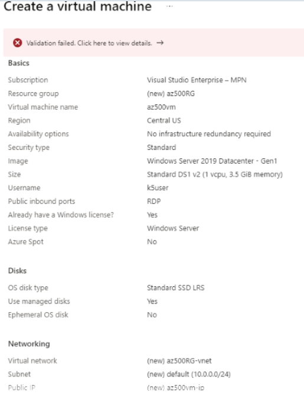

# AZ-500 Practice Test 139 Questions

---

## Q13X:

---

### Answer:

---

### References:

---

## Q139:

You are a security administrator in a global operating company. You discover that an organized hacking ring outside of your country has been targeting your company's research and development department.
You need to identify if an adversary is trying to leverage external-facing remote services to access within a network using Microsoft Sentinel.
Which attacker tactic should you look for in Microsoft Sentinel?

Choose the correct answer

- Resource Development
- Reconnaissance
- Initial Access
- Execution

---

### Answer:
- Initial Access

You should look for the use of Initial Access to identify if an adversary is trying to leverage external-facing remote services. Tactics are attack categories by which you can classify your rules. An attack usually consist of repeated stages. Based on the MITRE ATT&CK framework, Microsoft Sentinel differentiates multiple tactic stages. One of them is Initial Access. During this stage adversaries use different digital entry points (public facing applications, phishing, trusted relationships) to enter infrastructure and gain initial foothold within a network. Leveraging an external-facing remote service is one of the steps within Initial
Access.
You should not look for the use of Reconnaissance. Microsoft Sentinel classifies this stage as the first stage of an attack development. During this stage adversaries gather information to plan their next actions. This tactic does not include leveraging an external-facing remote service.
You should not look for the use of Resource Development. Microsoft Sentinel classifies this stage as the second stage of an attack development. During this stage, adversaries try to identify the resources they can use for their next actions. This tactic does not include leveraging an external-facing remote service.
You should not look for the use of Execution. Microsoft Sentinel classifies this stage as the fourth stage of an attack development. During this stage adversaries attempt to run their malicious code. This tactic does not include leveraging an external-facing remote service.

---

### References:

[Create custom analytics rules to detect threats](https://learn.microsoft.com/en-us/azure/sentinel/create-analytics-rules?tabs=azure-portal)  

[ATT&CK Matrix for Enterprise](https://attack.mitre.org/)


---

## Q138:

You manage Company1's Azure Infrastructure as a Service (laas) environment. Company1's global administration team is comprised of multiple smaller divisions that are located all over the world. Recently, one of the company's virtual machines (VMs) was accidentally deleted.
You need to use Azure Monitor to identify which administrator accidentally deleted the VM.
Which log should you evaluate?

Choose the correct answer

- Resource logs
- Active Directory (AD) logs
- Activity logs
- Microsoft Entra logs

---

### Answer:
- Activity logs

You should evaluate activity logs. Activity logs are part of the management plane, and they gather auditing information about operations on Azure resources. Activity logs allow you to determine who performed create, update, and delete operations on your subscription resources, as well as how and when these operations were performed.
You should not evaluate resource logs. Resource logs are part of the data plane and provide information about events within resources, such as log health monitoring, diagnostic of single apps in Azure App Service, etc.
You should not evaluate Microsoft Entra logs. Microsoft Entra logs are a subset of the resource logs. Microsoft Entra logs provide information about operations within Microsoft Entra ID, such as account creations and deletions, logins, etc.
You should not evaluate Active Directory (AD) logs. AD logs provide information about activities in AD on- premises. The scenario requires monitoring in the cloud, so you should evaluate the activity logs provided by Azure.

---

### References:


[Azure security logging and auditing](https://learn.microsoft.com/en-us/azure/security/fundamentals/log-audit)  
[Overview of Azure platform logs](https://learn.microsoft.com/en-us/azure/azure-monitor/data-sources)  
[Azure resource logs](https://learn.microsoft.com/en-us/azure/azure-monitor/essentials/resource-logs)  
[What are the Microsoft Entra activity log integration options?](https://learn.microsoft.com/en-us/entra/identity/monitoring-health/concept-log-monitoring-integration-options-considerations)  
[Monitoring Active Directory for Signs of Compromise](https://learn.microsoft.com/en-us/windows-server/identity/ad-ds/plan/security-best-practices/monitoring-active-directory-for-signs-of-compromise)  


---

## Q137:

Your recent audit discovered a vulnerability in your application, which could potentially compromise your user accounts.
You have been asked to configure the application so that it automatically prevents compromised accounts from being used. You onboard Microsoft Sentinel and connect it to Microsoft Defender for Cloud.
You need to automate the mitigation of incidents in Microsoft Sentinel. The solution must minimize administrative effort.

Which solution should you create to meet this requirement?

Choose the correct answer

- A playbook
- Azure Functions apps
- A runbook
- An alert rule

---

### Answer:
- A playbook

You should create a playbook. A playbook is a sequential list of required actions to mitigate an incident. Playbooks use the workflow power of Azure logic apps to automate an incident response. It can be configured to run automatically as soon as a specific incident is generated. Playbooks are closely integrated in Microsoft Sentinel, and thus this solution meets the requirement.
You should not create a runbook. Runbooks are used for Azure workloads management; for example, starting/stopping a virtual machine (VM), orchestrating external systems, and much more. Runbooks use PowerShell workflow. Using runbooks requires PowerShell programming experience, and therefore this solution does not meet the goal of minimizing administrative effort.
You should not create a Functions app. Functions is a serverless solution in Azure. You can use Functions to process file uploads, run scheduled tasks, process data in real time, and other similar tasks. If you use Functions, you do not need to maintain any underlying infrastructure. The cloud takes care of maintaining all the required resources. Although you could use a Functions app for the required task, it would require additional programming experience to write a code in supported languages (e.g. C#, Java, JavaScript, PowerShell, or Python), failing to minimize administrative effort.
You should not create an alert rule. Alerts are used to notify administrators if an issue is found within infrastructure or applications. Sentinel playbooks provide an integrated alerting mechanism so that you do not need to create an additional alert rule. Creating an additional alert rule will require more effort, which in this case needs to be minimized.

---

### References:

[Tutorial: Respond to threats by using playbooks with automation rules in Microsoft Sentinel](https://learn.microsoft.com/en-us/azure/sentinel/automation/tutorial-respond-threats-playbook)  
[Getting Started With Azure Automation - Runbook Management](https://azure.microsoft.com/de-de/blog/azure-automation-runbook-management/)  
[What are Azure Monitor Alerts?](https://learn.microsoft.com/en-us/azure/azure-monitor/alerts/alerts-overview) 


---

## Q136:

You configure Microsoft Sentinel in your company's Azure subscription.
Your company's security team needs to monitor events on your subscription and Microsoft Entra tenant by creating alerts and playbooks.
You need to identify the data connectors to monitor each of the events.
Which data connector should you use for each case? To answer, select the appropriate data connector from the drop-down menus.
Choose the correct options

Requirement | Data connector

To alert when a resource lock is removed from a virtual machine (VM): Azure Activity

To run a playbook when a user is removed: Microsoft Entra

To monitor when a user is assigned the owner permission in a resource group : Azure Activity

---

### Answer:

You should use the Azure Activity connector to alert when a resource lock is removed from a virtual machine (VM). You can use this connector to monitor any write operation performed on the resources in your subscription, including removing a resource lock.
You should use the Microsoft Entra connector to run a playbook when a user is removed. The Microsoft Entra connector can collect logs from audit logs and sign-in logs in your Microsoft Entra tenant. You can use the audit logs to monitor when a user is removed.
You should use the Azure Activity connector to monitor when a user is assigned the owner permission in a resource group. When you associate any permission to a resource group in your subscription, a write operation is sent to Azure Resource Manager, which can be monitored by Microsoft Sentinel using the Azure Activity connector.
You should not use the Microsoft Entra ID Protection connector. You can use this connector to collect risk sign-in attempts from Microsoft Entra ID Protection.

---

### References:


[Microsoft Sentinel data connectors](https://learn.microsoft.com/en-us/azure/sentinel/connect-data-sources?tabs=azure-portal)  
[Find your Microsoft Sentinel data connector](https://learn.microsoft.com/en-us/azure/sentinel/data-connectors-reference#azure-activity)   
[Connect Microsoft Entra data to Microsoft Sentinel](https://learn.microsoft.com/en-us/azure/sentinel/connect-azure-active-directory)  
[Azure Activity connector for Microsoft Sentinel](https://learn.microsoft.com/en-us/azure/sentinel/data-connectors/azure-activity)  


---

## Q135:

You are the security analyst for a company.
You have completed the Microsoft Sentinel onboarding process and you have configured alerts from Microsoft Defender for Cloud.
You need to automate the threat responses for incidents related to detected log-ons from a malicious IP on an Azure Virtual Machine (VM), running Windows. You need to minimize the implementation effort.

Which solution should you use?

Choose the correct answer

- Azure Monitor alert rule with a secure webhook
- Function app with an HTTP trigger
- Logic app with Microsoft Sentinel connector
- Power Automate flow with a custom connector

---

### Answer:
- Logic app with Microsoft Sentinel connector

You should use a Logic app with Microsoft Sentinel connector. You can use a security playbook to respond automatically to a thread detection alert event. The security playbooks are built on top of Azure Logic Apps and you do not need to write any code to implement them.
You should not use an Azure Monitor alert rule with a secure webhook. You could create a custom endpoint and implement code with a function app, but these will require a lot of implementation effort compared to built-in solutions.
You should not use an Azure Monitor alert rule with a function app with an HTTP trigger. Microsoft Sentinel does not provide direct integration with Azure Function. You could create a custom endpoint and implement code with a function app, but it would require a lot of implementation effort compared to built-in solutions.
You should not use a Power Automate flow with a custom connector. Power Automate does not have a built-in connector to integrate with Microsoft Sentinel. Using a custom connector will require more effort compared to a built-in solution using Logic Apps.

---

### References:


[Tutorial: Respond to threats by using playbooks with automation rules in Microsoft Sentinel](https://learn.microsoft.com/en-us/azure/sentinel/automation/tutorial-respond-threats-playbook)
[Quickstart: Onboard Microsoft Sentinel](https://learn.microsoft.com/en-us/azure/sentinel/quickstart-onboard)
[Security alerts a reference guide](https://learn.microsoft.com/en-us/azure/defender-for-cloud/alerts-reference)  
[Action groups](https://learn.microsoft.com/en-us/azure/azure-monitor/alerts/action-groups)  
[Build and certify custom connectors](https://learn.microsoft.com/en-us/power-automate/developer/register-custom-api)  


---

## Q134:

Your organization owns a Microsoft Entra tenant that has a subscription named Subscription1.
You have a security playbook named SentinelPlay1 in Microsoft Sentinel that responds to threats identified by Microsoft Sentinel rules. SentinelPlay1 has been configured to block IP addresses.
You need to modify SentinelPlay1 to send emails when an IP address is blocked.

Which tool should you use to modify the playbook?

Choose the correct answer

- Microsoft Defender for Cloud
- Azure Functions
- Azure Log Analytics
- Azure Logic Apps Designer

---

### Answer:
- Azure Logic Apps Designer

You should use Azure Logic Apps Designer. Sentinel security playbooks are configured as Logic Apps. To edit the behavior of the threat detection process, you need to open the playbook in Logic Apps Designer and add additional steps to the triggered event.
You should not use Microsoft Defender for Cloud. In this scenario, you want to edit an existing Microsoft Sentinel security playbook. You are not configuring any security alerts.
You should not use Log Analytics. Log Analytics can be used to view logs that are generated by various sources in Azure. You would not be able to configure any actions on a playbook using Azure Log Analytics.
You should not use Azure Functions. Security playbooks in Microsoft Sentinel are configured as logic apps. You would not be able to use the Azure Function designer to edit Logic Apps.


---

### References:

[Tutorial: Respond to threats by using playbooks with automation rules in Microsoft Sentinel](https://learn.microsoft.com/en-us/azure/sentinel/automation/tutorial-respond-threats-playbook)  
[What is Microsoft Defender for Cloud?](https://learn.microsoft.com/en-us/azure/defender-for-cloud/defender-for-cloud-introduction)  
[Log Analytics tutorial](https://learn.microsoft.com/en-us/azure/azure-monitor/logs/log-analytics-tutorial)  
[Azure Functions overview](https://learn.microsoft.com/en-us/azure/azure-functions/functions-overview?pivots=programming-language-csharp)  

---

## Q133:

You onboard Microsoft Sentinel for your organization's Microsoft Entra tenant. Your security team provides you with a list of different events for which they want to be able to create alerts and playbooks.
You need to identify which data sources must be enabled to meet each of the requirements provided by your security team.
Which data connector should you use for each requirement? To answer, drag the appropriate data connector to each requirement. A data connector may be used once, more than once, or not at all.

Drag and drop the answers

Azure Activity
Microsoft Entra ID
Azure Web Application Firewall
Azure DDoS Protection
Azure Firewall

Create an alert when someone deletes a virtual machine. : Azure Activity

Notify the security team when someone invokes a conditional access policy. : Microsoft Entra ID 

Create an alert when there is a SQL Injection attempt on your web applications. : Azure Web Application Firewall

Create an alert when an owner role is assigned to a user. : Azure Activity

---

### Answer:


You should use the Azure Activity data connector to create an alert when someone deletes a virtual machine. Changes to resources within a resource group are captured in Activity Logs.
You should use the Microsoft Entra ID connector to create a notification when someone invokes a conditional access policy. When a user invokes conditional access, Microsoft Entra generates a log entry on which the notification can be created in Microsoft Sentinel.
You should use the Azure Web Application Firewall (WAF) connector when there is a SQL Injection attempt
on your web applications. The WAF provides rules that can be enabled on applications sitting behind a gateway.
You should use the Azure Activity data connector to create an alert when an owner role is assigned to a user. Changes to resource permissions are captured as Activity Logs.
You should not use Azure Distributed denial of service (DDoS) protection. DDoS protection enables you to prevent attacks that attempt to exhaust an application's resources, which would impact the application's availability and make it unavailable to legitimate users.
You should not use Azure Firewall. Azure Firewall is a Microsoft managed network security service that protects resources hosted on Azure virtual networks. You can build Azure Firewall rules that permit or deny access to the resources hosted on the virtual network.

---

### References:

[Microsoft Sentinel data connectors](https://learn.microsoft.com/en-us/azure/sentinel/connect-data-sources?tabs=azure-portal)  
[Connect Microsoft Entra data to Microsoft Sentinel](https://learn.microsoft.com/en-us/azure/sentinel/connect-azure-active-directory)  
[Azure Activity connector for Microsoft Sentinel](https://learn.microsoft.com/en-us/azure/sentinel/data-connectors/azure-activity)
[Azure Web Application Firewall (WAF) connector for Microsoft Sentinel](https://learn.microsoft.com/en-us/azure/sentinel/data-connectors/azure-web-application-firewall-waf)
[Azure DDoS Protection connector for Microsoft Sentinel](https://learn.microsoft.com/en-us/azure/sentinel/data-connectors/azure-ddos-protection)  
[Azure Firewall connector for Microsoft Sentinel](https://learn.microsoft.com/en-us/azure/sentinel/data-connectors/azure-firewall)  

---

## Q132:

You notice an increase in the number of service desk tickets related to locked user accounts. You suspect that some users are trying to access resources that they do not have access to.
You need to generate a report using Azure Log Analytics to return all failed logins over the last five days.
Which Kusto Query Language (KQL) query options should you use? To answer, complete the command by selecting the correct parts from the drop-down menus.
Choose the correct options

```
SecurityEvent
| where TimeGenerated >=
ago(5d)
| where EventID == 4625
| summarize FailedLogins=count() by Account, Computer
| sort by FailedLogins desc
```

---

### Answer:

You should complete the query as follows:

```
SecurityEvent
| where TimeGenerated >=ago (5d)
| where EventID == 4625
| summarize FailedLogins=count() by Account, Computer
| sort by FailedLogins desc
```

You should first use SecurityEvent. All security logs are stored in the table named Security Event.
You should also use ago(5d). KQL uses the ago keyword when filtering for times and dates. The ago keyword takes the current datetime and subtracts the number of units specified in the brackets; in this example, five days.
You should not use (Get-Date). AddDays(-5). (Get-Date). AddDays(-5) is a PowerShell cmdlet that will subtract five days from the current date. It cannot be used in the KQL query.
You should not use either SecurityAlert or Operation. These tables do not contain the Security Event data that you need to query. The Security Alert table contains any security alerts that have occurred and been logged in Microsoft Defender for Cloud (formerly, Azure Security Center), for example, if a virus was detected on a virtual machine. The Operation table contains any operations that occur within the tenant, for example, when a virtual machine is powered off or resized.

---

### References:

[Get started with log queries in Azure Monitor](https://learn.microsoft.com/en-us/azure/azure-monitor/logs/get-started-queries)

---

## Q131:

You are the Azure administrator for your company. Users are assigned a Microsoft Entra ID P1 license.
Changes to Microsoft Entra accounts are currently only being stored for 90 days.
You need to ensure that changes to user accounts are logged and kept for 180 days. The solution should be the most cost-effective and efficient.
What should you do?

Choose the correct answer

- Assign users a Microsoft Entra ID P2 license.
- Create an Azure Function that writes changes to Table storage when changes are made and set the Table storage retention to 180 days.
- Use the Set-MsolUser cmdlet on all users and set log retention to 180 days.
- Create a Log Analytics workspace with a retention of 180 days and configure the export data settings for Microsoft Entra to send audit logs to the Log Analytics workspace.

---

### Answer:
- Create a Log Analytics workspace with a retention of 180 days and configure the export data settings for Microsoft Entra to send audit logs to the Log Analytics workspace.

You should create a Log Analytics workspace with a retention of 180 days and configure the export data settings for Microsoft Entra to send audit logs to the Log Analytics workspace. By default, audit logs for Microsoft Entra are stored for 90 days. If you want to keep data longer, you can export it automatically to a Log Analytics workspace.
You should not use the Set-MsolUser cmdlet. There are no user activity log retention settings that are configurable for user accounts.
You should not assign users a Microsoft Entra ID P2 license. There is no additional logging functionality over a Microsoft Entra ID P1 license.
You should not create an Azure Function that writes any changes to Table storage when any changes are made and set the Table storage retention to 180 days. You could write a function to perform the task, but it would require additional development knowledge and cost. Also, Table storage does not have a retention period setting.

---

### References:

[What are the Microsoft Entra activity log integration options?](https://learn.microsoft.com/en-us/entra/identity/monitoring-health/concept-log-monitoring-integration-options-considerations)  

---

## Q130:

You are a security professional in your organization.
Your security analysts have not been able to investigate and mitigate multiple recent well-known cyber- attacks due to a constantly overloaded Security Operations Center (SOC) and an increased flood of security alert notifications.
As a result, your organization has suffered a number of security breaches.
You need to use Microsoft Defender for Cloud workflow automation to automate the investigation and response to specific well-known security threats.
What should you do first?

Choose the correct answer

- Create a SharePoint workflow.
- Create an Azure automation task.
- Create an Azure Logic App.
- Create a Power Automate App.

---

### Answer:
- Create an Azure Logic App.

You should create an Azure Logic App. Azure Logic Apps is a cloud-based service that is provided by Microsoft Azure that allows users to create and run workflows that integrate with various systems, applications, and services. Microsoft Defender for Cloud's workflow automation is based on Azure Logic Apps, which serve as the underlying infrastructure. The visual workflow designer facilitates the easy customization of the logic and workflow according to your specific needs. You can either select from pre- existing Logic Apps or you can create a new one entirely from scratch. Once you have created your Logic App, you can seamlessly integrate it with Defender for Cloud, which can trigger it automatically upon receiving an alert.
You should not create a Power Automate App. The Power Automate App is a cloud-based workflow automation tool that is provided by Microsoft. Power Automate allows users to create and automate workflows across various applications and services and it does not require any coding expertise. While Power Automate App is a cloud-based workflow automation tool, Microsoft Defender for Cloud workflow automation is built on Azure Logic Apps so Power Automate does not meet the requirement.
You should not create a SharePoint workflow. A SharePoint workflow is a tool that helps automate and streamline business processes within SharePoint, which is a web-based collaboration platform developed by Microsoft. A workflow is a sequence of steps or activities that need to be completed to achieve a specific outcome. SharePoint workflows are built specifically for SharePoint on-premises. It cannot be used with Microsoft Defender for Cloud workflow automation per design.
You should not create an Azure automation task. Azure Automation is a service provided by Microsoft Azure that allows users to automate various processes in the Azure environment. It enables the creation, deployment, and management of automation workflows using PowerShell or Python scripts. With Azure Automation tasks, users can automate various tasks such as resource management, patching, backup, and monitoring. The focus of Azure Automation is not a security response automation but rather the automation of various processes and tasks in the Azure environment, therefore it does not meet the requirement.

---

### References:

[Use a workflow automation to automate responses](https://learn.microsoft.com/en-us/training/modules/resolve-threats-with-azure-security-center/5-use-a-playbook)  
[Get started with Power Automate](https://learn.microsoft.com/en-us/power-automate/getting-started)  
[Overview of workflows included with SharePoint](https://support.microsoft.com/en-us/office/overview-of-workflows-included-with-sharepoint-d74fcceb-3a64-40fb-9904-cc33ca49da56)  
[What is Azure Automation?](https://learn.microsoft.com/en-us/azure/automation/overview)  

---

## Q129:

You are monitoring your Azure subscription using Microsoft Defender for Cloud.
An Azure container registry named Reg1 has been deployed for your subscription. After uploading container images into the registry, you notice that these images are not being scanned for vulnerabilities.
You need to enable vulnerability scans for the container images when they are uploaded to Reg1.

What should you do?
Choose the correct answer

- Activate basic security features for Microsoft Defender for Cloud.
- Modify the Pricing tier settings for Microsoft Defender for Cloud.
- Create a DevOps build pipeline to upload container images into Reg1.
- Use Docker to push container images into Reg1.

---

### Answer:
- Modify the Pricing tier settings for Microsoft Defender for Cloud.

You should modify the Pricing tier settings for Microsoft Defender for Cloud. Microsoft Defender for Cloud is a cloud-based security solution that is designed to help organizations protect their cloud environment and data from advanced threats. This solution offers threat detection, investigation, and response capabilities, and it also provides visibility into cloud apps and services, and user activities, which helps organizations to detect and remediate security risks in real-time. Microsoft Defender for Cloud is offered in several pricing tiers, which vary depending on the features and capabilities that are included. You can choose from a plan that only offers basic features (continuous assessment and security recommendations within Cloud Security Posture Management (CSPM)) or one that offers enhanced protective security features based on the resource type. To enable vulnerability scans for resource type container, you have to modify the pricing tier settings for Microsoft Defender for Cloud by activating protection on container resources in the subscription.
You should not use Docker to push container images into Reg1. Docker is a popular platform for building, sharing, and running containerized applications. A container is a lightweight, standalone executable package of software that includes everything that is required to run an application, such as code, libraries, and dependencies. When you create a container image using Docker, you can push it to a container registry so that it can be accessed and used by others. Pushing a container image into Reg1 is a copy operation and it would not enable you to automatically activate vulnerability scanning by Microsoft Defender for Cloud.
You should not create a DevOps build pipeline to upload container images into Reg1. The Microsoft DevOps build pipeline is a continuous integration and delivery (CI/CD) pipeline that is used in Microsoft's Azure DevOps platform. The build pipeline automates the process of building, testing, and deploying software applications. Uploading container images into Reg1 using DevOps pipeline is similar to Docker push with automation enhancement. Essentially it is a copy process, which does not help to automatically activate vulnerability scanning by Microsoft Defender for Cloud.
You should not activate basic security features for Microsoft Defender for Cloud. This pricing tier does not include vulnerability scans for container images.

---

### References:

[Overview of Container security in Microsoft Defender for Containers](https://learn.microsoft.com/en-us/azure/defender-for-cloud/defender-for-containers-introduction)  
[Cloud Security Posture Management (CSPM)](https://learn.microsoft.com/en-us/azure/defender-for-cloud/concept-cloud-security-posture-management)  
[Microsoft Defender for Cloud pricing](https://azure.microsoft.com/en-us/pricing/details/defender-for-cloud/)  
[Connect your Azure subscriptions](https://learn.microsoft.com/en-us/azure/defender-for-cloud/connect-azure-subscription)


---

## Q128:

A recent penetration test revealed that your Azure SQL managed instances are vulnerable to an SQL injection attack.
You need to mitigate vulnerability and trigger high severity alerts to warn the incident response team.
Which four actions should you perform in sequence? To answer, move the appropriate actions from the list of possible actions to the answer area and arrange them in the correct order.
Create a list in the correct order

Possible actions
Create a Microsoft Sentinel workspace.
Configure SQL vulnerability assessment settings.
Set up SQL Health Check.

Actions in order
Enable Microsoft Defender for Cloud on your subscription.
Enable Microsoft Defender for SQL on all of your Azure SQL managed instances.
Configure Advanced Threat Protection for SQL settings.
Add the incident response team's email addresses in the Additional email addresses field.

---

### Answer:

You should perform the following steps in order:
1. Enable Defender for Cloud on your subscription.
2. Enable Microsoft Defender for SQL on all your Azure SQL managed instances.
3. Configure Advanced Threat Protection for SQL settings.
4. Add the incident response team's email addresses in the Additional email addresses field.
You should first enable Microsoft Defender for Cloud on your subscription. Enabling Microsoft Defender for Cloud on your subscription unlocks threat protection capabilities for the subscription's workloads, such as Azure SQL managed instances.
Next, you should activate Microsoft Defender for SQL on all your Azure SQL managed instances. Microsoft Defender for Cloud allows you to selectively enable or disable subscription workload protection.
Then, you should Configure Advanced Threat Protection for SQL settings. Advanced Threat Protection (ATP) for Azure SQL Database detects unusual activities on Azure SQL databases, such as SQL injection attacks, access from unusual or unknown locations, unauthorized database access, etc. ATP for Azure SQL is part of the Microsoft Defender for SQL offering. ATP for Azure SQL triggers alerts and notifies about an incident with a defined severity level; e.g. high or medium severity.
Finally, you should add the incident response team's email addresses in the Additional email addresses field.
You should not create a Microsoft Sentinel workspace. Microsoft Sentinel is a security information event management (SIEM) and security orchestration automated response (SOAR) solution. To activate Microsoft Sentinel, you should create a Microsoft Sentinel workspace. You need to set up Microsoft Defender for SQL, which is used with Azure SQL databases, not a Microsoft Sentinel workspace.
You should not set up SQL Health Check. SQL Health Check is a risk and health assessment solution that allows you to proactively check your Azure SQL environment. This solution does not send incident alerts.
You should not configure SQL vulnerability assessment settings. SQL vulnerability assessment allows you to discover potential database vulnerabilities. This feature sends vulnerability assessment reports, not incident alerts.

---

### References:

[Configure Advanced Threat Protection for Azure SQL Database](https://learn.microsoft.com/en-us/azure/azure-sql/database/threat-detection-configure?view=azuresql)  
[Optimize your SQL environment with the SQL Server Health Check solution in Azure Monitor](https://learn.microsoft.com/en-us/previous-versions/azure/azure-monitor/insights/sql-assessment)  
[What is Microsoft Sentinel?](https://learn.microsoft.com/en-us/azure/sentinel/overview?tabs=azure-portal)  
[Prerequisites to deploy Microsoft Sentinel](https://learn.microsoft.com/en-us/azure/sentinel/prerequisites)  
[SQL vulnerability assessment helps you identify database vulnerabilities](https://learn.microsoft.com/en-us/azure/defender-for-cloud/sql-azure-vulnerability-assessment-overview)  
[SQL Advanced Threat Protection](https://learn.microsoft.com/en-us/azure/azure-sql/database/threat-detection-overview?view=azuresql)  

---

## Q127:

You are a security administrator for an Azure environment. You are requested to protect all your virtual machines (VMs) with Microsoft Defender for Servers. Microsoft Defender for Cloud is activated, as shown in the exhibit.
You need to deploy a vulnerability assessment solution, but the integrated vulnerability scanner is not available as shown in the exhibit.

What should you do to fix this issue?

Choose the correct answer

- Switch on Microsoft Defender for Servers.
- Buy another Microsoft Defender plan that supports vulnerability assessments for VMs.
- Activate Auto Provisioning Extensions.
- Switch on the VMs into running state.


---

### Answer:
- Switch on Microsoft Defender for Servers.

You should switch on Microsoft Defender for Servers. Microsoft Defender for Servers is one of the enhanced security features of Microsoft Defender for Cloud. Microsoft Defender for Servers discovers vulnerabilities and misconfigurations in near real time. To enable an integrated vulnerability scanner on VMs, you should switch on Microsoft Defender for Servers in your enhanced Microsoft Defender for Cloud plan.
You should not switch on VMs into running state. VMs must be in a running state for integrated vulnerability scanner deployment, after the scanner has been enabled. To enable the integrated vulnerability scanner, Microsoft Defender for Servers must be switched on.
You should not activate Auto Provisioning Extensions. Defender for Cloud provides the possibility to automatically provision extensions (e.g., integrated vulnerability scanner). In this scenario, neither manual nor automatic provisioning can be activated as long as Microsoft Defender for Servers is set to off.
You should not buy another Microsoft Defender plan that supports vulnerability assessments for VMs. Microsoft Defender is offered as a free and enhanced plan. In this scenario the enhanced plan is already activated.

---

### References:

[Enable vulnerability scanning with the integrated Qualys scanner (deprecated)](https://learn.microsoft.com/en-us/azure/defender-for-cloud/deploy-vulnerability-assessment-vm)  
[What is Microsoft Defender for Cloud?](https://learn.microsoft.com/en-us/azure/defender-for-cloud/defender-for-cloud-introduction)  


---

## Q126:

You are a security administrator in an Azure cloud hybrid environment. You want to activate Microsoft Defender for Servers to all your Azure Cloud and on-premises servers and configure the Microsoft Defender for Cloud enhanced security features as shown in the exhibit.
You need to deploy Microsoft Monitoring Agent (MMA) to the on-premises services to extend their visibility and Defender for Cloud capabilities, such as continuous assessment, up-to-date security recommendations, etc.
Which two values should you specify? Each correct answer presents a part of the solution.

Choose the correct answers
- User-assigned managed identity
- Workspace ID
- Workspace secret key
- Microsoft Entra Identity


---

### Answer:
- Workspace ID
- Workspace secret key

You should specify a workspace secret key and a workspace ID. To be able to onboard on-premises servers into Microsoft Defender for Cloud you have to install Microsoft Monitoring Agent (MMA). MMA collects the required logs and performance metrics and sends them to Microsoft Defender for Cloud. Microsoft Defender for Cloud then evaluates the logs and provides recommendations about the servers' health and security status; for example, missing security updates. You have to provide a workspace secret key and workspace ID during MMA installation and configuration to provide the MMA with information about your Azure tenant and where to save the collected data within your tenant.
You should not specify either a user-assigned managed identity or a Microsoft Entra Identity. These two values are needed when you install Microsoft Defender for Cloud's integrated Qualys vulnerability scanner. The Qualys vulnerability scanner is an intrusion detection solution (IDS) that is integrated into Microsoft Defender for Cloud.

---

### References:


[Connect your Azure subscriptions](https://learn.microsoft.com/en-us/azure/defender-for-cloud/connect-azure-subscription)
[Onboard Windows servers to the Microsoft Defender for Endpoint service](https://learn.microsoft.com/en-us/defender-endpoint/configure-server-endpoints)  
[Microsoft Defender for Cloud Monitoring Agent Deployment Options](https://techcommunity.microsoft.com/t5/microsoft-defender-for-cloud/microsoft-defender-for-cloud-monitoring-agent-deployment-options/ba-p/817520)  
[Connect your non-Azure machines to Microsoft Defender for Cloud](https://learn.microsoft.com/en-us/azure/defender-for-cloud/quickstart-onboard-machines)  
[Azure Monitor Agent overview](https://learn.microsoft.com/en-us/azure/azure-monitor/agents/agents-overview)  
[Microsoft Monitoring Agent Setup](https://learn.microsoft.com/en-us/services-hub/unified/health/mma-setup)  
[Qualys FAQ](https://www.qualys.com/support/faq/general/)  


---

## Q125:

You have recently moved all your on-premises workloads to Azure Cloud and suffer vulnerability attacks on your on-premises SQL server.
You need to enable Microsoft Defender for SQL for your Azure SQL database.
Which three activities does Microsoft Defender for SQL identify as a threat? Each correct answer presents a complete solution.

Choose the correct answers

- Over 200 record deletions
- Cross site scripting (XSS)
- Over 70% updates in a table
- A legitimate user accessing from a breached computer
- An attempt to sign in as SELECT * FROM products WHERE name = 'table' or 1 = 1 --'
- A high number of failed sign-in attempts

---

### Answer:
- A legitimate user accessing from a breached computer
- An attempt to sign in as SELECT * FROM products WHERE name = 'table' or 1 = 1 --'
- A high number of failed sign-in attempts

The following activities will be identified as threats by Microsoft Defender for SQL:
• An attempt to sign in as SELECT FROM products WHERE name = 'table' or 11--'. This kind of threat is known as an SQL injection attack. In this scenario, an attacker inserts a T-SQL code in an input field. This code is executed at the backend, returning information which is not intended to be seen by end users. This way, an attacker can start reconnaissance of the backend environment to continue with lateral movements.
A legitimate user accessing from a breached computer. In this scenario, the SQL database is accessed by remotely-controlled malicious software which has been installed on a legitimate user's computer.
• A high number of failed sign-in attempts. This is an example of anomalous database access and query patterns.
Cross site scripting is not detected by Microsoft Defender for SQL. This is a web application vulnerability attack, which is detected by Application Gateway Web Application Firewall. During this attack a web server gets compromised and malicious scripts are injected into trustworthy websites.
Over 200 records deletions and over 70% updates in a table do not necessarily constitute an attack. In big databases, it is not unusual for 200 records to be deleted or for numerous updates to be performed. These actions would not be considered as malicious activities or threats by Microsoft Defender for SQL.


---

### References:

[Overview of Microsoft Defender for Azure SQL](https://learn.microsoft.com/en-us/azure/defender-for-cloud/defender-for-sql-introduction)  
[Cross Site Scripting (XSS)](https://owasp.org/www-community/attacks/xss/)  
[SQL injection](https://owasp.org/www-community/attacks/SQL_Injection)  
[Azure threat protection](https://learn.microsoft.com/en-us/azure/security/fundamentals/threat-detection)


---

## Q124:

Recent penetration testing at your organization revealed an SQL injection attack vulnerability.
You need to take steps to minimize the risk of this type of attack.
Which of the following features should you implement?

Choose the correct answer

- Advanced Threat Protection
- Transparent Data Encryption (TDE)
- Database-level firewall rules
- Dynamic Data Masking (DDM)

---

### Answer:
- Advanced Threat Protection

You should implement Advanced Threat Protection. Advanced Threat Protection for SQL is part of the Microsoft Defender for SQL product. It detects and protects against the exploitation of an SQL injection attack. Additionally, it protects against data exfiltration, brute force attacks, and some other anomalies. Therefore, this solution meets the requirement.
You should not implement Dynamic Data Masking (DDM). SQL DDM hides portions of sensitive information from unauthorized users. DDM can be configured as per database policy. You can query data in SQL (structured query language) using Microsoft's proprietary extension Transact-SQL (T-SQL). If an unauthorized user executes a T-SQL query, the sensitive information in returned data is hidden on a per-field basis, without changing the data itself. Although DDM protects sensitive information within the defined fields, it does not prevent an attacker from exploiting an SQL injection vulnerability and from exploring the internal SQL structure and settings.
You should not implement Transparent Data Encryption (TDE). TDE encrypts and protects SQL data at rest. It does not protect data in transit and data in use.
You should not implement database-level firewall rules. Database-level firewall rules protect the access to SQL on the network layer of the Open Systems Interconnection (OSI) model. SQL injection takes place on the Application layer of the OSI model.

---

### References:

[SQL Advanced Threat Protection](https://learn.microsoft.com/en-us/azure/azure-sql/database/threat-detection-overview?view=azuresql)
[Dynamic Data Masking](https://learn.microsoft.com/en-us/sql/relational-databases/security/dynamic-data-masking?view=sql-server-ver16)  
[Transparent Data Encryption (TDE)](https://learn.microsoft.com/en-us/sql/relational-databases/security/encryption/transparent-data-encryption?view=sql-server-ver16)  
[Transact-SQL Reference (Database Engine)](https://learn.microsoft.com/en-us/sql/t-sql/language-reference?view=sql-server-ver15)  
[Azure SQL Database and Azure Synapse IP firewall rules](https://learn.microsoft.com/en-us/azure/azure-sql/database/firewall-configure?view=azuresql)  


---

## Q123:

You are the Azure administrator for your company. Your company has resources on-premises as well as in Azure. All Azure resources are in the Europe West region in a single subscription.
A third-party solution monitors the on-premises resources for suspicious activity and includes monitoring the security logs.
You need to configure a similar solution for the Azure resources. You must monitor the security log and alert on any events with the EventID 4648.
What should you do?
Choose the correct answer

- Create a new alert rule and select the security event log. Filter for EventID 4648.
- Create a new alert rule and enter SecurityEvent | where EventID == 4648 as the search query.
- Export the security log to Log Analytics and filter for EventID 4648.
- Create a new runbook to export the Windows security log.

---

### Answer:
- Create a new alert rule and enter SecurityEvent | where EventID == 4648 as the search query.

You should create a new alert rule that uses the search query Security Event | where EventID == 4648. When you create a new alert rule, you should specify a workspace and use Kusto Query Language (KQL) to see if the workspace rules are evaluated over a time period; for example, every hour. Any positive matches are then visible within Microsoft Defender for Cloud.
You should not create a new alert rule, select the security event log, and filter for EventID 4648. Alert rules are used to query a connected workspace and not an event log, in this case, the security log.
You should not create a runbook to export the Windows security log. Runbooks are used to automate and schedule code; for example, PowerShell scripts, via a schedule.
You should not export the security log to Log Analytics and filter for EventID 4648. The Microsoft Graph API allows you to use REST calls to query Microsoft Entra ID, Office 365, and other Microsoft cloud resources. It does not allow you to export the security log to Log Analytics.

---

### References:

[What is Microsoft Defender for Cloud?](https://learn.microsoft.com/en-us/azure/defender-for-cloud/defender-for-cloud-introduction#custom-alert-rules-preview)  

[Tutorial: Create Automation PowerShell runbook using managed identity](https://learn.microsoft.com/en-us/azure/automation/learn/powershell-runbook-managed-identity)


---

## Q122:

You are managing an Azure environment for a company in Europe. The European Union Agency for Cybersecurity recently approved new security policies that consist of multiple scopes of actions. You have been asked to assess your environment's compliance based on the new regulation. You verify the built-in security policies in Microsoft Defender for Cloud; however, you are unable to find any policies that meet all of the new requirements.
You need to ensure that the company is compliant with the new regulations from the European Union Agency for Cybersecurity and that the requirements are implemented in a more streamlined manner.

What should you do?

Choose the correct answer

- Create a new security recommendation.
- Create a new security initiative.
- Create a new instance of Microsoft Defender EASM.
- Create a new security policy.

---

### Answer:
- Create a new security initiative.

You should create a new security initiative. An Azure Security Initiative is a compilation of Azure Policy definitions or rules that are arranged together to achieve a particular objective. By grouping a series of policies together into a unified item, Security Initiatives make it easier to manage policies in a more streamlined manner. Because the new regulation consists of multiple scopes of action, multiple Azure security policy definitions have to be created and these in turn are to be compiled into a new Azure security initiative.
You should not create a new security policy. An Azure Policy definition refers to a set of regulations that govern specific security conditions. These conditions can include limiting the types of resources that can be deployed or enforcing mandatory tagging for all resources. Additionally, users are able to create customized policy definitions to suit their specific needs. In order to put these policy definitions (whether they are pre- defined or custom) into effect, you must assign them to your resources. It is possible to assign any of these policy definitions using the Azure portal, PowerShell, or Azure CLI. However, in this scenario you would have to create multiple policies to meet the new regulation, and you would have to cloud assign them one by one to your resources. Grouping these policies into a security initiative and assigning this initiative to your resources as a whole would be a more streamlined way of implementing the requirements.
You should not create a new instance of Microsoft Defender External Attack Surface Management (Defender EASM). Microsoft Defender EASM conducts continuous scanning and mapping of your digital attack surface to provide an external view of your online infrastructure. Discovered attack surface leverages your organization's vulnerability and infrastructure data to show the key areas of concern for your organization. The discovery technology that is used in Defender EASM is the Microsoft proprietary one and as such, it does not take any specific local regulations into consideration.
You should not create a new security recommendation. Defender for Cloud employs policies to conduct regular assessments of your resources' compliance status and to detect any security misconfigurations or vulnerabilities. Based on these assessments, it offers remedial guidance to address the identified issues. As such, you cannot create a recommendation. Recommendations are formulated by evaluating your resources against the applicable policies and identifying any resources that fail to meet your specified criteria.

---

### References:

[Azure Policy built-in definitions for Microsoft Defender for Cloud](https://learn.microsoft.com/en-us/azure/defender-for-cloud/policy-reference)  
[Security policies in Defender for Cloud](https://learn.microsoft.com/en-us/azure/defender-for-cloud/security-policy-concept)  
[EU Agency for Cybersecurity](https://www.enisa.europa.eu/)
[Defender External Attack Surface Management](https://learn.microsoft.com/en-us/azure/external-attack-surface-management/)  

---

## Q121:

You have been asked to evaluate an external attack surface of your online infrastructure using Microsoft Defender External Attack Surface Management (Defender EASM).
You need to create a mapping of your organization's attack surface and so you create a Defender EASM instance in your Azure environment.
What should you configure next?

Choose the correct answer

- seeds
- resources
- assets
- policies

---

### Answer:
- seeds

You should configure seeds next. Microsoft employs a proprietary discovery technology that uses a recursive search strategy to identify infrastructure that has connections with known legitimate assets. This technology enables you to detect previously unobserved and unmonitored properties by analyzing the relationship between the infrastructure and the organization. The legitimate assets, which are referred to as discovery seeds, serve as a starting point for the Microsoft Defender External Attack Surface Management (Defender EASM), and they enable it to identify robust connections and continue searching recursively to uncover more links. This comprehensive approach ultimately helps you to fully understand the organization's attack surface.
You should not configure assets. In this scenario, assets refer to the infrastructure, devices, and applications that are identified by Defender EASM during the discovery process. Microsoft indexes the following kinds of web infrastructure during the discovery process:

- Organization Names
- Domains
- IP Blocks
- Hosts
- Email Contacts
- Autonomous System Numbers (ASNs)
- Whols organizations

At the beginning of the discovery process, the assets are not known, and as such, they cannot be configured.
You should not configure resources. Resources refer to the components, services, and data that are required to execute a particular task or to run an application. In the context of Defender EASM, you cannot configure resources given that these are allocated and managed by Azure, which therefore means that you do not have any influence over their configuration.
You should not configure policies. Policies are a feature of Microsoft Azure that enable users to enforce rules and controls on resources deployed in their Azure environment. Azure Policies are used to ensure that resources are compliant with security, governance, and compliance requirements and that they are consistent with best practices. In this scenario, you need to discover your online infrastructure's attack surface and as soon as you know your infrastructure's weaknesses, you can configure policies to improve its security posture.

---

### References:

[Use and manage discovery](https://learn.microsoft.com/en-us/azure/external-attack-surface-management/using-and-managing-discovery)  

[Defender External Attack Surface Management](https://learn.microsoft.com/en-us/azure/external-attack-surface-management/)  

---

## Q120:

You are the administrator of Company1's cloud environment, which runs in Azure cloud.
All of Company1's resources in Azure cloud are protected with Microsoft Defender for Cloud's enhanced security features. Recently, Company1 merged with Company2.
You have been asked to ensure that Company1's 100 existing servers, and all of Company2's newly created servers, which run in Amazon Web Services (AWS) cloud, are protected using your Microsoft Defender for
Cloud instance.
You need to implement a solution to meet this requirement with the least amount of administrative effort.

What should you do first?

- Choose the correct answer
- Install Microsoft Monitoring Agent (MMA).
- Onboard servers as Azure Arc machines.
- Set up a connector.
- Install Azure Monitoring Agent (AMA).

---

### Answer:
- Set up a connector.

You should set up a connector first. Microsoft Defender for Cloud is a cloud-native security solution that can help to protect Amazon Web Services (AWS) workloads and services. To extend Defender for Cloud protection to your AWS environment, you must first set up a connector. Once you have set up the connector, you should then turn off any plans you do not need, configure auto-provisioning settings, authenticate and deploy the settings to AWS. As soon as the connector has been set up, all of the existing and new servers will automatically be included in Microsoft Defender for Cloud protection, which will minimize the administrative efforts required.
You should not onboard servers as Azure Arc machines. Azure Arc is a hybrid cloud management platform that enables the management and governance of resources across on-premises, multi-cloud, and edge environments. To onboard servers using Azure Arc you need to configure and deploy Azure Arc agent on every server. Although it would be possible to extend Microsoft Defender for Cloud protection to the AWS servers using Azure Arc, this would require more administrative efforts, given that you would have to deploy and manage Azure Arc agents.
You should not install Azure Monitoring Agent (AMA). AMA is a lightweight agent that you can install on your servers or VMs to collect telemetry data and send it to Azure Monitor. AMA is primarily focused on collecting telemetry data from your applications and infrastructure, and this information can be used to monitor performance, diagnose issues, and gain insights into application and infrastructure behavior. While AMA can provide visibility into security-related events through log collection and analysis, it is not primarily designed as a security solution.
You should not install Microsoft Monitoring Agent (MMA). MMA is a lightweight agent that can be installed on Windows computers to collect and send data to Microsoft's cloud-based and on-premises monitoring solutions, such as Azure Monitor and System Center Operations Manager. MMA collects various types of data, such as performance metrics, event logs, and custom data from Windows performance counters and log files. While MMA can provide visibility into security-related events through log collection and analysis, it is not primarily designed as a security solution.

---

### References:

[Plan your Defender for Servers deployment](https://learn.microsoft.com/en-us/azure/defender-for-cloud/plan-defender-for-servers)  
[Microsoft Monitoring Agent setup](https://learn.microsoft.com/en-us/services-hub/unified/health/mma-setup)   
[Install Log Analytics agent on Windows computers](https://learn.microsoft.com/en-us/azure/azure-monitor/agents/agent-windows?tabs=setup-wizard)  
[Azure Monitor Agent overview](https://learn.microsoft.com/en-us/azure/azure-monitor/agents/agents-overview)  
[Azure Arc overview](https://learn.microsoft.com/en-us/azure/azure-arc/overview)  
[Operations Manager](https://learn.microsoft.com/en-us/system-center/scom/welcome?view=sc-om-2022) 

---

## Q119:

Company1 has implemented Microsoft Defender for Cloud to secure its Azure resources. You are a security analyst for Company1, and you have been asked to analyze the effectiveness of the environment's protection using Microsoft Defender for Cloud. You navigate to Microsoft Defender for Cloud in the organization as shown in the exhibit.
You need to create your evaluation report.
For each of the following statements, select Yes if the statement is true. Otherwise, select No.


A higher secure score means a lower identified risk level: Yes
You can use secure score to provide a comprehensive risk assessment of the organization's security posture: Yes
The organization's secure score values indicate that the risk of getting breached is low: No


---

### Answer:

A higher secure score means a lower identified risk level. In Microsoft Defender for Cloud, a higher Secure Score means a lower identified risk level. The Secure Score is a measure of how well your organization's environment is secured and protected against potential security threats. The Secure Score is calculated based on the implementation of security controls across different areas of security, such as identity and access management, device management, and threat protection. The higher the number of security controls that are in place and implemented effectively, the higher your Secure Score will be.
You can use secure score to provide a comprehensive risk assessment of the organization's security posture. Secure score uses a variety of factors to assess the overall security of your environment and identify potential security threats and vulnerabilities.
The organization's secure score values do not indicate that the risk of getting breached is low. Secure score does not measure the risk of getting breached. Secure Score is a tool that provides a relative measure of your organization's security posture compared to other organizations and it provides customized recommendations that enable you to improve your security posture.


---

### References:


References
[What is identity secure score?](https://learn.microsoft.com/en-us/entra/identity/monitoring-health/concept-identity-secure-score)  
[What is Microsoft Defender for Cloud?](https://learn.microsoft.com/en-us/azure/defender-for-cloud/defender-for-cloud-introduction)  
[Secure score in Defender for Cloud](https://learn.microsoft.com/en-us/azure/defender-for-cloud/secure-score-security-controls)  

---

[What is Azure Dedicated HSM?](https://learn.microsoft.com/en-us/azure/dedicated-hsm/overview)  

[Active Directory Certificate Services Overview](https://learn.microsoft.com/en-us/previous-versions/windows/it-pro/windows-server-2012-r2-and-2012/hh831740(v=ws.11))  

[Azure Key Vault basic concepts](https://learn.microsoft.com/en-us/azure/key-vault/general/basic-concepts)  

---

## Q118:

You are using Microsoft Defender for Cloud to monitor your company's Azure environment.
You identify that some unlicensed software is running on your VMs.
You have been asked to improve compliance with local security policies in order to ensure that only licensed software runs on your VMs.
You need to implement a solution to meet this request with the least amount of administrative effort.

What should you configure?
Choose the correct answer

- software restriction policies
- adaptive application controls
- Azure security policies
- application control policies

---

## Answer:
- adaptive application controls

You should configure adaptive application controls. Adaptive application controls is a security feature in Microsoft Defender for Cloud that helps protect your virtual machines (VMs) and servers by controlling the applications that can run on them. This feature uses machine learning and artificial intelligence to automatically create and enforce application control policies that adapt to your environment and the applications that are running on your VMs and servers. This approach is more automated and adaptive to changes in your environment, and it requires less manual intervention than traditional application control policies.
You should not configure application control policies. Application control policies are a security feature. These policies allow you to control which applications can run on your virtual machines (VMs) and servers by defining a set of allowed/blocked rules. Application control policies are a more traditional approach to application control, and they allow you to define a set of rules that specify which applications are allowed or blocked based on criteria such as file hashes, file paths, and publisher information. Once these policies have been defined, they are enforced across your VMs and servers. Although this approach is powerful, it requires careful planning and management in order to ensure that policies are up-to-date and accurate.
You should not configure software restriction policies. Software Restriction Policies (SRP) is a security feature in Windows that allows administrators to control which applications can run on a computer. SRP uses a pre-defined whitelist approach in which only applications that are explicitly allowed are able to run. It requires more administrative maintenance; therefore, it does not meet the requirements in this scenario.
You should not configure Azure security policies. Azure security policies are a set of predefined policies that help to ensure that your resources in Azure are secure and compliant with industry standards and best practices. These policies can be used to enforce rules and constraints on resources in your Azure environment, such as storage accounts, VMs and databases.

---

### References

[Understand adaptive application controls](https://learn.microsoft.com/en-us/azure/defender-for-cloud/adaptive-application-controls)  
[Windows Defender Application Control management with Configuration Manager](https://learn.microsoft.com/en-us/mem/configmgr/protect/deploy-use/use-device-guard-with-configuration-manager)  
[Software Restriction Policies](https://learn.microsoft.com/en-us/windows-server/identity/software-restriction-policies/software-restriction-policies)  
[Security policies in Defender for Cloud](https://learn.microsoft.com/en-us/azure/defender-for-cloud/security-policy-concept)  

---

---

## Q118:

Your company is planning on deploying resources to Azure in a new greenfield subscription and wants to allow its design architects to define a repeatable set of Azure resources that will adhere to the company standards, patterns, and requirements.
You recommend using Azure Blueprints to facilitate these requirements. You are tasked with granting the design architects the relevant permissions to be able to create and remove blueprints. You decide to create a custom role for the team of design architects and add the following permissions to the role:
• Microsoft.Blueprint/blueprints/write
• Microsoft.Blueprint/blueprints/versions/write
Microsoft. Blueprint/blueprints/versions/delete
During testing, you find that members of the group are still unable to perform all management tasks on Azure Blueprints.
You need to assign the relevant permissions to the custom role to allow the design architects group access to manage Azure Blueprints. The solution must follow the principle of least privilege.
Which three additional permissions should you add to the custom role to meet the access requirements? Each correct answer presents part of the solution.

- *
- Microsoft.Blueprint/blueprints/artifacts/delete
- Microsoft.Blueprint/blueprints/delete
- Microsoft.Blueprint/blueprintAssignments/*
- Microsoft.Blueprint/blueprints/artifacts/write
- Microsoft.Blueprint/blueprints/*

---

### Answer:
- Microsoft.Blueprint/blueprints/artifacts/delete
- Microsoft.Blueprint/blueprints/delete
- Microsoft.Blueprint/blueprints/artifacts/write

To use Azure Blueprint, you need to be granted permissions to create a blueprint definition, create artifacts on a blueprint definition, publish a blueprint, and delete a blueprint.
The group already has permissions to create a blueprint definition, publish a blueprint and delete a blueprint definition. Therefore, you need to assign the following permissions:
• Microsoft. Blueprint/blueprints/artifacts/write
• Microsoft. Blueprint/blueprints/artifacts/delete
• Microsoft. Blueprint/blueprints/delete
Microsoft.Blueprint/blueprints/artifacts/write would allow the group to create artifacts on a blueprint.
Microsoft.Blueprint/blueprints/artifacts/delete would allow the group to delete an artifact on a blueprint.
Microsoft.Blueprint/blueprints/delete would allow the group to delete blueprint definitions.
The Microsoft. Blueprint/blueprints/* will allow the group to have full access to all actions within Azure Blueprint, which would not follow least privilege access.
Microsoft.Blueprint/blueprintAssignments/* will allow the group to assign and un-assign a blueprint, which is not a requirement within this scenario.
Adding the "*" action would give owner-level permissions within Azure, which would not follow least privilege access.

---

### References:

[What is Azure Blueprints (Preview)?](https://learn.microsoft.com/en-us/azure/governance/blueprints/overview)  


---

## Q117:

Your company has an existing Azure subscription that hosts laas services including VMs, storage, and SQL databases. Your role within the organization is to ensure that resources within the Azure subscription are protected by backups and can easily be restored. You currently use Azure Backup to manage backups and restores within the environment.
A recent audit of the Azure subscription has concluded that existing VM disks must have Azure Disk Encryption (ADE) enabled on them. Your existing Azure estate currently hosts both managed and unmanaged disks and three file servers: FileServer01, FileServer02, and FileServer03.
You need to identify whether all of the disks will support ADE and that there would be no issues with recovering data from the file servers once it is enabled.
For each of the following statements, select Yes if the statement is true, otherwise select No.


Azure Backup supports file and folder level recovery on disks that are encrypted with Azure Disk Encryption (ADE): No

Azure Backup supports managed disks that are encrypted using ADE: Yes

Azure Backup supports unmanaged disks that are encrypted using ADE: Yes

---

### Answer:

Azure Backup does not support file and folder level recovery on disks that are encrypted with Azure Disk Encryption (ADE). If you need to recover specific files from a VM that has ADE enabled on its disks, you need to restore the entire VM and recover the files that way.
Azure Backup supports both managed and unmanaged disks that are encrypted using ADE. ADE integrates with Azure Key Vault to manage disk encryption keys and secrets. You can add an additional layer of encryption by configuring Key Vault Key Encryption Keys (KEKs), which encrypts encryption secrets before writing them to Key Vault.

---

### References:


[Back up and restore encrypted Azure virtual machines](https://learn.microsoft.com/en-us/azure/backup/backup-azure-vms-encryption)  

[Overview of managed disk encryption options](https://learn.microsoft.com/en-us/azure/virtual-machines/disk-encryption-overview)  


---

## Q116:

Your organization has recently won a new client that needs to abide by strict regulatory compliance for its on-premises and cloud resources. You are tasked with recommending a new secure key management solution with the following requirements:

- All devices need to be FIPS 140-2 Level 3-validated.
- The solution must support an upcoming project to migrate applications from on-premises to the cloud.
- The solution must support shrink-wrapped software.

You need to recommend a secure key management solution.
What should you recommend?

Choose the correct answer

- Azure Key Vault
- Active Directory Certificate Services (AD CS)
- Azure Dedicated HSM
- Azure Managed HSM

---

### Answer:

You should recommend Azure Dedicated HSM. This is a specialized service that addresses the specific requirements in this scenario. Azure Dedicated HSM is most suited for 'lift-and-shift' scenarios, specifically when migrating applications from on-premises to Azure virtual machines (VMs) and it supports running shrink-wrapped software such as Apache. Azure Dedicated HSM also supports FIPS 140-2 Level 3-validated devices. It is most suited to migrating to Azure from on-premises as it allows you to migrate applications with minimal changes.
You should not recommend Azure Key Vault. This is a cloud service for securely storing and accessing secrets in logical vaults. The vaults support storing software and HSM-backed keys in certain scenarios. Azure Key Vault does not support shrink-wrapped software or FIPS 140-2 Level 3-validated devices, and so does not meet the requirements for this scenario. Azure Key Vault is more suited to 'born-in-the-cloud' applications or for encryption of data at rest scenarios, which does not fit our requirement.
You should not recommend Azure Managed HSM. This is a fully managed standards-compliant cloud service that allows you to safeguard keys for cloud apps. Although it supports FIPS 140-2 Level 3-validated devices, it is not suitable for migration workloads from on-premises to cloud.
You should not recommend Active Directory Certificate Services (AD CS). This is an on-premises hosted service that is utilized for issuing and managed certificates and keys used in software security systems. It does not meet any of the regulatory compliance or the other requirements in this scenario.
Federal Information Processing Standard 140-2, better known as FIPS 140-2 is a benchmark for validating cryptographic hardware. There are 3 levels, level 1, 2, and 3 with each one having additional requirements to the last level.

---

### References:

[What is Azure Dedicated HSM?](https://learn.microsoft.com/en-us/azure/dedicated-hsm/overview)  

[Active Directory Certificate Services Overview](https://learn.microsoft.com/en-us/previous-versions/windows/it-pro/windows-server-2012-r2-and-2012/hh831740(v=ws.11)) 

[Azure Key Vault basic concepts](https://learn.microsoft.com/en-us/azure/key-vault/general/basic-concepts)  

[What is Azure Key Vault Managed HSM?](https://learn.microsoft.com/en-us/azure/key-vault/general/basic-concepts)  

[What is the Federal Information Processing Standard (FIPS)?](https://learn.microsoft.com/en-us/azure/key-vault/general/basic-concepts)  

---

## Q115:

Your company is planning on deploying resources to Azure in a new greenfield subscription and wants to allow its design architects to define a repeatable set of Azure resources that will adhere to the company standards, patterns, and requirements.
You recommend using Azure Blueprints to facilitate these requirements. You are tasked with granting the design architects the relevant permissions to be able to create and remove blueprints. You decide to create a custom role for the team of design architects and add the following permissions to the role:

• Microsoft. Blueprint/blueprints/write
• Microsoft.Blueprint/blueprints/versions/write
• Microsoft. Blueprint/blueprints/versions/delete

During testing, you find that members of the group are still unable to perform all management tasks on Azure Blueprints.
You need to assign the relevant permissions to the custom role to allow the design architects group access to manage Azure Blueprints. The solution must follow the principle of least privilege.
Which three additional permissions should you add to the custom role to meet the access requirements? Each correct answer presents part of the solution.

- *
- Microsoft.Blueprint/blueprints/*
- Microsoft.Blueprint/blueprintAssignments/*
- Microsoft.Blueprint/blueprints/artifacts/delete
- Microsoft.Blueprint/blueprints/artifacts/write
- Microsoft.Blueprint/blueprints/delete

---

### Answer:
- Microsoft.Blueprint/blueprints/artifacts/delete
- Microsoft.Blueprint/blueprints/artifacts/write
- Microsoft.Blueprint/blueprints/delete

To use Azure Blueprint, you need to be granted permissions to create a blueprint definition, create artifacts on a blueprint definition, publish a blueprint, and delete a blueprint.
The group already has permissions to create a blueprint definition, publish a blueprint and delete a blueprint definition. Therefore, you need to assign the following permissions:

• Microsoft.Blueprint/blueprints/artifacts/write
• Microsoft.Blueprint/blueprints/artifacts/delete
• Microsoft. Blueprint/blueprints/delete

Microsoft. Blueprint/blueprints/artifacts/write would allow the group to create artifacts on a blueprint.
Microsoft. Blueprint/blueprints/artifacts/delete would allow the group to delete an artifact on a blueprint.
Microsoft. Blueprint/blueprints/delete would allow the group to delete blueprint definitions.
The Microsoft. Blueprint/blueprints/* will allow the group to have full access to all actions within Azure Blueprint, which would not follow least privilege access.
Microsoft. Blueprint/blueprintAssignments/* will allow the group to assign and un-assign a blueprint, which is not a requirement within this scenario.
Adding the "*" action would give owner-level permissions within Azure, which would not follow least privilege access.
References
What is Azure Blueprints (Preview)?
Azure built-in roles

---

### References:

[What is Azure Blueprints (Preview)?](https://learn.microsoft.com/en-us/azure/governance/blueprints/overview)  

---

## Q114:

You are an administrator of Azure Infrastructure as a Service (laas) for Company1, which has 100 virtual machines (VMs) running the Linux operating system. The VMs are deployed in a resource group called Company1RG.
You need to deploy the log analytics extension on all Linux VMs. The deployment has to be automated usin PowerShell. As a first step, you create a policy rule and save it to Log AnalyticsExtension.json.
Which cmdlets should you use to automate the deployment? To answer, complete the commands by selecting the correct parts from the drop-down menus.
Choose the correct options

```
New-AzPolicy Definition -Name LogAnalyticsExtLinux DisplayName 'Install Log Analytics ext on Linux VMs'
-Policy 'LogAnalyticsExtension.json'

$rg = Get-AzResourceGroup -Name Company1RG

$policy = Get-AzPolicyDefinition -Name LogAnalyticsExtLinux'

New-AzPolicyAssignment -Name LogAnalyticsExtLinux' -PolicyDefinition Spolicy -Scope $rg. ResourceId
```

---

### Answer:

You should complete the code as follows:

```
New-AzPolicyDefinition -Name 'LogAnalyticsExtLinux' -DisplayName 'Install Log Analytics ext on Linux VMs'
-Policy 'LogAnalyticsExtension.json'
$rg = Get-AzResourceGroupName 'Company1RG'
$Policy = Get-AzPolicyDefinition -Name 'LogAnalyticsExtLinux'
New-AzPolicyAssignment -Name 'LogAnalyticsExtLinux' -PolicyDefinition Spolicy Scope $rg.ResourceId
```

You should first create the policy definition by using the New-AzPolicy Definition command and the created policy rule file LogAnalytics Extension.json.
After creating the policy definition, you should get the resource group object into variable $rg by using the Get-AzResourceGroup command and the policy definition object into variable $policy by using the Get- AzPolicy Definition command.
Finally, you should assign the defined policy in variable $policy to the resource group by using the resource group id from variable $rg. Resourceld.
You should not use the Set-AzPolicy Definition or Set-AzPolicy Assignment commands anywhere in the code. These commands are used to modify the policy definition or the policy assignment, respectively. In this scenario you are required to create a new policy.

---

### References:

[Azure Policy definition structure](https://learn.microsoft.com/en-us/azure/governance/policy/concepts/definition-structure-basics) 
[Programmatically create policies](https://learn.microsoft.com/en-us/azure/governance/policy/how-to/programmatically-create)  

New-AzPolicy Definition
Get-AzResourceGroup
Get-AzPolicy Definition
New-AzPolicy Assignment
Set-AzPolicy Definition
Set-AzPolicy Assignment

---

## Q113:

You are an internal auditor for a large retail company. The company has a number of Azure virtual machines (VMs) that run critical business processes with customers and partners around the world.
The last audit performed on your Azure infrastructure identified missing security controls on these VMS according to ISO/IEC 27001:2013 Information Security Management Standards (ISMS).
To satisfy this requirement, you assign Azure built-in policy initiative ISO/IEC 27001:2013 to Subscription1, as shown in the exhibit. Your next audit report shows that only newly created VMs satisfy the ISMS.
You need to remediate all VMs.
Which two actions should you perform? Each correct answer presents part of the solution.

Choose the correct answers
- Create a custom Policy Initiative definition.
- Modify the ISO/IEC 27001:2013 Policy Initiative assignment.
- Create a custom security Policy definition.
- Review security recommendations in Microsoft Defender for Cloud.


---

### Answer:
- Modify the ISO/IEC 27001:2013 Policy Initiative assignment.
- Review security recommendations in Microsoft Defender for Cloud.

You should modify the ISO/IEC 27001:2013 initiative assignment. During the assignment process, you have to set the option Create a remediation task to Yes. Your existing vulnerable resources will only be evaluated if this is set to Yes. Newly created resources are always evaluated. The assigned policy initiative then evaluates your existing Azure resources according to the business rules defined in the policy initiative and creates a remediation task in Microsoft Defender for Cloud's recommendations.
You should also review security recommendations in Microsoft Defender for Cloud and remediate your vulnerable resources.
You should not create a custom Policy Initiative definition. To simplify management, multiple security policies can be grouped together into an Initiative. Once an Initiative has been defined, it has to be assigned to a resource. Only Initiative assignment enforces the defined rules on a resource. Creating an Initiative definition does not meet the goal.
You should not create a custom security Policy definition. Security policy definitions are definitions of business rules, described in JSON format. Once a Policy has been defined, it has to be assigned to a resource. Only the assignment enforces the policy (business rules) on the respective resource. Creating a custom Policy definition does not meet the goal.

---

### References:

[Remediate non-compliant resources with Azure Policy](https://learn.microsoft.com/en-us/azure/governance/policy/how-to/remediate-resources?tabs=azure-portal)  
[ISO/IEC 27001:2013 Information Security Management Standards](https://learn.microsoft.com/en-us/compliance/regulatory/offering-iso-27001)  
[Secure score in Defender for Cloud](https://learn.microsoft.com/en-us/azure/defender-for-cloud/secure-score-security-controls)  
[Review security recommendations](https://learn.microsoft.com/en-us/azure/defender-for-cloud/review-security-recommendations)  
[Security policies in Defender for Cloud](https://learn.microsoft.com/en-us/azure/defender-for-cloud/security-policy-concept)  

---

## Q112:

You are managing a Microsoft Entra tenant. In your Microsoft Entra tenant you have a linked subscripti named Subscription1. For billing purposes, your organization needs to tag every resource created in the subscription with cost center and product name information. Although you have communicated this requirement to your administrators, you notice that many resources do not have the required tag values filled in.
You need to enforce required tags for cost center and product name to be set during every resource creation with the least amount of administrative effort. You create two Azure policy definitions: costcenterTag1 and productnameTag1.
Which three actions should you perform in sequence? To answer, move the appropriate actions from t list of possible actions to the answer area and arrange them in the correct order.
Create a list in the correct order

Possible actions
Assign the Initiative definition to resource groups.
Assign costcenterTag1 and productnameTag1 to Subscription1.
Create an Initiative definition.
Add costcenterTag1 and productnameTag1 to the Initiative definition.
Assign the Initiative definition to Subscription1.


Actions in order
Create an Initiative definition.
Add costcenterTag1 and productnameTag1 to the Initiative definition.
Assign the Initiative definition to Subscription1.

---

### Answer:

You should perform the following steps in order:
1. Create an Initiative definition.
2. Add costcenterTag1 and productnameTag1 to the Initiative definition.
3. Assign the Initiative definition to Subscription1.
First, you should create an Initiative definition. An Initiative definition is a collection or group of Policy definitions towards a specific goal or purpose. Grouping Policy definitions into an Initiative definition can essentially simplify the administrative effort, as you can enhance and assign multiple Policy definitions in one step.
Next, you should add costcenterTag1 and productnameTag1 to the newly created Initiative definition. In so doing, you define the multiple requirements that have to be enforced to achieve a common goal.
Finally, you should assign the newly created Initiative definition to Subscription1. This step puts the desired policies into effect.
You should not assign Initiative definition to resource groups. Although it would help to achieve the goal to enforce the setting of the required tags, it would not be the least amount of administrative effort. In contrast to the single assignment on the subscription level, you would have to assign Initiative definition every time administrators create a resource group.
You should not assign costcenterTag1 and productnameTag1 to Subscription1. This action could help to achieve the goal to enforce the setting of required tags, but in this case administrative effort would not be minimized. This solution requires handling every policy definition separately, and thus more administrative effort will be required.

---

### References:

[Azure Policy Initiatives vs Azure Policies: When should I use one over the other?](https://techcommunity.microsoft.com/t5/itops-talk-blog/azure-policy-initiatives-vs-azure-policies-when-should-i-use-one/ba-p/1229167)  


---

## Q111:

You are responsible for administering security in your organization's Azure environment. The environment contains multiple subscriptions. The security management board has agreed on a set of security policies for Azure resource management, and they have asked you to implement them globally in your Azure tenant. You start defining the policy.
You need to identify a location for the policy that satisfies the requirements of the security management board.
Which location should you identify?

Choose the correct answer

- Resource
- Management group
- Subscription
- Resource group

---

### Answer:

You should identify a management group as the location for the policy. When you start defining a policy, the very first decision you have to make is the location of the policy definition. The policy definition location sets the scope of the resources the policy will evaluate. The policy definition location can be assigned either to a management group or to a subscription. Because your organization has multiple subscriptions and the policy has to be applied globally, you should assign the policy definition location to a management group.
You should not identify a resource group as the location for the policy. Microsoft does not support a resource group as a policy definition location. The only supported policy definition locations are management group and subscription.
You should not identify a resource as the location for the policy. Microsoft does not support resource as the policy definition location. The only supported definition locations are management group and subscription.
You should not identify a subscription as the location for the policy. If the policy definition location is assigned to a subscription, only resources within the subscription can be assigned this policy definition. In this scenario, Azure Policy has to be applied globally. Because management group is a container that organizes multiple subscriptions, you should configure a management group as the policy definition location.

---

### References:

[What is Azure Policy?](https://learn.microsoft.com/en-us/azure/governance/policy/overview)  
[Understand scope in Azure Policy](https://learn.microsoft.com/en-us/azure/governance/policy/concepts/scope)  
[Azure Policy definition structure](https://learn.microsoft.com/en-us/azure/governance/policy/concepts/definition-structure-basics)  
[What are Azure management groups?](https://learn.microsoft.com/en-us/azure/governance/management-groups/overview)  

---

## Q110:

You administer an Azure environment for an organization that provides tax, audit and advisory services. Your organization has compliance regulations for key generation and control over all life-cycle operations. You implement Microsoft's Bring Your Own Key (BYOK) protection. You create the Key Vault resource KV1 and upload your own customer-generated and customer-managed key Key1 into KV1. You create a storage account SA1. To protect data stored in SA1 you activate the newly uploaded Key1 on SA1. SA1 is configured with all possible services, such as Blob storage, file shares, queue storage, and table storage.
Which two services configured in SA1 are always protected, by default, by customer-managed key Key1? Each correct answer presents a complete solution.

Choose the correct answers
- Queue storage
- Azure files
- Table storage
- Blob storage

---

### Answer:
- Azure files
- Blob storage

Azure files and Blob storage are always protected by customer-managed key Key1. To protect their information, customers can choose to use their own keys instead of Microsoft-generated keys. This kind of protection is referred to as Bring Your Own Key (BYOK) protection. Often, using BYOK protection is dictated by compliance regulations. If you use your own managed key, Azure files and Blob storage are protected by default.
Customer-managed keys do not encrypt queue or table data by default. You can opt to use customer- managed keys to encrypt queue or table data. This option, though, requires additional configuration steps.


---

### References:


[Bring your own key (BYOK) details for Azure Information Protection](https://learn.microsoft.com/en-us/azure/information-protection/byok-price-restrictions)  

[Customer-managed keys for Azure Storage encryption](https://learn.microsoft.com/en-us/azure/storage/common/customer-managed-keys-overview)  

[Azure Storage encryption for data at rest](https://learn.microsoft.com/en-us/azure/storage/common/storage-service-encryption)  

[Create an account that supports customer-managed keys for tables and queues](https://learn.microsoft.com/en-us/azure/storage/common/account-encryption-key-create?tabs=portal)


---


---
## Q109:

You manage an Azure tenant for Company1. You are requested to provide permissions to Developer1, so that they are able to create a Key Vault instance.
You need to decide at which interface of a key vault you can control the access to Key Vault instances.
Which interface of a Key Vault access control should you use?

Choose the correct answer
- The resource group scope
- The management plane
- The data plane
- The subscription scope

---

### Answer:
- The management plane

You should control the access to Key Vault at the management plane interface. The Key Vault access model provides two access control interfaces: management plane and data plane. Operations in the management plane would include the creation and deletion of key vaults, updating access policies, and retrieve Key Vault properties. By using the management plane, you can assign permissions at the subscription level (manage all key vaults in the subscription), resource group level (manage all key vaults within a resource group), or resource level (manage a specific key vault). The data management plane allows users the possibility to work with data stored in a key vault. Since the requirement is to provide permissions to create a key vault, you should use the management plane interface.
You should not control the access to Key Vault at the resource group scope. The resource group scope is an access control mechanism within the management plane. The question does not ask for a specific scope. In this scenario, permission can be defined at any scope within the management plane.
You should not control the access to Key Vault at the subscription scope. The subscription scope is an access control mechanism within the management plane. The question does not ask for a specific scope. In this scenario, permission can be defined at any scope within the management plane.
You should not control the access at the data plane. Data plane operations control viewing and managing data stored in a key vault, such as certificates, keys, and secrets. As the requirement is to create a key vault, the proper solution is to use any scope within the management plane of Key Vault.

---

### References:

[Azure Key Vault security](https://learn.microsoft.com/en-us/azure/key-vault/general/security-features)  


---

## Q108:

You manage the Microsoft Entra tenant for your company. You add two users to Microsoft Entra ID, as defined below:
• UserA is an Active Directory user in your company on-premises domain which is synced with Microsoft Entra Connect.
• UserB is a Microsoft Entra B2B user in another tenant from a partner company.
You need to determine the user type of these users in your Microsoft Entra tenant.
What is the user type for UserA and UserB? To answer, select the correct user type from the drop-down menus.
Choose the correct options


Users | User type
UserA:  Member
UserB: Guest

---

### Answer:

UserA is a member user in your Microsoft Entra tenant. Users that are created directly in the Microsoft Entra tenant or synched from Microsoft Entra Connect have the member user type.
UserB is a guest user in your Microsoft Entra tenant. Users from different Microsoft Entra tenants using Microsoft Entra B2B collaboration are displayed in your tenant as guest user type. In this scenario, the user authentication is delegated to the original user Microsoft Entra tenant.

---

### References:


[How to create, invite, and delete users](https://learn.microsoft.com/en-us/entra/fundamentals/how-to-create-delete-users?context=azure%2Factive-directory%2Fusers-groups-roles%2Fcontext%2Fugr-context)  
[Add Microsoft Entra B2B collaboration users in the Microsoft Entra admin center](https://learn.microsoft.com/en-us/entra/external-id/add-users-administrator)  
[What is hybrid identity with Microsoft Entra ID?](https://learn.microsoft.com/en-us/entra/identity/hybrid/whatis-hybrid-identity)  


---

## Q107:

You have an Azure subscription where you host the virtual machines shown in the table below:

| VM Name       | VNET/Subnet    | Managed service identity  | Enabled |
| -------------- | -------------- | --------------------------- | -------- |
| VM1             | VNET1/Subnet1  |                            True |         |
| VM2             | VNET1/Subnet2  |                            True |         |
| VM3             | VNET1/Subneti  |                           False |         |


You create an Azure key vault. You enable access from selected networks only to the key vault.
You need to configure access to the key vault for the virtual machines that meet the following requirements:
Processes on VM1 should be able to view all secrets in the key vault but not be able to edit or delete the secrets.
Processes on VM2 should not be able to view the secret names but should be able to read and delete the value of a secret based on the name provided.
Processes on VM3 should be able to view and edit secrets in the key vault.
For each of the following statements, select Yes if the statement is true. Otherwise, select No.


You would meet the requirements for VM1 if you configure VNET1/Subnet1 as a service endpoint and provide VM1 with the Get and List permissions for secrets : Yes

You would meet the requirements for VM2 if you configure VNET1/Subnet2 as a service endpoint and provide VM2 with the Get, List, and Delete permissions for secrets : No

You would meet the requirements for VM3 if you configure VNET1/Subnet1 as a service endpoint and provide VM3 with 
the Get, List, and Set permissions for secrets : No

---

### Answer:

You would meet the requirements for VM1 if you configure VNET1/Subnet1 as a service endpoint and provide VM1 with the Get and List permissions for secrets. Configuring VNET1/Subnet1 as an endpoint will allow VM1 to reach the key vault. Since the managed service identity is enabled for VM1 as shown in the exhibit, providing Get and List permissions to the managed service identity will let all processes in VM1 view secrets stored in the key vault.
You would not meet the requirements for VM2 if you configure VNET1/Subnet2 as a service endpoint and provide VM2 with the Get, List, and Delete permissions for secrets. Since processes should not be able to view all secret names from VM2, you should not provide the List permission, which lets users list all secret names in the key vault.
You would not meet the requirements for VM3 if you configure VNET1/Subnet1 as a service endpoint and provide VM3 with the Get, List, and Set permissions for secrets. For you to provide VM3 identity permissions, you would first have to enable the managed service identity for VM3, which is not enabled as shown in the exhibit.

---

### References:


[Configure Azure Key Vault firewalls and virtual networks](https://learn.microsoft.com/en-us/azure/key-vault/general/network-security)  

[Configure managed identities for Azure resources on a VM using the Azure portal](https://learn.microsoft.com/en-us/entra/identity/managed-identities-azure-resources/how-to-configure-managed-identities?pivots=qs-configure-portal-windows-vm)


---

## Q106:

You have a Microsoft Entra tenant with multiple subscriptions. You are using Azure Monitor, and your team queries logs using a Log Analytics workspace.
The security team raises concerns over storage encryption for all of these logs. Currently, the data accessed by Log Analytics is encrypted using Microsoft-managed keys.
You need to configure encryption based on the keys that your organization can manage. You decide to use a customer-managed key for encryption.
Which five actions should you perform in sequence? To answer, move the appropriate actions from the list of possible actions to the answer area and arrange them in the correct order.
Create a list in the correct order

Possible actions

Create an Azure storage account to store the Key Encryption Key (KEK).
Provision a virtual machine (VM) to encrypt the workspace data.
Configure the Key Vault to allow the Get, Update, Create, and Delete operations for the cluster.
Create an Azure Key Vault to store the Key Encryption Key (KEK).
Create a dedicated cluster to host the workspace.
Configure the Key Vault to allow the Get, Unwrap Key, and Wrap Key operations for the cluster.
Update the cluster with the Key Vault and key identifiers.
Link the workspace to the cluster.

Actions in order

Create an Azure Key Vault to store the Key Encryption Key (KEK).
Create a dedicated cluster to host the workspace.
Configure the Key Vault to allow the Get, Unwrap Key, and Wrap Key operations for the cluster.
Update the cluster with the Key Vault and key identifiers.
Link the workspace to the cluster.

---

### Answer:

You should execute the following actions in this order:
1. Create an Azure Key Vault to store the Key Encryption Key (KEK).
2. Create a dedicated cluster to host the workspace.
3. Configure the Key Vault to allow the Get, Unwrap Key, and Wrap Key operations for the cluster.
4. Update the cluster with the Key Vault and key identifiers.
5. Link the workspace to the cluster.
You should provision an Azure Key Vault first to store the KEK. Because Customer-managed key is delivered on dedicated clusters, the second step is to create it. Dedicated clusters are also for customers that want to host their workspace to serve high volume logs. You have to use the dedicated cluster configuration to implement the KEK process. The cluster would need the Get, Unwrap Key, and Wrap Key permissions on the Key Vault for it to read the key and use it for encryption and decryption. Once permissions have been set, you should update the cluster with the location of the Key Vault and the name of the key that is to be used. Finally, you need to link the workspace to the cluster that you created.
You do not need to create an Azure storage account. The keys used for encryption are stored in the Key Vault and not in a storage account.
You do not need to provision a VM to encrypt the workspace data. Microsoft allows you to create a dedicated cluster to host the workspace that can use the key stored in the Key Vault to encrypt the data.
You do not need to configure the Key Vault with the Get, Update, Create, and Delete permissions. The cluster requires permissions to the key vault for cryptographic operations. The Unwrap and Wrap key permissions provide the cluster the capability to implement the KEK solution.

---

### References:

[Azure Monitor customer-managed key](https://learn.microsoft.com/en-us/azure/azure-monitor/logs/customer-managed-keys?tabs=portal)  
[Create and manage a dedicated cluster in Azure Monitor Logs](https://learn.microsoft.com/en-us/azure/azure-monitor/logs/logs-dedicated-clusters?tabs=azure-portal)  


---

## Q105:

You are the Azure administrator for your company. You create a key vault named key-vault1 and use it to store secrets.

A web application connects to the key vault and uses a secret named DBPassword to authenticate against an on-premises SQL Server.

For each of the following statements, select Yes if the statement is true. Otherwise, select No.


Secrets can be easily enabled and disabled when required : Yes
Secrets can be stored in blob storage and accessed by using Shared Access Signatures (SAS) : No
Access to secrets can be controlled via role-based access control (RBAC) : Yes

---

### Answer:

Secrets can easily be enabled and disabled when required. You can click on a secret within a key vault and toggle the enabled property to Yes or No. Secrets can also be set to expire at a date, time, and within a time zone. When you click on a secret in a key vault, you can configure an expiration time.
Secrets cannot be accessed by using a SAS key. Data within a vault is secured by using a key vault access policy.
Access to key vaults can be controlled by a role-based access control (RBAC), as well as by an access policy on the vault itself.

---

### References:

[About Azure Key Vault](https://learn.microsoft.com/en-us/azure/key-vault/general/overview)
[Azure Key Vault keys, secrets and certificates overview](https://learn.microsoft.com/en-us/azure/key-vault/general/about-keys-secrets-certificates)  
[Automate the rotation of a secret for resources that have two sets of authentication credentials](https://learn.microsoft.com/en-us/azure/key-vault/secrets/tutorial-rotation-dual?tabs=azure-cli)  


---

## Q104:

You are the Azure administrator for your company. You use several applications that use Azure Key Vault to store and access keys for Azure Service Bus.
You regenerate the keys manually and store them in the key vault. The process takes a while to complete.
You need to configure Azure to rotate the keys automatically. Your solution must require minimal efforts.
What should you do?

Choose the correct answer

- Use an Automation account and a runbook to rotate the keys.
- Grant each application permission to rotate the keys.
- Use a scheduled task and PowerShell to expire the keys and generate new ones.
- Set the keys to auto rotate with an expiration date of six months.

---

### Answer:

You should set the keys to auto rotate with an expiration date of six months. With the Azure Key Vault automated key rotation feature you can schedule the key rotation policy.
You should not use an Automation account and then create a runbook that runs on a schedule. Although you can create the runbook which contains code to generate a new key and then store the new value within the key vault, this requires more effort than using the automated key rotation feature.
You should not use a scheduled task or PowerShell to expire the keys and generate new ones. The scheduled task would have to store credentials locally to authenticate against the key vault, which would not be secure.
You should not grant each application permission to rotate the keys. An application should be granted permission to read the appropriate key only. Granting any other permission is not best practice and would go against the principle of least privilege access.

---

### References:

[Automate the rotation of a secret for resources that have two sets of authentication credentials](https://learn.microsoft.com/en-us/azure/key-vault/secrets/tutorial-rotation-dual?tabs=azure-cli)  

[Azure Key Vault security](https://learn.microsoft.com/en-us/azure/key-vault/general/security-features)  

[Automated key rotation in Azure Key Vault is now in public preview](https://azure.microsoft.com/en-us/updates/automated-key-rotation-in-azure-key-vault-is-now-in-preview/)  

[Configure cryptographic key auto-rotation in Azure Key Vault](https://learn.microsoft.com/en-us/azure/key-vault/keys/how-to-configure-key-rotation)  


---

## Q103:


You are the Azure administrator for your company. An existing key vault, named key-vault1, stores secrets for many systems across the environment.
You need to allow the security team access to view any existing keys and secrets in the vault. They should not be able to create any new keys or secrets.
How should you complete the command? To answer, select the correct parts from the drop-down menus.
Choose the correct options

```
Set-AzKeyVaultAccessPolicy -VaultName key-vault1 -ObjectId (Get-AzADGroup -DisplayName 'Security Team')[0].ld `
-Permissions ToKeys  get,list `
-Permission ToSecrets get, list
```

---

### Answer:

You should use the following command:

```
Set-AzKeyVaultAccess Policy -VaultName key-vault1 -ObjectId (Get-AzADGroup SearchString 'Security Team') [0].Id
-PermissionsToKeys get, list
-PermissionsToSecrets get, list
```

Access to key vaults, in other words, access to the configuration of the key vault itself or access to the data within it, is controlled at either the Data or Management plane level.
When using the Set-AzKeyVaultAccess Policy cmdlet, you should specify the vault name as a string for the VaultName parameter.
The -PermissionsToKeys parameter should be set to a list of comma separated actions; in this case get, list grants both the ability to retrieve keys from the store and the ability to list all keys that are available.
The -PermissionsToSecrets parameter should also be set to a list of comma separated actions; in this case get, list grants both the ability to retrieve secrets from the store and the ability list all secrets that are available.
In this case, you need to grant the security team group access to the data within the vault. You should grant access only to view the keys and secrets.
You should not use (Get-AzKeyVault 'key-vault1'). The Get-AzKeyVault cmdlet will return a reference to the Key Vault object itself. This cannot be used with Set-AzKey VaultAccess Policy because the vault name should be a string value.
You should not use create, import. This would allow the security team to create and import keys and/or secrets in the key vault.


---

### References:

[Azure Key Vault security](https://learn.microsoft.com/en-us/azure/key-vault/general/security-features)  


---

## Q102:

Your company develops a web application that requires API access to a general purpose v2 storage account in Azure.
You need to ensure that the access keys for the storage account are regenerated on a schedule.
What should you do?

Choose the correct answer

- Enforce secure transfer for the storage account,
- Configure Azure Key Vault to store access keys for the storage account.
- Enable hierarchical namespace for the storage account.
- Implement storage service encryption for the storage account.

---

### Answer:
- Configure Azure Key Vault to store access keys for the storage account.

You should configure Azure Key Vault to store the storage account's two access keys. This configuration is called a managed storage account because Azure Key Vault can be configured to regenerate the keys on an administrator-defined schedule. Managed storage account configuration is not yet available in the Azure portal, so you must use Azure PowerShell or Azure command-line interface (Azure CLI) to undertake this task.
You should not implement storage service encryption (SSE) for the storage account because Azure already enables this feature by default. In fact, you could not disable it even if you wanted to. SSE provides at-rest data encryption for all general-purpose storage account services: blob, file, table, and queue.
You should not enforce secure transfer for the storage account. You would use this option to require Transport Layer Security (TLS) encryption for in-transit data. Secure transfer is not related to storage account access keys.
You should not enable hierarchical namespace for the storage account. Hierarchical namespace, also called Azure Data Lake Storage Gen2, is a Hadoop-compatible file system used for big data analysis. As such, hierarchical namespace is unrelated to storage account security.

---

### References:

[Manage storage account keys with Key Vault and Azure PowerShell (legacy)](https://learn.microsoft.com/en-us/azure/key-vault/secrets/overview-storage-keys-powershell)  

[Azure Storage encryption for data at rest](https://learn.microsoft.com/en-us/azure/storage/common/storage-service-encryption)  

[Require secure transfer to ensure secure connections](https://learn.microsoft.com/en-us/azure/storage/common/storage-require-secure-transfer)   

[Azure Data Lake Storage Gen2 hierarchical namespace](https://learn.microsoft.com/en-us/azure/storage/blobs/data-lake-storage-namespace)    


---

## Q101:

Your organization has an existing Azure tenant where it hosts a number of cloud data-processing applications. Azure Storage and Azure SQL databases are used to host terabytes of data, which is accessed by the processing applications on a daily basis. A recent audit of the Azure tenant has identified that there is no compliance or governance being implemented on the terabytes of data that are being stored and accessed.
Your manager has asked you to recommend a cloud native service that can mitigate this and meet the following requirements:
.
To be able to find trusted data sources by browsing and searching your data assets
To align your data to your assets with friendly business terms and data classification to identify data sources
To easily be able to search and filter discovered data
You need to recommend a solution that mitigates the compliance and governance findings in the audit and meets these requirements.

Which solution should you recommend?
Choose the correct answer

- Microsoft Purview Data Policy App
- Microsoft Purview Data Estate Insights application
- Microsoft Purview Data Catalog
- Microsoft Purview Data Sharing
---

### Answer:
- Microsoft Purview Data Catalog

You should recommend the Microsoft Purview Data Catalog. This is a cloud native service that is accessible via the Microsoft Purview compliance portal. The Data Catalog service within Microsoft Purview allows you to locate trusted data sources by searching your data assets. The data catalog matches your assets with easy-to-understand business terms to identify data sources. Additionally, you can easily search and filter through all the data that is discovered, and therefore it meets all the requirements in this scenario.
You should not recommend the Microsoft Purview Data Estate Insights application. This application gives you an overview of your data estate to help you discover what kinds of data you have and where. It is primarily aimed at roles that have more of a focus on data management, compliance, and data use. This application gives you actionable insights into the organization's data resources, catalog usage, adoption, and processes. It does not meet the requirements of the scenario, except for it being cloud native.
You should not recommend Microsoft Purview Data Sharing (preview). This cloud-native service is accessible with the Microsoft Purview compliance portal and allows you to securely share data internally or across organizations with business partners and customers. Data providers can share data in-place from Azure Data Lake Storage Gen2 and Azure Storage accounts, both internally and across organizations. It does not meet the requirements of the scenario, except for it being cloud native.
You should not recommend the Microsoft Purview Data Policy App. This allows you to have a set of central, cloud-based experiences that help you provision access to data securely and at scale. It does not meet the requirements of the scenario, except for it being cloud native.

---

### References:

[Azure Storage in-place data sharing with Microsoft Purview (preview)](https://learn.microsoft.com/en-us/purview/concept-data-share)  

[What are Microsoft Purview's governance solutions?](https://learn.microsoft.com/en-us/purview/governance-solutions-overview)    

[Search the Microsoft Purview Data Catalog](https://learn.microsoft.com/en-us/purview/how-to-search-catalog)    

[Understand the Microsoft Purview Data Estate Insights application](https://learn.microsoft.com/en-us/purview/concept-insights)  


---

## Q100:

You are a Cloud administrator for an organization that has an existing Azure landing zone. The company currently hosts laas services, including VMs, VNets, and Azure Blob and Azure Files storage.
The development team has recently implemented a VM with SQL Server installed but they want to integrate it with Microsoft Entra ID so that they can authenticate with their Azure credentials. You create a Microsoft Entra security group and add the development team members to this group. You then assign the db_owner permission to the group within SQL Server.
The development team has reported that they receive the following error when trying to use the CREATE DATABASE SCOPED CREDENTIAL syntax against Azure SQL Database:

```
"SQL Error [2760] [50001]: The specified schema name 'user@mydomain.com' either doesn't exist or you do not have permission to use it."
```

You need to resolve this issue to allow the development team to run the command syntax. The solution mus apply the principle of least privilege.

What should you do to fix this problem?

Choose the correct answer

- Assign the built-in Virtual Machine Contributor role to the Microsoft Entra group at the resource group level.
- Assign each Microsoft Entra user in the development team the db_owner role directly.
- Assign the built-in Owner role to the Microsoft Entra group on the SQL databases.
- Assign each Microsoft Entra user in the development team the built-in Contributor role on the SQL databases.

---

### Answer:
- Assign each Microsoft Entra user in the development team the db_owner role directly.

You should assign each Microsoft Entra user in the development team the db_owner role directly to resolve the issue. Microsoft Entra users that are part of a group that is member of the db_owner database role cannot use the CREATE DATABASE SCOPED CREDENTIAL syntax against SQL Database and Azure Synapse and will receive the error stated above. Assigning the Microsoft Entra users directly the db_owner permission will mitigate this issue and follow the principle of least privilege, as the Microsoft Entra users are being assigned permissions at the database level rather than the resource level or higher.
You should not assign the built-in Owner role to the Microsoft Entra group on the SQL databases. This would give the Microsoft Entra users who are members of the group full ownership of the SQL databases, and therefore it would not follow the principle of least privilege. In addition, this would not grant the development team the relevant permissions on the database and they would still receive the same error message.
You should not assign the built-in Virtual Machine Contributor role to the Microsoft Entra group at the resource group level. This would assign the Microsoft Entra group members permissions to make changes to virtual machines within the resource group that stores the SQL Database. Therefore, it would not follow the principle of least privilege. In addition, this would not grant the development team the relevant permissions on the database and they would still receive the same error message.
You should not assign each Microsoft Entra user in the development team the built-in Contributor role on the Azure SQL databases. This would give the Microsoft Entra users access to make changes to the SQL database within the portal, and therefore it would not follow the principle of least privilege. In addition, it would not grant the development team the relevant permissions on the database and they would still receive the same error message.

---

### References:

[Use Microsoft Entra authentication](https://learn.microsoft.com/en-us/azure/azure-sql/database/authentication-aad-overview?view=azuresql)


---

## Q099:

You are the administrator of the Azure environment at a financial institution. One of the workloads you are administering is Azure SQL Server SQLServer1, which hosts databases containing confidential financial data (DBFin1), business data (DBBiz1), as well as database with public data (DBPub1). According to security and compliance requirements, usage and access to financial and business data needs to be audited. You activate auditing for SQLServer1, with the audit log destination to be at sqlserverlaudits. Additionally, you activate auditing at the database level as shown in the below table:

| DBName       | SQL Server name              | Database Auditing       | Audit log destination |
|--------------|------------------------------|--------------------------|------------------------|
| DBFin1        | SQLServer1                     | On                          | storeauditfinl          |
| DBBiz1        | SQLServer1                     | On                          | storeauditbiz1          |
| DBPub1        | SQLServer1                     | Off                         | None                     |

The storage for audit log destination is configured as shown in the below table:

| Storage name | Storage type  | Performance type |
|---|---|---|
| storeauditfin1 | Storage V2 | Premium |
| storeauditbiz1 | Storage V2 | Standard |
| sqlserverlaudits | Storage V2 | Standard |

You need to identify which audit events will be written to which audit log destinations.
For each of the following statements, select Yes if the statement is true. Otherwise, select No.


---

### Answer:

| Statement                                                  | Yes  | No  |
|--------------------------------------------------------------|-----|-----|
| Audit events for DBFin1 are written to storeauditfin1.      |  -  | No  |
| Audit events for DBBiz1 are written to storeauditbiz1 and    | Yes  | =  |
| sqlserver1 audits.                                           |     |     |
| Audit events for DBPub1 are written to sqlserver1 audits.      | Yes   | - |

Audit events for DBFin1 cannot be written to storeauditfin1. In Azure SQL Server, you can activate auditing to track database events. The tracking information, in the form of audit logs, can be written to an Azure storage account, Log Analytics workspace, or Event Hub. If you configure to write audit logs to an Azure storage account, you have to consider Microsoft's audit limitations. One of them is that premium storage is currently not supported. In this scenario, the log destination for DBFin1 cannot be configured to write audit logs to storeauditfin1, because this storage account is a premium account.
Audit events for DBBiz1 are written to storeauditbiz1 and sqlserverlaudits. Auditing policy can be defined as default on SQL server level. Auditing policy can also be configured specific at the database level. If auditing is set on an SQL server level as default, it is applied to all existing and newly created databases, regardless of the settings on the database level. If auditing is set at the database level, in addition to the SQL server's default setting, then both audits will exist side by side. The audit setting at the database level does not override the SQL default setting. In this scenario, the default audits will be written to sqlserverlaudits and database audits will be written to storeauditbiz1.
Audit events for DBPub1 are written to sqlserverlaudits. The default SQL server audit setting is applied to all existing and newly created databases, regardless of the settings at the database level. In this scenario, the audit at the database level for DBPub1 is turned off. Therefore, audit logs for DBPub1 will be written to the default destination sqlserverlaudits.

---

### References:

[Auditing for Azure SQL Database and Azure Synapse Analytics](https://learn.microsoft.com/en-us/azure/azure-sql/database/auditing-overview?view=azuresql)  


---

## Q098:

You create an application named App1 to be used for managing customer data in a call center. App1 uses an SQL database named DB1 to store customer data. With the help of App1, call center employees verify the identity of customers with the last four numbers of their credit cards.
The Personally identifiable information (PII) regulation prohibits exposing complete credit card numbers to the call center employees. To satisfy the regulation, you implement a Dynamic Data Masking (DDM) solution and create the rule for the credit card column in table az500table1, as shown in the exhibit named DDM rule. Call center employees start to test your newly created App1 and inform that they cannot see credit card values at all, as shown in the exhibit named employee feedback.
You need to implement a solution to satisfy the regulatory requirement and provide call center employees with the required information.
What should you do?

Choose the correct answer

- Implement Randomized Encryption.
- Implement the Always Encrypted feature.
- Implement Dynamic Data Masking (DDM) with random masking field format.
- Implement Dynamic Data Masking (DDM) with custom masking field format.


---

### Answer:

You should implement Dynamic Data Masking (DDM) with custom masking field format. SQL Dynamic Data Masking (DDM) hides portions of sensitive information from unauthorized users. DDM is policy-based. If an unauthorized user executes a T-SQL query, the sensitive information is hidden in the returned data according to the DDM policy definition. You can hide the information on a per column basis, without changing the data itself. DDM provides four types of masking formats:
• Default - This method provides full masking, which is defined in this case and prevents call center
employees from seeing the required portion of the credit card.
Email This masking method exposes the first letter of an email address and the constant suffix. Example: aXXXX@XXXXX.de
• Random - This method masks with a randomized value within a specified range.
• Custom - This method exposes the first and the last letters and adds a custom padding string in the middle. This solution can satisfy the requirements in this scenario. By defining the rule to set the number of initial letters to zero and the number of last letters to four you can mask only the portion
required. This solution meets the goal.
You should not implement the Always Encrypted feature. The always encrypted feature encrypts all the data in the client application and transfers the encrypted data to an SQL DB. With this method, data is encrypted in transit and at rest. Only the client application at the client end is able to decrypt the data. Always encrypted provides two types of encryption: randomized and deterministic. The always encrypted feature
does not allow you to encrypt only a portion of the data so this solution does not meet the requirements.
You should not implement Dynamic Data Masking (DDM) with random masking field format. This method masks with randomized value within a specified range. This method is not applicable in this scenario because it hides the whole credit card number and replaces it with a random number.
You should not implement Randomized Encryption. Randomized encryption is an encryption type of the Always Encrypted feature. This type of encryption is more secure than deterministic encryption. The encrypted data value is not predictable. The downside of that is that with this encryption type no operations like lookups, equality joins, grouping and indexing on encrypted columns are possible. This encryption type does not allow you to encrypt only a portion of the data.

---

### References:


[Dynamic Data Masking](https://learn.microsoft.com/en-us/sql/relational-databases/security/dynamic-data-masking?view=sql-server-ver16)  

[Always Encrypted](https://learn.microsoft.com/en-us/sql/relational-databases/security/encryption/always-encrypted-database-engine?view=sql-server-ver16)   


---

## Q097:

You need an Azure SQL database for a custom application. You create an Azure SQL server named SQLServer1 first and then configure it to support Microsoft Entra authentication. After that, you create an SQL Database named SQLDB1.
For your Microsoft Entra tenant, you configure Microsoft Entra Connect to synchronize user accounts from on-premises Active Directory Domain Services (AD DS) and implement Microsoft Entra join for all your Windows 10 clients.
You need to use a method to connect to SQLServer1 and SQLDB1 from Microsoft SQL Server Management Studio (SSMS). The solution must eliminate authentication prompts.
Which authentication method should you use?

Choose the correct answer

- SQL Server Authentication
- Active Directory - Password
- Active Directory - Universal with MFA support
- Active Directory - Integrated

---

### Answer:

You should use the Active Directory (AD)- Integrated authentication method. This provides the possibility to
access Azure SQL Instance using AD credentials. To be able to implement this method, you have to
implement Microsoft Entra Seamless Single Sign-On (Microsoft Entra Seamless SSO). Microsoft Entra
Seamless SSO can automatically sign in users from their corporate devices, which are connected to users'
corporate networks. The Microsoft Entra Seamless SSO implementation consists of two main tasks that are
described in this scenario:
• synchronize accounts from AD to Microsoft Entra ID • implement Microsoft Entra join for Windows 10 clients
You should not use the Active Directory Universal with MFA support authentication method. Multi-factor authentication (MFA) requires authenticating with a second factor. In this case, the authentication process will be briefly interrupted, which does not meet the requirement of eliminating authentication prompts.
You should not use the Active Directory Password authentication method. With password authentication, you will be prompted to enter user credentials manually.
You should not use the SQL Server Authentication authentication method. This solution also prompts for credentials.

---

### References:

[Configure and manage Microsoft Entra authentication with Azure SQL](https://learn.microsoft.com/en-us/azure/azure-sql/database/authentication-aad-configure?view=azuresql&tabs=azure-powershell)  

[Microsoft Entra seamless single sign-on](https://learn.microsoft.com/en-us/entra/identity/hybrid/connect/how-to-connect-sso)  


---

## Q096:

You manage three Azure SQL databases in your company Azure subscription. The databases must meet the following security requirements:

- Operations All data in the entire database must be encrypted at rest.
- Customer - Only specific columns in the customer table must be encrypted.
- Financial - Data must be encrypted while in transit between the client application and the database.

You need to determine which encryption technology to use for each database.
Which encryption technology should you use for each database? To answer, select the appropriate encryption technology from the drop-down menus.

Choose the correct options

Database      | Encryption technology
Operations: Transparent data encryption (TDE)
Customer:  Always Encrypted
Financial: SSL/TLS encryption

---

### Answer:

You should use transparent data encryption (TDE) for the Operations database. TDE allows you to encrypt an entire Azure SQL database at rest by using Azure-managed encryption keys or stored customer-managed keys.
You should use Always Encrypted for the Customer databases. Always Encrypted allows you to encrypt data in specific columns in the customer database table.
You should use SSL/TLS encryption for the Financial databases. SSL/TLS encryption is used to encrypt data in transit between the client application and the database server. It ensures that data transmitted over the network is protected from eavesdropping, interception, and tampering. SSL/TLS encryption is typically used
for securing communication between the client application and the database server.

---

### References:


[An overview of Azure SQL Database and SQL Managed Instance security capabilities](https://learn.microsoft.com/en-us/azure/azure-sql/database/security-overview?view=azuresql)  

[Always Encrypted](https://learn.microsoft.com/en-us/sql/relational-databases/security/encryption/always-encrypted-database-engine?view=sql-server-ver16)  

[Transparent data encryption (TDE)](https://learn.microsoft.com/en-us/sql/relational-databases/security/encryption/always-encrypted-database-engine?view=sql-server-ver16)  


---

## Q095:

You are the Azure administrator for your company. You replicate a finance database to an Azure SQL database that contains sensitive data that is currently stored in clear text.
You need to provide a solution that ensures that the data in the Azure database is encrypted at rest, when in use, and during any communication between the end client and the database. You must also ensure that data can be grouped and sorted and that columns can be indexed.
Which two actions should you perform? Each correct answer presents part of the solution.

Choose the correct answers

- Connect to the Azure database using SQL Server Management Studio and enable the Encrypt columns feature.
- Enable BitLocker encryption.
- Use the deterministic encryption type.
- Use the randomized encryption type.

---

### Answer:

Explanation
You should connect to the Azure database using SQL Server Management Studio and enable the Encrypt columns feature, and then specify the deterministic encryption type.
When you enable column encryption, you must ensure that you select the correct encryption type for your requirements. In this instance, you must ensure that data can be grouped and sorted and that columns can be indexed. Deterministic encryption is the only encryption type that supports these features.
You should not enable BitLocker encryption. BitLocker is used to encrypt data at rest, and it encrypts at block level. It encrypts the SQL Database file but not the data inside it.
You should not use the randomized encryption type. Although this is technically more secure than the deterministic encryption type, it does not allow data to be grouped, sorted and indexed.


---

### References:

[Configure column encryption using Always Encrypted Wizard](https://learn.microsoft.com/en-us/sql/relational-databases/security/encryption/always-encrypted-wizard?redirectedfrom=MSDN&view=sql-server-2017#Anchor_2)  

[Tutorial: Getting started with Always Encrypted](https://learn.microsoft.com/en-us/sql/relational-databases/security/encryption/always-encrypted-tutorial-getting-started?view=sql-server-ver16&tabs=ssms)  


---

## Q094:

You are the Azure administrator for your company.
You migrate an on-premises SQL Server to four Azure SQL databases in a single Azure SQL server.
Before migrating to Azure, the SQL Server audit logs were copied to an Azure Blob storage. The audit logs are reviewed quarterly for any suspicious activity.
You need to ensure that the auditing events of all Azure SQL databases are logged and stored for review while minimizing costs.
Which two actions should you perform? Each correct answer presents part of the solution.

Choose the correct answers

- Configure Azure Storage as the audit log destination.
- Configure Azure Event Hubs as the audit log destination.
- Configure Azure Log Analytics as the audit log destination.
- Enable auditing at the database level.
- Enable auditing at the server level.

---

### Answer:
- Configure Azure Storage as the audit log destination.
- Enable auditing at the server level.

You should enable auditing at the server-level. Server-level enables auditing in all databases hosted on the Azure SQL server, meeting the requirement to audit all databases.
You should also configure Azure Storage as the audit log destination. Storing audit logs in Azure Storage is useful for long-term retention and presents the most cost-effective way to store audit logs. You can centralize on-premises SQL Server audit logs for quarterly reviews of suspicious activities.
You should not enable auditing at the database level. Database-level auditing is enabled per database and is recommended only if you need to log specific events for a given database or configure different audit log destinations. Enabling server-level auditing is recommend for multiple databases on the same server.
You should not configure Azure Event Hubs as the audit log destination. Audit logs can be streamed in real- time by Event Hubs and consumed by other services like Azure Stream Analytics or Azure Functions. However, you do not need real-time streaming for the quarterly review.
You should not configure Azure Log Analytics as the audit log destination. Azure Log Analytics can centralize auditing logs and logs from other Azure services. You can create a log query to correlate audit logs with other logs stored in Log Analytics. However, you do not need to correlate other logs for the audit log quarterly review.

---

### References:

[Auditing for Azure SQL Database and Azure Synapse Analytics](https://learn.microsoft.com/en-us/azure/azure-sql/database/auditing-overview?view=azuresql)  


---

## Q093:

You are the Azure administrator for your company. All Azure resources are in a single subscription and a single region. The company's Active Directory (AD) domain is synchronized from on-premises via Microsoft Entra Connect. Active Directory Federation Services (AD FS) is used for Single Sign-On (SSO).
You deploy a managed SQL instance named Database1 to Azure with a single-user database. You use SQL Server authentication to authenticate users when they connect. Users report that they need to remember a separate username and password when they connect Excel to the managed SQL instance.
You need to configure the Azure SQL database to allow the users to log in without having to enter a username and password.
Which two actions should you perform? Each correct answer presents part of the solution.
Choose the correct answers

- Configure a Microsoft Entra administrator for Database1.
- Deploy an on-premises data gateway in the on-premises network.
- Grant Database1 access to Microsoft Entra ID.
- Connect to Database1 via SQL Server Management Studio (SSMS) and enable Windows authentication.

---

### Answer:
- Configure a Microsoft Entra administrator for Database1.
- Grant Database1 access to Microsoft Entra ID.

You should grant Database1 access to Microsoft Entra ID. Before you set a Microsoft Entra administrator for Database1, managed SQL Server instances need to be granted access from a Microsoft Entra Global Administrator to read permissions from the Microsoft Entra tenant.
You should configure a Microsoft Entra administrator for Database1. In order to authenticate users using their SSO credentials, you need to create a second SQL Server administrator that is member of a Microsoft Entra account. When you change the SQL Server administrator in Databasel, you can grant users access via their AD accounts via the CREATE USER query.
You should not connect to the SQL Server managed instance using SQL Management Studio and configure Windows authentication. This option is not configurable on a SQL Server managed instance.
You should not deploy an on-premises data gateway in the on-premises network. An on-premises data gateway provides a quick and secure data transfer between on-premises data and Microsoft cloud services like PowerBI, PowerApps, and Azure Logic Apps. Users still need to use different credentials to access Dabatase1.

---

### References:

[Use Microsoft Entra authentication](https://learn.microsoft.com/en-us/azure/azure-sql/database/authentication-aad-overview?view=azuresql)  

[Configure and manage Microsoft Entra authentication with Azure SQL](https://learn.microsoft.com/en-us/azure/azure-sql/database/authentication-aad-configure?view=azuresql&tabs=azure-powershell)  

[What is an on-premises data gateway?](https://learn.microsoft.com/en-us/data-integration/gateway/service-gateway-onprem)  

---

## Q092:

Your company is developing an Azure App Service web application named App1. App1 writes sales data to an Azure SQL database.
You need to allow users to authenticate to the Azure SQL database by providing Microsoft Entra credentials.
What should you do first?

Choose the correct answer

- Create a Microsoft Entra administrator for the Azure SQL server.
- Define contained database user identities for your users.
- Configure the Azure SQL database to use Azure SQL Database Managed Instance.
- Deploy the Microsoft Entra Authentication Library to the Azure SQL server.

---

### Answer:
- Create a Microsoft Entra administrator for the Azure SQL server.

To support Microsoft Entra authentication in Azure SQL Database and Azure SQL Database Managed instance, you must first create a Microsoft Entra administrator for the Azure SQL server.
Next, you should deploy the Microsoft Entra Authentication Library for SQL Server (ADALSQL.DLL) to your client computers. Lastly, you should create contained database users for your users. A contained database user has no login defined in the MASTER database but is mapped to a Microsoft Entra identity.
You should not configure the Azure SQL database to use Azure SQL Database Managed Instance. Both product versions support Microsoft Entra authentication, although the setup procedure varies slightly.
You should not deploy ADALSQL DLL to the virtual server, but to all client computers that will authenticate to your Azure SQL database.


---

### References:


[Configure and manage Microsoft Entra authentication with Azure SQL](https://learn.microsoft.com/en-us/azure/azure-sql/database/authentication-aad-configure?view=azuresql&tabs=azure-powershell)  

[Use Microsoft Entra authentication](https://learn.microsoft.com/en-us/azure/azure-sql/database/authentication-aad-overview?view=azuresql)    

[Features comparison: Azure SQL Database and Azure SQL Managed Instance](https://learn.microsoft.com/en-us/azure/azure-sql/database/features-comparison?view=azuresql)    

[Tutorial: Set up Microsoft Entra authentication for SQL Server](https://learn.microsoft.com/en-us/sql/relational-databases/security/authentication-access/azure-ad-authentication-sql-server-setup-tutorial?view=sql-server-ver16)  


---

## Q091:

You have a single Azure subscription and deploy all resources in the Europe West region.
You create a storage account named storageaccount1 and a blob container named sqlbackups to store SC backup data.
You need to configure access for the SQL backup data so that the SQL development team is able to store backups in the container. The solution must use the principle of least privilege.
What are two possible ways of meeting the requirement? Each correct answer presents a complete solution.

Choose the correct answers

- Grant access to the container by using role-based access control (RBAC).
- Give the development team a shared access signature (SAS).
- Give the development team one of the storage account keys.
- Grant access to the container by using Microsoft Entra Privileged Identity Management (PIM).

---

### Answer:
- Grant access to the container by using role-based access control (RBAC).
- Give the development team a shared access signature (SAS).

You could give the development team a shared access signature (SAS). Azure operations can be divided into two categories: control plane and data plane. In this scenario, to manage your backup data (data plane) within a resource storage account (control plane) you should use an SAS. Shared access signatures are generated and signed using one of the two shared access keys. The other major benefit of using an SAS is that fine-grained permissions to access data can be granted to specific containers and even objects.
You could also grant access to the container by using role-based access control (RBAC). Azure RBAC is used to segregate duties within a team and to grant users only the amount of access they need to perform their jobs. Azure RBAC can be used to assign specific permissions to users, service principals, or other identities that need to interact with a registry, for example to pull or push container images. You can also define custom roles with fine-grained permissions to a registry for different operations.
You should not give the development team one of the storage account keys. Every storage account is given two account keys, both of which can be regenerated. They should never be given to end users. If an account key is compromised, it gives the user full access to everything in the storage account.
You should not grant access to the container by using Microsoft Entra Privileged Identity Management (PIM). PIM is used to manage access to important resources in Azure. It does not control access to storage containers.

---

### References:

[Best practices for securing PaaS web and mobile applications using Azure Storage](https://learn.microsoft.com/en-us/azure/security/fundamentals/paas-applications-using-storage)  

---

## Q090:

Your company has an existing Azure subscription, which it uses to host resources and data for the various teams within the business. The engineering team has requested permissions to a number of Azure tables that are hosted within the tenant. The details for the Azure table resources are as follows:

| Azure Table Name | Storage Account Association | Resource Group Association | Subscription Association |
|------------------|-----------------------------|----------------------------|--------------------------|
| AzTable-A | azsa001 | rgaz-a | subaz001 |
| AzTable-B | azsa002 | rgaz-c | subaz001 |
| AzTable-C | azsa003 | rgaz-c | subaz001 |
| AzTable-D | azsa001 | rgaz-b | subaz001 |
| AzTable-E | azsa003 | rgaz-b | subaz001 |

The engineering team has requested access to AzTable-A, AzTable-B. and AzTable-C. You need to assign the Storage Account Contributor role to the relevant Azure tables. Your solution must minimize administrative effort and follow the principle of least privilege.
At which level should you assign the permissions to the engineering team?
Choose the correct answer

- Individual Table level
- Storage account level
- Subscription level
- Resource group level

---

### Answer:
- Resource group level

You should assign the permissions at the resource group level. The three relevant Azure tables reside in rgaz-a and rgaz-c, which means that you would need to assign the permissions on only two resources. This would also not grant access to any other Azure tables. This meets the requirement for minimum administrative effort and adhering to the principle of least privilege, as management time is minimized and no other tables reside in these two resource groups.
You should not assign the permissions at the Individual Table level. There are three Azure table resources to which the engineering team requires access. This means you that would need to assign the permissions three times and any subsequent management tasks would also need to be completed three times. Although this follows the principle of least privilege, it does not minimize administrative effort as additional work would be required.
You should not assign the permissions at the storage account level. There are three storage account resources to which the engineering team require access. This means that you would need to assign the permissions three separate times and any subsequent management tasks would need to be completed three times. This does not adhere to the principle of least privilege, as it would grant access to an additional storage account than needed. It also does not minimize administrative effort as additional work would be required.
You should not assign the permissions at the subscription level. Although this would minimize administrative effort as there is only a single subscription, it would give the engineering team access to all the Azure tables so would not adhere to the principle of least privilege.

---

### References:

[Authorize access to tables using Microsoft Entra ID](https://learn.microsoft.com/en-us/azure/storage/tables/authorize-access-azure-active-directory)  

---

## Q089:

Your company has two Azure subscriptions that the development team uses to develop applications and solutions for your user base. They are currently developing a new application that requires access to queue data on an existing storage account.
The development team wants to access queue data with the storage account access key but needs the relevant permissions. The following table shows the various storage queue details:

| Queue Name | Storage Account Name | Resource Group | Subscription |
|------------|----------------------|----------------|--------------|
| Queue01 | storageaccount01 | resourcegroup01 | sub01 |
| Queue02 | storageaccount02 | resourcegroup02 | sub02 |
| Queue03 | storageaccount03 | resourcegroup02 | sub02 |
| Queue04 | storageaccount04 | resourcegroup03 | sub02 |

You need to assign the relevant built-in role with the most appropriate scope to ensure the development team can access the data in each queue using the account access key. Your solution must minimize administrative effort and use the principle of least privilege.

What should you do?
Choose the correct answer

- Assign the Storage Account Contributor role at the subscription level to each subscription.
- Assign the Storage Account Contributor role at the storage account level to each storage account.
- Assign the Reader and Data Access role at the resource group level to each resource.
- Assign the Reader and Data Access role at the subscription level for each subscription.

---

### Answer:
- Assign the Reader and Data Access role at the subscription level for each subscription.

You should assign the Reader and Data Access role at the subscription level for each subscription. The Reader and Data Access role allows you to view everything within a storage account but not to delete or create anything within a storage account. This role has the least amount of privilege for all the built-in roles. Assigning the permissions at the subscription level means the least amount of administrative work as there are only two subscriptions, and when you set the permissions at the subscription level all the resource groups and resources within it will inherit the same permissions.
You should not assign the Reader and Data Access role at the resource group level to each resource. Although the Reader and Data Access role is the correct role to assign, setting the permissions at the resource group level will mean more administrative effort than setting it at the subscription level as there are three resource groups and only two subscriptions.
You should not assign the Storage Account Contributor role at the subscription level to each subscription. Although the subscription level is the correct level at which to assign the permissions, the Storage Account Contributor role does not follow the principle of least privilege as it allows users to create and delete storage accounts.
You should not assign the Storage Account Contributor role at the storage account level to each storage account. This is both the wrong Azure built-in role and the wrong level to assign the permissions at. The Storage Account Contributor role would give the development team more permissions than they require, so it does not follow the principle of least privilege. Assigning the permissions at the storage account level would mean more administrative work than assigning the permissions at the subscription level as there are four storage accounts and only two subscriptions.

---

### References:

[Choose how to authorize access to queue data in the Azure portal](https://learn.microsoft.com/en-us/azure/storage/queues/authorize-data-operations-portal)


---

## Q088:

Your organization has an existing Azure subscription, which it uses to host laas services, including virtual machines, storage and application services. A recent security audit has highlighted that the existing storage accounts only have single encryption enabled and need to have double encryption to meet the organization's security standards.
You recommend enabling infrastructure encryption on all the storage accounts to remediate and resolve this issue from the security audit.
You need to enable infrastructure encryption on all storage accounts within the tenant.

What should you do?
Choose the correct answer

- Re-create all the storage accounts.
- Enable the Infrastructure Encryption setting under the encryption blade on each storage account.
- Use Azure CLI and use the az storage account encryption scope command.
- Use PowerShell and use the Set-AzStorageAccount cmdlet and set the RequireInfrastructure Encryption variable to True.

---

### Answer:
- Re-create all the storage accounts.

You should re-create all the storage accounts and enable infrastructure encryption during this process. You can only enable infrastructure encryption on a storage account during the initial creation process and it cannot be disabled or enabled after that point.
You cannot enable the Infrastructure Encryption setting under the encryption blade on each storage account. The option to enable or disable infrastructure encryption will be greyed out on this blade as it can only be configured during the initial storage account creation process.
You cannot use PowerShell and use the Set-AzStorageAccount cmdlet and set the RequireInfrastructure Encryption variable to True. It is not possible to enable this variable on an existing Azure storage account and it must be enabled during the storage account creation process.
You cannot use Azure CLI and use the az storage account encryption scope command. Although this command allows you to manage encryption settings within a storage account, you cannot update the infrastructure encryption feature as this can only be done during the storage account creation process.

---

### References:

[Enable infrastructure encryption for double encryption of data](https://learn.microsoft.com/en-us/azure/storage/common/infrastructure-encryption-enable?tabs=portal)  

[Configure customer-managed keys in an Azure key vault for an existing storage account](https://learn.microsoft.com/en-us/azure/storage/common/customer-managed-keys-configure-existing-account?tabs=azure-portal)  

[Set-AzStorageAccount](https://learn.microsoft.com/en-us/powershell/module/az.storage/set-azstorageaccount?view=azps-12.0.0&viewFallbackFrom=azps-9.4.0)  

[az storage account](https://learn.microsoft.com/en-us/cli/azure/storage/account?view=azure-cli-latest)  


---

## Q087:

You are managing an Azure subscription named Subscription1. You create a storage account named storage1, define a stored access policy, and provide designated users shared access signatures (SAS) to ensure fine-grained data access control. You notice that unauthorized users can access both the file service and the blob service.
You need to revoke access to storage1.

What should you do?

Choose the correct answer

- Create a new stored access policy.
- Regenerate Azure storage account access keys.
- Generate a new SAS.
- Create a lock on storage1.

---

### Answer:
- Regenerate Azure storage account access keys.

You should regenerate Azure storage account access keys. Storage account keys are 512-bit long and are used to authorize access to data residing in your storage account. Storage account keys provide limitless access to the data stored in a storage account. When storage account keys are stolen, or you notice that an unauthorized user can access storage account data, the only way to protect your data is to regenerate the storage account keys.
You should not create a new stored access policy. A stored access policy provides an additional level of control over SAS. A stored access policy allows you to modify the start/expiry time and SAS permissions. A stored access policy also allows you to revoke an SAS, but it cannot revoke all storage account access.
You should not create a lock on storage1. Azure Resource Manager locks are used to protect storage accounts from accidental resource deletion. They do not prevent users from accessing storage account data.
You should not generate a new SAS. This action provides new access permissions to data stored in a storage account, independent of already existing SAS. This does not prevent malicious users from accessing your data unauthorized.

---

### References:

[Manage storage account access keys](https://learn.microsoft.com/en-us/azure/storage/common/storage-account-keys-manage?tabs=azure-portal)  

[Define a stored access policy](https://learn.microsoft.com/en-us/rest/api/storageservices/define-stored-access-policy)  

[Apply an Azure Resource Manager lock to a storage account](https://learn.microsoft.com/en-us/azure/storage/common/lock-account-resource?tabs=portal)  


---

## Q086:

You are the administrator for your organization's Azure environment and work from your home office. Your Azure storage account and role-based access control (RBAC) role are configured as shown in the exhibits.
You want to create a user delegation key to provide a contractor temporary access to a blob container named az500container within Azure storage account az500store1, but you receive an error message as shown in the exhibit.
You need to fix the issue.

Which two actions could you perform? 
Each correct answer presents a complete solution.
Choose the correct answers

- Add an existing virtual network (VNet).
- Add the RBAC owner to the Admin1 account.
- Change the storage account configuration to All networks.
- Check the Add your client IP address checkbox.


---

### Answer:
- Change the storage account configuration to All networks.
- Check the Add your client IP address checkbox.

The Azure storage account layered security model provides the possibility to set granular access control to the data within a storage account on the network layer (layer 3) or application layer (layer 7) of the open system interconnection (OSI) model. If you turn on the firewall rules (OSI layer 3) for your storage account, all incoming data requests (including the generation of SAS tokens) are blocked by default. In this scenario, Admin1 has control plane operations owner permissions, which allows them to manage the az500store1 resource and to configure firewall rules.
You should change the storage account configuration to All networks or check the Add your client IP address checkbox. To be able to manage and access data within the storage account in this scenario, Admin1 has to configure the az500store1 firewall to allow data access from Admin1's client IP address or switch az500store1's firewall off by allowing access from all networks.
You should not add the RBAC owner to the Admin1 account. The owner of the Admin1 account already has RBAC permissions set. This permission provides full access to Admin1 to manage az500store1, including the ability to assign roles in Azure RBAC. In this scenario, the firewall rule prevents Admin1 to access data within the storage account.
You should not add an existing VNet. Adding a VNet would provide access to az500store1 from within your Azure infrastructure's virtual machine (VM) installed within a VNet. In this scenario, Admin1 is accessing az500store1 from their home office, which means Admin1 has to configure the az500store1 firewall to allow access from Admin1's client IP address, or to switch az500store1's firewall off by allowing access from all networks.

---

### References:

[Create a user delegation SAS](https://learn.microsoft.com/en-us/rest/api/storageservices/create-user-delegation-sas)  

[Configure Azure Storage firewalls and virtual networks](https://learn.microsoft.com/en-us/azure/storage/common/storage-network-security?tabs=azure-portal)  

[Azure control plane and data plane](https://learn.microsoft.com/en-us/azure/azure-resource-manager/management/control-plane-and-data-plane)  

[Windows Network Architecture and the OSI Model](https://learn.microsoft.com/en-us/windows-hardware/drivers/network/windows-network-architecture-and-the-osi-model)  


---

## Q085:

Your organization plans to move workloads from an on-premises datacenter to the Azure Cloud platform with the lift and shift method. Many services you plan to migrate use the Windows or Network File System (NFS) file share service. You want to minimize effort by changing your application to a modern authentication method. You decide to set up Azure file shares with identity-based access control. You need to evaluate authentication possibilities.
For each of the following statements, select Yes if the statement is true. Otherwise, select No.

You substitute Windows file share with Azure Files SMB and use Microsoft Entra Domain Services authentication : Yes

You substitute Windows file share with Azure Files SMB and use on- premises Active Directory Domain Services (AD DS) authentication : Yes

You substitute on premises NFS with Azure Files NFS and use Identity- based authentication method: No

---

### Answer:

You can substitute Windows file share with Azure Files SMB and use Microsoft Entra Domain Services authentication. Microsoft Entra Domain Services enables fully compatible services in the cloud, such as domain-join, group policy, Kerberos / NTLM authentication, and many more. To enable Microsoft Entra Domain Services authentication, the following initial steps are necessary:

- enable Microsoft Entra Domain Services
- Microsoft Entra Domain Services domain-join the virtual machines, which will access file data
- create domain-joined virtual machines in the same virtual network (VNet) as Microsoft Entra Domain Services

You can also substitute Windows file share with Azure Files SMB and use on-premises Active Directory
Domain Services (AD DS) authentication. To enable AD DS authentication, the following steps are necessary:

- set up Microsoft Entra Connect sync to synchronize users between AD DS and Microsoft Entra ID
- AD DS domain-join the virtual machines and clients that will access file data

You cannot substitute on-premises NFS with Azure Files NFS and use an Identity-based authentication method. For Azure Files NFS you cannot use the Identity-based authentication method, because it is not supported by Network File System (NFS) shares. NFS is a distributed file system protocol. It was originally used to provide a file-sharing service in Unix and Linux environments.

---

### References:

[Overview of Azure Files identity-based authentication options for SMB access](https://learn.microsoft.com/en-us/azure/storage/files/storage-files-active-directory-overview)  

[Network File System overview](https://learn.microsoft.com/en-us/windows-server/storage/nfs/nfs-overview)  

[NFS file shares in Azure Files](https://learn.microsoft.com/en-us/azure/storage/files/files-nfs-protocol)  


---

## Q084:

You are an Azure administrator at Company1.
You need to provide User1 temporary read-only access to the content of an Azure storage account container. You should follow the principle of least privilege.

What should you do?
Choose the correct answer

- Use access keys.
- Generate a shared access signature (SAS) token for the container.
- Configure public access permission to the container.
- Share the container entity tag with User1.

---

### Answer:
- Generate a shared access signature (SAS) token for the container.

You should generate a shared access signature (SAS) token for the container. SAS is a unified resource identifier (URI) to provide restricted access to storage resources. You can use SAS to delegate access to users to storage resources for a defined period of time and with limited permissions. As User1 in this case needs only temporary read access, this solution meets the requirement.
You should not configure public access permission to the container. Although this solution provides User1 access to the required storage resource, it does not meet the requirement to adhere to the principle of least privilege. Besides, this solution cannot limit the access time.
You should not share the container entity tag (ETag) with User1. ETag controls concurrent write to the storage. If User1 makes changes to one part of the document and User2 makes another change to the document, an ETag is assigned to each copy of the document. When users try to save their copies of the document to the storage resource, the ETags are evaluated by the storage resource. If the ETags are different, an error message is produced, providing users a chance to review and coordinate their changes. This solution controls concurrent write but does not control access permissions.
You should not use access keys. When a storage account is created, Azure generates two 512-bit storage account access keys. These storage account access keys provide unrestricted access to the storage resources and are comparable with an administrative password. In this scenario, the requirement is to provide time-limited read-only access to the data.

---

### References:

[Delegate access with a shared access signature](https://learn.microsoft.com/en-us/rest/api/storageservices/delegate-access-with-shared-access-signature)  

[Create SAS tokens for your storage containers](https://learn.microsoft.com/en-us/azure/ai-services/Translator/document-translation/how-to-guides/create-sas-tokens?tabs=Containers)  

[Managing Concurrency in Microsoft Azure Storage](https://azure.microsoft.com/en-us/blog/managing-concurrency-in-microsoft-azure-storage-2/)  

[What's the purpose of ETag in Azure Storage Table?](https://microsoft.github.io/AzureTipsAndTricks/blog/tip88.html)  

[Manage storage account access keys](https://learn.microsoft.com/en-us/azure/storage/common/storage-account-keys-manage?tabs=azure-portal)  


---

## Q083:

You have an Azure Subscription in your company's Microsoft Entra tenant.
You have a storage account with multiple blob containers and files used by various users and applications. All access to the data stored is provided using Shared Access Signatures (SAS) and stored access policies.
Microsoft Defender for Cloud reports an anomaly in access to the storage account.
You need to ensure that all unauthorized access to the storage account is revoked. The solution should cause minimum disruption.

What should you do?

Choose the correct answer

- Create a new stored access policy.
- Regenerate the storage account Access Key.
- Change the firewall rules to prevent access to the storage account.
- Generate a new SAS signature.


---

### Answer:
- Regenerate the storage account Access Key.

You should regenerate the storage account Access Key. This key is used to sign the SAS as well. Regenerating the Access Key will revoke all types of access to the storage account.
You should not generate a new SAS signature. Even though this will prevent access to the storage account using the SAS key, an unauthorized user would still be able to access the storage account if the Access Key is compromised.
You should not create a new stored access policy. Creating a new stored access policy will not remove the
existing policy. Since the SAS and the Stored Access Policy are still present, this will not revoke access to the storage account.
You could change the firewall rules and block all access. However, that will also prevent access to your existing applications. You need to ensure that, once the problem is fixed, applications are able to access the storage account.

---

### References:

[Manage storage account access keys](https://learn.microsoft.com/en-us/azure/storage/common/storage-account-keys-manage?tabs=azure-portal)  

[Grant limited access to Azure Storage resources using shared access signatures (SAS)](https://learn.microsoft.com/en-us/azure/storage/common/storage-sas-overview)  

[Authorizing access to data in Azure Storage](https://learn.microsoft.com/en-us/azure/storage/common/authorize-data-access?toc=%2Fazure%2Fstorage%2Fblobs%2Ftoc.json&tabs=blobs)  

[Authorize with Shared Key](https://learn.microsoft.com/en-us/rest/api/storageservices/authorize-with-shared-key)  


---

## Q082:

Your company has a Microsoft Entra tenant. You configure users in the tenant with group membership and a multi-factor authentication (MFA) status, as shown in the table below:

| Name | Group Membership | MFA Status |
|------|------------------|------------|
| User1 | Group 1         |  Disabled  |
| User2 | Group 1, Group2 | Enabled    |
| User3 | Group1          |  Disabled  |

You create an Microsoft Entra ID Protection sign-in risk policy and enforce it on your tenant. The policy has the following settings:

• Assignments: Include Group1, exclude Group2
• Conditions: Sign-in risk level: Medium and above
• Access: Allow access, Require MFA

You need to determine how each user will experience sign-in to your Microsoft Entra tenant.
What sign-in behavior would occur in each scenario? To answer, select the appropriate options from the drop-down menus.

Choose the correct options

When User1 signs in from an unfamiliar location :  They will be blocked
When User2 signs in from an anonymous IP address : They will be prompted for MFA
When User3 signs in from an infected device : They will be blocked

---

### Answer:

When Usert signs in from an unfamiliar location, they will be blocked. User1 is part of Group1, and that group is assigned an Microsoft Entra ID Protection sign-in risk policy with a sign-in risk level of Medium and above. Since signing in from an unfamiliar location is considered as a medium-level risk and multi- factor authentication (MFA) is not enabled, the user will be blocked.
When User2 signs in from an anonymous IP address, they will be prompted for MFA. User2 belongs to Group1, which is included in the sign-in risk policy, and to Group2, which is excluded from the sign-in risk policy. In this conflicting situation, the exclusion will override the inclusion, hence the sign-in risk policy per se will not trigger for User2. However, User2 is enrolled in a per-user Microsoft Entra Multi-Factor Authentication with the Enabled status. When given this status, users sign in, complete the registration process, and their state changes to Enforced. As such, User2 will be prompted for MFA to complete the enrollment process.
When User3 signs in from an infected device, they will be blocked. User3 is part of Group1, and that group is assigned an Microsoft Entra ID Protection sign-in risk policy with a sign-in risk level of Medium and above. Since signing in from an infected device is considered to be a medium-level risk and MFA is not enabled, the user will be blocked.


---

### References:

[Risk-based access policies](https://learn.microsoft.com/en-us/entra/id-protection/concept-identity-protection-policies)  

[What are risk detections?](https://learn.microsoft.com/en-us/entra/id-protection/concept-identity-protection-risks)  

[Enable per-user Microsoft Entra multifactor authentication to secure sign-in events](https://learn.microsoft.com/en-us/entra/identity/authentication/howto-mfa-userstates)  

[Configure and enable risk policies](https://learn.microsoft.com/en-us/entra/id-protection/howto-identity-protection-configure-risk-policies)  

[Exclusions Precedence](https://github.com/MicrosoftDocs/azure-docs/issues/48314)  


---

## Q081:

Your company wants to set up a new design project and needs to share some confidential drawings with a customer.
You need to allow read access to the drawings and ensure that they are only accessible to the customer for a short period from the customer's office. The customer's office connects to the internet via a static IP address.
You need to provide the most cost-effective, secure solution.
What should you do?

Choose the correct answer

- Create a new web application and enable the Secure File Transfer Protocol (SFTP) feature. Provide the customer with the web application URL.

- Create a new virtual machine (VM) using the B1S Stock Keeping Unit (SKU). Create a network share on the VM, copy the drawings to the share and grant access only to the customer. Assign the VM a public IP address and share the IP and details with the customer.

- Create a blob container. Provide the customer with the URL to the container and one storage account access key.

- Create a blob container. Generate a new shared access signature (SAS) allowing read access from the customer IP. Provide the customer with the URL to the container including the SAS.

---

### Answer:
- Create a blob container. Generate a new shared access signature (SAS) allowing read access from the customer IP. Provide the customer with the URL to the container including the SAS.

You should create a blob container and generate a new SAS that allows read access from the customer IP. You should then provide the end customer with the URL that contains the SAS.
Every storage account has two storage account keys. One should be used as a primary key and the other should be used as a backup. The storage account keys are used to sign a SAS and ensure that it has not been tampered with. By using a SAS, you can limit what access is granted (in this case Read), for how long, and from what location (in this case the customer IP address).
You should not create a new web application and enable the SFTP feature on the web application, copy the drawings to the web application and provide the customer with the address to the web application. Technically, this solution will work and the customer will be able to access his drawings. However, SFTP is secured using a username and password, and access is neither time-limited nor limited to the connecting client's IP address. If the credentials were obtained, someone could access the data from any location at any time. This would not be the case if you were to use a SAS token.
You should not create a blob container to store the drawings and provide the end client with the URL to the container along with one of the storage account access keys. By giving the customer the storage account keys, they can access the entire storage account. Although this gives the customer access to the drawings, they will have much more access than is required and will be able to access the images from any location.
You should not create a new VM using the B1S SKU, create a network share on the VM, copy the drawings to the share, grant access only to the customer, assign the VM a public IP address and share the IP address and details with the customer. Although this option gives the customer access to the images, it is not secure. It is also not cost-effective and requires additional administrative overhead.

---

### References:

[Grant limited access to Azure Storage resources using shared access signatures (SAS)](https://learn.microsoft.com/en-us/azure/storage/common/storage-sas-overview)  
[Security recommendations for Blob storage](https://learn.microsoft.com/en-us/azure/storage/blobs/security-recommendations)  

---

## Q080:

You are the Azure administrator for your company. You deploy a general-purpose v1 storage account named storageaccount1.
Several external users connect to a container named container1 in storageaccount1 to manage images.
The external users authenticate to the container1 with Shared Access Signature (SAS) tokens.
You need to allow the external users to use Microsoft Entra ID to authenticate to container1.
For each of the following statements, select Yes if the statement is true. Otherwise, select No.


You must upgrade storageaccount1 to a Storage V2 account : No

The external users will need to be added to the Storage Blob Data Contributor role scoped to storageaccount1: Yes

The external users will need to be added to the Contributor role scoped to storageaccount1.
Explanation: No

---

### Answer:

You do not need to upgrade storageaccount1 to a Storage V2 account. Microsoft Entra ID can be used to authenticate against both Storage V1 and V2 accounts.
The external users will need to be added to the Storage Blob Contributor role scoped to storageaccount1. This role will allow them access to read, write, and delete data in the container itself using the Microsoft Entra account.
The external users do not need to be added to the Contributor role scoped to storageaccount1. The Contributor role will allow read, write, and delete access to the container itself at the control plane level. It will not allow them to access or store any data within the container.


---

### References:

[Assign an Azure role for access to blob data](https://learn.microsoft.com/en-us/azure/storage/blobs/assign-azure-role-data-access?tabs=portal)  

---

## Q079:

Your company has two storage accounts named storageaccount1 and storageaccount2. The default access tier for storageaccount1 is set to Hot. The default access tier for storageaccount2 it is set to Cool. Access to both storage accounts is managed via Microsoft Entra ID.
You need to monitor the usage of blob data in storageaccountí over a 90-day period to determine which files can be moved to cool storage.
Which four actions should you perform in sequence? To answer, move the appropriate actions from the list of possible actions to the answer area and arrange them in the correct order.

Create a list in the correct order

Possible actions

Select blob properties.
Navigate to Lifecycle Management of the storage account storageaccount2.
Enable Read. Write, and Delete.

Actions in order

Navigate to Lifecycle Management of the storage account storageaccount1.
Add Lifecycle Management rule.
Set the condition that Base blobs were last modified more than 90 days ago.
Set action option to Move to cool storage.

---

### Answer:

You should perform the following actions in order:

1. Navigate to Lifecycle Management of the storage account storageaccount1.
2. Add Lifecycle Management rule
3. Set the condition that Base blobs were last modified more than 90 days ago.
4. Set action option to Move to cool storage

You should first navigate to Lifecycle Management of the storage account. With Azure storage Lifecycle Management you can define rule-based policy to move rarely used data to a less expensive access tier.
Then you should add Lifecycle Management rule. Lifecycle Management rule is a workflow rule that can automate transitioning the blob data from a more expensive tier to a less expensive one, delete blobs, and much more.
Next, you should set the condition that Base blobs were last modified more than 90 days ago. With this settings the workflow will monitor the data age and will trigger the next action.
Finally you should set action option to Move to cool storage.
You should not navigate to Lifecycle Management of the storage account storageaccount2. The requirement in this case is to identify rarely used data in the storage account storageaccount1 in order to move such data to the storage account with the cool access tier.
You should not Enable Read, Write, and Delete. These options are available for managing storage account's log diagnostic data. These options are not available in Lifecycle Management rule definition.
Your should not select blob properties. In blob properties you can define settings such as default access
tier, blob public access, data versioning, and more. Within blob properties you cannot define Lifecycle management of the data.

---

### References:

[Access tiers for blob data](https://learn.microsoft.com/en-us/azure/storage/blobs/access-tiers-overview)  
[Optimize costs by automatically managing the data lifecycle](https://learn.microsoft.com/en-us/azure/storage/blobs/lifecycle-management-overview)  
[Storage Analytics log format](https://learn.microsoft.com/en-us/rest/api/storageservices/storage-analytics-log-format)    
[Enable and manage Azure Storage Analytics logs (classic)](https://learn.microsoft.com/en-us/azure/storage/common/manage-storage-analytics-logs?tabs=azure-portal)  

---

## Q078:

Your organization has an existing Azure subscription that hosts virtual machines, storage and databases. You have the following VMs within this environment for which you need enable JIT access:

| VM Name   | Operating System     | Deployment Method |
|-----------|----------------------|-------------------|
| Server01  | Windows Server 2019  | Azure Resource Manager |
| Server02  | Windows Server 2019  | Classic Deployment     |
| Server03  | Windows Server 2022  | Azure Resource Manager |
| Server04  | Windows Server 2016  | Azure Resource Manager |
| Server05  | Windows Server 2019  | Azure Resource Manager |

Server05 contains highly sensitive data; it sits behind an Azure Firewall that is controlled by Azure Firewall Manager for additional security. All other servers go straight out to the internet. You need to enable JIT for the servers that support this feature.
Which three servers from the table support JIT? Each correct answer presents a complete solution.

Server01
Server04
Server03
Server05
Server02

---

### Answer:
Server04
Server03
Server02

Explanation
Server02, Server03, and Server04 all meet the requirements to support the JIT feature as they are all deployed through Azure Resource Manager as well as not integrating with Azure Firewall that is managed and controlled by Azure Firewall Manager.
Server01 does not meet the requirements to support JIT, as JIT does not support virtual machines that are deployed with the classic deployment method.
Although Server05 is deployed through Azure Resource Manager, it integrates with Azure Firewall, which is controlled by Azure Firewall Manager. JIT does not support VMs protected in this manner.

---

### References:

[Enable just-in-time access on VMs](https://learn.microsoft.com/en-us/azure/defender-for-cloud/just-in-time-access-usage)  
[Azure Resource Manager vs. classic deployment: Understand deployment models and the state of your resources](https://learn.microsoft.com/en-us/azure/azure-resource-manager/management/deployment-models)   


---

## Q077:

Your organization has an existing Azure subscription that uses laas and PaaS services to host applications and data. The development team has recently logged a support ticket regarding the performance of an AKS cluster that was recently deployed within the Azure tenant.
There is no monitoring currently configured on the AKS cluster and your manager has requested that you grant the development team leader, DevAdminA, the relevant permissions to enable container insights on the AKS cluster. DevAdminA is currently a member of the Owner group on any AKS cluster resources but needs the relevant admin role assignment on the AKS cluster to enable the container insights. The solution must follow the principle of least privilege.
Which built-in role should you assign to DevAdminA?

Choose the correct answer:

- Contributor
- Log Analytics Contributor
- Log Analytics Reader
- Monitoring Contributor


---

### Answer:
- Log Analytics Contributor

Explanation
You should assign the Log Analytics Contributor role to the DevAdminA on the Azure Kubernetes Services (AKS) cluster. You need to ensure that the user is both part of the Owner group of the AKS cluster and has the Log Analytics Contributor role at least to allow them to enable and configure insights on an AKS cluster. This will, in turn, allow them to monitor the AKS cluster. The Log Analytics Contributor role will meet all the requirements of this scenario, including the requirement for least privilege.
You should not assign the Monitoring Contributor role to the DevAdminA on the AKS cluster. This will allow DevAdminA to read all monitoring data and edit monitoring settings within Azure Monitor but it will not enable insights on an AKS cluster.
You should not assign the Log Analytics Reader role to the DevAdminA on the AKs cluster. To enable insights on the AKS cluster you require permissions to make changes and the reader role gives you read access only and so the permissions are not sufficient.
You should not assign the Contributor role to the DevAdminA on the AKS cluster. Although assigning this role to the user on the AKS cluster will allow them to enable insights, it will also give them permissions to make changes to the entire resource. The user does not need that type of access, and therefore it would not meet the requirement for least privilege.


---

### References:

[Security considerations for Azure Container Instances](https://learn.microsoft.com/en-us/azure/container-instances/container-instances-image-security)  
[Enable monitoring for Kubernetes clusters](https://learn.microsoft.com/en-us/azure/azure-monitor/containers/kubernetes-monitoring-enable?tabs=cli)  
[Azure security baseline for Azure Container Apps](https://learn.microsoft.com/en-us/security/benchmark/azure/baselines/azure-container-apps-security-baseline)  
[Manage access to Log Analytics workspaces](https://learn.microsoft.com/en-us/azure/azure-monitor/logs/manage-access?tabs=portal)  
[Roles, permissions, and security in Azure Monitor](https://learn.microsoft.com/en-us/azure/azure-monitor/roles-permissions-security)  


---

## Q076:

Your organization uses Azure VMs for various services, including application and web servers. A recent security audit has highlighted that Azure Disk Encryption is not enabled on any of the virtual machine disks and this needs to be remediated.
You have the following VMs within the tenant that require attention:

| N VMs | Operating System    | Disk Type      | Virtual Machine Size |
| ----| --------------------- | -------------- | -------------------- |
| 5   | Windows Server 2022   | Standard SSD   | Dsv3 |
| 3   | Windows Server 2019   | Premium SSD    | Dsv3 |
| 7   | Windows 10 Enterprise | Premium SSD    | Esv3 |
| 5   | Server Core for Windows Server 2012 R2 | Standard SSD | Standard B2s |

You successfully enable Disk Encryption for the Windows Server 2022, 2019 and Windows 10 Enterprise VMs. When you try to enable it for Server Core for Windows Server 2012 R2 you receive an unknown error.
You need to configure the Server Core for Windows Server 2012 R2 VMs to allow disk encryption to be enabled.
What must you do before you are able to enable Disk Encryption on the five Windows Server 2012 R2 VMs?

Choose the correct answer:

- Upgrade the VM size.
- Change the disk type to Premium disks.
- Install the bdehdcf component on the five virtual machines.
- Enable Bit Locker on the Windows OS.

---

### Answer:
- Install the bdehdcf component on the five virtual machines.

Explanation
You must install the bdehdcf component on the five virtual machines. The bdehdcfh component prepares hard drives with the partitions necessary for BitLocker encryption. The five servers in our scenario run on the Server Core for Windows Server 2012 operating system (OS), which by default does not have the required components for encryption. Therefore, they need to be installed first.
You do not need to enable BitLocker on the Windows operating system. It is not possible to log on to the Server Core for Windows Server 2012 R2 servers via a user interface as it is a command line-based operating system.
You do not need to change the disk type to Premium disks. Standard disk types are supported with Azure Disk Encryption, as well as Premium disks.
You do not need to update the VM sizes of the five servers. Azure Disk Encryption does not support A- Series virtual machines; however, in our scenario, the five Windows Server 2012 R2 virtual machines are B- series, and therefore are supported.

---

### References:

[Azure Disk Encryption for Windows VMs](https://learn.microsoft.com/en-us/azure/virtual-machines/windows/disk-encryption-overview)   
[Azure Disk Encryption scenarios on Windows VMs](https://learn.microsoft.com/en-us/azure/virtual-machines/windows/disk-encryption-windows)  
[Quickstart: Create and encrypt a Windows virtual machine with the Azure portal](https://learn.microsoft.com/en-us/azure/virtual-machines/windows/disk-encryption-portal-quickstart)  
[bdehdcfg](https://learn.microsoft.com/en-us/windows-server/administration/windows-commands/bdehdcfg)  

---

## Q075:

Your company has an office based in San Francisco that is using the 192.168.1.0/24 subnet. The office connects to Azure over a site-to-site VPN.
The development team stores docker images on its machines and also copies them to a file share.
Company policy states that all users must have multi-factor authentication (MFA) enabled and conditional access policies applied.
You need to create an Azure container registry for testing while ensuring that company policy is still applied. You must also ensure that the container registry can only be accessed from the San Francisco office.
How should you configure the container registry? To answer, drag the appropriate configuration value to each container registry property. A configuration value may be used once, more than once, or not at all.

Drag and drop the answers

No
ACR Firewall
Yes
Network Security Group

Admin user enabled: No
Configure network access using: ACR Firewall

---

### References:

[Authenticate with an Azure container registry](https://learn.microsoft.com/en-us/azure/container-registry/container-registry-authentication?tabs=azure-cli)  
[Restrict access to a container registry using a service endpoint in an Azure virtual network](https://learn.microsoft.com/en-us/azure/container-registry/container-registry-vnet)  

---


### Answer:

Explanation

You should not enable the admin account. When creating a container registry, the admin user is disabled by default. Because all users must have MFA enabled, you can log in using the az login and allow the development team to log into the container registry to perform a push or pull request. The az login command will prompt for MFA.
You should configure network access using an ACR firewall. Access to a container registry can be controlled by using the Firewall blade on the container registry itself and can be allowed for all networks, specific Virtual Networks (VNETs), or CIDR notated subnets. You should configure the firewall on the container registry itself to allow access from the 192.168.1.0/24 network only.
You should not configure network access by using a Network Security Group (NSG). You can use an NSG to allow network access only from the San Francisco office subnet. However, you cannot attach an NSG to a container registry.


---

## Q074:

Your company asks you to create a new Azure Kubernetes Service (AKS) cluster using an existing service principal named azk-cluster-sp.
You need to grant azk-cluster-sp pull access to an existing container registry named azk-container-registry.
Which Azure Command-line interface (Azure CLI) cmdlets should you use? To answer, complete the command by selecting the correct parts from the drop-down menus.

Choose the correct options

```
SP_ID=$(az ad sp show --id http://azk-cluster-sp-query "{id:objectId}" --output tsv)
ACR_ID=$(az acr show --name azk-container-registry --query "id"--output tsv)
az role assignment create --assignee $SP_ID --role acrpull --scope $ACR_ID
```

---

### Answer:

You should complete the command as shown below:

SP_ID=$(az ad sp show --id http://azk-cluster-sp-query "(id:objectId}" --output tsv)
ACR_ID=$(az acr show-name azk-container-registry --query "id" --output tsv)
az role assignment create --assignee $SP ID --role acrpull --scope SACR ID

You should use the azk-container-registry name in the az acr show command. The variable ACR_ID contains the ID assigned to the existing container registry named azk-container-registry. Using the az acr show command lists all containers in the tenant. Using the name parameter will filter the results.
You should then use the acrpull role with the $ACR_ID as scope in the az role assignment create command. The az role assignment create command requires the -assignee, --role and -scope parameters. When configuring role-based access control (RBAC), you assign a security principal a set of permissions, called a role, to an object. In this scenario, you want to assign the existing service principal pull permission to the existing container registry.
You should not use $ACR_ID as--assignee-object-id. You can use this parameter with an object id if you
need to bypass Microsoft Graph API permission issues. This parameter should replace the --assignee parameter and should not be used with a container registry id. Only object ids from users, groups, service principals and managed identities are allowed.
You should not use azk-cluster-sp in the az acr show command, as -name expects a container registry and not a service principal.

---

### References:

[What is Azure role-based access control (Azure RBAC)?](https://learn.microsoft.com/en-us/azure/role-based-access-control/overview)  
[Azure Container Registry roles and permissions](https://learn.microsoft.com/en-us/azure/container-registry/container-registry-roles?tabs=azure-cli)  
[az acr](https://learn.microsoft.com/en-us/cli/azure/acr?view=azure-cli-latest)  
[az ad sp](https://learn.microsoft.com/en-us/cli/azure/ad/sp?view=azure-cli-latest)  
[az role assignment](https://learn.microsoft.com/en-us/cli/azure/role/assignment?view=azure-cli-latest)  

---

## Q073:

Your company deploys a Windows Server 2019 virtual machine (VM) named VM01 to Azure. VM01 hosts a website running on IIS.
VM01 has a single network interface controller (NIC) connected named NICO1 with a Network Security Group (NSG) assigned. The NSG has an inbound rule allowing TCP port 443 from the network 192.168.1.0/24.
Your company is testing an Azure Kubernetes Service (AKS) cluster named AKS01 as a replacement for the website on VM01.
You need to configure a network policy to apply to AKS01. The policy should match the current NSG configuration for VM01.
Which configuration settings should you use? To answer, select the appropriate solutions from the drop- down menus.

kind: NetworkPolicy
apiVersion: networking.k8s.io/v1
metadata:
  name: backend-policy
  namespace: production
spec:
  podSelector:
    matchLabels:
      app: webapp
      role: backend
    ingress
      - from:
        - ipBlock:
          cidr. 192.168.1.0/24
      ports:
        protocol: TCP
        port: 443

---

### Answer:

You should complete the settings as shown below:
kind: NetworkPolicy
apiVersion: networking.k8s.io/v1
metadata:
name: backend-policy
namespace: production
spec:
podSelector:
matchLabels:
app: webapp
role: backend
ingress:
from:
ipBlock:
cidr: 192.168.1.0/24
ports:
protocol: TCP
port: 443

You should configure the Network Policy kind. When applying a configuration to a Kubernetes cube, you must create a YAML file and specify the type of configuration being applied using the kind value.
You should configure ingress traffic from the CIDR block 192.168.1.0/24. Controlling ingress and egress traffic into a Kubernetes cube is achieved by a network policy. The scenario states that you should match the existing NSG configuration for VM01, which allows traffic from the 192.168.1.0/24 subnet on port 443.
You should not configure inbound or outbound. Inbound and outbound rules are configured on NSGs and are invalid for a network policy.

---

### References:

[Secure traffic between pods by using network policies in AKS](https://learn.microsoft.com/en-us/azure/aks/use-network-policies)  

[Networking concepts for applications in Azure Kubernetes Service (AKS)](https://learn.microsoft.com/en-us/azure/aks/concepts-network)  

---

## Q072:

You are the Azure administrator for your company. Your company runs multiple versions of the same application and has over 20 different applications across the existing on-premises estate. Microsoft Entra Connect is configured, and identities are synchronized from on-premises AD to Azure.
Managing the different applications and versions is becoming very difficult, leading to incompatibility and unnecessary downtime.
You need to create a service principal name (SPN) to be used by an Azure Kubernetes Service (AKS) cluster.
Which action should you perform to achieve your goal?

Choose the correct answer

Use the az aks create --name myAKSCluster --resource-group myResourceGroup cmdlet.

Create a new account in the on-premises AD. Use the setspn cmdlet to add a new SPN to the AD account and allow it to synchronize to Azure.

Use the az ad sp create-for-rbac cmdlet.

Create a new account in the on-premises AD. Configure delegation on the AD account and allow it to synchronize to Azure.

---

### Answer:
Use the az ad sp create-for-rbac cmdlet.

You can use the az ad sp create-for-rbac cmdlet to create a new SPN in Microsoft Entra ID.
You should not use the az aks create --name myAKSCluster --resource-group my Resource Group cmdlet because it will create an Azure Kubernetes cluster.
You should not create a new account in the on-premises AD, configure delegation on the AD account, and allow it to synchronize to Azure. Delegation is used for on-premises accounts for Kerberos delegation.
You should not use the setspn cmdlet. This will configure delegation on the AD account. Delegation is used for on-premises accounts for Kerberos delegation.

---

### References:

[az ad sp](https://learn.microsoft.com/en-us/cli/azure/ad/sp?view=azure-cli-latest)  

[Use a service principal with Azure Kubernetes Service (AKS)](https://learn.microsoft.com/en-us/azure/aks/kubernetes-service-principal?tabs=azure-cli)  

---

## Q071:

Your company uses Azure Container Registry to store Docker images for internal development use.
You need to configure the registry so that developers can log into the registry by using the registry nam the username and an access key as the password.
What should you do?

Choose the correct answer

Define a service endpoint for the registry.
Enable the admin user in the registry.
Assign the developers to the AcrPull role-based access control (RBAC) role.
Create a system-assigned managed identity.

---

### Answer:
Enable the admin user in the registry.

You should enable the admin user in your Azure Container Registry resources. In the Azure portal, browse to your registry, select the Access keys setting, and move the Admin user slider from Disable to Enable. Azure generates two interchangeable access keys. Developers can then run docker login to authenticate to the registry by supplying the registry name as the user name, and one of the access keys as the password.
You should not create a system-defined managed identity. First, Azure Container Registry is not yet enabled for system-assigned managed identities. Second, doing so would not support the login goal. A managed identity in Azure is analogous to a service account in a local Active Directory environment.
You should not assign the developers to the AcrPull RBAC role because doing so does not accomplish the goal. However, it is true that Microsoft offers a number of sub-administrative roles for Azure Container Registry access. Specifically, the AcrPull role grants users the ability to download (pull) Docker images hosted in the Azure Container Registry instance.
You should not define a service endpoint for the registry. Service endpoints enable you to associate certain Azure resources (including Azure Container Registry) with one or more virtual networks (VNets) in your Azure subscriptions. Doing so denies internet access to the resource and therefore improves security. However, this action does not accomplish the goal.

---

### References:

[Authenticate with an Azure container registry](https://learn.microsoft.com/en-us/azure/container-registry/container-registry-authentication?tabs=azure-cli)  

[What are managed identities for Azure resources?](https://learn.microsoft.com/en-us/entra/identity/managed-identities-azure-resources/overview)  

[Azure Container Registry roles and permissions](https://learn.microsoft.com/bs-latn-ba/azure/container-registry/container-registry-roles?tabs=azure-cli)  

[Restrict access to a container registry using a service endpoint in an Azure virtual network](https://learn.microsoft.com/en-us/azure/container-registry/container-registry-vnet)  

---

## Q070:

Your organization has an existing Azure landing zone with multiple management groups and subscriptions that host Azure laas and PaaS services. The company has seen an increase in distributed DDoS attacks, which have caused outages across the various subscriptions.
You have been tasked with implementing Azure DDoS Protection to mitigate these attacks with the following requirements:

You need to be able to look at metrics and alerts.
• You need to be able to integrate DDoS Protection with Azure Firewall Manager.
You require rapid response support.
You require cost protection.

Before implementing the DDoS configuration you need to select which SKU meets your requirements.
Which DDoS Protection SKU could you use to meet each requirement? To answer, drag the appropriate SKU to each required feature. A SKU may be used once, more than once, or not at all.

Network Protection
Both
IP Protection


Ability to look at metrics and alerts: Both
DDoS Protection integration with Azure Firewall Manager: Both
Rapid response support: Network Protection
Cost protection: Network Protection

---

### Answer:

There are two types of Azure DDoS Protection plan SKUs available: DDoS IP Protection (Preview) and DDoS Network Protection.
You could use either DDoS IP Protection (Preview) or DDoS Network Protection to be able to look at metrics or alerts, and to integrate DDoS Protection with Azure Firewall Manager. However, you would need to use DDos Network Protection for the cost protection and rapid response support features. IP Protection (Preview) is a pay-per-protected IP model that contains the same base features as the Network Protection SKU but without these two features.
The ability to look at metrics and alerts within the Azure DDoS Protection SKUs means that you can look at live and historic alerts and metrics that have been found by the service.
Azure DDoS Rapid Response support is the ability to have access to the Azure DDoS Rapid Response team in the event of an active attack.
The cost protection feature allows customers to get data transfer and application scale-out service credits for resource cost that is incurred as a result of a DDoS attack.
Allowing integration with Azure Firewall Manager will enable customers to get DDoS Protection at the perimeter of the network and scan all inbound traffic for potential attacks.

---

### References:

[What is Azure DDoS Protection?](https://learn.microsoft.com/en-us/azure/ddos-protection/ddos-protection-overview)  

[About Azure DDoS Protection tier Comparison](https://learn.microsoft.com/en-us/azure/ddos-protection/ddos-protection-sku-comparison)  

---

## Q069:

You should identify az500VM1 and the device with IP address 83.135.179.76. According to the storage firewall (FW) configuration, all the devices from the VNet az500Sub1 and internet devices with the IP addresses 83.135.179.76 and 85.115.58.180 can access the storage. The VM az500VM1 can access the storage because it resides in the az500Sub1 VNet.
All the other options are invalid, because they include device az500VM2, which resides in subnet az500Sub2. A configured firewall does not allow access from the az500Sub2 subnet.


$front DoorWafPolicy Get-AzFront DoorWafPolicy
-ResourceGroupName Front DoorWafPolicyRG01
-Name 'BotWafPolicy'
$botProtectionRuleSet New-AzFrontDoorWafManagedRuleObject
-Type 'Microsoft_BotManagerRuleSet'
-Version '1.0'
$front DoorWafPolicy.ManagedRules.Add (ShotProtectionRuleSet)
$front DoorWafPolicy | Update-AzFront DoorWafPolicy


---

### Answer:

You should complete the PowerShell script as follows:

$front DoorWafPolicy Get-AzFront DoorWafPolicy
-ResourceGroupName Front DoorWafPolicyRG01
-Name 'BotWafPolicy'
$botProtectionRuleSet New-AzFrontDoorWafManagedRuleObject
-Type 'Microsoft_BotManagerRuleSet'
-Version '1.0'
$front DoorWafPolicy.ManagedRules.Add (ShotProtectionRuleSet)
$front DoorWafPolicy | Update-AzFront DoorWafPolicy

You should run the Get-AzFrontDoorWafPolicy cmdlet to show the current configuration of the WAF policy. When using this cmdlet you need to ensure that you are using the relevant and correct resource group and policy name; otherwise, you will end up getting the details for the configuration.
You should also use the New-AzFront DoorWaf Managed Rule Object cmdlet to select the bot protection rule set in order to add a bot protection rule, including the version of the rule set. You can then add the rule set to the WAF's configuration.
You should also use the Update-AzFront DoorWafPolicy cmdlet to apply the configuration. This cmdlet updates your WAF policy to include the configuration you have just created.
You should not use the New-AzFront Door cmdlet. This cmdlet is used to create a new Azure Front Door landing zone. You would use this when you want to create a new Azure Front Door resource rather than retrieving information about an existing one, which is what you need in this scenario.
You should not use the Get-AzFront Door cmdlet. This cmdlet shows the Azure Front Door load balancer information. You would use this cmdlet in a scenario where you need to obtain information regarding the Azure Front Door load balancer. In this scenario, you need to obtain information regarding the WAF policy.
You should not use the Get-AzFront DoorRules Engine cmdlet. This cmdlet retrieves the rules engine configuration. You would use this cmdlet in the scenario where you need to obtain information regarding the rule engine configuration.
You should not use the New-AzFront DoorRulesEngine cmdlet. This cmdlet is used to create a new rules engine configuration for a specific Azure front door. This cmdlet would be used in the scenario where you want to create a new rules engine configuration for an existing Azure Front Door resource.
You should not use the Set-AzFront DoorRules Engine cmdlet. This cmdlet is used to update a rules engine.
This cmdlet would be used in the scenario where you want to save changes you have made to an existing
Azure Front Door rules engine.
You should not use the Set-AzFrontDoor cmdlet. This cmdlet is used to update a Front Door load balancer.
This cmdlet would be used to save changes you have made to an existing Azure Front Door load balance.

---

### References:

[Configure bot protection for Web Application Firewall](https://learn.microsoft.com/en-us/azure/web-application-firewall/afds/waf-front-door-policy-configure-bot-protection?pivots=powershell)  

[Azure Web Application Firewall on Azure Front Door](https://learn.microsoft.com/en-us/azure/web-application-firewall/afds/afds-overview)  

[New-AzFrontDoor](https://learn.microsoft.com/en-us/powershell/module/az.frontdoor/new-azfrontdoor?view=azps-12.0.0&viewFallbackFrom=azps-9.4.0)  

[Get-AzFrontDoor](https://learn.microsoft.com/en-us/powershell/module/az.frontdoor/get-azfrontdoor?view=azps-12.0.0&viewFallbackFrom=azps-9.4.0)  

[Get-AzFrontDoorRulesEngine](https://learn.microsoft.com/en-us/powershell/module/az.frontdoor/get-azfrontdoorrulesengine?view=azps-12.0.0&viewFallbackFrom=azps-9.4.0)  

[New-AzFrontDoorRulesEngine](https://learn.microsoft.com/en-us/powershell/module/az.frontdoor/new-azfrontdoorrulesengine?view=azps-12.0.0&viewFallbackFrom=azps-9.4.0)  

[Set-AzFrontDoorRulesEngine](https://learn.microsoft.com/en-us/powershell/module/az.frontdoor/set-azfrontdoorrulesengine?view=azps-12.0.0&viewFallbackFrom=azps-9.4.0)  

[Set-AzFrontDoor](https://learn.microsoft.com/en-us/powershell/module/az.frontdoor/set-azfrontdoor?view=azps-12.0.0&viewFallbackFrom=azps-9.4.0)  


---

## Q068:

You are an Azure tenant administrator. You are preparing an Azure landing zone for lift and shift migration. You create a virtual network (VNnet), virtual machines (VMs), and file share storage, as shown in the table
below:


You set up storage configuration to serve server message block (SMB) file share, as shown in the Storage Configuration exhibit.
You need to identify the devices with access to the az500store2 file share storage.

Which devices should you identify?

- az500VM2 and the device with IP address 83.135.179.76
- az500VM1 and the device with IP address 83.135.179.76
- az500VM1 and az500VM2
- az500VM1, az500VM2, and the device with IP address 83.135.179.76

---

### Answer:
- az500VM1 and the device with IP address 83.135.179.76

You should identify az500VM1 and the device with IP address 83.135.179.76. According to the storage firewall (FW) configuration, all the devices from the VNet az500Sub1 and internet devices with the IP addresses 83.135.179.76 and 85.115.58.180 can access the storage. The VM az500VM1 can access the storage because it resides in the az500Sub1 VNet.
All the other options are invalid, because they include device az500VM2, which resides in subnet az500Sub2. A configured firewall does not allow access from the az500Sub2 subnet.

---

### References:

[Configure Azure Storage firewalls and virtual networks](https://learn.microsoft.com/en-us/azure/storage/common/storage-network-security?tabs=azure-portal)  

---

## Q067:

You are the Azure administrator for your company. The company has a subscription named Production in your existing tenant. You host a web application www.mycorp.com on virtual machine MYCORPVM connected to a subnet named prod-subnet within the virtual network (VNet) VNET01.
You are asked to limit internet access for the virtual machines (VMs) within the VNET01.
You need to deploy and configure an Azure solution that restricts internet access to www.mycorp.com.

How should you configure this solution? To answer, select the appropriate options from the drop-down menus.

Solution: Azure Firewall
Rule to create: Application rule
Subnet name: AzureFirewallSubnet

---

### Answer:

You should create an Azure Firewall. This is a managed network security service from Azure that protects the Azure Virtual Network. You can use Azure Firewall to centralize network connectivity policies in your VNet.
You should create an application rule in Azure Firewall, specifying the deny action for the target fully qualified domain name (FQDN) www.mycorp.com.
You should deploy the Azure firewall in a subnet named AzureFirewallSubnet. The firewall must be assigned to a subnet with this specific name.
You should not create a network security group (NSG). An NSG contains a list of rules that are processed in ascending order. If traffic matches a rule, a particular action (Allow or Deny) will be taken. However, you should deny access to www.mycorp.com and an NSG does not support FQDN, but only source and destination IPs.
You should not create a network rule. This is a type of rule used by Azure Firewall to define the source address, protocol, destination port, and destination address. A network rule is similar to an NSG rule and like NSG, only the source and destination IP addresses are supported.
You should not use a subnet named prod-subnet. Azure Firewall requires a separate subnet named AzureFirewallSubnet in a VNet to be provisioned. You cannot use a different subnet name.

---

### References:


[What is Azure Firewall?](https://learn.microsoft.com/en-us/azure/firewall/overview)   

[Deploy and configure Azure Firewall using the Azure portal](https://learn.microsoft.com/en-us/azure/firewall/tutorial-firewall-deploy-portal)  


---

## Q066:

Your company has a web application in Azure named webapp01 deployed to the production-rg resource group. Webapp01 was assigned a public IP address at deployment.
To increase the security of webapp01, you need to configure and allow only HTTPS traffic.
Which cmdlets should you use? To answer, complete the cmdlets by selecting the correct parts from the drop-down menus.

New-AzWebAppSSLBinding WebAppName "webapp01"
-ResourceGroupName "production-rg"
-Name "mycorp.co.uk" -CertificateFilePath "C:\cert.pfx"
-CertificatePassword "pass" -SslState SniEnabled


---

### Answer:

You should complete the cmdlet as shown below:

New-AzWebAppSSLBinding WebAppName "webapp01"
-ResourceGroupName "production-rg"
-Name "mycorp.co.uk" -CertificateFilePath "C:\cert.pfx"
-CertificatePassword "pass" -SslState SniEnabled

You should use the New-AzWebAppSSLBinding cmdlet. The New-AzWeAppSSLBinding cmdlet creates an SSL binding for a web app.
You should use 'C:\cert.pfx' as the path to the certificate..PFX files contain both the certificate and the private key. Since the .PFX file contains the private key, it is secured with a password. The private key is required to decrypt traffic between the web app and the connecting device.
You should not use the New-WebBinding cmdlet. This cmdlet is used to bind an SSL certificate to an IIS website.
You should not use 'C:\cert.crt'. A CRT file contains only the certificate and does not contain the private key.

---

### References:

[New-AzWebAppSSLBinding](https://learn.microsoft.com/en-us/powershell/module/az.websites/new-azwebappsslbinding?view=azps-12.0.0&viewFallbackFrom=azps-5.3.0)  

[New-WebBinding](https://learn.microsoft.com/en-us/powershell/module/webadministration/new-webbinding?view=windowsserver2019-ps)  

[Personal Information Exchange (.pfx) Files](https://learn.microsoft.com/en-us/windows-hardware/drivers/install/personal-information-exchange---pfx--files)  

---

## Q065:

You manage five Azure Virtual Machines (VMs) and a virtual network (VNet) named VNet1. VNet1 has the following subnet configuration:

- subnet-1: empty
- subnet-2: 3 Azure VMs
- subnet-3: 2 Azure VMS

You need to deploy an Azure Firewall to VNet1.
Which two actions should you perform? Each correct answer presents part of the solution.

- Create an application security group (ASG).
- Create a subnet.
- Create a policy.
- Create a network security group (NSG).
- Create a public IP address.

---

### Answer:
- Create a subnet.
- Create a public IP address.

Before you can deploy an Azure Firewall to VNet1, you must first create an empty subnet named AzureFirewallSubnet and also an unused public IP address resource. Azure Firewall is a Microsoft- managed, stateful packet inspection firewall appliance. Its value proposition is that you can protect your VNet resources with a robust firewall that requires minimal manual configuration and upkeep.
You should not create an application security group (ASG). An ASG is an administrator-defined set of Azure resources that you reference as a group in NSG rules.
You should not create a network security group (NSG). In this scenario, you need to implement Azure Firewall, which can completely replace the need for NSGs associated to the subnet or network interface level.
You should not create a policy. Azure Policy is a governance solution that allows you to audit, enforce, and remediate security or compliance issues in your Azure environment. For example, you might deploy a policy that requires certain taxonomic tags to be added before any deployment can continue.

---

### References:

[What is Azure Firewall?](https://learn.microsoft.com/en-us/azure/firewall/overview)   

[Deploy and configure Azure Firewall using the Azure portal](https://learn.microsoft.com/en-us/azure/firewall/tutorial-firewall-deploy-portal)  

---

## Q065:

A manufacturing company has resources running in a single Azure region.
Users connect to Azure from each of its offices via a site-to-site VPN connection and they use a point-to- site VPN connection when working from home.
A third-party contractor connects to a virtual machine named JumpHost01 via Remote Desktop Protocol.
To meet the company's security policy, only outbound traffic from JumpHost01 to the supported application server is allowed, and all other traffic is blocked.
The contractor needs to download a critical security update from the domain update.myapp.com, but he is unable to do so. The security team agrees to allow access to the domain update.myapp.com from JumpHost01 only.
You need to allow the contractor to download the file from JumpHost01.

What solution should you use?

- Azure Private DNS
- Azure Firewall
- Azure Application Proxy
- Network security group (NSG)

---

### Answer:
- Azure Firewall

You should use Azure Firewall. Azure Firewall can be used to limit access to a specific domain or URL, as well as to certain IP addresses or ports. In this scenario, you want to limit access to the domain update.myapp.com from the server JumpHost01.
You should not use Azure Application Proxy. Application Proxy can be used to allow access to internal resources on your network and it provides enhanced security, including multi-factor authentication (MFA) and Conditional Access.
You should not use a network security group (NSG). An NSG contains a list of rules that are processed in ascending order based on their assigned priority number. If traffic matches a rule, then a particular action (Allow or Deny) will be taken. Rules are matched using five-tuple information (source/destination IP, source/destination port, protocol) and then either allowed or denied. An NSG cannot block traffic destined for a particular domain or URL.
You should not use Azure Private DNS. An Azure private DNS zone uses your own custom domain names rather than the Azure-provided names and does not block or allow traffic.

---

### References:

[Deploy and configure Azure Firewall using the Azure portal](https://learn.microsoft.com/en-us/azure/firewall/tutorial-firewall-deploy-portal)  

[What is Azure Private DNS?](https://learn.microsoft.com/en-us/azure/dns/private-dns-overview)  

---

## Q064:

You are the Azure administrator for your company. You have an App Service instance that is in Dev\Test and uses the Free service plan.
You need to configure App Service to use a Transport Layer Security (TLS)/Secure Sockets Layer (SSL) certificate for the custom domain, which is named mydomain.com. You must ensure that traffic to the App Service instance is encrypted.
How should you configure the App Service instance? To answer, drag the appropriate App Service configuration value to each App Service configuration property. A configuration value may be used once, more than once, or not at all.

On
PFX
Basic
Off
Free
CRT


TLS/SSL certificate format: PFX
Minimum required App Service plan: Basic
Set HTTPS Only to: On


---

### Answer:

You should use the PFX format for the Transport Layer Security (TLS)/Secure Sockets Layer (SSL) certificate. PFX files are used to export certificates. Private key certificates in PFX format should be uploaded to App Service and then bound to the custom domain. App Service does not support importing certificates in the CRT format.
The minimum required App Service plan that supports TLS/SSL is Basic. The Free service plan does not include TLS/SSL support.
The HTTPS Only option should be set to On. By setting it to On, any incoming traffic via HTTP on port 80 will be automatically redirected to HTTPS on port 443. This ensures that anyone using the insecure HTTP protocol will be forced to use TLS/SSL.

---

### References:

[Secure a custom DNS name with a TLS/SSL binding in Azure App Service](https://learn.microsoft.com/en-us/azure/app-service/configure-ssl-bindings)  

---

## Q063:

You manage five Azure Virtual Machines (VMs) and a virtual network (VNet) named VNet1. VNet1 has the following subnet configuration:
• subnet-1: empty
• subnet-2: 3 Azure VMS
• subnet-3: 2 Azure VMs

You need to deploy an Azure Firewall to VNet1.
Which two actions should you perform? Each correct answer presents part of the solution.

- Create a public IP address.
- Create a network security group (NSG).
- Create a policy.
- Create a subnet.
- Create an application security group (ASG).

---

### Answer:
- Create a public IP address.
- Create a subnet.

Before you can deploy an Azure Firewall to VNet1, you must first create an empty subnet named AzureFirewall Subnet and also an unused public IP address resource. Azure Firewall is a Microsoft- managed, stateful packet inspection firewall appliance. Its value proposition is that you can protect your VNet resources with a robust firewall that requires minimal manual configuration and upkeep.
You should not create an application security group (ASG). An ASG is an administrator-defined set of Azure resources that you reference as a group in NSG rules.
You should not create a network security group (NSG). In this scenario, you need to implement Azure Firewall, which can completely replace the need for NSGs associated to the subnet or network interface level.
You should not create a policy. Azure Policy is a governance solution that allows you to audit, enforce, and remediate security or compliance issues in your Azure environment. For example, you might deploy a policy that requires certain taxonomic tags to be added before any deployment can continue.

---

### References:

[What is Azure Firewall?](https://learn.microsoft.com/en-us/azure/firewall/overview)  

[Deploy and configure Azure Firewall using the Azure portal](https://learn.microsoft.com/en-us/azure/firewall/tutorial-firewall-deploy-portal)  


---

## Q062:

You work for an organization that hosts both compute, storage, and databases in an Azure landing zone with multiple subscriptions. You have been asked to design a solution to facilitate a new application that will use the following services:
10 web servers
15 SQL databases
10 TB of hot storage (file shares)
15 TB of Archive storage
All parts of the solution have been finalized except the SQL databases. As Azure SQL Database and SQL Managed Instance support multiple types of authentication, you need to decide which type to use. The authentication solution you select for the SQL databases must meet the following requirements:
• To minimize password storage and enable centralized password rotation policies
To support both managed and federated accounts
• To support users and groups for a customer domain federated with the identity provider
For each of the following statements select Yes if the statement is true. Otherwise select No.


| Statement                                                              | Yes | No |
|-----------------------------------------------------------------------|-----|----|
| SQL authentication supports users and groups for a federated customer domain with an identity provider. | - | No   |
| Microsoft Entra authentication minimizes password storage and enables centralized password rotation. | Yes | -  |
| Windows authentication for Microsoft Entra Principals supports both managed and federated accounts. | - | No  |

---

### Answer:

SQL authentication does not support users and groups for a federated customer domain with an identity provider. This type of authentication refers to the authentication of a user when connecting to Azure SQL Database or Azure SQL Managed Instance using a username and password. You must specify credentials (server admin) during the creation of the database, and then these credentials can authenticate to any
database on that server or instance as the database owner. Microsoft Entra authentication minimizes password storage and enables centralized password rotation. Microsoft Entra authentication allows you to connect to Azure SQL Database, Azure SQL Managed
Instance and Azure Synapse Analytics by using identities in Microsoft Entra ID.
Windows authentication for Microsoft Entra Principals does not support both managed and federated accounts. This is also known as Kerberos authentication, and it allows Windows authentication for Azure SQL managed instances. The benefit of this is to enable consumers to move pre-existing services to the cloud and keep the user experience the same. Kerberos authentication is an authentication mechanism of Active Directory Domain Services (AD DS), so it does not support both managed and federated accounts.

---

### References:

[An overview of Azure SQL Database and SQL Managed Instance security capabilities](https://learn.microsoft.com/en-us/azure/azure-sql/database/security-overview?view=azuresql)  

---

## Q061:

Your company uses the Azure Functions Premium plan to allow its development team to create applications in an Azure landing zone without the need to deploy servers and additional infrastructure. You currently use the virtual network integration feature with an App Service Environment to allow Functions apps to access resources inside a VNet.
The development team manager has informed you that the development team now needs to access application resources in other networks.
You need to recommend a feature and service to facilitate this requirement.

What should you recommend?

- Azure Relay's Hybrid Connections feature
- Network Security Groups (NSGS)
- Service endpoints
- Private endpoints

---

### Answer:
- Azure Relay's Hybrid Connections feature

You should recommend Azure Relay's Hybrid Connections feature. This is recommended because Hybrid Connections can be used to access application resources in other networks. It enables access from your Functions app to an application endpoint but it cannot be used to access the application. It is only available to functions that run on a Windows Consumption plan. When you use a Consumption plan, instances of an Azure Functions host are dynamically added and removed based on how many incoming events there are.
You should not recommend Network Security Groups (NSGs). These are utilized to block inbound and outbound traffic to resources in a VNet. For example, if an app is using VNet integration, it can use an NSG to block outbound traffic to resources in your VNet or the internet. However, it would require VNet peering to communicate with other VNets, which is not part of this scenario.
You should not recommend private endpoints. A private endpoint is a network interface that allows you to connect privately to a service provider via Azure Private Link. It uses a private IP address from your VNet, which essentially brings the service into your VNet.
You should not recommend service endpoints. By using service endpoints with Azure Functions apps, you can restrict multiple Azure services to specific VNet subnets to enable a much higher level of security.

---

### References:

[Azure App Service Hybrid Connections](https://learn.microsoft.com/en-us/azure/app-service/app-service-hybrid-connections)  

[App Service networking features](https://learn.microsoft.com/en-us/azure/app-service/networking-features)  

[Azure Functions networking options](https://learn.microsoft.com/en-us/azure/azure-functions/functions-networking-options?tabs=azure-portal)  

[Integrate your app with an Azure virtual network](https://learn.microsoft.com/en-us/azure/app-service/overview-vnet-integration)  

[Azure Functions networking options](https://learn.microsoft.com/en-us/azure/azure-functions/functions-networking-options?tabs=azure-cli)  

[Azure Relay Hybrid Connections protocol](https://learn.microsoft.com/en-us/azure/azure-relay/relay-hybrid-connections-protocol)  

[What is a private endpoint?](https://learn.microsoft.com/en-us/azure/private-link/private-endpoint-overview)  

[Virtual Network service endpoints](https://learn.microsoft.com/en-us/azure/virtual-network/virtual-network-service-endpoints-overview)    

---

## Q060:

Your organization has an existing Azure subscription and currently uses different cloud services, including virtual machines, databases, and storage. You have recently set up a virtual network and enabled VNet service endpoint for Azure Storage via a PowerShell script.
Your manager has asked you to create a service endpoint for Azure Storage and restrict network access via a network security group (NSG) for the subnet with three rules with the following requirements:
• Allow outbound access to the public IP address assigned to the Azure Storage service.
• Deny access to all public IP addresses, except the Azure Storage service.
• Allow inbound Remote Desktop Protocol (RDP) traffic to the subnet from any location.
You need to use PowerShell to configure three rules that match the above requirements.
Which cmdlets should you use? To answer, complete the commands by selecting the correct parts from the drop-down menus.


$rule1 =
New-AzNetwork Security RuleConfig
-Name Allow-Storage-All'
-Access Allow'
-DestinationAddressPrefix Storage'
-DestinationPortRange * '
-Direction Outbound'
-Priority
100
Protocol * '
-SourceAddressPrefix VirtualNetwork'
-SourcePortRange *


$rule2 = New-AzNetworkSecurity RuleConfig'
-Name Deny-Internet-All'
-Access Deny'
-DestinationAddressPrefix Internet'
-DestinationPortRange *`
-Direction Outbound'
-Priority
110
-Protocol *
-SourceAddressPrefix VirtualNetwork'
-SourcePortRange *

$rule3 New-AzNetworkSecurity RuleConfig'
-Name Allow-RDP-All`
-Access Allow
-DestinationAddressPrefix VirtualNetwork'
-Destination PortRange
3389
-Direction Inbound'
-Priority 120'
-Protocol * 1
-SourceAddressPrefix * '
-SourcePortRange *


---

### Answer:

You should complete the PowerShell script as follows:

$rulel New-AzNetworkSecurityRuleConfig"
-Name Allow-Storage-All
-Access Allow
-DestinationAddressPrefix Storage
-DestinationPortRange
-Direction Outbound
-Priority 100 -Protocol *
-SourceAddressPrefix VirtualNetwork
-SourcePortRange

$rule2 New-AzNetworkSecurityRuleConfig
-Name Deny-Internet-All
-Access Deny
-DestinationAddressPrefix Internet
-DestinationPortRange
-Direction Outbound
-Priority 110 -Protocol *
-SourceAddressPrefix VirtualNetwork
-SourcePortRange *

$rule3 New-AzNetworkSecurityRuleConfig
-Name Allow-RDP-All
-Access Allow
-DestinationAddressPrefix VirtualNetwork
-DestinationPortRange 3389
-Direction Inbound
-Priority 120
-Protocol
-SourceAddress Prefix
-SourcePortRange *

You should use the New-AzNetwork Security RuleConfig cmdlet to start each rule as you are creating three new rules for the service endpoint traffic flow.
You should not use the New-AzNetwork SecurityGroup cmdlet. This cmdlet creates a new network security group (NSG), which is not a requirement within this scenario. You would use this cmdlet when you want to create a new NSG to associate with a subnet.

---

### References:

[Virtual Network service endpoints](https://learn.microsoft.com/en-us/azure/virtual-network/virtual-network-service-endpoints-overview)   

[Allow access to Azure Service Bus namespace from specific virtual networks](https://learn.microsoft.com/en-us/azure/service-bus-messaging/service-bus-service-endpoints)  

[New-AzNetworkSecurityRuleConfig](https://learn.microsoft.com/en-us/powershell/module/az.network/new-aznetworksecurityruleconfig?view=azps-12.0.0&viewFallbackFrom=azps-9.4.0)   

[New-AzNetworkSecurityGroup](https://learn.microsoft.com/en-us/powershell/module/az.network/new-aznetworksecuritygroup?view=azps-12.0.0&viewFallbackFrom=azps-9.4.0)   

[New-AzNetworkManagerSecurityAdminRule](https://learn.microsoft.com/en-us/powershell/module/az.network/new-aznetworkmanagersecurityadminrule?view=azps-12.0.0&viewFallbackFrom=azps-9.4.0)  

[New-AzNetworkManagerSecurityAdminConfiguration](https://learn.microsoft.com/en-us/powershell/module/az.network/new-aznetworkmanagersecurityadminconfiguration?view=azps-12.0.0&viewFallbackFrom=azps-9.4.0)  

[New-AzPrivateLinkService](https://learn.microsoft.com/en-us/powershell/module/az.network/new-azprivatelinkservice?view=azps-12.0.0&viewFallbackFrom=azps-9.4.0)  


---

## Q059:

You are administering an Azure environment for a military organization.
You have a virtual machine (VM) named VM1 that is running in a virtual network (VNet) named VNET1. VNET1 hosts an application named App1 which generates top secret reports which are stored in storage account topsecretstorage1.
You need to ensure that topsecretstorage1 can be accessed exclusively from VNET1 in the most secure way.

What should you configure?

- Private endpoint connections
- Network security groups (NSGs)
- Firewalls and VNets
- Application security groups (ASGs)

---

### Answer:
- Private endpoint connections

You should configure private endpoint connections. By default, a storage account is always accessed over the public internet, even if you limit traffic using a firewall. Configuring a private endpoint connection enables VM secure access to the requested storage account without exfiltrating traffic outside of the VNET the VM resides in. In this scenario, by using a private link on the Microsoft backbone network, VM1 can access topsecretstorage1 only from within VNET1, thus eliminating exposure to the public internet.
You should not configure firewalls and VNets. Even if you configure firewalls and VNets, network traffic would still travel over the public internet.
You should not configure Application security groups (ASGs). An ASG protects traffic from the internet and between VNETs for multiple servers serving the same application type, for example all VMs within a web service, all VMs within an SQL service, etc. An ASG would not ensure that topsecretstorage1 can be accessed exclusively from VNET1.
You should not configure Network security groups (NSGs). An NSG can filter traffic from the internet and between VNETs. An NSG would not ensure that topsecretstorage1 can be accessed exclusively from VNET1.

---

### References:

[Configure Azure Storage firewalls and virtual networks](https://github.com/MicrosoftDocs/azure-docs/blob/main/articles/storage/common/storage-network-security.md)

[Use private endpoints for Azure Storage](https://github.com/MicrosoftDocs/azure-docs/blob/main/articles/storage/common/storage-private-endpoints.md)  

[Application security groups](https://learn.microsoft.com/en-us/azure/virtual-network/application-security-groups)  

[
Network Security Group (NSG) vs Application Security Group](https://tutorialsdojo.com/network-security-group-nsg-vs-application-security-group/)  

---

## Q058:

You manage an Azure App Service named App1.
The security team performs a security assessment on App1 and discovers the following vulnerabilities:
App1 is susceptible to SQL injection attacks.
Network communication between the server and clients is not encrypted.
You need to protect App1 from the security vulnerabilities discovered by the security team.
How should you configure application security? To answer, drag the appropriate configuration setting to each security alert detail. A configuration setting may be used once, more than once, or not at all.

SSL certificate
Application Gateway
Network security group (NSG)
Azure Load Balancer
Azure Traffic Manager


Protect against SQL injection attacks: Application Gateway

Encrypt network communication between server and clients: SSL certificate


---

### Answer:

You should use Application Gateway for protection against SQL injection attacks. Application Gateway is a web traffic load balancer that operates in the application layer of the OSI model (Layer 7). Application Gateway has a Web Application Firewall feature that protects your web applications from common exploits and vulnerabilities, including SQL injection.
You should use an SSL certificate to encrypt network communication between server and clients. You can include SSL certificates in Azure App Service to enable HTTPS and encrypt network communication. You can use an App Service certificate and take advantage of features like automated certificate management for
your custom domains.
You should not use a network security group (NSG). An NSG enables you to allow or deny network traffic from virtual network (VNet) subnets and network interfaces. You could therefore use one to limit which VNets have access to App1. However, you cannot use an NSG to encrypt network traffic or protect against SQL injection.
You should not use Azure Load Balancer. Load Balancer can be used to distribute network traffic between a pool of servers. Load Balancer supports both Transmission Control Protocol (TCP) and User Datagram Protocol (UDP).
You should not use Azure Traffic Manager. Traffic Manager is a Domain Name System (DNS) based traffic load balancer designed to distribute network traffic. Traffic Manager uses DNS to direct clients to the most appropriate service endpoint, based on health probes and traffic-routing rules.
You should not use Azure Load Balancer or Azure Traffic Manager to encrypt network traffic or protect against SQL injection.

---

### References:

[Securing PaaS deployments](https://learn.microsoft.com/en-us/azure/security/fundamentals/paas-deployments)  

[Security services and technologies available on Azure](https://learn.microsoft.com/en-us/azure/security/fundamentals/services-technologies)  

[Azure network security overview](https://learn.microsoft.com/en-us/azure/security/fundamentals/network-overview)  

[Add and manage TLS/SSL certificates in Azure App Service](https://learn.microsoft.com/en-us/azure/app-service/configure-ssl-certificate?tabs=apex)  

[What is Azure Web Application Firewall?](https://learn.microsoft.com/en-us/azure/web-application-firewall/overview)  

---

## Q057:

Your company is planning to migrate an IIS web application to Azure. The web application is hosted on a Windows Server 2012 R2 server named WEB01. It is accessed by some of your company's partners.
You need to evaluate the web app's migration to Azure and recommend a security baseline for the web application.
Which security features should you implement? To answer, drag the appropriate security feature to each requirement. A security feature may be used once, more than once, or not at all.

Access Restrictions
Managed Identity
Microsoft Defender for Cloud
SAML
Microsoft BPA


Automatically run security assessments and provide security recommendations :
Microsoft Defender for Cloud

Restrict access to the web app to a list of IP addresses 
Access Restrictions

Protect back-end resources with authenticated access
Managed Identity

---

### Answer:

You should use Microsoft Defender for Cloud to automatically run security assessments periodically across the tenant and provide security recommendations for your resources. Microsoft Defender for Cloud can identify attacks on App Service applications and it uses analytics and machine learning models to cover all interfaces that allow interaction with the web application.
You should use access restrictions to restrict access to the web app based on a list of IP addresses. Access restrictions process inbound traffic to a web application and are processed from top to bottom. If traffic matches a rule, traffic will either be allowed or denied. There is an implicit deny at the bottom, which applies to any traffic that does not match rules higher up.
You should use a managed identity to protect back-end resources with authenticated access. A managed identity can be used to apply role-based access control (RBAC) permissions directly to the web application. For example, you could grant the web application itself permission to any Azure resource that supports RBAC.
You should not use SAML. Security Assertion Markup Language (SAML) is used to exchange authentication and authorization data between parties. It is used for Azure single sign-on, among other things.
You should not use Microsoft Best Practices Analyzer (BPA). Microsoft BPA is used for various Microsoft products to scan a system and report any best practice violations, so that they can be remediated. For example, on Windows Server 2016, Microsoft BPA creates a detailed report explaining any violations, their severity, and how they can be remediated. However, Microsoft BPA does not run security assessments automatically and results do not restrict access to a list of IP addresses or protect back-end resources with authenticated access.

---

### References:

[Set up Azure App Service access restrictions](https://learn.microsoft.com/en-us/azure/app-service/app-service-ip-restrictions?tabs=azurecli)   

[How to use managed identities for App Service and Azure Functions](https://learn.microsoft.com/en-us/azure/app-service/overview-managed-identity?tabs=portal%2Chttp)  

[Single sign-on SAML protocol](https://learn.microsoft.com/en-us/entra/identity-platform/single-sign-on-saml-protocol)  

[Run Best Practices Analyzer Scans and Manage Scan Results](https://learn.microsoft.com/en-us/windows-server/administration/server-manager/run-best-practices-analyzer-scans-and-manage-scan-results)    

---

## Q056:

Your company creates and runs a Docker image in Azure to support a custom ASP.NET application. The container is running on a Windows 2019 Server virtual machine (VM) named VM01.
The development team wants to create three additional Docker images to run on VM01.
You need to ensure that the Docker images are isolated from each other and that they do not share the sam kernel. You also need to keep costs to a minimum.
How should you configure the Windows containers? To answer, drag the appropriate configuration value to each Windows container property. A configuration value may be used once, more than once, or not at all.

Hyper-V
One
None
Three
Process

Container Isolation Mode: Hyper-V
Additional VMs: None

---

### Answer:

You should use the Hyper-V isolation mode. By default, Windows containers will run in the process container mode. This means that they share the same kernel. The only way to guarantee that containers do not share the same kernel is to configure them to use the Hyper-V isolation mode, which ensures that each container has a dedicated kernel.
You should not create any additional VMs. Although creating three additional VMs would achieve the goal of the containers not sharing the same kernel, it would be a more expensive solution.

---

### References:

[Windows Containers Isolation Modes](https://learn.microsoft.com/en-us/virtualization/windowscontainers/manage-containers/hyperv-container)  

---

## Q055:

You are the global administrator for the Microsoft Entra tenant of your company.
The company wants to assign newly added users to a specific group, based on their attributes such as department and role, without increasing the workload for the operations team.
You need to assign these users to Microsoft Entra groups automatically.
What should you use?

- Dynamic membership rules
- Group owners
- Groups Administrator
- Self-service group management

---

### Answer:
- Dynamic membership rules

You should use dynamic membership rules. You can create dynamic membership rules in your Microsoft Entra groups to automatically assign users to those groups based on the users' attributes, such as department or role. This also reduces the operational workload for helpdesk teams. To use dynamic membership rules, you must have an Microsoft Entra P1 license at least.
You should not use self-service group management. You can configure self-service group management to allow users to manage security groups or Microsoft 365 groups, with the moderation of a group owner. Self-service group management does not add new users to a specific group based on their attributes.
You should not use group owners. A group owner is a user or service principal who is able to manage group membership. A group owner can also approve or deny membership requests if the group is configured with self-service group management. Although group owners would be able to manage membership of the groups they are responsible for, this would not meet the requirement not to increase the workload for the operations team.
You should not use Groups Administrator. Groups Administrator is a Microsoft Entra built-in role to create and manage groups and their settings, for example naming and expiration policies. Although users in this Microsoft Entra role would be able to manage membership of the groups, this would not meet the requirement of not increasing the workload of the operations team.

---

### References:

[Dynamic membership rules for groups in Microsoft Entra ID](https://learn.microsoft.com/en-us/entra/identity/users/groups-dynamic-membership)   

[Set up self-service group management in Microsoft Entra ID](https://learn.microsoft.com/en-us/entra/identity/users/groups-self-service-management)  

[Manage Microsoft Entra groups and group membership](https://learn.microsoft.com/en-us/entra/fundamentals/how-to-manage-groups)   

[Microsoft Entra built-in roles](https://learn.microsoft.com/en-us/entra/identity/role-based-access-control/permissions-reference)    

---

## Q054:

Your company has a new green field Azure landing zone in which it wants to create a secure virtual hub. The Cloud team has defined the following variables:

- Resource Group Name: vwan-rg-a
- Location: uksouth
- Virtual Wan Name: vwan01
- Virtual Hub Name: huba

The Cloud team has started to create the PowerShell script to create the secure virtual hub and need your assistance to complete the script. In the script they have defined the variables, created the resource group, as well as the virtual wan, and the virtual hub. They need help to create a virtual network (VNet) and connect it to the hub and spokes.
You need to use PowerShell to allow the Cloud team to deploy the secure virtual hub.
Which cmdlets should you use? To answer, complete the commands by selecting the correct parts from the drop-down menus.

```
$Spoke1 = New-AzVirtual Network 
-Name "spoke1" 
-ResourceGroupName $RG 
-Location $Location
-Address Prefix "10.2.1.0/24"

$Spoke1Connection = New-AzVirtualHubVnetConnection -ResourceGroupName $RG -ParentResourceName

$HubName -Name "spoke1" -RemoteVirtualNetwork $Spoke1 -EnableInternetSecurityFlag $True
```

---

### Answer:

You should use the New-AzVirtual Network cmdlet to initially create a new VNet to allow you to then use the New-AzVirtual HubVnetConnection to create the hub virtual connection resource that peers the virtual network to the Azure Virtual Hub.
You should not use the Get-AzVirtual Hub VnetConnection cmdlet as this returns information on the VNet connection in a virtual hub. In this scenario, you need to create a virtual hub connection rather than obtain information regarding its connectivity to a VNet.
You should not use the Get-AzVirtual Network cmdlet as this will return the VNet information form a resource group. In this scenario, you need to create a VNet, not view information about an existing one.
You should not use the Update-AzVirtual HubVnetConnection cmdlet as this will update an existing hub's VNet connection. There are no existing connections in this scenario.


---

### References:

[Tutorial: Secure your virtual hub using Azure PowerShel](https://learn.microsoft.com/en-us/azure/firewall-manager/secure-cloud-network-powershell)  

[New-AzVirtualNetwork](https://learn.microsoft.com/en-us/powershell/module/az.network/new-azvirtualnetwork?view=azps-12.0.0&viewFallbackFrom=azps-9.4.0)  

[Get-AzVirtualNetwork](https://learn.microsoft.com/en-us/powershell/module/az.network/get-azvirtualnetwork?view=azps-12.0.0&viewFallbackFrom=azps-9.4.0) 

[New-AzVirtualHubVnetConnection](https://learn.microsoft.com/en-us/powershell/module/az.network/new-azvirtualhubvnetconnection?view=azps-12.0.0&viewFallbackFrom=azps-9.4.0)  

[Get-AzVirtualHubVnetConnection](https://learn.microsoft.com/en-us/powershell/module/az.network/get-azvirtualhubvnetconnection?view=azps-12.0.0&viewFallbackFrom=azps-9.4.0)  

[Update-AzVirtualHubVnetConnection](https://learn.microsoft.com/en-us/powershell/module/az.network/update-azvirtualhubvnetconnection?view=azps-12.0.0&viewFallbackFrom=azps-9.4.0)  

---

## Q053:

Your organization has an existing Azure subscription that is used to host web applications, storage and databases. Currently, the development team can only access the Azure resources when they are in one of the company offices, as the Azure network is only accessible via the site-to-site VPN.
Your company decides to also allow the development team to access the Azure resources when they are remotely working and you recommend implementing a point-to-site VPN with Microsoft Entra authentication.

The following table shows the development team's device information:

| User Name | Device Type | Device Operating System |
|-----------|-------------|---|
| DevUser1 | Tablet | Android |
| DevUser2 | Laptop | Windows 8 |
| DevUser3 | Laptop | macOS |
| DevUser4 | Laptop | Windows 10 |  
| DevUser5 | Tablet |  |
| DevUser6 | Laptop | Windows 8 |


You need to identify which devices will support a point-to-site VPN with Microsoft Entra authentication.
Which two users should you identify? Each correct answer presents part of the solution.

- DevUser1
- DevUser2
- DevUser3
- DevUser4
- DevUser5
- DevUser6


---

### Answer:
- DevUser3
- DevUser4

Microsoft Entra authentication for point-to-site (P2S) VPN connections enables users to connect to Azure by using their Microsoft Entra login credentials. Native Microsoft Entra authentication is only supported for OpenVPN protocol and requires an Azure VPN client.
You should identify that DevUser3 and DevUser4 devices will support a P2S VPN with Microsoft Entra authentication. P2S Microsoft Entra authentication supports Windows 10 or later and macOS client operating systems.
OpenVPN is a tunneling protocol that uses Secure Sockets Layer (SSL) encryption to make sure that any data that is shared via the internet is kept private by using AES-256 encryption.

---

### References:

[About Point-to-Site VPN](https://learn.microsoft.com/en-us/azure/vpn-gateway/point-to-site-about)  

---

## Q052:

Your company has an existing Azure subscription that hosts laas and PaaS resources and services. The development team has recently developed a new web application called webapp01, which has a backend application server called appsrv01, and has the following requirements that need to be met before migrating to the production environment:

• Webapp01 must be accessible from the public internet only.
• All traffic from the internet to Webapp01 must go via a network virtual appliance (NVA) firewall.
• All traffic to the appsrv01 must go via the NVA firewall.

You need to recommend a routing solution to meet the above requirements.
Which routing solution should you recommend?

- Network security group (NSG)
- Application security group (ASG)
- System route
- User Defined Routes (UDR)

---

### Answer:
- User Defined Routes (UDR)

You should recommend User Defined Routes (UDR) as the routing solution to meet the requirements. You can create custom or UDR routes in Azure to override default system routes, or add routes to a subnets route table. You can specify different next hop types, including virtual appliances, when creating a UDR.
You should not recommend an application security group (ASG) as the routing solution to meet the requirements. ASGs allow you to configure network security as an extension of an application's structure. This enables you to group VMs and define network security policies based on those groups. According to the requirements, you need to route traffic, not secure the application.
You should not recommend a network security group (NSG) as the routing solution. An NSG is a set of security rules that allow or block inbound and outbound network traffic from Azure resources. According to the requirements, you need to route traffic, not secure a network.
You should not recommend a system route for the routing solution to meet the requirements. System routes are automatically created and assigned by Azure to each subnet in a virtual network. You cannot create or remove system routes. However, you can override them with UDR.

---

### References:

[Virtual appliance scenario](https://learn.microsoft.com/en-us/azure/virtual-network/virtual-network-scenario-udr-gw-nva)  
[Virtual network traffic routing](https://learn.microsoft.com/en-us/azure/virtual-network/virtual-networks-udr-overview)  
[Application security groups](https://learn.microsoft.com/en-us/azure/virtual-network/application-security-groups)  
[How network security groups filter network traffic](https://learn.microsoft.com/en-us/azure/virtual-network/network-security-group-how-it-works)  

---

## Q051:

Your company has an existing Azure subscription where you host multiple laas services, including virtual machines, storage and databases. At present you have four different offices in the following locations:

| Office location | Azure region |
|-----------------|--------------|
| London          | UK South |
| Leeds           | UK South |
| Paris           | France Central |
| New York        | East US |

Currently, only the Leeds and London offices can access shared Azure laaS resources. However, there is now a requirement to access resources for both Paris and New York.
You need to configure network connectivity between the UK-based offices and Paris and New York. There is no existing Multiprotocol Label Switching (MPLS) network in place. Your solution should minimize administrative overhead.
Which connectivity method should you use?

- ExpressRoute connection
- site-to-site VPN
- Virtual network peering
- Global virtual network peering

---

### Answer:
- Global virtual network peering

You should use global virtual network peering. This allows you to seamlessly connect multiple virtual networks in Azure that are situated across Azure regions. In this scenario, we have three regions that need to be connected: UK South, France Central and East US.
You should not use virtual network peering. This allows you to seamlessly connect multiple networks in Azure that are in the same region. In this scenario, the two offices in the same region (UK South) are already connected and the requirement is to connect offices in other regions.
You should not use a site-to-site VPN. This type of connection would require a virtual network gateway in each virtual network you want to connect. In this scenario, it would require a virtual network gateway in UK South, France Central and East US, which would increase administrative overhead.
You should not use an Express Route connection. This type of connection cannot be configured between virtual networks and must be configured between a virtual network and on-premises location/data center. However, it would require a Multiprotocol Label Switching (MPLS) network to be implemented to connect all the offices into a single wide area network (WAN). An MPLS is a networking technology that routes traffic using the shortest path based on labels rather than network addresses.

---

### References:

[Virtual network peering](https://learn.microsoft.com/en-us/azure/virtual-network/virtual-network-peering-overview)  

[Tutorial: Create a site-to-site VPN connection in the Azure portal](https://learn.microsoft.com/en-us/azure/vpn-gateway/tutorial-site-to-site-portal)  

[Azure geographies](https://azure.microsoft.com/en-gb/explore/global-infrastructure/geographies/#geographies)  

---

## Q050:

You are the Azure administrator for your company. The company has a subscription named Production in your existing tenant. All users are based in the San Francisco office that uses the 192.168.0.0/24 subnet.
There are two virtual machines (VMs) running in Azure named VM01 and VM02. They are connected to the network as shown in the table below:

| VM   | VNET   | Subnet    | NSG |
|------|--------|-----------|---|
| VM01 | VNET01 | subnet-01 | nsg-01 |
| VM02 | VNET01 | subnet-02 | n/a |

You need to ensure that Remote Desktop Protocol (RDP) access to both VM01 and VM02 is only accessible from the San Francisco office and enabled when needed.
How should you configure RDP access to VM01 and VM02? To answer, select the appropriate options from the drop-down menus.

Create a new  : Network security group (NSG) | VNet
Configure     : Just-in-time (JIT) access    | PIM
Allowed source: 192.168.0.0/24               | VNET01


---

### Answer:

Create a new  : Network security group (NSG)
Configure     : Just-in-time (JIT) access
Allowed source: 192.168.0.0/24

You should create a new network security group (NSG). This NSG needs to be assigned to subnet-02 to limit Remote Desktop Protocol (RDP) access in this subnet. This is required by just-in-time (JIT) access.
You should configure JIT access. JIT uses an NSG rule to deny or temporarily allow network traffic when specific users request RPD connection. Configuring JIT will provide network access to connect with VM01 and VM02 only when needed.
You should use 192.168.0.0/24 as the allowed source. This classless inter-domain routing (CIDR) block is used by the San Francisco office and only users in this office should request access to VM01 and VM02.
JIT access requires an NSG to be created. Once JIT is enabled, it will create a deny rule for the configured port rules at the top of the assigned NSG rule list for inbound traffic: in this case, anything destined for VM01 and VM02 from the San Francisco office on TCP port 3389. When access is requested, JIT will create an allow rule only for three hours by default. When that period elapses, the rule will be removed.
You should not create a new virtual network (VNet). You can use the current VNET01 to meet the objectives.
You should not enable Privileged Identity Management (PIM). PIM is a service that enables you to manage, control, and monitor access to important resources by providing time-based and approval-based role activation. PIM cannot allow or deny RDP access.

---

### References:

[Enable just-in-time access on VMs](https://learn.microsoft.com/en-us/azure/defender-for-cloud/just-in-time-access-usage)    

[What is Microsoft Entra Privileged Identity Management?](https://learn.microsoft.com/en-us/entra/id-governance/privileged-identity-management/pim-configure)  

---

## Q049:

Your company runs a web application in Azure named webapp01. Webapp01 was assigned a public IP address at deployment.
To increase security to webapp01, you remove the public IP address and replace it with a private address. You create an application gateway named gateway01. External users are able to access webapp01 by using the application gateway. The resources have been assigned the private IP addresses shown in the table below:

| Resource  | Internal IP Address |
|-----------|---------------------|
| webapp01  | 192.168.1.10 |
| gateway01 | 10.10.1.10 |

You need to allow only HTTPS traffic from gateway01 to webapp01. All other traffic should be blocked. You must use an Azure Resource Manager (ARM) template.
Which ARM template settings should you use? To answer, complete the settings by selecting the correct parts from the drop-down menus.

{
"type": "Microsoft.Web/sites/config" | "Microsoft.Network/applicationGateways",
"apiVersion": "2016-08-01",
"name": "name",
"location": "West Europe",
"dependson": [],
"properties": {
    "ipSecurityRestrictions": [
        {
            "ipAddress": "10.10.1.10" | "198.168.1.10",
            "subnetMask": "255.255.255.255",
            "name": "Allow-443"
        }
    ]
}
}

---

### Answer:

{
"type": "microsoftwebsites.config",
"apiVersion": "2016-08-01",
"name": "name",
"location": "West Europe",
"dependson": [],
"properties": {
    "ipSecurityRestrictions": [
        {
            "ipAddress": "10.10.1.10",
            "subnetMask": "255.255.255.255",
            "name": "Allow-443"
        }
    ]
}
}


You should use "Microsoft.Web/sites/config" as the type. One way to secure a web application is to use an
application gateway with a public IP address assigned to it, and then create a back-end pool that contains the private IP address assigned to the web application. To block all other inbound traffic to webapp01, except gateway01, you should create an access restriction on webapp01.
You should use 10.10.1.10 as the source IP address. Access restrictions allow traffic from a source Classless Inter-Domain Routing (CIDR) block. In this case, you want to allow traffic from gateway01, which has been allocated the IP address 10.10.1.10.
You should not use "Microsoft.Network/application Gateways". Access restrictions cannot be applied to application gateways.
You should not use 192.168.1.10 as the source address. This is the destination IP address assigned to webapp01. Access restrictions block traffic based on the source IP address.


---

### References:

[What is Azure Application Gateway?](https://learn.microsoft.com/en-us/azure/application-gateway/overview)  
[Set up Azure App Service access restrictions](https://learn.microsoft.com/en-us/azure/app-service/app-service-ip-restrictions?tabs=azurecli)  

---

## Q048:

Your company deploys a new accounting web application in Azure. The web application uses an SSL certificate. The company has a small sales office in Los Angeles with five users. The main office is in New York with 200 users. The office networks are configured as follows:

| Site               | Subnet       |
|--------------------| ------------ |
| Los Angeles Subnet | 10.10.0.0/24 |
| New York Subnet    | 10.20.0.0/24 |


Both sites are connected to Azure via a site-to-site VPN gateway connection. All resources are assigned to VNET1. The web application uses the standard service plan and the 10.30.0.1 address. Your company uses the least privilege model.
The IT team is informed that users from the sales office are able to access the web application. Only users who are physically located at the main office should be able to access the web application.
You need to limit access to the web application.

- Create a new Network Security Group (NSG) and create a rule that allows traffic from the 10.20.0.0/24 network to the 10.30.0.1 address on TCP port 443.

- Create two new security groups. Assign one group to the sales office users and one group to the main office users. Create a new Network Security Group (NSG) and create a rule to allow the main office group access to the 10.30.0.1 address on TCP port 443.

- Create two new Microsoft Entra security groups. Assign one group to the sales office users and one group to the main office users. Grant only the main office group access to the accounting web application.

- Create a new Network Security Group (NSG) and create a rule that allows traffic from the 10.20.0.0/24 network to VNET1 on TCP port 443.

---

### Answer:
- Create a new Network Security Group (NSG) and create a rule that allows traffic from the 10.20.0.0/24 network to the 10.30.0.1 address on TCP port 443.

You should create a new Network Security Group (NSG) and create a rule that allows traffic from the 10.20.0.0/24 network to the 10.30.0.1 address on TCP port 443. This is the only solution that will limit access to the web application to users who are physically at the main office.
An NSG contains a list of rules that are processed in ascending order. If traffic matches a rule, a particular action (Allow or Deny) will be taken. Rules are matched by using 5-tuple information (source/destination IP, source/destination port, protocol) and then either allowed or denied. When users are physically located at the main office, their traffic will originate from the 10.20.0.0/24 subnet with a destination address of 10.30.0.1 port 443 using the TCP protocol and as a result will be allowed. All other traffic that does not match a rule will be denied by default.
You should not create two new Microsoft Entra security groups, assign one group to the sales office users and one group to the main office users, and grant only the main office group access to the accounting web application. This does not meet the goal because groups are assigned to users and not to a physical location.
You should not create two new security groups, assign one group to the sales office users and one group to the main office users, create a new NSG, and create a rule to allow the main office group access to the 10.30.0.1 address on TCP port 443. You cannot configure a rule that applies to group membership.
You should not create a new NSG and create a rule that allows traffic from the 10.20.0.0/24 network to VNET1 on TCP port 443. Although this configuration would restrict traffic originating from the main office, it does not use the least privilege model. Traffic originating from the main office will be allowed to all resources within VNET1 on TCP port 443, not just the web application.

---

### References:


---

## Q047:

Your company has a single subscription and two resource groups configured, one named production-rg and the other development-rg.

The network is configured as follows:

| Resource Group | VNET  | Subnet  | Subnet Address Range |
|----------------| ----  | ------- | ---------------------|
| development-rg | VNET1 | Subnet1 | 10.1.1.0/24 |
| production-rg  | VNET2 | Subnet2 | 10.2.1.0/24 |


Virtual network peering is in place between VNET1 and VNET2. The development team regularly creates resources in the development-rg group and connects them to Subnet2. All development resources in development_rg communicate over TCP port 80 or 443 from Subnet1 to subnet2.
You need to ensure that traffic from the development resources is allowed but all other traffic for Subnet2 is denied.

What should you do?

- Create a new Network Security Group (NSG) and allow outbound traffic to TCP ports 80 and 443. Assign the new Network Security Group (NSG) to VNET1 and Subnet1.

- Create a new static route to the 10.2.1.0/24 subnet and set the next hop to VNET2. Assign the new static route to Subnet1.

- Create a new Network Security Group (NSG) and allow inbound traffic to TCP ports 80 and 443. Assign the new NSG to Subnet2.

- Remove VNET peering between VNET1 and VNET2.

---

### Answer:
- Create a new Network Security Group (NSG) and allow inbound traffic to TCP ports 80 and 443. Assign the new NSG to Subnet2.

You should create a new Network Security Group (NSG) and allow inbound traffic to TCP ports 80 and 443, and then assign the new NSG to Subnet2. In this scenario, you create an inbound rule to allow TCP ports 80 and 443 from any source and then assign the NSG to Subnet2.
You should not create a new static route to the 10.2.1.0/24 subnet, set the next hop to VNET2, and then assign the new static route to Subnet1. Static routes are used to route traffic and do not allow or deny traffic.
You should not remove the virtual network (VNET) peering between VNET1 and VNET2. For subnet1 to communicate with subnet2, a VNET peer is required. VNET peering facilitates communication between two VNETS. By default all communication between two VNETS are not allowed.
You should not create a new NSG, allow outbound traffic to TCP ports 80 and 443 and then assign the NSG to VNET1 and Subnet1. This would block all outbound traffic leaving Subnet1, other than TCP 80 and 443, and would be too restrictive.


---

### References:

[What is Azure Virtual Network?](https://learn.microsoft.com/en-us/azure/virtual-network/virtual-networks-overview)   

[Virtual network traffic routing](https://learn.microsoft.com/en-us/azure/virtual-network/virtual-networks-udr-overview)   

[Network security groups](https://learn.microsoft.com/en-us/azure/virtual-network/network-security-groups-overview)   

---

## Q046:

You have an Azure virtual machine (VM) running Linux. The VM is named linux1 and it has the following properties:
• resource group: prod
• location: East US
You have a Log Analytics workspace named prod-workspace with the following properties:
• resource group: prod
• location: Central US
You need to enable the Update Management solution on linux1.
What should you do first?


- Connect linux1 to the Log Analytics workspace.
- Enable boot diagnostics on linux1.
- Define an Azure Automation runbook.
- Deploy a second Log Analytics workspace.

---

### Answer:
- Connect linux1 to the Log Analytics workspace.

You need to connect linux1 to prod-workspace. The VM has to be connected to the log analytics workspace before you can enable Update Management for the virtual machine.
You do not need to deploy a second Log Analytics workspace. You can have the VM and the Log Analytics workspace in different regions and still be able to connect the VM to the workspace.
You should not enable boot diagnostics on linux1. Doing so does not accomplish the goal. Boot diagnostics stores Serial Console log data and periodic screenshots of the VM's console screen.
You should not define an Azure Automation runbook. This does not accomplish the goal of enabling Update Management for linux1.

---

### References:

[Update Management overview](https://learn.microsoft.com/en-us/azure/automation/update-management/overview)    

[Supported regions for linked Log Analytics workspace](https://learn.microsoft.com/en-us/azure/automation/how-to/region-mappings)    

[How to use boot diagnostics to troubleshoot virtual machines in Azure](https://learn.microsoft.com/en-us/troubleshoot/azure/virtual-machines/windows/boot-diagnostics)   

[Manage runbooks in Azure Automation](https://learn.microsoft.com/en-us/azure/automation/manage-runbooks)   

[Monitor virtual machines with Azure Monitor](https://learn.microsoft.com/en-us/azure/azure-monitor//vm/monitor-virtual-machine)  

---

## Q045:

You are developing a web application named WebApp1 that needs to retrieve data from Azure SQL database DB1. Your static code security analysis identified an SQL connection string with a username and password included in your code in plain text. You must eliminate this vulnerability in your WebApp1.

Which two actions should you identify to achieve this goal in the most effective way? Each correct answer presents a complete solution.

- Create a system-assigned managed identity.
- Create a Microsoft Entra user identity.
- Create a user-assigned managed identity.
- Create a database user identity.
- Create a virtual machine local user identity.

---

### Answer:
- Create a system-assigned managed identity.
- Create a user-assigned managed identity.

You should create a user-assigned or system-assigned managed identity. A managed identity is a Microsoft Entra security principal that represents the Azure resource. Azure resources can use a managed identity to authenticate to any other Azure services, as such providing secure inter-service authentication. Managed identities can be system-assigned or user-assigned. If you set a system-assigned managed identity, it is created and managed by Azure and gets assigned to your respective resource automatically. If you would like to manage the identity of a security principal yourself, you need to manually create a managed identity as an Azure resource and then assign it to your app service, virtual machine (VM), or other Azure resources. In this scenario, using a Microsoft Entra-managed identity provides the possibility to move plain text authentication credentials out of the source code, thereby mitigating the security risk of stolen credentials.
You should not create a Microsoft Entra user identity. Although using a Microsoft Entra user identity would
enable WebApp1 to access DB1, it is not the most effective way. This solution would be more expensive and
require much more administrative effort. A Microsoft Entra user identity would be suitable to manage
access to WebApp1, but it is not effective to configure service-to-service authentication.
You should not create a database user identity. Database identities can be used by users who do not have a login and if they only need access to one or a few databases. It should not be used in the scenario of service-to-service authentication, like this one. This is the most dangerous type of authentication.
You should not create a virtual machine local user identity. It is not technologically possible to use a virtual machine local user identity to access Azure SQL Database. A virtual machine local user could be used in the
case of an SQL server being installed directly on the virtual machine with the local user.

---

### References:

[Authenticate apps to Azure services by using service principals and managed identities for Azure resources](https://learn.microsoft.com/en-us/training/modules/authenticate-apps-with-managed-identities/)    

[SQL Server Create a database user](https://learn.microsoft.com/en-us/sql/relational-databases/security/authentication-access/create-a-database-user?view=sql-server-ver16)  


---

## Q044:

You are a security engineer at your company. The company has created an internal iOS mobile application that is registered in your Microsoft Entra tenant.
A group of users in your company utilize the application to edit the user attributes in your Microsoft Entra tenant.
You need to ensure that the application can edit the user attributes on behalf of the application users.

What should you configure?

- Application permission without admin consent
- Delegated permission requiring admin consent
- Application permission requiring admin consent
- Delegated permission without admin consent

---

### Answer:
- Delegated permission requiring admin consent

You should configure delegated permission requiring admin consent. You need to delegate the permission because the application uses the permissions of an application user to edit the user attributes in Microsoft Entra ID. You also need admin consent since the delegation request is for write permissions.
You should not configure delegated permission without admin consent. You can configure delegated permission without admin consent when the application performs read operations on behalf of the users. In this scenario, the application needs to edit user attributes in Microsoft Entra ID.
You should not configure application permission with or without admin consent. Application permissions are provided when the application needs permission to access Microsoft Graph API without user interaction. These kinds of permissions should be provided to applications that do not need user interaction, such as background services or daemon apps.


---

### References:

[Overview of permissions and consent in the Microsoft identity platform](https://learn.microsoft.com/en-us/entra/identity-platform/permissions-consent-overview)    

[Quickstart: Configure a client application to access a web API](https://learn.microsoft.com/en-us/entra/identity-platform/quickstart-configure-app-access-web-apis)   


---

## Q043:

Your team is developing a new application that uses the Microsoft Identity Platform for user authentication.
The application is a single-page application (SPA) developed with JavaScript. Users should be able to login by using their personal Microsoft accounts.
You need to register the application in Microsoft Entra ID.

Which grant flow and account type should you use? To answer, select the appropriate options from the drop-down menus.

Options: Autherization Code | Implicit
Grant flow: Autherization Code

Options: Multitenant | Personal | Single Tenant
Account Type: Personal only

---

### Answer:

You should use the authorization code grant flow. Single-page applications (SPAs) run directly in the client browser and have different security requirements compared to traditional server-based web applications. The authorization code grant flow is used to perform authentication and authorization for these applications. It requires the application to provide a client secret or certificate to securely provide access tokens. This method is the best option for ensuring SPAs are compatible with browsers that require privacy, like Safari.
You should use the personal account type. This account type allows users to log in with personal Microsoft
accounts only. As an alternative, you could use the account type that combines both personal Microsoft
accounts and multi-tenant accounts, as this would allow accounts in any Microsoft Entra ID directory as
well as personal accounts to log in with the application.
You should not use the implicit grant flow. The implicit grant flow allows the application to get tokens without performing a backend server credential exchange, making it possible for users to log in directly from the SPA. This practice is no longer considered a best practice.
You should not use a single tenant only or multi-tenant account type only. These account types are used to log in users that are present in the same Microsoft Entra tenant where the application is registered, or any Microsoft Entra accounts, respectively. These options do not allow personal Microsoft accounts to log in.

---

### References:

[Application types for the Microsoft identity platform](https://learn.microsoft.com/en-us/entra/identity-platform/v2-app-types)  

[Quickstart: Sign in users in a single-page app (SPA) and call the Microsoft Graph API using JavaScript](https://learn.microsoft.com/en-us/entra/identity-platform/quickstart-single-page-app-javascript-sign-in)    

[Tenancy in Microsoft Entra ID](https://learn.microsoft.com/en-us/entra/identity-platform/single-and-multi-tenant-apps)  

[Microsoft identity platform app types and authentication flows](https://learn.microsoft.com/en-us/entra/identity-platform/authentication-flows-app-scenarios)  


---

## Q042:

Your company has an Azure subscription that is associated with a Microsoft Entra tenant. You develop a mobile app and install it on your company devices.
Your device needs to access protected resources on your tenant for which your app would use OAuth 2.0 code grant to acquire Microsoft Entra access tokens.
You need to register your app in Microsoft Entra ID.

What information should you provide to register your app in Microsoft Entra ID?

- A redirect URI
- A service principal object ID
- An application ID
- A client certificate

---

### Answer:
- A redirect URI

You should provide a redirect URI. Microsoft Entra ID will use this URI to return token responses to the client app. An app configuration can be completed without a redirect URI, but the OAuth 2.0 code grant would not work for your mobile application without the redirect URI configured for the Microsoft Entra registered app.
You should not provide a service principal object ID. A service principal object ID is a principal that is created for the app registration that can be assigned permissions on resources in Azure subscriptions.
You should not provide a client certificate. You would use a client certificate for the app registration if you wanted the authentication for the app to use a certificate instead of a password.
You should not provide an application ID. The application ID is a unique ID that is provided once the app is registered in Microsoft Entra ID.

---

### References:

[Microsoft identity platform and OAuth 2.0 authorization code flow](https://learn.microsoft.com/en-us/entra/identity-platform/v2-oauth2-auth-code-flow)  

---

## Q041:

You are a security engineer at your company. A company-designed application is registered as secureApp in your Microsoft Entra tenant and it is used by users within the company.
You need to ensure that secureApp can read secrets from an Azure Key Vault in a subscription associated with your company's Microsoft Entra tenant on behalf of the application users.

What should you configure?

- A delegated permission without admin consent
- An application permission requiring admin consent
- An application permission without admin consent
- A delegated permission requiring admin consent

---

### Answer:
- A delegated permission without admin consent

You should configure a delegated permission without admin consent. You need to delegate the permission because the app is using the permissions of a user to access the key vault. Since you want to limit access by the selected permission based on the application user, the use of a delegated permission is appropriate. For permissions that use the user's authorization to access the key vault, Microsoft Entra ID does not require you to provide admin consent.
You should not select a delegated permission requiring admin consent. Since the delegation request is for read permissions, admin consent would not be required. Admin consent is required for elevated access to the API in situations where you do not want access based on the user context, as is the case in this scenario.
You should not select application permission with or without admin consent. Application permissions are provided when the client application needs to access the key vault web API directly without the user context. These kinds of permissions should not be provided to client applications.

---

### References:

[User and admin consent in Microsoft Entra ID](https://learn.microsoft.com/en-us/entra/identity/enterprise-apps/user-admin-consent-overview)   

[Quickstart: Register an application with the Microsoft identity platform](https://learn.microsoft.com/en-us/entra/identity-platform/quickstart-register-app)  

[Quickstart: Configure an application to expose a web API](https://learn.microsoft.com/en-us/entra/identity-platform/quickstart-configure-app-expose-web-apis)    

[Quickstart: Configure a client application to access a web API](https://learn.microsoft.com/en-us/entra/identity-platform/quickstart-configure-app-access-web-apis)  

---

## Q040:

You are the Azure administrator for your company. The company has an Enterprise application that connects to the Microsoft Graph API. The application synchronizes profile data from Microsoft Entra ID and must be able to read all user properties within the tenant.
You need to configure the application permissions using the least privilege principle.
How should you configure the workspace? To answer, drag the appropriate configuration value to each workspace property. A configuration value may be used once, more than once, or not at all.

Scope : Directory.Read.All
Scope Type: app-only
Requires admin consent: yes

Options:
Directory.Read.All
yes
app-only
Directory.ReadWrite.All
app.only
delegated
no


---

### Answer:

You should use the Directory.Read.All permission scope because this will grant the application read access to all data in the directory, including users.
You should set the scope type to app-only. The app-only scopes offer the full set of permissions offered by the scope, in this case Directory.Read.All access to all objects in the directory. App-only scopes are used by apps that run as a service without a signed-in user being present.
Some permissions require administrative consent when they are assigned to the application. In this case, Directory.Read. All requires administrative consent.
You should not use the Directory.ReadWrite. All permission scope. This would allow write access to all data in the directory, and write access is not required. Using the least privilege model, this would grant unnecessary permission to the application.
You should not set the scope type to delegated. Delegated permission scopes are used when an application requires a user to be signed in and allow the application to use the privileges of the signed in user.

---

### References:

[Permission scopes | Graph API concepts](https://learn.microsoft.com/en-us/previous-versions/azure/ad/graph/howto/azure-ad-graph-api-permission-scopes)  

---

## Q039:

Your company has an Azure subscription associated with a Microsoft Entra tenant named company.net.
The company is developing an application named App1 running on a Linux Ubuntu server provisioned in this Azure subscription.
App1 runs as a background service and does not need a signed-in user to run. App1 needs to access the company.net Microsoft Graph API to export user data in this tenant.
You need to delegate the required permissions to App1 using the principle of least privilege.
Which three actions should you perform in sequence? To answer, move the appropriate actions from the list of possible actions to the answer area and arrange them in the correct order.

- Grant permissions
- Add a delegated permission
- Add an application permission
- Create an app registration
- Configure Microsoft Entra Application Proxy

---

### Answer:
- Create an app registration
- Add an application permission
- Grant permissions

You should first create an app registration. App registration is used to create an identity for an application. This identity is also known as a service principal. You can assign role-based access control (RBAC) permissions to the service principal. This limits the application to only have permission to export user data.
You then need to add an application permission. Application permissions are used by applications that run without a signed-in user. They require admin consent to be permitted, which is also required to export user data from the Graph API.
The last step is to grant permissions to the app. The User. Export.All permission is required for App1 to be able to export user data from the Graph API. This is the only permission required for App1.
You should not configure Microsoft Entra Application Proxy for this scenario. Microsoft Entra Application Proxy is used to provide remote access to on-premises web applications. App1 is provisioned in the Azure infrastructure.
You should not add a delegated permission. This permission is used by applications that require a signed-in user. These applications use the user identity to perform requests on behalf of the user. App1, however, runs as a background service and does not interact directly with signed-in users.

---

### References:

[Register a Microsoft Entra app and create a service principal](https://learn.microsoft.com/en-us/entra/identity-platform/howto-create-service-principal-portal)  

[Overview of permissions and consent in the Microsoft identity platform](https://learn.microsoft.com/en-us/entra/identity-platform/permissions-consent-overview)  

[Microsoft Entra application proxy documentation](https://learn.microsoft.com/en-us/entra/identity/app-proxy/)  

[Microsoft Graph permissions reference](https://learn.microsoft.com/en-us/graph/permissions-reference)   

---

## Q038:

You manage an Azure subscription named Labs and a Microsoft Entra tenant for a sales company.
Your company is developing an application named App1 to provision resources on the Labs subscription.
App1 provisions these resources using the Azure REST API under its own identity or under the identity of a signed-in user.
You need to register App1 in Microsoft Entra ID with the correct platform configuration and request the appropriate configuration information from the development team.
Which platform configuration and configuration information should you use? To answer, select the appropriate options from the drop-down menus.

Options: 
Web | 
Public client / native mobiel & desktop
SPA

Platform configuration: Web

Options: Redirect URI | Bundle ID | Signature Hash
Configuration information: Redirect URI

---

### Answer:

You should use the web platform configuration and request a Redirect URI from the development team as the configuration information. According to the OAuth2 Authorization Framework, you have to configure a web platform to let the application create Azure resources using its own identity or the identity of a signed- in user. With this configuration, you can create an app registration in Microsoft Entra ID to be used by App1.
You should not use the Public client/native (mobile & desktop) platform configuration. With this configuration, the app is installed and run on a device. Resources are accessed only under delegated authorization. In this scenario, the app has to access resources under its own identity or under the identity of a signed-in user. You should therefore register App1 with the web platform configuration.
You should not use a Single-page application (SPA). This type of application runs entirely in the browser and cannot use its own identity to access resources in Azure.
You should not use the bundle ID or Signature Hash configuration information. These configurations are used to register iOS mobile applications and Android mobile applications, respectively. You should provide a Redirect URI for a web platform application.

---

### References:

[Azure REST API reference](https://learn.microsoft.com/en-us/rest/api/azure/)   

[Quickstart: Configure a client application to access a web API](https://learn.microsoft.com/en-us/entra/identity-platform/quickstart-configure-app-access-web-apis)  

[Microsoft identity platform app types and authentication flows](https://learn.microsoft.com/en-us/entra/identity-platform/authentication-flows-app-scenarios)   

[Register mobile apps that call web APIs](https://learn.microsoft.com/en-us/entra/identity-platform/scenario-mobile-app-registration)   

[Microsoft identity platform and OAuth 2.0 implicit grant flow](https://learn.microsoft.com/en-us/entra/identity-platform/v2-oauth2-implicit-grant-flow)  

[Single-page application: App registration](https://learn.microsoft.com/en-us/entra/identity-platform/scenario-spa-app-registration)  

---

## Q037:

You are the Azure administrator for your company. Your company has several Azure Enterprise applications configured. Some of the applications run interactively and some do not.
You need to recommend the appropriate permissions for the following Azure Enterprise applications:
• APP1 - This application is available to all users to input expense claims interactively using their mobile devices.
• APP2 - This application is used to synchronize identities to a third-party system and does not involve any interactive actions with any user.
• APP3 - This application allows power users to modify custom user attributes interactively in Microsoft Entra ID.

For each of the following statements, select Yes if the statement is true. Otherwise, select No.


- APP1 should be assigned the appropriate delegated permissions
Yes
- APP2 should be assigned the appropriate delegated permissions.
No
- APP3 should be assigned the appropriate application permissions.
No

---

### Answer:

APP1 should be assigned delegated permissions because it is used interactively by users to input their expense claims. Delegated permissions are used by applications when the user who is signed in is present. In this case, the users will be signed in and using the application. By using delegated permissions, the application acts as the signed-in user and uses the permissions the user has already been assigned.
APP2 should be not assigned delegated permissions, it should be assigned application permissions because it is used to synchronize identities to a third party. It is not interactive and therefore does not have a signed- in user present. Application permissions are used when an application is running without a user sign-in and usually when explicit, high-level permissions are required.
APP3 should not be assigned application permissions. It is used interactively by power users to modify custom Microsoft Entra attributes and should therefore be assigned delegated permissions.

---

### References:

[Overview of permissions and consent in the Microsoft identity platform](https://learn.microsoft.com/en-us/entra/identity-platform/permissions-consent-overview)  

---

## Q036:

You are the Azure administrator for your company. Your company uses a third-party email scanning system that scans email before it enters or leaves Microsoft Office 365. The solution supports single sign-on (SSO) and has advanced mail scanning, reporting, and quarantine features.
The third-party email scanning system has a recipient verification feature that connects to the tenant directory via a non-interactive Azure enterprise app. The application verifies the sending email address before allowing the email to be sent.
You need to verify which permissions are configured on the Azure enterprise app.

Which two actions should you perform? Each correct answer presents part of the solution.

- Verify that only the correct Admin consent permissions are configured.
- Review the Enterprise Application in Microsoft Defender for Cloud.
- Verify that the correct User and Admin consent permissions are configured.
- Review the Enterprise Application in Active Directory.


---

### Answer:
- Verify that only the correct Admin consent permissions are configured.
- Review the Enterprise Application in Active Directory.

You should review the Enterprise Applications in Active Directory and then verify that only the correct Admin consent permissions are configured. When assigning permissions to an Enterprise application, two types are supported: Delegated (User consent) or Application (Admin consent). Delegated permissions are used when an application is used interactively. Application consent applications are used non-interactively and usually have a high level of permission assigned to them.
You should not verify that the correct user and admin consent permissions are configured. For delegated permissions, the effective permissions are the least restrictive of the permissions assigned to the application and the current signed-in user. For example, if the application is granted the User.ReadWrite. All permission and the user is a global administrator, they will be able to update all user properties in the environment. If the user is not a global administrator, they will only be able to update their own user properties. For application permissions, the effective permissions will be the full level of privileges implied by the permission. For example, an Azure Enterprise app that has been granted the application (Admin consent) permission User.ReadWrite.All can update the profile of all users in the organization.
Although the required permissions are not explained in the question, it does state that the Azure Enterprise app runs non-interactively, which implies a higher level of privileges.
You should not review the Enterprise App in Microsoft Defender for Cloud (formerly, Azure Security Center). Microsoft Defender for Cloud is used to manage and strengthen your security posture. It cannot be used to manage Enterprise App permissions.

---

### References:

[Overview of permissions and consent in the Microsoft identity platform](https://learn.microsoft.com/en-us/entra/identity-platform/permissions-consent-overview)  

[What is Microsoft Defender for Cloud?](https://learn.microsoft.com/en-us/azure/defender-for-cloud/defender-for-cloud-introduction)  

---

## Q035:

Your company is migrating an on-premises payroll solution to a cloud solution. Microsoft Entra Connect is configured and identities are synchronized from the AD domain to Azure. The domain functional level is Windows Server 2012 R2. Active Directory Federation Services (AD FS) is used for single sign-on. When users connect to the cloud solution, they are prompted to enter their credentials.
You need to allow users to connect to the new payroll solution without being prompted for authentication.

Which two actions should you perform? Each correct answer presents part of the solution.

- Add the payroll company as a relying party trust in the AD FS console.
- Create a new app registration within the Azure portal.
- Download the Security Assertion Markup Language (SAML) metadata file and send it to the payroll provider.
- Send the AD FS token-signing certificate to the payroll company.

---

### Answer:
- Create a new app registration within the Azure portal.
- Download the Security Assertion Markup Language (SAML) metadata file and send it to the payroll provider.

You should create a new app registration in the Azure portal and send the SAML metadata file to the payroll provider. When you create an app registration in the Azure portal, there are a few different configuration settings you need to configure, such as the reply URL, which the authenticated token should be sent back to, or the terms of service URL, a URL containing any terms of service for the application. There are templates for many well-known applications, or you can create a custom configuration if required.
Regardless of the method chosen, the supplier will need a copy of the SAML metadata file. The file is XML- formatted and contains, among other things, the public signing certificate. The certificate is used to sign the SAML token generated by Azure and verifies where the token was generated and that it has not been tampered with. The provider will configure its system to only allow tokens that were signed by the token- signing certificate configured in the Azure App registration.
You should not add the payroll company as a relying party trust in the AD FS console. Although AD FS is an identity provider, it is not required when creating Azure Enterprise apps.
You should not send the token-signing certificate to the payroll company. The certificate is used to sign the issued token. Although it is required for single-sign-on (SSO), additional data is needed to complete the SSO process. For example, the payroll provider would need the URLs of endpoints, information about supported bindings, identifiers, and public keys, none of which is contained in the certificate.

---

### References:

[Quickstart: Register an application with the Microsoft identity platform](https://learn.microsoft.com/en-us/entra/identity-platform/quickstart-register-app)  

[Create a Relying Party Trust](https://learn.microsoft.com/en-us/windows-server/identity/ad-fs/operations/create-a-relying-party-trust)    

[Token-Signing Certificates](https://learn.microsoft.com/en-us/windows-server/identity/ad-fs/design/token-signing-certificates)    

---

## Q034:

Your company develops an Azure App Service web application named InternalApp that uses Microsoft Entra authentication.
You need to prevent the app from prompting users for OAuth 2.0 approval.

What should you do?

- In Azure Key Vault, define an access policy
- In Microsoft Entra ID, configure application roles
- In Microsoft Entra ID, grant admin consent
- In Azure Key Vault, configure HSM-protected keys

---

### Answer:
- In Microsoft Entra ID, grant admin consent

In Microsoft Entra ID, you should grant admin consent. Your Microsoft Entra ID-backed applications can make use of two types of OAuth 2.0 consent flow. User consent flow is when each user is prompted to consent to the application's data access. Admin consent flow is when an Microsoft Entra administrator globally consents on behalf of the organization. In this case, the authenticated users never see the OAuth 2.0 consent dialog.
You should not configure application roles in Microsoft Entra ID. Application roles simplify role-based access control (RBAC) authorization in your cloud application.
You should not define an access policy in Azure Key Vault. Access policies define which actions an authorized user or service principal can perform within Key Vault. In this scenario, you are concerned with the Azure AD OAuth 2.0 consent flow, not secret management.
You should not configure Hardware Security Module (HSM)-protected keys in Azure Key Vault for the same reason that you should not define an access policy. OAuth 2.0 consent is unrelated to Key Vault. However, HSM is a premium Azure Key Vault feature that offers a higher degree of security assurance for stored secrets.

---

### References:

[Configure how users consent to applications](https://learn.microsoft.com/en-us/entra/identity/enterprise-apps/configure-user-consent?pivots=portal)  

[Consent experience for applications in Microsoft Entra ID](https://learn.microsoft.com/en-us/entra/identity-platform/application-consent-experience)  

[Add app roles to your application and receive them in the token](https://learn.microsoft.com/en-us/entra/identity-platform/howto-add-app-roles-in-apps)  

[Azure Key Vault security](https://learn.microsoft.com/en-us/azure/key-vault/general/security-features)   

[Import HSM-protected keys to Key Vault](https://learn.microsoft.com/en-us/azure/key-vault/keys/hsm-protected-keys)  


---

## Q033:

You manage an Azure App Service app that hosts website artifacts in a general purpose v2 storage account.
You need to configure the App Service app to authenticate programmatically to the storage account.
Which of the following should you create?

- An Azure role-based access control (RBAC) role assignment
- A Microsoft Entra user
- A managed identity
- An Microsoft Entra Connect virtual machine (VM)

---

### Answer:
- A managed identity

You should create a system-assigned or user-assigned managed identity for the App Services app in Microsoft Entra ID. A managed identity is a Microsoft Entra security principal that represents an Azure resource. By creating a managed identity for the web app, you can authenticate the web app to the storage account without exposing sensitive secrets (such as storage account access keys) in your source code.
You should not create an Azure role-based access control (RBAC) role assignment. Before you create an RBAC assignment, you first need to create a managed identity for the App Service app.
You should not create a Microsoft Entra user. Applications are represented as service principals, not users, in your Microsoft Entra tenant.
You should not create a Microsoft Entra Connect virtual machine (VM). You would use Microsoft Entra Connect to replicate and synchronize on-premises Active Directory user accounts to your Microsoft Entra tenant, which facilitates cloud app single sign-on (SSO).

---

### References:

[What are managed identities for Azure resources?](https://learn.microsoft.com/en-us/entra/identity/managed-identities-azure-resources/overview)  

[Application and service principal objects in Microsoft Entra ID](https://learn.microsoft.com/en-us/entra/identity-platform/app-objects-and-service-principals?tabs=browser)    


[What is Azure role-based access control (Azure RBAC)?](https://learn.microsoft.com/en-us/azure/role-based-access-control/overview)  


[Microsoft Entra Connect Sync: Understand and customize synchronization](https://learn.microsoft.com/en-us/entra/identity/hybrid/connect/how-to-connect-sync-whatis)   

---

## Q032:

You are a Global Security Administrator for a Microsoft Entra tenant.
You need to delegate the creation and management of Azure Key vaults to your colleague administrator. You must adhere to the principle of least privilege.
Which Azure built-in role-based access control (RBAC) role should you assign to your colleague?

- Key Vault Reader
- Key Vault Administrator
- Security Admin
- Key Vault Contributor

---

### Answer:
- Key Vault Contributor

You should assign them the Key Vault Contributor role. This role manages data plane operations that provide permissions to manage Azure key vaults. It does not grant access to Azure key vault content, such as keys, secrets, and certificates. To be able to adhere to the principle of least privilege, you should only provide permissions to delegate the creation and management of Azure key vault resources, which makes Key Vault Contributor the right role for this scenario.
You should not assign them the Key Vault Reader role. This role provides permissions to read metadata of key vaults, certificates, keys, and secrets, but not to create and manage key vaults.
You should not assign them the Security Admin role. This role provides permissions to manage Microsoft 365 Defender, Microsoft Entra ID Protection, Microsoft Entra Authentication, Azure Information Protection, and the Office 365 Security & Compliance Center. These permissions are not required in the scenario and do not adhere to the principle of least privilege.
You should not assign them the Key Vault Administrator role. This role provides permissions to manage data plane operations on key vaults, certificates, keys, and secrets. This role does not allow you to manage, create or delete key vault resources or manage role assignments.

---

### References:

[Provide access to Key Vault keys, certificates, and secrets with an Azure role-based access control](https://learn.microsoft.com/en-us/azure/key-vault/general/rbac-guide?tabs=azure-cli)  


---

## Q031:


You are appointed to take over the role of a security administrator for an Azure tenant of Company1. You receive a complaint from User1, saying that they are not able to create a virtual machine (VM) in the tenant. Refer to the exhibit for details of the error message.
You have identified that the following custom role definition, Role1, is assigned to User1:

```
{
  "Name": "Role1",
  "IsCustom": true,
  "Description": "Rolel",
  "Actions": [
    "Microsoft.Compute/*",
    "Microsoft.Resources/subscriptions/resourceGroups/write",
    "Microsoft.Resources/subscriptions/resourceGroups/read",
    "Microsoft.Resources/deployments/*"
  ],
  "notActions": [],
  "dataActions": [],
  "notDataActions": [],
  "assignableScopes": [
    "/subscriptions/11111111-2222-3333-4444-555555555555",
    "/subscriptions/11111111-2222-3333-4444-555555555555/resourceGroups/az500rg"
  ]
}
```

You need to resolve the error, satisfying the principle of least privilege and causing the least amount of administrative effort.
Which step should you take to meet this requirement?




- Preconfigure the resource group named az500rg.
- Assign the Contributor role to User1 at the resource group level.
- Assign to the user the Virtual Machine Contributor role at the subscription level.
- Add the Microsoft.Network/*/write permission to the Actions section.

---

### Answer:
- Add the Microsoft.Network/*/write permission to the Actions section.

You should add the Microsoft.Network/*/write permission to the Actions section. If Azure built-in roles do not satisfy your needs, you can create custom roles and assign them to users via a procedure similar to the one used for built-in roles. With custom roles, you can limit the level of permissions to those that the user needs to perform their work. Providing only the level of permissions as required by the user to perform their work is called the principle of least privilege. To create a virtual machine (VM), User1 needs only Compute, Resourcegroups, and Network permissions. The custom role configuration can be defined in a JSON configuration file, in which you can use the Actions section to provide permissions and the notActions section to remove them. In User1's custom role definition, the Microsoft.Network/*/write permission is missing, which prevents the creation of a virtual LAN (VLAN) and network interface card (NIC). The solution of adding the Microsoft.Network/*/write line satisfies both requirements: the principle of least privilege and least administrative effort.
You should not assign the Contributor role to User1 at the resource group level. A Contributor role is an Azure built-in role which provides the permission to create resources at the resource group level and, as such, it provides a higher level of permissions than required. Although assigning the Contributor role at the resource group level would solve the error, it would not satisfy the principle of least privilege.
You should not preconfigure the resource group named az500rg. Preconfiguring the resource group cannot resolve the error, seeing as the Microsoft.Network/*/write permission is still missing in this case.
You should not assign to the user the Virtual Machine Contributor role at the subscription level. This Azure
built-in role allows the user to create and manage VMs. However, this role does not provide the permission
to manage a network, which is the main reason for the error in this scenario. This role would be useful if you
needed to provide permissions to an administrator to start/stop/reboot a VM or execute some other
administrative task on the VM. In this case, the requirement is to create a VM, which requires additional
permissions. This solution does not satisfy the requirement.


---

### References:

[Create or update Azure custom roles using Azure CLI](https://learn.microsoft.com/en-us/azure/role-based-access-control/custom-roles-cli)  

[Understand Azure role definitions](https://learn.microsoft.com/en-us/azure/role-based-access-control/role-definitions)   

[Azure custom roles](https://learn.microsoft.com/en-us/azure/role-based-access-control/custom-roles)  

---

## Q030:

You are the administrator of a Microsoft Sentinel workspace in your company. You grant access to the following users in this workspace:

- UserA is a security manager who needs to view incidents in the workspace
- UserB is a security analyst who is responsible for managing analytics rules
- UserC is a level I support analyst who is responsible for responding to incidents
- UserD is a level II support analyst who needs to create automation playbooks

You need to assign the Microsoft Sentinel Contributor built-in role to the users who require it, based on their daily tasks and following the principle of least privilege.
Which two users should you assign this built-in role to? Each correct answer presents part of the solution.

- UserA
- UserB
- UserC
- UserD

---

### Answer:
- UserB
- UserD

You should assign the Microsoft Sentinel Contributor role to UserB and UserD. You should assign this role to users who need to create and edit workbooks, analytics rules, and other Microsoft Sentinel resources, as well as to those who need to manage incidents by assigning or dismissing them, and view Microsoft Sentinel resources. In addition to the Microsoft Sentinel Contributor, you need to assign the Logic App Contributor role to UserD in order to allow them to create automation playbooks.
You should not assign the Microsoft Sentinel Contributor role to UserA. You should assign this user the Microsoft Sentinel Reader role instead. This role has the permissions to view Microsoft Sentinel resources, such as incidents and workbooks.
You should not assign the Microsoft Sentinel Contributor role to UserC. You should assign this user the
Microsoft Sentinel Responder role instead, seeing as this role would give them permission to manage incidents by assigning or dismissing them. The role also contains all the permissions from the Microsoft Sentinel Reader role.


---

### References:

[Roles and permissions in Microsoft Sentinel](https://learn.microsoft.com/en-us/azure/sentinel/roles)  

---

## Q029:

Your company owns a Microsoft Entra tenant named myCompany.com. You create a subscription in the tenant named subscriptionA. The table below shows the users of the tenant, their roles defined in Microsoft Entra ID, and their role level for subscriptionA.

| Name  | Microsoft Entra role  | Subscription role |
|------ |-----------------------|-------------------|
| User1 | Application Developer | Owner             |       
| User2 | None                  | Contributor       |
| User3 | None                  | Security Admin    |
| User4 | Conditional Access Administrator | None   |

You have a resource group named resourcegroup1 in subscriptionA.
You need to understand how these role assignments affect the ability of users to perform tasks in resourcegroup1.
Which user or users can perform the actions specified in the answer area? To answer, select the appropriate options from the drop-down menus.

Options: 
User1
User1 and User2
User1 and User3
User1 and User2 and User3
User1 and User2 and User4


Users who can manage permissions for resourcegroup1.
User1

Users who can create virtual machines (VMs) in resourcegroup1.
User1 and User2

Users who can register applications in the tenant.
User1

---

### Answer:

Only User1 would be able to manage permissions on resourcegroup1. When using built-in roles, you have to be part of the Owner built-in role to manage permissions on resources in Azure. The Conditional Access Administrator, Contributor, and Security Admin roles do not have permissions to manage user access across Azure resources.
User1 and User2 would be able to create a VM in resourcegroup1. The Contributor role provides all permissions to manage resources in Azure, but it does not give you the ability to manage access control on resources. The Security Admin role does not have permission to create a virtual machine (VM) in Azure.
Only User1 can register applications in the tenant. To register applications at the tenant level, users must be assigned Microsoft Entra roles rather than subscription roles. The Application Developer role has the permissions required to register an application in the tenant. The Conditional Access Administrator role does not grant users the required permissions, it provides permissions to manage the configuration of conditional access to resources in Azure.

---

### References:

---

## Q028:

You need to configure periodic access reviews for your company for applications and groups. The access reviews should be routinely administered by the application teams. All team members for an application are part of the same Microsoft Entra group. The owner of the group is responsible for ensuring that access is removed when a team member changes roles.
You need to configure the access review users and reviewers section.
For each of the following statements, select Yes if the statement is true. Otherwise, select No.

| Statement                                                             | Yes  | No  |
|---|---|---|
| You should select Members of a group for the Users to review setting. | Yes  |     |
| You should select Guest users only for the Scope setting.             |      | No  |
| You should select Selected user(s) for the Select reviewers setting.  |      | No  |

---

### Answer:

You should select Members of a group for the Users to review setting. Since the application team members belong to a Microsoft Entra group, you can select the group that has to review their access.
You should not select Guest users only as the Scope. The requirements are to review all user access. The scope should be set to All users, to ensure that access for all users that belong to the group is reviewed.
You should not select Selected user(s) as the Reviewers. In this case, you want to make sure that the owner of the group is responsible for proper access for the application team. You should select Group owner(s) as the reviewers.

---

### References:

[Plan a Microsoft Entra access reviews deployment](https://learn.microsoft.com/en-us/entra/id-governance/deploy-access-reviews)  

[Create an access review of groups and applications in Microsoft Entra ID](https://learn.microsoft.com/en-us/entra/id-governance/create-access-review)  

[Review access to groups and applications in access reviews](https://learn.microsoft.com/en-us/entra/id-governance/perform-access-review)  

[Review access for yourself to groups or applications in access reviews](https://learn.microsoft.com/en-us/entra/id-governance/review-your-access)  


---

## Q027:

Your company wants to regularly review Microsoft Entra group membership. All users have been assigned a Microsoft Entra ID P1 license.
You need to create a new access review for all users in the marketing group. The access review needs to be performed by the group owner every week.
Which four actions should you perform in sequence? To answer, move the appropriate actions from the list of possible actions to the answer area and arrange them in the correct order.

- Specify the recurrence of the review.
- Assign all users a Microsoft Entra ID P2 license.
- Scope the access review users to All users.
- Assign the marketing group owner a Microsoft Entra ID P2 license.
- Scope access review users to guests only.
- Select the marketing group for access review.
- Assign a Microsoft Entra ID P2 license to the marketing group.
- Create a one-time access review.


---

### Answer:
- Assign the marketing group owner a Microsoft Entra ID P2 license.
- Select the marketing group for access review.
- Scope the access review users to All users.
- Specify the recurrence of the review.

First, you should assign the marketing group owner a Microsoft Entra ID P2 license. To perform a review in this scenario, only the group owner requires a Microsoft Entra ID P2 license.
Next, you should select the marketing group for access review. This will configure a new access review for members of the marketing group as is stated by the requirements.
Then, you should scope the access review users to All users. This will perform access reviews on all members of the marketing group, not only guest users.
Finally, you should specify the recurrence of the review. You specify the recurrence of the review by changing the frequency setting to one time, weekly, monthly, quarterly, semi-annually or annually. You should select weekly frequency for this access review, following the requirements.
You should not create a one-time access review. In this scenario you need to perform a weekly access review in the marketing group.
You should not scope the access review users to guests only. All users that are members of the marketing team need to have their access reviewed, not guest users only, as is stated in the requirements.
You should not assign all users a Microsoft Entra ID P2 license. This is not required. Only the group owner requires the license.
You should not assign a Microsoft Entra ID P2 license to the marketing group. By assigning a Microsoft Entra ID P2 license to the marketing group, all members of the group will automatically be assigned the license, which is not required.

---

### References:

[Create an access review of groups and applications in Microsoft Entra ID](https://learn.microsoft.com/en-us/entra/id-governance/create-access-review) 

---

## Q026:

All IT staff in your company are members of the Global Administrators role. All users are assigned a Microsoft Entra ID P1 license.
You are requested to minimize the number of administrators being able to access to secure resources by providing users just-in-time privileged access. You also have to be able to oversee what those users are doing with their privileged access.
You need to activate Privileged Identity Management (PIM) while keeping costs to a minimum.

Which two actions should you perform? Each correct answer presents part of the solution.

- Consent to PIM by using the Azure portal with any Global Administrator role assigned.
- Assign Microsoft Entra ID P2 licenses to all users.
- Visit Privileged Identity Management configuration page in Azure portal.
- Assign Microsoft Entra ID P2 licenses to the IT staff.

---

### Answer:
- Visit Privileged Identity Management configuration page in Azure portal.
- Assign Microsoft Entra ID P2 licenses to the IT staff.

You should first assign a Microsoft Entra ID P2 license to the IT staff and then visit the Privileged Identity Management (PIM) configuration page in the Azure portal. To implement PIM, you must be active in a privileged role in a Microsoft Entra organization (e.g., be member of the Global Administrators role as in this scenario) and you must have a Microsoft Entra ID P2 license assigned. Once you are logged into the portal, you should search for the PIM service and open the configuration page once. Navigating to the PIM service by user with the Global Administrator role and Microsoft Entra ID P2 license assigned triggers automatic activation of PIM for the organization.
You should not assign Microsoft Entra ID P2 licenses to all users. This is not requested in this scenario and would not be cost-effective.
You should not consent to PIM via the Azure portal with any Global Administrator role assigned. The scenario states that all users, including those with Global Administrator role, are assigned a Microsoft Entra ID P1 license. To be able to activate PIM for the organization a user must be active in a privileged role in an Microsoft Entra ID (e.g., be a member of Global Administrators role) and have a Microsoft Entra ID P2 license assigned. Being Global Administrator only is not enough to activate PIM for the organization.

---

### References:

[Start using Privileged Identity Management](https://learn.microsoft.com/en-us/entra/id-governance/privileged-identity-management/pim-getting-started)  

---

## Q025:

You manage an Azure account with a subscription named Sub1 for your company. Sub1 has three Azure virtual machines (VMs) named SERVER01, SERVERO2, and SERVER03.
SERVER01 and SERVERO2 are used by the sales team, and SERVERO3 is used by the development team. All servers are in a resource group named RG1 in Sub1.
The development team regularly makes changes to SERVERO3, including adding memory and additional storage. The team also needs the ability to create new VMs in the future.
You need to limit access to the development team and perform the necessary tasks using the least privilege model. The solution should not increase the administrative effort required to maintain the Azure account.
Which three actions should you perform? To answer, move the appropriate actions from the list of possible actions to the answer area and arrange them in any order.


- Create a new resource group named RG2.
- Assign the development team the Virtual Machine Contributor role, scoped to RG2.
- Assign the development team the Virtual Machine Contributor role, scoped to Sub2.
- Create a new subscription named Sub2.
- Assign the development team the Virtual Machine Contributor role, scoped to Sub1.
- Move SERVER03 to Sub2.
- Move SERVER03 to RG2.

---

### Answer:

- Create a new resource group named RG2.
- Assign the development team the Virtual Machine Contributor role, scoped to RG2.
- Move SERVER03 to RG2.

Access to objects in Azure is controlled via role-based access control (RBAC). When configuring access to objects, roles are assigned to resources. A role consists of three elements:
• A security principal the development team user account
• A role definition - Virtual Machine Contributor
• A scope - the resource group
You can specify a scope at multiple levels: management group, subscription, resource group, or resource. Scopes are structured in a parent-child relationship. Therefore, in this example, the development team will have access to all objects in the new resource group. They will also be able to create new VMs in the resource group in the future, as per the requirements.
You should not create a new subscription named Sub2, assign the development team the Virtual Machine Contributor role, scoped to Sub2, and move SERVERO3 to it. This would limit the development team's access to performing the required tasks in Sub2 only. However, managing an Azure account with multiple subscriptions involves more administrative effort compared to an account with a single subscription.
You should not assign the development team the Virtual Machine Contributors role, scoped to Sub1. If you assigned them the Virtual Machine Contributors role and scoped it to the existing subscription, you would grant them full access to all resources within the subscription. This is more access than is required for the development team.

---

### References:

[What is Azure role-based access control (Azure RBAC)?](https://learn.microsoft.com/en-us/azure/role-based-access-control/overview)  

[Automate resource management governance](https://learn.microsoft.com/en-us/azure/cloud-adoption-framework/govern/enforce-cloud-governance-policies#automate-resource-management-governance)   
 
---

## Q024:

You work for a pharmaceutical company that regularly runs clinical trials on new drugs in development. Each new trial is worked on by several different teams who use a dedicated Azure enterprise application to enter result data.
When a trial starts, a new enterprise application is created and access is granted to the application via Microsoft Entra groups.
Your company decides to implement access reviews to streamline the process and shorten the time needed to set up new clinical trials. All users are already assigned an Office 365 E3 license.
You need to enable and configure an access review for a new Azure enterprise application. You should also ensure that costs are kept to a minimum.

What should you do?


- Assign all users an Office 365 E5 license. Then select the Microsoft Entra ID blade, select Identity Governance, and configure an access review policy.

- Create a Conditional Access policy and assign the policy to the new enterprise application. Link the Conditional Access policy to a new access review.

- Assign all users a Microsoft Entra ID P2 license. Then select the Microsoft Entra ID blade, select Identity Governance, and configure an access review policy.

- In the Azure portal, select the Microsoft Entra ID blade, select Identity Governance, and configure an access review policy.

---

### Answer:

- Assign all users a Microsoft Entra ID P2 license. Then select the Microsoft Entra ID blade, select Identity Governance, and configure an access review policy.

You should first assign all users a Microsoft Entra ID P2 license. You should then select the Microsoft Entra ID blade, select Identity Governance, and configure an access review policy. A Microsoft Entra ID P2 license is required for access reviews.
You should not assign all users an Office 365 E5 license, then select the Microsoft Entra ID blade, select Identity Governance, and configure an access review policy. The license would include additional enterprise features that cost more and are not required to implement the solution. This scenario requests to keep the costs to a minimum. All you would need is a Microsoft Entra ID P2 license for access reviews.
You should not create a Conditional Access policy, assign the policy to the new enterprise application, and link the Conditional Access policy to a new access review. Conditional Access is a technology that is used to make decisions and enforce corporate organizational policies when accessing corporate resources.

---

### References:

[What are access reviews?](https://learn.microsoft.com/en-us/entra/id-governance/access-reviews-overview)  

[What is Conditional Access?](https://learn.microsoft.com/en-us/entra/identity/conditional-access/overview)  

[Find the right Microsoft 365 enterprise plan for your organization](https://www.microsoft.com/en-us/microsoft-365/enterprise/microsoft365-plans-and-pricing)  

[Microsoft Entra Plans & Pricing](https://www.microsoft.com/en-us/security/business/microsoft-entra-pricing?market=it)   

---

## Q023:

Your company uses a centralized system for payroll and expense payments. The payroll system is secured by Microsoft Entra groups, and access is delegated to two groups: the Payroll Administrators group grants access to payroll data, and the Expense Administrators group grants access to expense data.
When a new payroll user is created, access is requested by the user's line manager. In the past, access to payroll data was incorrectly granted to new users. The mistake is sometimes rectified months after the creation of the new account.
You need to implement a solution allowing the payroll manager to check and remediate access to the payroll data on a regular basis.

What should you do?


- Create an access review with a monthly frequency for the Payroll Administrators group. Select the payroll manager as the reviewer.

- Create an Azure function that sends an e-mail to the payroll manager whenever a new user is added to the Payroll Administrators group.

- Change the group owner of the Payroll Administrators group to the payroll manager.

- Create a scheduled task to use the Get-ADGroupMember cmdlet and send the Payroll Administrators group members to the payroll manager.

---

### Answer:
- Create an access review with a monthly frequency for the Payroll Administrators group. Select the payroll manager as the reviewer.


You should create an access review with a monthly frequency for the Payroll Administrators group and select the payroll manager as the reviewer. Access reviews can be created as either a one-off review or they can be performed on a schedule. The aim of an access review is to allow specific users, in this case the payroll manager, to review group members based on their requirements. The payroll manager will see all the group members and can approve or deny members of the group via the access review. Any denied users will be removed from the group.
You should not create a scheduled task to use the Get-ADGroup Member cmdlet and send the Payroll Administrators group members to the payroll manager. The Get-ADGroupMember command retrieves a list of group members, which can be exported to CSV. However, you cannot modify group membership via the Get-ADGroupMember cmdlet.
You should not create an Azure function to send an email to the payroll manager whenever a new user is added to the Payroll Administrators group. Although this will inform the payroll manager when users are added to the group, it is an unnecessarily complex solution and will incur additional costs. It also does not provide the ability to remediate any users who have been incorrectly assigned to the Payroll Administrators group.
You should not change the group owner of the Payroll Administrators group to the payroll manager. This will not inform the payroll manager whenever any changes are made to the group or provide any additional functionality to regularly review and remediate group membership.


---

### References:

[Review access to groups and applications in access reviews](https://learn.microsoft.com/en-us/entra/id-governance/perform-access-review)  

[What are access reviews?](https://learn.microsoft.com/en-us/entra/id-governance/access-reviews-overview)  

[Get-ADGroup](https://learn.microsoft.com/en-us/powershell/module/activedirectory/get-adgroup?view=windowsserver2019-ps)  

---

## Q022:


You are the Azure administrator for your company. You create two virtual machines (VMs) named VM01 and VM02. Both are stored in the production-rg resource group.
The IT support team has the Contributor role at the subscription level.
You create a new VM named VM03 and deploy it to a new resource group named development-rg.
You need to allow the development team access to the new VM. They must be able to deploy new resources to the development-rg resource group only. They should not be allowed to grant access to any other users.

Which role should you assign to each resource to support the requirements? To answer, select the 
appropriate roles from the drop-down menus.

Options: Reader | Contributor | Owner | None

| Resource         | Role |
|------------------|------|
| Subscription     | None |
| production-rg    | None |
| development-rg   | Contributor |

---

### Answer:

You should assign the Contributor role to the development team but only to the development-rg resource group. You should not assign any other roles to any other resources.
Resources within Azure are protected using role-based access control (RBAC), and applied permissions are inherited from any parent object to its children. In this case, you want to grant the development team the ability to modify any existing resources or create new resources in the development-rg resource group.
You should not apply the Owner role. This would allow the development team the ability to grant other users access to resources.
You should not apply role permissions at any other level because you would not be using the least privilege model. Any other level of permissions would grant the development team more access than they require.

---

### References:

[What is Azure role-based access control (Azure RBAC)?](https://learn.microsoft.com/en-us/azure/role-based-access-control/overview)  

---

## Q021:

You are the Azure administrator for your company. You are asked to design the appropriate access permissions for the finance, IT support, and development teams.
Your company's tenant contains a single management group named Group IT. Within the management group, there are two subscriptions named Production and Development.

- The finance team needs Read access to all subscriptions across the tenant.

- The IT support team needs full access to the Production subscription. The team should not be able to grant access to any resources.

- The development team needs full access to the Development subscription only, including the ability to grant other users access to resources.

Which role should you assign to each resource to support the requirements? To answer, select the appropriate roles from the drop-down menus.

Options: Reader | Contributor | Owner

| Resource                  | Team              | Role             |
|---------------------------|-------------------|------------------|
| Management group          | Finance           | Reader           |
| Production subscription   | IT Support        | Contributor      |
| Development subscription  | Development       | Owner            |

---

### Answer:

Permissions in Azure are inherited, and permissions that are granted on a parent item are inherited by any of its children.
You should add the Finance team to the Reader role scoped to the Group IT Management group because it contains all subscriptions in the tenant. Adding the finance team to the Readers role will grant read access to the management group, and all objects within it.
You should grant the IT Support team Contributor access to the Production subscription. The Contributor role allows full access to the object and any children without the ability to grant other users access.
Finally, you should grant the Development team Owner access to the Development subscription. The Owner
role is the only built-in role that allows full access to a resource and also the ability to grant other users
access.

---

### References:

[Assign Azure roles using the Azure portal](https://learn.microsoft.com/en-us/azure/role-based-access-control/role-assignments-portal)  

---

## Q020:

You are the Azure administrator for your company. The company migrated to Office 365 last year and is synchronizing identities to Azure via Microsoft Entra Connect. All users have a Microsoft 365 E5 license.
You need to activate and configure Microsoft Entra Privileged Identity Management (PIM) for your tenant. PIM must be configured to ensure the following:

- Any assigned roles should only be active for one hour
- Users must authenticate with multi-factor authentication (MFA) before using their roles

What should you do?

Set activations to one hour and enable MFA in PIM.
Enable MFA for all users.
Enable PIM on each of the privileged accounts.
Create a conditional access rule for PIM.

---

### Answer:
Set activations to one hour and enable MFA in PIM.


You should set activations to one hour in Privileged Identity Management (PIM) and enable multi-factor authentication (MFA) in PIM. When configuring PIM, roles can either be permanently assigned or eligible for assignment. Eligible roles can be set to expire between one and 72 hours after activation. If MFA is enabled in PIM, then a user must authenticate using MFA before they can start to use their roles.
You should not enable MFA for all users because that is not required. PIM will only prompt for MFA if MFA is enabled in PIM.
You should not enable PIM on each of the privileged accounts. Once PIM has been enabled, you can enable it for roles. You do not enable PIM on accounts.
You should not create a conditional access rule for PIM. Conditional access is used to enforce organization policies and rules based on how and where the user is authenticating from, among other things. For example, you could configure a conditional access rule to enforce an MFA prompt if a user authenticates from any location other than the corporate network.

---

### References:

[Start using Privileged Identity Management](https://learn.microsoft.com/en-us/entra/id-governance/privileged-identity-management/pim-getting-started)  

[Plan a Privileged Identity Management deployment](https://learn.microsoft.com/en-us/entra/id-governance/privileged-identity-management/pim-deployment-plan)  

[Configure Microsoft Entra role settings in Privileged Identity Management](https://learn.microsoft.com/en-us/entra/id-governance/privileged-identity-management/pim-how-to-change-default-settings)  

[What is Conditional Access?](https://learn.microsoft.com/en-us/entra/identity/conditional-access/overview)  

---

## Q019:

Your company has an Azure subscription, Sub1, that is associated with a Microsoft Entra tenant named company1.com.
Your colleague Darla is a Global Administrator in the company1.com tenant.
You transfer Sub1 to a new Microsoft Entra tenant named company2.com. You need to ensure that Darla maintains access to Sub1.

What should you do?

Transfer the billing ownership of Sub1 to Darla.
No action is necessary.
Invite Darla's user account into the company2.com directory.
Update the Azure key vault's tenant ID.

---

### Answer:
Invite Darla's user account into the company2.com directory.

To ensure that Darla maintains access to Sub1 resources, you should invite Darla into the company2.com Microsoft Entra tenant by using Microsoft Entra Business-to-Business (B2B) collaboration.
When you move a subscription to another Microsoft Entra tenant, all role-based access control (RBAC) assignments are lost. This means you need to either create new accounts in the new tenant or use Microsoft Entra B2B to invite them to join the new tenant. If you take no action, Darla will lose access to Sub1 resources.
You should not transfer the billing ownership of Sub1 to Darla. First, subscription billing ownership is not affected by a movement to another Microsoft Entra tenant. Second, the scenario says that Darla is a Global Administrator but not the subscription's designated billing administrator.
You should not update the Azure key vault's tenant ID. Although this action would be required if the subscription included Key Vault, the scenario makes no mention of such a resource.

---

### References:

[Associate or add an Azure subscription to your Microsoft Entra tenant](https://learn.microsoft.com/en-us/entra/fundamentals/how-subscriptions-associated-directory)  

[Transfer billing ownership of an MOSP Azure subscription to another account](https://learn.microsoft.com/en-us/azure/cost-management-billing/manage/billing-subscription-transfer)  

[Moving an Azure Key Vault to another subscription](https://learn.microsoft.com/en-us/azure/key-vault/general/move-subscription)  


---

## Q018:

Your company uses Microsoft Entra Privileged Identity Management (PIM).
You need to ensure that User1 requests administrative role elevation prior to taking any administrative action in Azure.

What should you do?

Assign User1 the Eligible role membership type
Invite User1 to an access review
Require User1 to use Microsoft Entra Multi-Factor Authentication (MFA)
Perform a resource audit on User1

---

### Answer:
Assign User1 the Eligible role membership type

To ensure that User1 requests administrative role elevation, you must assign them the Eligible role membership type in Microsoft Entra Privileged Identity Management (PIM). By default, Microsoft Entra users have permanent role assignments. With PIM, you can force users to use standard privileges and, when they need to perform any administrative actions, they can request elevation to high-privilege Microsoft Entra and Azure resource roles. You can also optionally require this role elevation to occur in a request approval cycle.
You should not invite User1 to an access review. Access reviews in Microsoft Entra PIM enable PIM administrators to determine whether Microsoft Entra users should remain associated with high-privilege roles. An access review in itself would not meet the scenario requirement.
You should not require User1 to use Microsoft Entra Multi-Factor Authentication (MFA). Microsoft Entra MFA does integrate with Microsoft Entra PIM. Although it is not a requirement, Microsoft strongly recommends activating MFA with Microsoft Entra PIM. Having only MFA activated is not enough to perform any administrative tasks. User1 also has to be assigned the Eligible role membership type to meet the goal.
You should not perform a resource audit on User1. Doing so would reveal their role membership changes, but this does not fulfill the scenario goal.

---

### References:

[Start using Privileged Identity Management](https://learn.microsoft.com/en-us/entra/id-governance/privileged-identity-management/pim-getting-started)  

[What is Microsoft Entra Privileged Identity Management?](https://learn.microsoft.com/en-us/entra/id-governance/privileged-identity-management/pim-configure)    

[Plan a Microsoft Entra multifactor authentication deployment](https://learn.microsoft.com/en-us/entra/identity/authentication/howto-mfa-getstarted)  

[View audit history for Microsoft Entra roles in Privileged Identity Management](https://learn.microsoft.com/en-us/entra/id-governance/privileged-identity-management/pim-how-to-use-audit-log)   


---

## Q017:

Your company has an Azure subscription named Sub1 that is associated with a Microsoft Entra tenant named company1.com.
You plan to configure Microsoft Entra Privileged Identity Management (PIM) to enforce least-privilege administration for Microsoft Entra ID and for Azure resources.
User1 needs to enable Microsoft Entra PIM. Their currently assigned role is the Developer role.

What should you do first?

Instruct User1 to consent to PIΜ.
Assign User1 the Owner role.
Instruct User1 to discover resources to manage in PIM.
Assign User1 the Global Administrator role.

---

### Answer:
Assign User1 the Global Administrator role.


You should assign User1 the Global Administrator role in your Microsoft Entra tenant first. 

A user must be assigned the Global Administrator role to be able to enable Microsoft Entra Privileged Identity Management (PIM). After a Global Administrator has set up Microsoft Entra PIM, they can then delegate Microsoft Entra PIM management to others by assigning them the Privileged Role Administrator Microsoft Entra role.
You should not assign User1 the Owner subscription role. Although Microsoft Entra PIM manages both Microsoft Entra ID and Azure resource role assignments, the PIM administrator only needs to be a Privileged Role Administrator to perform all PIM-related management tasks.
You should not instruct User1 to consent to PIM. Consenting to PIM is the first step in actually using the service. However, User1 would be unable to do so until they have been assigned the Global Administrator Microsoft Entra role.
You should not instruct User1 to discover resources to manage in PIM. Resource discovery is limited to Global Administrators or Privileged Role Administrators. Also, consent to PIM must be undertaken first before resource discovery can take place.

---

### References:

[Start using Privileged Identity Management](https://learn.microsoft.com/en-us/entra/id-governance/privileged-identity-management/pim-getting-started)  

[Discover Azure resources to manage in Privileged Identity Management](https://learn.microsoft.com/en-us/entra/id-governance/privileged-identity-management/pim-resource-roles-discover-resources)  

[Microsoft Entra built-in roles](https://learn.microsoft.com/en-us/entra/identity/role-based-access-control/permissions-reference)  

[Azure built-in roles](https://learn.microsoft.com/en-us/azure/role-based-access-control/built-in-roles)  

---

## Q016:

Your company recently completed an Office 365 migration and is using Microsoft Entra Connect to synchronize onsite Active Directory with Microsoft Entra ID. After a security incident, your company's security team enables and enforces multi-factor authentication (MFA) deployed on an on-premises server for all external sales reps.
The sales director is unable to access their account and an important presentation because the Microsoft Authenticator app does not launch.
You need to ensure that the director can access their presentation as quickly as possible without compromising the company's security policy.

What should you do?

Launch the Azure Portal app and disable MFA on the sales director's user account.
Use the Set-MsolUser -UserPrincipalName $user -StrongAuthentication Requirements:$false command.
Create a one-time bypass for the sales director's user account.
Launch Active Directory (AD) Users & Computers and disable MFA on the sales director's user account.

---

### Answer:
Create a one-time bypass for the sales director's user account.

You should create a one-time bypass for the sales director's user account. One-time bypasses are used as a temporary solution to MFA issues, for example when a user is not receiving a notification or phone call. They are time-limited and allow a one-time bypass so the user can access the desired resource.
You should not disable MFA on the sales director's account in AD Users & Computers. MFA is not controlled through the on-premises AD. It is controlled in Microsoft Entra ID.
You should not use the Set-MsolUser cmdlet. The Set-MsolUser cmdlet is used to configure MFA and not to disable it.
You should not launch the Azure Portal app and disable MFA on the sales director's user account. Although this would grant access to the resource, it would leave MFA disabled for any subsequent logins.

---

### References:

[Configure Microsoft Entra multifactor authentication settings](https://learn.microsoft.com/en-us/entra/identity/authentication/howto-mfa-mfasettings)  

[Set-MsolUser](https://learn.microsoft.com/en-us/powershell/module/msonline/set-msoluser?view=azureadps-1.0)  

[Configure MFA Server settings](https://learn.microsoft.com/en-us/entra/identity/authentication/howto-mfa-server-settings)  


---

## Q015:

Your company has a web app named CorpIntranet that uses Microsoft Entra authentication.
You configure password hash synchronization (PHS) in Microsoft Entra Connect to replicate on-premises Active Directory user accounts to Microsoft Entra ID.
You need to enforce two-step authentication for all Microsoft Entra users.

What should you use?


Microsoft Defender for Cloud
Microsoft Entra Conditional Access
Microsoft Entra Privileged Identity Management (PIM)
Azure Policy

---

### Answer:
Microsoft Entra Conditional Access


To enforce two-step verification, which also called multi-factor authentication (MFA), you should deploy a Conditional Access policy that requires MFA enrollment.
Microsoft Entra Conditional Access enforces policies after the user provides first-factor (password) authentication. Although Conditional Access policies can completely "shape" the user authentication environment, in this case you only need to configure the policy to grant access and require MFA. If the user has not yet enrolled in Azure MFA, they will be required to do so. Users who are already enrolled will be prompted with an MFA challenge as their second-factor authentication.
You should not use Azure Policy. Azure Policy is a governance tool with which you can standardize deployment attributes in your subscriptions. For example, you could deploy an Azure Policy that limits the regions your administrators can deploy resources to.
You should not use Microsoft Entra Privileged Identity Management (PIM). Microsoft Entra PIM is a platform to evaluate high-privileged Microsoft Entra and Azure resource roles, and to control their use.
You should not use Microsoft Defender for Cloud. Microsoft Defender for Cloud is a toolset that, among other features, analyzes the security posture of your subscription and offers recommendations for improvement.

---

### References:

[Tutorial: Secure user sign-in events with Microsoft Entra multifactor authentication](https://learn.microsoft.com/en-us/entra/identity/authentication/tutorial-enable-azure-mfa)   

[What is Conditional Access?](https://learn.microsoft.com/en-us/entra/identity/conditional-access/overview)  

[What is Azure Policy?](https://learn.microsoft.com/en-us/azure/governance/policy/overview)  

[What is Microsoft Entra Privileged Identity Management?](https://learn.microsoft.com/en-us/entra/id-governance/privileged-identity-management/pim-configure)  

[What is Microsoft Defender for Cloud?](https://learn.microsoft.com/en-us/azure/defender-for-cloud/defender-for-cloud-introduction)  

---

## Q014:

You are an Azure administrator for a multi-tenant Microsoft Entra ID.
You need to provide users in Microsoft Entra Tenant1 access to resources in Microsoft Entra Tenant2.
Which three actions should you perform in sequence? To answer, move the appropriate actions from the list of possible actions to the answer area and arrange them in the correct order.

Send the Microsoft Entra Tenant1 users an invite from Tenant2.
Choose a Microsoft Entra identity provider for authentication.
Ensure that the Microsoft Entra Tenant1 users accept the invite.
Choose a Microsoft Account (MSA) identity provider for authentication.
Choose an email one-time passcode for authentication.
Choose a SAML/WS-Fed identity provider for authentication.

---

### Answer:

Send the Microsoft Entra Tenant1 users an invite from Tenant2.
Ensure that the Microsoft Entra Tenant1 users accept the invite.
Choose a Microsoft Entra identity provider for authentication.

For users from Microsoft Entra Tenant1 to be able to access resources in Microsoft Entra Tenant2, you should send an invite from Tenant2 first. You can do so in the Microsoft Entra ID portal by navigating to the Users menu, selecting Invite user, er, and adding guest user information.
Next, you should ensure that Microsoft Entra Tenant1 users accept the invite. This is needed so that users from Tenant1 can access resources in Tenant2.
Finally, you should choose a Microsoft Entra identity provider. Microsoft Entra ID is a cloud-based identity management service that provides user authentication services for Azure resources, Microsoft 365 resources, and software-as-a-service (SaaS) applications. Both tenants in the scenario are Microsoft Entra tenants, so you should use a Microsoft Entra identity provider. Users with Microsoft Entra accounts in an external Microsoft Entra tenant can be invited via email. After accepting the invitation, they can sign into the resources Microsoft Entra tenant without any further configuration.
You should not choose an MSA identity provider. MSA is an identity provider used for Microsoft's consumer products, such as Xbox LIVE, Outlook, etc. In this case, the organization's accounts reside in Microsoft Entra ID, which implies that users cannot authenticate using MSA.
You should not choose an SAML/WS-Fed identity provider. If the partner organization's identity provider is neither Microsoft Entra ID nor MSA, you can set up a custom authentication flow using the SAM/WS-Fed protocol. This could be the case if a partner's accounts reside in Active Directory (AD) on-premises.
You should not choose an email one-time passcode for authentication. This authentication mechanism can be used for external identities if they cannot be authenticated using any of the available identity providers.

---

### References:

[Compare self-managed Active Directory Domain Services, Microsoft Entra ID, and managed Microsoft Entra Domain Services](https://learn.microsoft.com/en-us/entra/identity/domain-services/compare-identity-solutions)  

[Add Microsoft Entra ID as an identity provider for External ID](https://learn.microsoft.com/en-us/entra/external-id/default-account)  

[Add Microsoft Entra B2B collaboration users in the Microsoft Entra admin center](https://learn.microsoft.com/en-us/entra/external-id/add-users-administrator)  

[Add Microsoft account (MSA) as an identity provider for External ID](https://learn.microsoft.com/en-us/entra/external-id/microsoft-account)  

[Federation with SAML/WS-Fed identity providers for guest users](https://learn.microsoft.com/en-us/entra/external-id/direct-federation)   

[Email one-time passcode authentication](https://learn.microsoft.com/en-us/entra/external-id/one-time-passcode)  

---

## Q011-013:

You have an Azure SQL Server instance in your subscription. Your passwords for the SQL Server instance are stored in a key vault.
Your organization has password rotation policies that require all SQL passwords to expire every three months. You decide to automate the password rotation in your key vault three days before the password is about to expire.
You need to implement this automation.

---

Solution: 
You create an Azure function with an Event Grid Trigger and configure the Key Vault Event Grid as the source.
Does the solution meet the goal?

---

### Answer: Yes

This solution meets the goal. 

To automate key rotation, you have to write a custom function that can first create a new key in the key vault and then update the SQL password. Since the old password would not yet have expired, applications that use SQL Server as the data source would still function as long as they have the password cached. Once the password is rotated, the applications would retrieve the new password from the key vault.

---

### References:

[Automate the rotation of a secret for resources that use one set of authentication credentials](https://learn.microsoft.com/en-us/azure/key-vault/secrets/tutorial-rotation)  

---

Solution: 
You trigger an email to the SQL administrator when the password is about to expire. 
The administrator will update both the key vault and the SQL server with the new password using the Azure Command Line Interface (CLI).

Does the solution meet the goal?

### Answer: No

This solution does not meet the goal. 

The requirements state to automate the password rotation process. Even though this solution will automate the notification of the expiration, it will not automate the password rotation. The Azure CLI would have to be executed by the SQL Server administrator.

---

### References:

[Automate the rotation of a secret for resources that use one set of authentication credentials](https://learn.microsoft.com/en-us/azure/key-vault/secrets/tutorial-rotation)  

---

Solution: 
You create a PowerShell runbook in an Azure Automation account and schedule it to run every 90
days.

### Answer: No

This solution does not meet the goal. 

The PowerShell runbook would provide the necessary automation for rotating the password, but the trigger is fixed at 90 days. Since you decide to rotate the password three days before the expiration date, it will not always be a 90-day interval.


---

### References:

[Automate the rotation of a secret for resources that use one set of authentication credentials](https://learn.microsoft.com/en-us/azure/key-vault/secrets/tutorial-rotation)  

---

## Q008-010:

You have a hybrid configuration of Microsoft Entra ID.
You have an Azure storage account with a file share named `fileshare01`.
You plan to allow users to authenticate to `fileshare01` by using their Microsoft Entra credentials.
You need to configure the environment to support the planned authentication.

--- 

Solution: You assign the Storage File Data SMB Shar Contributor role to the users.
Does this solution meet the goal?

--

### Answer: Yes

This solution meets the goal. 

Azure Storage supports access to Azure files storage resources using Microsoft Entra credentials. To authorize your users you should assign to their account one of the following role based access control (RBAC) roles:

• Storage File Data SMB Share Reader: This role allows users to read files and directories in file shares over SMB.
Storage File Data SMB Share Contributor: This role allows users to read, write, and delete files and directories in file shares over SMB.
Storage File Data SMB Share Elevated Contributor: This role allows users to read, write, delete, and modify Windows ACLs in file shares over SMB.

---

### References:

[Assign share-level permissions for Azure file shares](https://learn.microsoft.com/en-us/azure/storage/files/storage-files-identity-ad-ds-assign-permissions?tabs=azure-portal)  

[AZ-500: Secure compute, storage, and databases](https://learn.microsoft.com/en-us/training/paths/secure-compute-storage-databases/)   

[Choose how to authorize access to blob data in the Azure portal](https://learn.microsoft.com/en-us/azure/storage/blobs/authorize-data-operations-portal)  

[Authorize access to blobs using Microsoft Entra ID](https://learn.microsoft.com/en-us/azure/storage/blobs/authorize-access-azure-active-directory)  

--- 

Solution: You deploy Microsoft Entra application proxy.
Does this solution meet the goal?

--

### Answer: No

This solution does not meet the goal. 

You should use Microsoft Entra Application Proxy to provide secure remote access to web applications hosted on-premises from a remote client. 

You can enable single sign-on (SSO) with Application Proxy. However, you cannot allow users to authenticate to the fileshare01 file share with Application Proxy.

---

### References:

[Microsoft Entra application proxy documentation](https://learn.microsoft.com/en-us/entra/identity/app-proxy/)  

--- 

Solution: You deploy the on-premises data gateway in the on-premises network.
Does this solution meet the goal?

---

### Answer: No

This solution does not meet the goal. 

You should not deploy an on-premises data gateway in the on- premises network. 

An on-premises data gateway provides quick and secure data transfer between on- premises data and several Microsoft cloud services, like Power BI, PowerApps, and Azure Logic Apps.

---

### References:

[What is an on-premises data gateway?](https://learn.microsoft.com/en-us/data-integration/gateway/service-gateway-onprem)  

---

## Q004-007:

Company1 is a financial firm that specializes in crypto currencies. 

Company1 applications are developed in Docker containers and deployed 
to Azure virtual machines (VMs) in an Azure subscription named `Cloud`.

`Cloud` is associated with a Microsoft Entra tenant named `company1.net`.

`Cloud` contains the resources provisioned in four resource groups, 
as shown in the table below:

| Name       | Resource Group | Description                                          |
|------------|----------------|---------------------------------------------------|
| VNET1      | RG1            | Azure Virtual Network with address space 10.0.0.0/16 |
| Sub1       | RG1            | Subnet from VNET1 for prod environment with address 10.0.0.0/24  |
| Sub2       | RG1            | Subnet from VNET1 for dev environment with address 10.0.1.0/24  |
| VM1        | RG1            | Azure VM for production environment                 |
| VM2        | RG2            | Azure VM for development environment                |
| VM3        | RG3            | Azure VM running MySQL database for production      |
| VM4        | RG3            | Azure VM running MySQL database for development     |
| Storage1   | RG3            | Production Storage Account                          |
| Storage2   | RG3            | Development Storage Account                         |
| Registry1  | RG4            | Azure Container Registry for all images              |

The Azure VMs are associated with the subnets as shown below:

| Virtual Machine | Network Interface | Subnet |
|-----------------|-------------------|--------|
| VM1             | NIC1              | Sub1 |
| VM3             | NIC3              | Sub1 |
| VM2             | NIC2              | Sub2 |
| VM4             | NIC4              | Sub2 |

The following table shows the users contained in the tenant `company1.net`,
along with their attached roled in the `Cloud`. 

| User   | Role           |
|--------|----------------|
| User1  | Contributor    |
| User2  | AcrPull        |
| User3  | AcrPush        |
| User4  | AcrlmageSigner |      

`Cloud` contains resource group locks, as shown in the table below:

| Name  | Set on | Lock type |
|-------|--------|-----------|
| Lock1 | RG1    | Delete    |
| Lock2 | RG3    | Delete    |
| Lock3 | RG3    | Read-only |
| Lock4 | RG4    | Delete    |

`Cloud` also contains the Azure policies shown in the table below:

| Policy                     | Resource type    | Scope |
|----------------------------|------------------|-------|
| Not allowed resource types | registries       | RG1 |
| Allowed resource types     | virtual Machines | RG2 |
| Not allowed resource types | registries       | RG3 |
| Not allowed resource types | virtual Machines | RG4 |

**Storage2** has its firewall enabled.

---

## Requirements:

• A new user named `User5` is created in `company1.net`. 
This user needs permission to push and pull trusted images to a container registry.

• A new user named `User6` is created in `company1.net`. 
This user has the Owner role in `Cloud`.

• `Registry1` needs to be private and protected by authentication.

• The push operation in `Registry1` needs to be audited at the user level.

• The images in `Registry1` need to be frequently scanned for vulnerabilities.

• Azure-managed services need to be used whenever possible to reduce
administrative efforts. 

• Network access to `VM3` needs to be restricted to `VM1` only.

• Network access to `Storage1` needs to be restricted to `Sub1` only.

• Network access restrictions need to be applied at the resource level only.


---

## Q007

You create `User6` and assign them the `Owner` role at the `Cloud` subscription level.
In which resource groups could `User6` create a new Azure virtual machine?

- RG2 only
- RG1 only
- RG1, RG2 only
- RG1, RG2, RG3 only

> Relevant information:


> Relevant Requirements:
• A new user named `User6` is created in `company1.net`. 
This user has the Owner role in `Cloud`.


---

### Answer: RG1, RG2 only


Even if a user is assigned the Owner role in a subscription, resource group locks and Azure Policy are applied.

User6 could provision an Azure VM in resource groups RG1 and RG2 only. The Azure policy on RG2 allows only VMs to be provisioned, and the policy in RG1 only restricts the container registry to be provisioned.
User6 could not provision any resources to RG3 because a ReadOnly lock is enabled in this resource group. The delete lock type applied to other resource groups does not restrict you from provisioning new resources. You are only restricted from deleting the existing resources.

---

### References:

[Azure Policy built-in policy definitions](https://learn.microsoft.com/en-us/azure/governance/policy/samples/built-in-policies)  

[Lock your resources to protect your infrastructure](https://learn.microsoft.com/en-us/azure/azure-resource-manager/management/lock-resources?tabs=json)  

---

## Q006:

You need to restrict network access to resources in Cloud as specified in the requirements.

Which network service should you use to restrict network access for `Storage1` and `VM3`? 

---

### Answer:

Storage1: Resource firewall
VM3: NSG

- You should use a resource firewall for Storage1. 

> Relevant information:

| Name       | Resource Group | Description                                          |
|------------|----------------|---------------------------------------------------|
| Storage1   | RG3            | Production Storage Account                          |

> Relevant Requirements:
• Network access to `Storage1` needs to be restricted to `Sub1` only.
• Network access restrictions need to be applied at the resource level only.

**Storage account resource firewalls** restrict access to the storage account public endpoint. 
**By default, all networks are allowed in the resource firewall**. 

You can select a virtual network (VNet) or IP range to restrict network access directly in `Storage1`. 
You can configure Storage1 to allow traffic only from the `Sub1` subnet.

- An NSG is needed for VM3

| Name       | Resource Group | Description                                          |
|------------|----------------|---------------------------------------------------|
| VM3        | RG3            | Azure VM running MySQL database for production      |

| Virtual Machine | Network Interface | Subnet |
|-----------------|-------------------|--------|
| VM3             | NIC3              | Sub1 |

> Relevant Requirements:

• Network access to `VM3` needs to be restricted to `VM1` only.
• Network access restrictions need to be applied at the resource level only.

An NSG contains security rules that allow or deny inbound network traffic in Azure. 
An NSG can be attached directly to an Azure VM, and you can create a security rule to allow inbound traffic only from VM1 using a private IP address.

> The following do not apply:

- You should not use Azure Firewall

This is a **managed network security service** from Azure that **protects the Azure Virtual Network (VNet)**. 
You can use Azure Firewall to centralize network connectivity policies in your VNets. 
However, **Azure Firewall is a separate resource that is not applied directly at the resource level**.

- You should not use a network appliance. 

You can deploy network appliance solutions from the Azure marketplace and configure the centralized 
network connectivity policies in your VNets. 
Managing an Azure VM with the network appliance will also increase the required administrative effort.

---

### References:

[Configure Azure Storage firewalls and virtual networks](https://learn.microsoft.com/en-us/azure/storage/common/storage-network-security?tabs=azure-portal)   

[What is Azure Firewall?](https://learn.microsoft.com/en-us/azure/firewall/overview)    

[What is Azure Web Application Firewall on Azure Application Gateway?](https://learn.microsoft.com/en-us/azure/web-application-firewall/ag/ag-overview)  

[Network Appliances](https://azure.microsoft.com/en-us/solutions/network-appliances/)   

---

## Q005:

You need to ensure that the Docker containers running on VM2 can 
access Storage2 over the Microsoft backbone network only.

What should you do before you create a Docker container on VM2?

- Create a private endpoint for Storage2 and connect it to the Sub2.
- Create an application security group (ASG) and a network security group (NSG).
- Move Storage2 to RG2.
- Install the container network interface (CNI) plug-in.

The relevant information from the question and requirements sections:

| Virtual Machine | Network Interface | Subnet |
|-----------------|-------------------|--------|
| VM2             | NIC2              | Sub2 |

| Name       | Resource Group | Description                                          |
|------------|----------------|---------------------------------------------------|
| VNET1      | RG1            | Azure Virtual Network with address space 10.0.0.0/16 |
| Sub2       | RG1            | Subnet from VNET1 for dev environment with address 10.0.1.0/24  |
| VM2        | RG2            | Azure VM for development environment                |
| Storage2   | RG3            | Development Storage Account                         |

**Storage2** has its firewall enabled

---

### Answer:

-  You should create a private endpoint for Storage2 and connect it to the Sub2. 

The private endpoint uses a separate IP address from the Sub2 address space for the Storage2. 
As such, network traffic between the Docker containers running on VM2 and Storage2 traverses 
over Sub2 and private link using the Microsoft backbone network.

The following do not apply:

- You should not install the container network interface (CNI) plug-in. 

This plug-in is only allowed when using Azure Kubernetes Services (AKS).
[Kubernetes Network Plugins](https://kubernetes.io/docs/concepts/extend-kubernetes/compute-storage-net/network-plugins/)
[Choose the best networking plugin for AKS](https://learn.microsoft.com/en-us/training/modules/choose-network-plugin-aks/)  

When you set up an Azure Kubernetes Service (AKS) cluster, it's important to consider the different options of 
network plugins for your business. Network plugins are required to configure network connectivity so applications
or pods in the cluster can communicate with each other.

- You should not create an application security group (ASG) and a network security group (NSG). 

An **ASG** is used to **group similar Azure VMs**, allowing you **to create security rules in an NSG** 
that references this application security group. 

This makes security rule management simpler as you can manage the NSG Rules of machine that run 
the same, similar or related apps as a signe group rather than down to the individual machines. 

However, you do not need an application security group to access a private service endpoint in the same subnet.

- You should not move Storage2 to RG2. 

Moving a storage account to another resource group within the same subscription does not affect network access
to a private service endpoint. VM2 can access Storage2, even if they are in different resource groups.

---

### References:

[Enable containers to use Azure Virtual Network capabilities](https://learn.microsoft.com/en-us/azure/virtual-network/container-networking-overview)  

[Deploy the Azure Virtual Network container network interface plug-in](https://learn.microsoft.com/en-us/azure/virtual-network/deploy-container-networking)  

[Configure Azure Storage firewalls and virtual networks](https://learn.microsoft.com/en-us/azure/storage/common/storage-network-security?tabs=azure-portal)    

[Use private endpoints for Azure Storage](https://learn.microsoft.com/en-us/azure/storage/common/storage-private-endpoints)  

[Tutorial: Connect to a storage account using an Azure Private Endpoint](https://learn.microsoft.com/en-us/azure/private-link/tutorial-private-endpoint-storage-portal?tabs=dynamic-ip)  

[Network security groups](https://learn.microsoft.com/en-us/azure/virtual-network/network-security-groups-overview)  

[Move Azure resources to a new resource group or subscription](https://learn.microsoft.com/en-us/azure/azure-resource-manager/management/move-resource-group-and-subscription)  

---

## Q004:

You need to determine which users can upload and download the 
container images stored in `Registry1`, based on the attached 
role for each user.

Which users should you choose? 

Upload images: User1 & User3 only
Download images: User1, User2 User3 only

---

### Answer:

Only User1 and User3 can upload images to Registry1. 

You need to use a role with the push image permission. 
The `Owner`, `Contributor`, and `AcrPush` Azure Container Registry roles have this permission. 
Only User1 and User3 have one of these roles.

User1, User2, and User3 are eligible to download images from Registry1. 

You need to use a role with the pull image permission. 
All Azure Container Registry roles, **except AcrDelete and AcrlmageSigner**, have this permission. 
The users who have one of these roles are User1, User2, and User3.

User4 has the `AcrlmageSigner` role, which does not have the permission to upload or download 
container images from Registry1.

These are the roles assigned to each user:

| User   | Role           |
|--------|----------------|
| User1  | Contributor    |
| User2  | AcrPull        |
| User3  | AcrPush        |
| User4  | AcrlmageSigner |

The following is information that is relevant to this particular question:

| Name       | Resource Group | Description                                          |
|------------|----------------|---------------------------------------------------|
| Registry1  | RG4            | Azure Container Registry for all images              |

| Name  | Set on | Lock type |
|-------|--------|-----------|
| Lock4 | RG4    | Delete    |

| Policy                     | Resource type    | Scope |
|----------------------------|------------------|-------|
| Not allowed resource types | virtual Machines | RG4 |

---

### References:

[Azure Container Registry roles and permissions](https://learn.microsoft.com/en-us/azure/container-registry/container-registry-roles?tabs=azure-cli)  

---

## Q001-003:

Your organization has a subscription that hosts resources for 
multiple applications in Azure. 
The subscription is part of a tenant that has synchronization enabled 
using Microsoft Entra Connect with on-premises Active Directory Domain Services (AD DS). 

The resources for each application are contained in individual resource groups.

As additional users are added to the application teams, 
you add roles for those users at the resource group level. 
Users can manage multiple applications.

You need to efficiently manage the permissions that are assigned 
to the Microsoft Entra users for them to access these resource groups.

Solution-1: 

You create Microsoft Entra groups for each application, 
add users to these groups, 
and assign roles to the groups at the resource group level.

Does the solution meet the goal?
---

### Answer: Yes

This solution meets the goal. 

Creating Microsoft Entra groups provides centralized user management of groups of users rather than individual users. 

When the group is provided permissions at the resource group level, all users in the group inherit the permissions provided to the group. 

To add or remove permissions for a given user, you would just add or remove them from the corresponding Microsoft Entra group. 

Roles are a collection of permissions, while groups are a collection of users. 
With groups, you are able to manage a collection of permissions 
for a collection of users, which eases the management of both 
the permissions and the users.

---

### References:

[Manage Microsoft Entra groups and group membership](https://learn.microsoft.com/en-us/entra/fundamentals/how-to-manage-groups)  

---


Solution-2: 

You create security groups in AD DS, 
add users to these groups, 
and assign roles to the groups at the resource group level.

Does the solution meet the goal?

### Answer: Yes

This solution meets the goal. 

Creating Active Directory Domain Services (AD DS) security groups 
provides centralized user management of groups of users in your 
on-premises active directory. 

**Since these groups are synchronized with Microsoft Entra Connect**, 
they are available in Microsoft Entra to assign permissions. 

When the group is provided permissions at a resource group level, 
all users in the group inherit the permissions provided to the group. 

To add or remove permissions for a given user, you would just add or remove them from the corresponding AD DS group. Roles are a collection of permissions, while groups are a collection of users. With groups, you are able to manage a collection of permissions for a collection of users, which eases the management of both the permissions and the users.

---

### References:

[Active Directory security groups](https://learn.microsoft.com/en-us/windows-server/identity/ad-ds/manage/understand-security-groups)  

[Microsoft Entra Connect Sync: Understanding Users, Groups, and Contacts](https://learn.microsoft.com/en-us/entra/identity/hybrid/connect/concept-azure-ad-connect-sync-user-and-contacts)  


---

Solution-3: 
You remove permissions for the users at the resource group level and 
apply the same permissions for each individual user at the subscription level.

Does the solution meet the goal?

### Answer: No

This solution does not meet the goal. 

You should not assign users permissions at the subscription level. 

Even though you can easily add and remove permissions to individual users, 
adding user permissions at the subscription level would provide them with 
permissions to all resource groups. 

The permissions need to be managed at the resource group level since each 
resource group contains the resources for a different application, and only
the users who manage a given application would need to have permission to 
those resources. 

Roles are a collection of permissions, while groups are a collection of users. 
With groups, you are able to manage a collection of permissions for a collection 
of users, which eases the management of both the permissions and the users.

---

### References:

[Associate or add an Azure subscription to your Microsoft Entra tenant](https://learn.microsoft.com/en-us/entra/fundamentals/how-subscriptions-associated-directory)  

---
